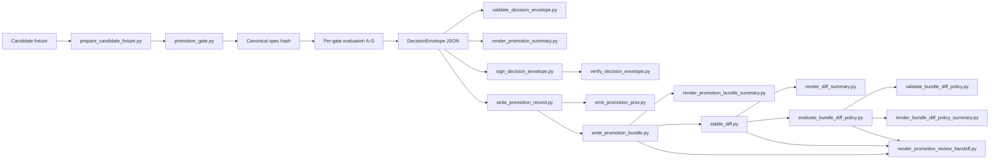
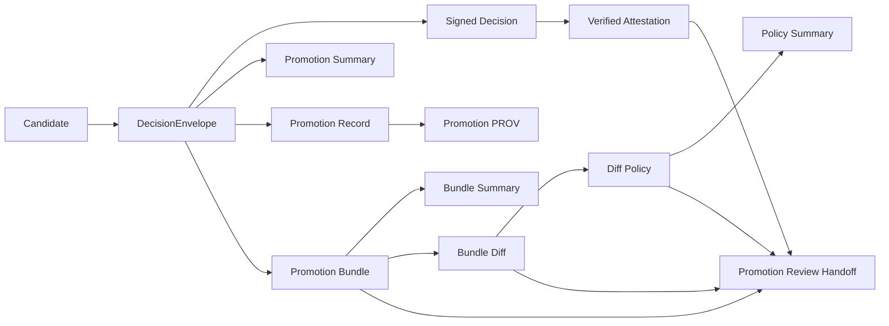

<!-- [KFM_META_BLOCK_V2]
doc_id: kfm://doc/NEEDS-VERIFICATION
title: tools/validators/promotion_gate
type: standard
version: v1
status: draft
owners: @bartytime4life
created: YYYY-MM-DD
updated: 2026-04-14
policy_label: public
related: [
  ../README.md,
  ../connector_gate/README.md,
  ../../../contracts/README.md,
  ../../../schemas/promotion/decision-envelope.schema.json,
  ../../../schemas/promotion/promotion-record.schema.json,
  ../../../schemas/promotion/promotion-prov.schema.json,
  ../../../schemas/promotion/promotion-bundle.schema.json,
  ../../../schemas/promotion/promotion-bundle-diff-policy.schema.json,
  ../../../policy/README.md,
  ../../../policy/promotion_bundle_diff_policy.json,
  ../../../data/receipts/README.md,
  ../../../data/proofs/README.md,
  ../../../data/catalog/stac/README.md,
  ../../../data/catalog/dcat/README.md,
  ../../../data/catalog/prov/README.md,
  ../../../tests/README.md,
  ../../../tests/validators/test_promotion_gate_e2e.py,
  ../../../tests/validators/test_bundle_diff_policy.py,
  ../../../tests/validators/test_validate_bundle_diff_policy.py,
  ../../../tests/ci/test_render_promotion_review_handoff.py,
  ../../../tools/ci/render_promotion_summary.py,
  ../../../tools/ci/render_promotion_bundle_summary.py,
  ../../../tools/ci/render_diff_summary.py,
  ../../../tools/ci/render_bundle_diff_policy_summary.py,
  ../../../tools/ci/render_promotion_review_handoff.py,
  ../../../tools/diff/stable_diff.py,
  ../../../tools/catalog/catalog_crosslink.py,
  ../../../.github/workflows/README.md
]
tags: [kfm, validators, promotion, governance, evidence, ci, diff-policy, review-handoff, proofs, spec_hash]
notes: [Release-facing validator contract for governed promotion decisions. Active-branch inventory, exact workflow wiring, schema presence, and merge-blocking enforcement remain NEEDS VERIFICATION where not directly proven.]
[/KFM_META_BLOCK_V2] -->

# `tools/validators/promotion_gate/`

Fail-closed, evidence-first validator surface for **governed promotion decisions** on release-bearing KFM candidates.

> [!NOTE]
> **Status:** experimental  
> **Document status:** draft  
> **Owners:** `@bartytime4life`  
>       
> **Quick jumps:** [Scope](#scope) · [Repo fit](#repo-fit) · [Accepted inputs](#accepted-inputs) · [Exclusions](#exclusions) · [Directory tree](#directory-tree) · [Decision contract](#decision-contract) · [Gate matrix](#gate-matrix-ag) · [Execution flow](#execution-flow) · [Outputs](#outputs) · [Trust chain](#trust-chain) · [Catalog closure](#catalog-closure) · [Quickstart](#quickstart) · [FAQ](#faq)

> [!IMPORTANT]
> This document defines both a **validator contract** and a **thin-slice executable shape** for promotion validation. It does **not** by itself prove that all mounted scripts, schemas, policies, tests, or merge-blocking integrations are present on the active branch. Exact file inventory, schema locations, workflow wiring, and enforcement posture remain **NEEDS VERIFICATION** where not directly confirmed.

> [!TIP]
> Keep the KFM trust split visible here:
>
> **receipt ≠ proof ≠ catalog ≠ publication**
>
> `promotion_gate/` may validate declared linkage among these surfaces, and may derive release-significant trust objects, but it must not collapse them into one helper-owned authority.

---

## Scope

This lane decides whether a **release candidate** is promotable under KFM governance. It validates the candidate, emits a finite machine-readable decision, and routes the result into governed review. It is **not** the act of publication.

This README serves two purposes at once:

1. a **normative lane contract** for promotion decisions, and  
2. an **implementation-facing directory README** for the executable thin slice scaffolded under this path.

### Working question

> **Is this release-bearing candidate explicit, reviewable, policy-compliant, and trust-complete enough to advance into governed release flow?**

In practical terms, this lane is where a promotion candidate should be checked for:

- stable candidate identity and canonical `spec_hash`
- asset integrity against reviewed bytes
- geometry, CRS, and temporal invariants where applicable
- rights, sensitivity, and policy posture
- receipt, proof, and attestation linkage
- rollback, supersession, and steward review readiness
- catalog closure across STAC, DCAT, and PROV
- explicit reviewer-facing outputs without pretending publication already happened

### Truth labels used here

| Label | Meaning here |
|---|---|
| **CONFIRMED** | Directly supported by stable KFM doctrine or the visible document set |
| **INFERRED** | Strongly suggested by adjacent checked-in docs and lane structure |
| **PROPOSED** | Recommended thin-slice shape consistent with current doctrine |
| **UNKNOWN** | Not surfaced strongly enough to state as current repo fact |
| **NEEDS VERIFICATION** | Exact mounted file, workflow, schema, or enforcement detail should be checked on the working branch |

[Back to top](#toolsvalidatorspromotion_gate)

---

## Repo fit

**Path:** `tools/validators/promotion_gate/README.md`  
**Lane:** `tools/validators/`  
**Role:** deterministic release-facing validator surface for governed promotion decisions

### Upstream and adjacent anchors

| Relation | Surface | Why it matters |
|---|---|---|
| Parent lane | [`../README.md`](../README.md) | Sets the validator-family posture: deterministic, reviewable, fail-closed helpers |
| Upstream admission membrane | [`../connector_gate/README.md`](../connector_gate/README.md) | Connector admission is narrower and earlier than release promotion |
| Shared contracts | [`../../../contracts/README.md`](../../../contracts/README.md) | Promotion should validate declared authority, not invent it |
| Shared policy | [`../../../policy/README.md`](../../../policy/README.md) | Deny-by-default and obligation-bearing logic belongs there |
| Receipts | [`../../../data/receipts/README.md`](../../../data/receipts/README.md) | Process memory should remain inspectable and separate from proof |
| Proofs | [`../../../data/proofs/README.md`](../../../data/proofs/README.md) | Release-grade proof objects and bundles belong there conceptually, even if helpers here derive some artifacts |
| Catalog closure | [`../../../data/catalog/stac/README.md`](../../../data/catalog/stac/README.md), [`../../../data/catalog/dcat/README.md`](../../../data/catalog/dcat/README.md), [`../../../data/catalog/prov/README.md`](../../../data/catalog/prov/README.md) | Promotion should validate outward identity closure, not treat catalog fields as decorative metadata |
| Workflow boundary | [`../../../.github/workflows/README.md`](../../../.github/workflows/README.md) | Orchestration should call helpers here rather than bury policy-significant logic in workflow YAML |
| Reviewer rendering | `tools/ci/*` | Reviewer summaries are derived outputs, not policy authority |

### Boundary rule

Use `promotion_gate/` to validate **release readiness**.

Do **not** use it to:

- publish artifacts directly
- merge branches directly
- own domain-specific subject validation in hydrology, hazards, soils, or other lanes
- replace runtime answer-accountability envelopes
- redefine contracts, schemas, or policy owned elsewhere
- turn CI presentation helpers into policy authority
- replace underlying machine artifacts with a single Markdown handoff document

[Back to top](#toolsvalidatorspromotion_gate)

---

## Accepted inputs

Accepted inputs are the minimum evidence-bearing objects required to judge one promotion candidate.

| Input | Required | Purpose |
|---|---:|---|
| `candidate_id` | yes | stable identifier for the promoted subject |
| `spec_path` or equivalent canonical source | yes | source bytes used to compute the candidate `spec_hash` |
| `declared_spec_hash` | yes | declared canonical hash for the candidate |
| `release_manifest` or equivalent | yes | declares what outward release would contain |
| `assets[]` with checksums | yes | binds reviewed asset inventory to exact bytes |
| `catalog_refs` / `catalog_closure` | yes | links the candidate to STAC, DCAT, and PROV closure |
| `run_receipt` | yes | carries machine-checkable execution facts |
| `attestation_refs` | yes | carries integrity and origin evidence |
| `policy_label` / policy context | yes | supplies classification and governance context |
| `review` | yes | carries approval state and steward identity |
| `rollback` / prior release reference | yes for promotable release | preserves reversal and supersession visibility |
| `ai_receipt` | conditional | required when model mediation affected the candidate |
| `diff_artifact` | conditional | required when change visibility matters materially |
| `correction_notice_ref` | conditional | required when the candidate supersedes or narrows a prior release |
| `prior_bundle` | conditional | needed when governed prior/current bundle review is enabled |
| `bundle_diff_policy` | conditional | needed when bundle-diff policy classification is part of the review path |

### Current thin-slice file inputs

| Input | Expected path family |
|---|---|
| candidate fixture | `tests/fixtures/promotion/*.json` |
| spec file | `data/work/.../stac-item.json` |
| asset files | `data/work/.../assets/*` |
| policy bundle | `tools/validators/promotion_gate/policies/*.rego` |
| decision schema | `schemas/promotion/decision-envelope.schema.json` |
| record schema | `schemas/promotion/promotion-record.schema.json` |
| PROV schema | `schemas/promotion/promotion-prov.schema.json` |
| bundle schema | `schemas/promotion/promotion-bundle.schema.json` |
| bundle diff-policy schema | `schemas/promotion/promotion-bundle-diff-policy.schema.json` |
| bundle diff-policy file | `policy/promotion_bundle_diff_policy.json` |
| prior/current diff report | `promotion-bundle-diff.json` or equivalent |
| diff-policy report | `promotion-bundle-diff-policy.json` or equivalent |
| composed review handoff inputs | `promotion-bundle.json` + `promotion-bundle-diff.json` + `promotion-bundle-diff-policy.json` |

---

## Exclusions

This lane does **not**:

- publish artifacts directly
- merge branches directly
- replace domain-specific validation in subject lanes
- stand in for request-time runtime accountability such as `RuntimeResponseEnvelope`
- redefine schemas or policy owned elsewhere
- convert a README into proof that implementation already exists
- embed governance authority in helper scripts where policy should remain the source of truth
- compute general diff law inside CI renderers
- replace underlying machine artifacts with one composed Markdown reviewer handoff

---

## Directory tree

Current documented executable shape, still subject to branch verification:

```text
tools/validators/promotion_gate/
├── README.md
├── promotion_gate.py
├── prepare_candidate_fixture.py
├── validate_decision_envelope.py
├── validate_promotion_record.py
├── validate_promotion_prov.py
├── validate_promotion_bundle.py
├── write_promotion_record.py
├── write_promotion_bundle.py
├── emit_promotion_prov.py
├── evaluate_bundle_diff_policy.py
├── validate_bundle_diff_policy.py
├── policies/
│   ├── a_identity.rego
│   ├── b_integrity.rego
│   ├── c_geometry.rego
│   ├── d_temporal.rego
│   ├── e_policy.rego
│   ├── f_proof.rego
│   ├── g_review.rego
│   └── promotion.rego
```

Related surfaces:

```text
tools/attest/sign_decision_envelope.py
tools/attest/verify_decision_envelope.py
tools/diff/stable_diff.py
tools/catalog/catalog_crosslink.py
tools/ci/render_promotion_summary.py
tools/ci/render_promotion_bundle_summary.py
tools/ci/render_diff_summary.py
tools/ci/render_bundle_diff_policy_summary.py
tools/ci/render_promotion_review_handoff.py
policy/promotion_bundle_diff_policy.json
schemas/promotion/
tests/fixtures/promotion/
tests/validators/test_promotion_gate_e2e.py
tests/validators/test_bundle_diff_policy.py
tests/validators/test_validate_bundle_diff_policy.py
tests/ci/test_render_promotion_review_handoff.py
```

> [!NOTE]
> Shared contracts, schemas, and policy surfaces remain authoritative in their own repo homes. This lane validates and consumes them; it does not replace them.

[Back to top](#toolsvalidatorspromotion_gate)

---

## Decision contract

Every promotion attempt must end in one finite result:

| Result | Meaning |
|---|---|
| `ALLOW` | candidate satisfied all required gates strongly enough to advance into governed release flow |
| `ABSTAIN` | evidence is insufficient to promote safely, but no direct contradiction has been proven |
| `DENY` | candidate failed one or more required gates |
| `ERROR` | the gate could not safely evaluate due to parse, execution, or other fail-closed faults |

> [!WARNING]
> `ALLOW` does **not** publish directly. It means the candidate is valid for the governed review and release path.

### Gate status vocabulary

Each gate emits its own status:

| Status | Meaning |
|---|---|
| `PASS` | required checks for that gate succeeded |
| `FAIL` | the gate found a concrete promotability violation |
| `SKIP` | the gate was not applicable or not yet implemented |
| `ERROR` | the gate could not safely evaluate due to parse or execution failure |

### Bundle diff-policy vocabulary

The current thin-slice bundle-diff policy layer classifies prior/current bundle key drift into:

| Classification | Meaning |
|---|---|
| `informational` | expected or non-blocking by current policy |
| `review` | trust-visible or otherwise review-significant |
| `blocking` | release-significant drift that must not pass silently |

These are **review classifications**, not a replacement for the main promotion decision grammar.

---

## Outputs

This lane emits a **DecisionEnvelope**, not a `RuntimeResponseEnvelope`.

### Minimum output shape

```yaml
decision: ALLOW | ABSTAIN | DENY | ERROR
candidate_id: string
spec_hash: string
prior_spec_hash: string?
release_ref: string?
steward_id: string?
reason_codes: []
obligations: []
gates:
  - gate: A
    status: PASS | FAIL | SKIP | ERROR
    details: []
generated_at: RFC3339 timestamp
```

### Output intent

| Field | Purpose |
|---|---|
| `decision` | finite machine-readable promotion result |
| `candidate_id` | stable subject the decision applies to |
| `spec_hash` | canonical identity anchor for the candidate spec |
| `prior_spec_hash` | rollback or supersession anchor for the prior release |
| `reason_codes` | explicit failure, abstention, or error reasons |
| `obligations` | required follow-up actions before promotion can continue |
| `gates[]` | per-gate results for reviewer and CI visibility |
| `generated_at` | time the decision was produced |

### Secondary and derived outputs

The current thin slice may also emit:

| Object | Purpose |
|---|---|
| `promotion-summary.md` | reviewer-readable summary of the DecisionEnvelope |
| `promotion-record.json` | compact promotion ledger entry derived from the decision |
| `promotion-prov.json` | minimal PROV document derived from the promotion record |
| `promotion-bundle.json` | index of the full governed promotion artifact set |
| `promotion-bundle-summary.md` | reviewer or auditor summary of the full bundle |
| `decision-sign-result.json` | signing command result |
| `decision-verify-result.json` | attestation verification result |
| `promotion-bundle-diff.json` | prior/current bundle diff report |
| `promotion-bundle-diff-summary.md` | reviewer-facing diff summary |
| `promotion-bundle-diff-policy.json` | machine-readable policy classification of bundle drift |
| `promotion-bundle-diff-policy-summary.md` | reviewer-facing policy summary for bundle drift |
| `promotion-review-handoff.md` | composed steward-facing review document derived from bundle, diff, diff-policy, and attestation visibility |

### Preferred reviewer publication order

When these reviewer-facing artifacts are published together, keep the order stable:

1. `promotion-bundle-summary.md`
2. `promotion-bundle-diff-summary.md`
3. `promotion-bundle-diff-policy-summary.md`
4. `promotion-review-handoff.md`

Why this order matters:

- the reviewer first sees the governed bundle as released evidence
- then the prior/current drift surface
- then the policy interpretation of that drift
- then the final steward-facing composed conclusion

That ordering improves reviewer ergonomics while preserving the authority split between machine artifacts and the final Markdown convenience surface.

---

## Gate matrix (A–G)

| Gate | Name | What it checks | Minimum evidence |
|---|---|---|---|
| **A** | Identity and closure | stable identifier, canonical `spec_hash`, required STAC identity fields, immutable target intent | `candidate_id`, spec bytes, declared hash, release subject identity |
| **B** | Asset integrity | every declared asset exists, is checksummed, and matches reviewed bytes | `assets[]`, checksums, manifest or STAC asset linkage |
| **C** | Geometry and CRS invariants | geometry validity, CRS allowlist, bbox consistency, deterministic generalization, sane summaries | geometry-bearing assets, CRS metadata, bbox, generalization parameters when applicable |
| **D** | Temporal and coverage semantics | valid intervals, coherent spatial/temporal coverage, freshness declarations where required | time fields, coverage metadata, source-aligned scope declarations |
| **E** | Rights, sensitivity, and policy | license, rights, policy label, sensitivity handling, deny-by-default on missing classification | rights metadata, policy label, reviewable classification context |
| **F** | Provenance, proofs, and receipts | receipts present, attestations validate, proof hashes match, catalog/provenance closure is coherent | `run_receipt`, `attestation_refs`, `catalog_refs`, proof objects |
| **G** | Reviewer intent and rollback readiness | approval present, steward recorded, rollback target exists, supersession is visible and reversible | `review`, prior release reference, correction/rollback posture, immutable version or tag intent |

### Gate-to-outcome collapse

| Condition | Final decision |
|---|---|
| all required gates `PASS` | `ALLOW` |
| one or more required gates `FAIL` | `DENY` |
| insufficient evidence but no contradiction | `ABSTAIN` |
| evaluator or gate error | `ERROR` |

[Back to top](#toolsvalidatorspromotion_gate)

---

## Execution flow



### Execution steps

1. Load the candidate and canonical spec bytes.
2. Compute `spec_hash`.
3. Normalize fixture hashes where needed.
4. Validate gate inputs and shared contracts.
5. Evaluate Gates A–G in deterministic order.
6. Emit per-gate statuses.
7. Collapse the result to one finite `decision`.
8. Validate the decision against schema.
9. Render reviewer-readable output where needed.
10. Optionally sign and verify the decision.
11. Derive record, PROV, and bundle objects.
12. Optionally compare prior/current bundles.
13. Classify bundle drift using checked-in diff policy.
14. Render reviewer-facing diff and policy summaries.
15. Optionally compose one steward-facing review handoff document from bundle, diff, and diff-policy artifacts.
16. Route the result into governed review or rework.

---

## Trust chain

The current thin slice supports a fuller governed promotion evidence chain.



### Trust object split

| Surface | Role |
|---|---|
| `decision.json` | finite machine-readable decision |
| `decision-sign-result.json` | receipt-like signing outcome |
| `decision-verify-result.json` | receipt-like verification outcome |
| `promotion-record.json` | compact governed ledger entry |
| `promotion-prov.json` | provenance activity for promotion |
| `promotion-bundle.json` | bundle manifest indexing the full promotion artifact set |
| `promotion-bundle-diff.json` | deterministic prior/current comparison report |
| `promotion-bundle-diff-policy.json` | reviewed interpretation layer for changed keys |
| `promotion-review-handoff.md` | composed reviewer-facing document derived from, but not replacing, the underlying machine artifacts |

### Review publication sequence

When steward-facing Markdown artifacts are published together, the preferred order is:

1. bundle summary
2. diff summary
3. diff-policy summary
4. review handoff

That keeps the reviewer’s view aligned with the trust chain itself: bundle first, then drift, then classification, then composed conclusion.

> [!NOTE]
> This preserves KFM’s **receipt vs proof** doctrine. Receipts capture process memory; proofs and release-significant trust objects remain separately identifiable. The diff-policy layer interprets change visibility; it does not replace the release decision itself. The review handoff document is a derived steward convenience surface, not a new authoritative machine object.

---

## Catalog closure

Minimal closure expectations are not decorative metadata checks. They are release-scope identity checks.

| Surface | Minimum expectation |
|---|---|
| **STAC** | release-bearing item or collection for the outward spatial or spatiotemporal assets |
| **DCAT** | dataset/distribution discovery for the same promoted subject |
| **PROV** | lineage linking entity, activity, and agent for the same outward release |
| **Cross-surface rule** | STAC, DCAT, and PROV must agree on subject identity, scope, and correction posture |

---

## Quickstart

### 1. Prepare fixture hashes

```bash
python tools/validators/promotion_gate/prepare_candidate_fixture.py \
  tests/fixtures/promotion/candidate.runtime.json
```

### 2. Run the promotion gate

```bash
python tools/validators/promotion_gate/promotion_gate.py \
  tests/fixtures/promotion/candidate.runtime.json \
  > decision.json
```

### 3. Validate the decision envelope

```bash
python tools/validators/promotion_gate/validate_decision_envelope.py \
  schemas/promotion/decision-envelope.schema.json \
  decision.json
```

### 4. Render reviewer summary

```bash
python tools/ci/render_promotion_summary.py \
  decision.json \
  --output promotion-summary.md
```

### 5. Write the promotion record

```bash
python tools/validators/promotion_gate/write_promotion_record.py \
  decision.json \
  --output promotion-record.json \
  --summary-ref "artifact://promotion-summary.md"
```

### 6. Emit promotion PROV

```bash
python tools/validators/promotion_gate/emit_promotion_prov.py \
  promotion-record.json \
  --output promotion-prov.json
```

### 7. Write the promotion bundle

```bash
python tools/validators/promotion_gate/write_promotion_bundle.py \
  --decision decision.json \
  --summary promotion-summary.md \
  --record promotion-record.json \
  --prov promotion-prov.json \
  --output promotion-bundle.json
```

### 8. Render bundle summary

```bash
python tools/ci/render_promotion_bundle_summary.py \
  promotion-bundle.json \
  --output promotion-bundle-summary.md
```

### 9. Diff prior/current promotion bundles

```bash
python tools/diff/stable_diff.py \
  --left promotion-bundle.previous.json \
  --right promotion-bundle.json \
  --output promotion-bundle-diff.json
```

### 10. Classify bundle drift

```bash
python tools/validators/promotion_gate/evaluate_bundle_diff_policy.py \
  --diff promotion-bundle-diff.json \
  --policy policy/promotion_bundle_diff_policy.json \
  --output promotion-bundle-diff-policy.json
```

### 11. Render review handoff

```bash
python tools/ci/render_promotion_review_handoff.py \
  --bundle promotion-bundle.json \
  --diff promotion-bundle-diff.json \
  --diff-policy promotion-bundle-diff-policy.json \
  --output promotion-review-handoff.md
```

> [!TIP]
> Keep command examples aligned with the mounted implementation. This README should not invent runnable paths once the active branch proves a different interface.

---

## FAQ

### Does `promotion_gate/` publish anything directly?

No. It validates release readiness, emits a finite decision plus derived trust objects, and prepares the next governed handoff. Publication remains a later state transition.

### Is this the same thing as `connector_gate/`?

No. `connector_gate/` is upstream and admission-facing. `promotion_gate/` is later, stronger, and release-facing.

### Why does this lane talk about receipts, proofs, and catalog closure together?

Because promotion is where those surfaces must agree without being collapsed. This lane validates their coherence; it does not erase their separate roles.

### Is `promotion-review-handoff.md` authoritative?

No. It is a steward-facing derived convenience surface. The underlying machine-readable artifacts remain the authoritative trust objects.

### Can this lane sign artifacts?

It may call signing or verification helpers as part of the thin slice, but signature execution mechanics still belong conceptually to adjacent attestation surfaces rather than to policy authority itself.

[Back to top](#toolsvalidatorspromotion_gate)
