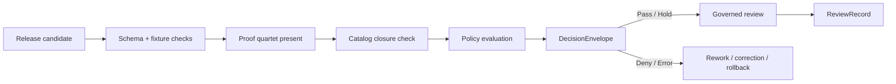

<!-- [KFM_META_BLOCK_V2]
doc_id: kfm://doc/NEEDS-VERIFICATION
title: Promotion Gate (A–G)
type: standard
version: v1
status: draft
owners: @bartytime4life
created: YYYY-MM-DD
updated: YYYY-MM-DD
policy_label: public
related: [../../../contracts/README.md, ../../../schemas/README.md, ../../../policy/README.md, ../../../data/proofs/README.md, ../../../data/catalog/stac/README.md, ../../../data/catalog/dcat/README.md, ../../../data/catalog/prov/README.md, ../../../tests/README.md, ../../../.github/workflows/README.md]
tags: [kfm, validators, promotion, governance, evidence, ci]
notes: [Target path is inferred as tools/validators/promotion_gate/README.md; executable validator presence, exact schema locations, and CI wiring remain NEEDS VERIFICATION.]
[/KFM_META_BLOCK_V2] -->

# Promotion Gate (A–G)

Fail-closed promotion validation for KFM release candidates, proof objects, and catalog closure.

> **Status:** experimental  
> **Owners:** `@bartytime4life`  
>       
> **Quick jumps:** [Scope](#scope) • [Repo fit](#repo-fit) • [Inputs](#inputs) • [Exclusions](#exclusions) • [Gate contract](#gate-contract) • [Gate matrix (A–G)](#gate-matrix-ag) • [Quickstart](#quickstart) • [Policy evaluation](#policy-evaluation) • [CI integration](#ci-integration) • [FAQ](#faq)

> [!IMPORTANT]
> This document defines a **validator contract and review surface**, not proof of a mounted validator, workflow, or schema inventory. Exact executable paths, filenames, and merge-blocking enforcement remain **NEEDS VERIFICATION**.

---

## Scope

This lane defines how KFM should decide whether a candidate release is **ready for promotion**, **held for review**, **denied**, or **errored**. It is a validation and decision step. It is **not** the act of publication.

| Posture | Meaning in this document |
|---|---|
| **CONFIRMED** | KFM requires typed contract families, release-bearing proof objects, policy-visible decisions, catalog linkage, and correction-visible release behavior. |
| **PROPOSED** | The exact validator packaging here: the A–G lettering, starter layout, example commands, and field grouping below. |
| **UNKNOWN / NEEDS VERIFICATION** | Mounted repo paths, executable validator presence, shared schema inventory, CI enforcement, emitted proof packs, and exact outcome enums already implemented in code. |

---

## Repo fit

**Path (INFERRED):** `tools/validators/promotion_gate/README.md`  
The provided document name points to `tools/validators/promotion_gate`, and this revision treats it as a **directory README** rather than a standalone standard elsewhere in the repo.

**Upstream inputs**
- Shared contracts and schemas for release-bearing objects
- Policy bundles and reason / obligation registries
- Proof objects from `data/proofs/`
- Catalog closure objects linking STAC, DCAT, and PROV

**Downstream consumers**
- Review flows and human approval surfaces
- Publication and correction runbooks
- Thin-slice release examples
- CI jobs that validate promotability before merge or publish

**Role in the system**
- Sits **after** candidate artifact assembly
- Sits **before** governed review and outward release
- Emits a **policy-bearing decision object**
- Must not become a silent direct-publish shortcut

---

## Inputs

Accepted inputs are the release-bearing objects the gate needs in order to make a governed decision.

| Input | Required | Purpose |
|---|---:|---|
| `release_manifest` or equivalent release candidate scope | Yes | Declares what one outward release would contain. |
| `evidence_bundle` or `evidence_bundle_ref` | Yes | Proves that the visible claim or artifact scope remains reconstructable. |
| `catalog_refs` / `catalog_closure` | Yes | Links the candidate to STAC / DCAT / PROV closure. |
| `run_receipt` | Yes | Carries machine-checkable execution facts for the candidate build or ingest. |
| `attestation_refs` | Yes | Carries integrity / origin evidence that can be verified. |
| `policy_labels` or equivalent promotion context | Yes | Supplies policy-bearing classification and review context. |
| `ai_receipt` | Conditional | Required when model mediation affected the candidate. |
| `diff_artifact` | Conditional | Required when change visibility matters for review. |
| `correction_notice_ref` | Conditional | Required when the candidate supersedes or narrows a prior release. |
| `rollback_ref` / rollback posture | Conditional | Strongly preferred when the release changes outward truth materially. |

---

## Exclusions

This lane does **not** do the following:

- Publish artifacts directly
- Merge branches directly
- Replace domain-specific validation for hydrology, hazards, soils, or other lanes
- Stand in for runtime response accountability such as `RuntimeResponseEnvelope`
- Prove that the repo already contains the exact files, tests, or workflows shown below
- Convert exploratory packets into mounted implementation by prose alone

---

## Directory tree

```text
# PROPOSED starter layout — NEEDS VERIFICATION against the mounted repo

tools/validators/promotion_gate/
├── README.md
├── policies/
│   └── promotion.rego
├── fixtures/
│   ├── valid/
│   └── invalid/
├── examples/
│   └── gate_input.json
└── tests/
    └── test_promotion_gate.*
```

> [!NOTE]
> Shared contracts are expected to live in repo-wide contract or schema directories rather than being duplicated here. This lane should validate those shared objects, not fork them.

---

## Quickstart

```bash
# Illustrative only — replace with mounted paths and commands once surfaced.

# 1) Confirm the candidate carries release + proof objects.
jq 'has("release_manifest")
    and has("run_receipt")
    and has("attestation_refs")' \
  examples/gate_input.json

# 2) Evaluate promotion policy.
conftest test examples/gate_input.json \
  --policy tools/validators/promotion_gate/policies/

# 3) A passing gate means "review-ready", not "auto-published".
echo "Promotion gate passed; continue through governed review."
```

---

## Usage

### Gate contract

```yaml
version: v1
gate_id: kfm.promotion.release
subject: release_candidate

required_inputs:
  - release_manifest
  - evidence_bundle_or_ref
  - catalog_refs
  - run_receipt
  - attestation_refs
  - policy_context

conditional_inputs:
  - ai_receipt
  - diff_artifact
  - correction_notice_ref
  - rollback_ref

output:
  decision_envelope:
    result: <project-controlled enum>
    reason_codes: []
    obligation_codes: []
    audit_ref: string
    effective_window: <optional>
    policy_bundle_ref: <recommended>

posture: fail_closed
notes:
  - Gate result is review-bearing.
  - Gate pass must not imply direct publish authority.
```

### Proof objects and shared contracts

This gate is strongest when it validates **shared** proof objects rather than inventing its own local vocabulary.

| Object family | Why the gate cares |
|---|---|
| `ReleaseManifest` / `ReleaseProofPack` | Defines one outward release and its proof-bearing scope. |
| `EvidenceBundle` | Carries the support package for one claim or release context. |
| `run_receipt` | Proves what ran, when, over what inputs, and with what outputs. |
| `ai_receipt` | Makes model-mediated proposal or synthesis auditable when applicable. |
| `DecisionEnvelope` | Carries the machine-readable policy result for the gate. |
| `ReviewRecord` | Captures human approval, denial, escalation, or comment after the gate. |
| `CorrectionNotice` | Preserves visible lineage when a release is replaced, narrowed, or corrected. |
| `attestation_refs` | Links the candidate to verifiable integrity / origin evidence. |

### Outputs

This lane should emit a **DecisionEnvelope**, not a `RuntimeResponseEnvelope`.

| Output field | Purpose |
|---|---|
| `result` | Machine-readable gate result for the promotion decision. |
| `reason_codes` | Explicit failure, hold, or narrowing reasons. |
| `obligation_codes` | Required follow-up actions before promotion can continue. |
| `audit_ref` | Stable trace handle for logs, review, and later correction. |
| `effective_window` | Optional scope if the decision is time-bounded. |
| `policy_bundle_ref` | Strongly preferred reference to the policy basis used. |
| `subject_ref` | The release-bearing subject this decision applies to. |

> [!WARNING]
> The exact project-controlled result enum remains **NEEDS VERIFICATION**. This README therefore uses `DecisionEnvelope.result` generically instead of hard-coding an unverified repo enum.

### Gate matrix (A–G)

| Gate | Name | What it checks | Minimum release-bearing evidence |
|---|---|---|---|
| **A** | Identity & ownership metadata | Required owner / steward / reviewer-bearing metadata exists for the promoted subject or review context. | Applicable ownership or steward fields for the subject profile; for documentation artifacts, this may include the KFM Meta Block. |
| **B** | Schema & fixture validation | Shared contracts validate and malformed fixtures fail. | Shared schemas, valid fixtures, invalid fixtures, validator output. |
| **C** | Evidence closure | The candidate has reconstructable support, not just a file bundle. | `evidence_bundle` or resolvable equivalent plus release-bearing refs. |
| **D** | Catalog closure | STAC / DCAT / PROV all point to the same release-bearing subject and outward scope. | Catalog refs or closure object linking the same promoted subject. |
| **E** | Integrity & attestation | Proof objects include verifiable integrity / origin evidence. | `spec_hash`, `run_receipt`, `attestation_refs`, and `ai_receipt` when applicable. |
| **F** | Policy evaluation | Policy executes fail-closed and emits explicit reason / obligation codes. | Policy bundle, evaluation output, decision object. |
| **G** | Diff / correction / rollback visibility | Material change is inspectable and supersession is not silent. | Diff artifact, correction notice ref, rollback posture, or explicit “no supersession” statement. |

### Execution

1. Collect the release-bearing inputs.
2. Validate shared contracts and required field families.
3. Confirm the proof quartet is present where applicable.
4. Check STAC / DCAT / PROV closure for the same outward subject.
5. Evaluate policy in fail-closed mode.
6. Emit a `DecisionEnvelope`.
7. Route the result into governed review:
   - pass or hold -> review-bearing flow
   - deny or error -> visible rework / correction / rollback path

### Catalog closure

Minimal closure expectations are release-scope consistency rules, not decorative metadata.

| Surface | Minimum expectation |
|---|---|
| **STAC** | Release-bearing item / collection refs for the outward spatial or spatiotemporal assets. |
| **DCAT** | Outward dataset / distribution discovery for the same promoted subject. |
| **PROV** | Lineage linking the release-bearing entity, activity, and supporting agents. |
| **Cross-surface rule** | The three surfaces must agree on subject identity, release scope, and correction posture. |

### Policy evaluation

Illustrative Rego only:

```rego
package kfm.promotion

default allow := false

allow if {
  input.release_manifest
  input.run_receipt.spec_hash != ""
  input.attestation_refs[_]
  input.catalog_refs.stac
  input.catalog_refs.dcat
  input.catalog_refs.prov
  not deny[_]
}

deny contains "missing evidence bundle" if {
  not input.evidence_bundle_ref
}

deny contains "missing outputs" if {
  count(input.run_receipt.outputs) == 0
}

deny contains "missing correction path on superseding release" if {
  input.supersedes_release == true
  not input.correction_notice_ref
}
```

### CI integration

Illustrative workflow hook only:

```yaml
# .github/workflows/promotion-gate.yml
name: promotion-gate

on:
  pull_request:
    paths:
      - "tools/validators/promotion_gate/**"
      - "contracts/**"
      - "policy/**"
      - "fixtures/**"

jobs:
  promotion_gate:
    runs-on: ubuntu-latest
    steps:
      - uses: actions/checkout@v4

      - name: Validate promotion candidate
        run: |
          conftest test examples/gate_input.json \
            --policy tools/validators/promotion_gate/policies/

      - name: Persist gate output
        run: |
          echo "Emit DecisionEnvelope here once mounted validator path is surfaced."
```

[Back to top](#promotion-gate-ag)

---

## Diagram



---

## Tables

### Fail-closed semantics

| Condition | Expected response | Why |
|---|---|---|
| Shared contract missing or malformed | `ERROR` or equivalent fail-closed result | The system cannot safely decide on an ill-formed input. |
| Required release evidence missing | `DENY` | Promotion without reconstructable support breaks the trust path. |
| Catalog closure unresolved | `DENY` | Outward metadata cannot drift away from the release-bearing subject. |
| Attestation absent or unverifiable | `DENY` | Integrity and origin remain unproven. |
| Policy execution undecidable | `ERROR` | Fail-closed posture forbids silent fallback. |
| Superseding release with no correction path | `HOLD` or `DENY` | Visible lineage must survive change. |

### Release-readiness summary

| Question | Gate answer should make visible |
|---|---|
| What is being promoted? | `subject_ref`, release scope, manifest reference |
| Why is it promotable or blocked? | `reason_codes` |
| What still must happen? | `obligation_codes` |
| Where is the evidence trail? | `audit_ref`, `evidence_bundle_ref`, catalog refs |
| How would later correction stay visible? | `correction_notice_ref` or explicit correction posture |

---

## Task list

Definition of done for this lane:

- [ ] Shared contract inputs are validated against surfaced schemas.
- [ ] Positive and negative fixtures exist and are reviewable.
- [ ] The proof quartet is required where applicable.
- [ ] STAC / DCAT / PROV closure resolves to the same promoted subject.
- [ ] Policy emits machine-readable reason and obligation codes.
- [ ] Material supersession has diff + correction / rollback visibility.
- [ ] Passing the gate still routes through governed review; no silent direct publish path exists.
- [ ] README examples are updated when the shared contract or policy grammar changes.

---

## FAQ

### Does this gate publish artifacts?

No. It validates promotability and emits a decision object. Publication stays in the governed review and release flow.

### Why not use `RuntimeResponseEnvelope` here?

Because promotion is a **policy-bearing release decision**, not a runtime answer surface. Runtime outcomes belong to `RuntimeResponseEnvelope`; promotion decisions belong to `DecisionEnvelope`.

### Does this replace domain QA?

No. Hydrology, hazards, soils, biodiversity, and other lanes still need their own lane-specific validation. This gate sits above those checks and asks whether the candidate is fit for governed release.

### Is the directory layout below already implemented?

Unknown. The tree in this document is a **PROPOSED starter layout** and must be checked against the mounted repo before being treated as fact.

---

## Appendix

<details>
<summary><strong>Illustrative gate input</strong></summary>

```json
{
  "release_manifest": {
    "release_id": "candidate-2026-04-12-01"
  },
  "evidence_bundle_ref": "kfm://evidence/bundle/example-01",
  "catalog_refs": {
    "stac": "kfm://catalog/stac/example-01",
    "dcat": "kfm://catalog/dcat/example-01",
    "prov": "kfm://catalog/prov/example-01"
  },
  "run_receipt": {
    "run_id": "run-2026-04-12-01",
    "spec_hash": "0123456789abcdef0123456789abcdef0123456789abcdef0123456789abcdef",
    "outputs": [
      {
        "uri": "oci://example/release-artifact",
        "sha256": "abcdefabcdefabcdefabcdefabcdefabcdefabcdefabcdefabcdefabcdefabcd",
        "media_type": "application/json"
      }
    ]
  },
  "attestation_refs": [
    {
      "type": "sigstore-cosign",
      "uri": "oci://example/release-artifact#attestation"
    }
  ],
  "policy_labels": [
    "public-safe"
  ],
  "supersedes_release": false
}
```

</details>

<details>
<summary><strong>Illustrative decision output</strong></summary>

```json
{
  "subject_ref": "candidate-2026-04-12-01",
  "result": "DENY",
  "reason_codes": [
    "missing_evidence_bundle"
  ],
  "obligation_codes": [
    "provide_release_scoped_evidence"
  ],
  "audit_ref": "kfm://audit/example-01"
}
```

</details>

[Back to top](#promotion-gate-ag)