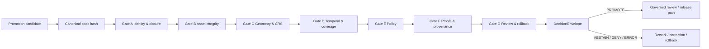

<!-- [KFM_META_BLOCK_V2]
doc_id: kfm://doc/NEEDS-VERIFICATION
title: Promotion Gate (A–G)
type: standard
version: v1
status: draft
owners: @bartytime4life
created: YYYY-MM-DD
updated: YYYY-MM-DD
policy_label: public
related: [../../../contracts/README.md, ../../../schemas/README.md, ../../../policy/README.md, ../../../data/receipts/README.md, ../../../data/proofs/README.md, ../../../data/catalog/stac/README.md, ../../../data/catalog/dcat/README.md, ../../../data/catalog/prov/README.md, ../../../tests/README.md, ../../../.github/workflows/README.md]
tags: [kfm, validators, promotion, governance, evidence, ci]
notes: [Target path is inferred as tools/validators/promotion_gate/README.md; executable validator presence, exact schema locations, and CI wiring remain NEEDS VERIFICATION.]
[/KFM_META_BLOCK_V2] -->

# Promotion Gate (A–G)

Fail-closed, evidence-first promotion validation for KFM release candidates.

> **Status:** experimental  
> **Owners:** `@bartytime4life`  
>       
> **Quick jumps:** [Scope](#scope) • [Repo fit](#repo-fit) • [Inputs](#inputs) • [Exclusions](#exclusions) • [Decision contract](#decision-contract) • [Gate matrix](#gate-matrix-ag) • [Quickstart](#quickstart) • [Outputs](#outputs) • [Policy evaluation](#policy-evaluation) • [CI integration](#ci-integration) • [FAQ](#faq)

> [!IMPORTANT]
> This document defines a **validator contract and review surface**, not proof of a mounted validator, workflow, or schema inventory. Exact executable paths, filenames, and merge-blocking enforcement remain **NEEDS VERIFICATION**.

---

## Scope

This lane decides whether a release candidate is promotable under KFM governance. It validates the candidate, emits a machine-readable decision, and routes the result into governed review. It is **not** the act of publication.

| Posture | Meaning in this document |
|---|---|
| **CONFIRMED** | KFM requires typed contracts, evidence-bearing release objects, policy-visible decisions, catalog closure, and fail-closed behavior. |
| **PROPOSED** | The exact A–G gate decomposition, starter layout, example commands, and example schemas below. |
| **UNKNOWN / NEEDS VERIFICATION** | Mounted validator code, emitted filenames, CI enforcement, schema locations, and exact repo inventory already present on the active branch. |

---

## Repo fit

**Path (INFERRED):** `tools/validators/promotion_gate/README.md`

**Upstream inputs**
- shared release contracts
- shared schemas
- policy bundles and reason/obligation vocabularies
- receipts from candidate-producing runs
- proofs and attestations
- catalog closure objects across STAC / DCAT / PROV

**Downstream consumers**
- reviewer approval flows
- release and correction workflows
- CI summaries and annotations
- promotion records and rollback preparation

**Role in the system**
- sits **after** candidate assembly
- sits **before** governed publication
- emits a **DecisionEnvelope**
- must not become a hidden direct-publish shortcut

---

## Inputs

Accepted inputs are the minimum evidence-bearing objects required to judge one promotion candidate.

| Input | Required | Purpose |
|---|---:|---|
| `candidate_id` | Yes | Stable identifier for the promoted subject. |
| `spec_path` or equivalent canonical source | Yes | Source bytes used to compute the candidate `spec_hash`. |
| `declared_spec_hash` | Yes | Declared canonical hash for the candidate. |
| `release_manifest` or equivalent | Yes | Declares what outward release would contain. |
| `assets[]` with checksums | Yes | Binds reviewed asset inventory to exact bytes. |
| `catalog_refs` / `catalog_closure` | Yes | Links the candidate to STAC / DCAT / PROV closure. |
| `run_receipt` | Yes | Carries machine-checkable execution facts. |
| `attestation_refs` | Yes | Carries integrity and origin evidence. |
| `policy_label` / policy context | Yes | Supplies classification and governance context. |
| `review` | Yes | Carries approval state and steward identity. |
| `rollback` / prior release reference | Yes for promotable release | Preserves reversal and supersession visibility. |
| `ai_receipt` | Conditional | Required when model mediation affected the candidate. |
| `diff_artifact` | Conditional | Required when change visibility matters materially. |
| `correction_notice_ref` | Conditional | Required when the candidate supersedes or narrows a prior release. |

---

## Exclusions

This lane does **not**:

- publish artifacts directly
- merge branches directly
- replace domain-specific validation in hydrology, hazards, soils, or other subject lanes
- stand in for runtime answer accountability such as `RuntimeResponseEnvelope`
- redefine schemas or policy owned elsewhere
- convert a prose README into proof that implementation already exists

---

## Decision contract

Every promotion attempt must end in one finite result:

| Result | Meaning |
|---|---|
| `PROMOTE` | Candidate satisfied all required gates and may proceed to governed release flow. |
| `ABSTAIN` | Evidence is insufficient to promote safely, but no direct contradiction has been proven. |
| `DENY` | Candidate failed one or more required gates. |
| `ERROR` | The gate could not safely evaluate due to parse, execution, or other fail-closed faults. |

> [!WARNING]
> A `PROMOTE` result does **not** publish directly. It means the candidate is valid for the governed review/release path.

---

## Outputs

This lane emits a **DecisionEnvelope**, not a `RuntimeResponseEnvelope`.

### Minimum output shape

```yaml
decision: PROMOTE | ABSTAIN | DENY | ERROR
candidate_id: string
spec_hash: string
prior_spec_hash: string?
release_ref: string?
steward_id: string?
reason_codes: []
obligations: []
gates:
  - gate: A
    status: PASS | FAIL | SKIP | ERROR
    details: []
generated_at: RFC3339 timestamp
```

### Output intent

| Field | Purpose |
|---|---|
| `decision` | Finite machine-readable promotion result. |
| `candidate_id` | Stable subject the decision applies to. |
| `spec_hash` | Canonical identity anchor for the candidate spec. |
| `prior_spec_hash` | Rollback/supersession anchor for the prior release. |
| `reason_codes` | Explicit failure, abstention, or error reasons. |
| `obligations` | Required follow-up actions before promotion can continue. |
| `gates[]` | Per-gate results for reviewer and CI visibility. |
| `generated_at` | Time the decision was produced. |

---

## Gate matrix (A–G)

| Gate | Name | What it checks | Minimum evidence |
|---|---|---|---|
| **A** | Identity & closure | Stable identifier, canonical `spec_hash`, required STAC identity fields, immutable target intent. | `candidate_id`, spec bytes, declared hash, release subject identity. |
| **B** | Asset integrity | Every declared asset exists, is checksummed, and matches reviewed bytes. | `assets[]`, checksums, manifest/STAC asset linkage. |
| **C** | Geometry & CRS invariants | Geometry validity, CRS allowlist, bbox consistency, deterministic generalization, sane geometric summaries. | Geometry-bearing assets, CRS metadata, bbox, generalization parameters when applicable. |
| **D** | Temporal & coverage semantics | Valid intervals, coherent spatial/temporal coverage, freshness declarations where required. | Time fields, coverage metadata, source-aligned scope declarations. |
| **E** | Rights, sensitivity, and policy | License, rights, policy label, sensitivity handling, deny-by-default for unknown or missing classification. | Rights metadata, policy label, reviewable classification context. |
| **F** | Provenance, proofs, and receipts | Receipts present, attestations validate, proof hashes match, catalog/provenance closure is coherent. | `run_receipt`, `attestation_refs`, `catalog_refs`, proof objects. |
| **G** | Reviewer intent & rollback readiness | Approval present, steward recorded, rollback target exists, supersession is visible and reversible. | `review`, prior release reference, correction/rollback posture, immutable version/tag intent. |

---

## Execution

1. Load the candidate and canonical spec bytes.
2. Compute `spec_hash`.
3. Validate gate inputs and shared contracts.
4. Evaluate Gates A–G in deterministic order.
5. Emit per-gate statuses.
6. Collapse the result to one finite `decision`.
7. Route the result into governed review or rework.

---

## Catalog closure

Minimal closure expectations are not decorative metadata checks. They are release-scope identity checks.

| Surface | Minimum expectation |
|---|---|
| **STAC** | Release-bearing item or collection for the outward spatial/spatiotemporal assets. |
| **DCAT** | Dataset/distribution discovery for the same promoted subject. |
| **PROV** | Lineage linking entity, activity, and agent for the same outward release. |
| **Cross-surface rule** | STAC, DCAT, and PROV must agree on subject identity, scope, and correction posture. |

---

## Quickstart

```bash
# Illustrative only — replace with mounted paths once verified.

# 1) Prepare candidate input.
python tools/validators/promotion_gate.py \
  tests/fixtures/promotion/candidate.runtime.json \
  > decision.json

# 2) Evaluate policy overlays.
conftest test tests/fixtures/promotion/candidate.runtime.json \
  --policy policy/promotion/

# 3) Review the decision envelope.
jq . decision.json
```

---

## Policy evaluation

Illustrative Rego only:

```rego
package promotion.e_policy

default allow = false

allowed_labels := {"public", "internal", "restricted"}

allow {
  input.policy_label
  allowed_labels[input.policy_label]
  input.rights.license != ""
}

deny contains "policy.label_missing" if {
  not input.policy_label
}

deny contains "policy.unknown_label" if {
  input.policy_label
  not allowed_labels[input.policy_label]
}

deny contains "policy.rights_missing" if {
  not input.rights.license
}
```

---

## CI integration

Illustrative workflow hook only:

```yaml
name: promotion-gate

on:
  pull_request:
    paths:
      - "tools/validators/promotion_gate/**"
      - "policy/promotion/**"
      - "tests/fixtures/promotion/**"

jobs:
  validate-promotion:
    runs-on: ubuntu-latest
    steps:
      - uses: actions/checkout@v4

      - name: Run promotion gate
        run: |
          python tools/validators/promotion_gate.py \
            tests/fixtures/promotion/candidate.runtime.json \
            > decision.json

      - name: Run conftest policies
        run: |
          conftest test tests/fixtures/promotion/candidate.runtime.json \
            --policy policy/promotion/

      - name: Upload decision envelope
        uses: actions/upload-artifact@v4
        with:
          name: promotion-decision
          path: decision.json
```

---

## Diagram



---

## Task list

- [ ] Shared promotion inputs validate against surfaced schemas.
- [ ] Candidate `spec_hash` is computed from canonicalized spec bytes.
- [ ] Asset checksums are required and verified.
- [ ] Geometry and CRS invariants are checked deterministically where applicable.
- [ ] STAC / DCAT / PROV closure resolves to the same promoted subject.
- [ ] Policy emits machine-readable reason codes.
- [ ] Proof objects and receipts stay distinct.
- [ ] Reviewer approval and rollback readiness are visible before promotion proceeds.
- [ ] A passing gate still routes through governed review; no silent direct publish path exists.

---

## FAQ

### Does this gate publish artifacts?

No. It validates promotability and emits a decision object. Publication remains part of the governed release flow.

### Why not use `RuntimeResponseEnvelope` here?

Because promotion is a release decision, not a request-time answer surface. Promotion decisions belong in `DecisionEnvelope`.

### Does this replace domain QA?

No. Domain-specific validation still belongs in subject lanes. This gate sits above those checks and asks whether the candidate is fit for governed promotion.

### Is the directory layout already implemented?

Unknown. This README is a lane contract and review surface. Mounted code, schemas, and workflows remain subject to repo verification.

---

## Appendix

<details>
<summary><strong>Illustrative candidate input</strong></summary>

```json
{
  "candidate_id": "overlay:floodplain-kansas",
  "spec_path": "data/work/overlays/floodplain-kansas/stac-item.json",
  "declared_spec_hash": "abc123",
  "assets": [
    {
      "href": "data/work/overlays/floodplain-kansas/assets/floodplain.geojson",
      "checksum": "def456"
    }
  ],
  "catalog_refs": {
    "stac": "kfm://catalog/stac/overlay/floodplain-kansas/v1",
    "dcat": "kfm://catalog/dcat/overlay/floodplain-kansas/v1",
    "prov": "kfm://catalog/prov/overlay/floodplain-kansas/v1"
  },
  "run_receipt": {
    "run_id": "run-2026-04-13-01"
  },
  "attestation_refs": [
    {
      "type": "dsse",
      "uri": "kfm://proof/overlay/floodplain-kansas/v1/attestation"
    }
  ],
  "policy_label": "public",
  "rights": {
    "license": "public-domain"
  },
  "review": {
    "approved": true,
    "steward_id": "steward:bartytime4life"
  },
  "rollback": {
    "prior_spec_hash": "priorhash123"
  }
}
```

</details>

<details>
<summary><strong>Illustrative decision output</strong></summary>

```json
{
  "decision": "DENY",
  "candidate_id": "overlay:floodplain-kansas",
  "spec_hash": "abc123",
  "prior_spec_hash": "priorhash123",
  "steward_id": "steward:bartytime4life",
  "reason_codes": [
    "integrity.asset_checksum_mismatch"
  ],
  "obligations": [],
  "gates": [
    {
      "gate": "A",
      "status": "PASS",
      "details": []
    },
    {
      "gate": "B",
      "status": "FAIL",
      "details": [
        "integrity.asset_checksum_mismatch"
      ]
    }
  ],
  "generated_at": "2026-04-13T00:00:00Z"
}
```

</details>

[Back to top](#promotion-gate-ag)
