<!-- [KFM_META_BLOCK_V2]
doc_id: kfm://doc/NEEDS-VERIFICATION__uuid
title: Promotion Gate (A–G)
type: standard
version: v1
status: draft
owners: @bartytime4life
created: 2026-04-13
updated: 2026-04-25
policy_label: public
related: [../README.md, ../../README.md, ../../../README.md, ../../../contracts/README.md, ../../../schemas/README.md, ../../../schemas/promotion/decision-envelope.schema.json, ../../../schemas/promotion/promotion-record.schema.json, ../../../schemas/promotion/promotion-prov.schema.json, ../../../schemas/promotion/promotion-bundle.schema.json, ../../../policy/README.md, ../../../data/receipts/README.md, ../../../data/proofs/README.md, ../../../data/catalog/stac/README.md, ../../../data/catalog/dcat/README.md, ../../../data/catalog/prov/README.md, ../../../tests/README.md, ../../../tests/validators/README.md, ../../../tests/e2e/runtime_proof/promotion_gate/README.md, ../../ci/README.md, ../../attest/README.md, ../../../.github/actions/promotion-gate/README.md, ../../../.github/workflows/README.md]
tags: [kfm, validators, promotion, governance, evidence, ci, fail-closed, pmtiles, cog, attestation]
notes: [Target path is tools/validators/promotion_gate/README.md. doc_id, active-branch executable inventory, exact schema-home authority, workflow enforcement, tile QA implementation, attestation wiring, and branch protection posture remain NEEDS VERIFICATION. Created date is derived from surfaced prior Promotion Gate README evidence and should be rechecked against git history before publication.]
[/KFM_META_BLOCK_V2] -->

<a id="top"></a>

# Promotion Gate (A–G)

Fail-closed, evidence-first promotion validation for KFM release candidates before publication.

> [!IMPORTANT]
> **Status:** `experimental` · **Doc status:** `draft` · **Owners:** `@bartytime4life` · **Path:** `tools/validators/promotion_gate/README.md`  
> **Quick jumps:** [Scope](#scope) · [Repo fit](#repo-fit) · [Accepted inputs](#accepted-inputs) · [Exclusions](#exclusions) · [Quickstart](#quickstart) · [Decision contract](#decision-contract) · [Gate matrix](#gate-matrix-ag) · [Tile QA](#tile-qa-profile) · [Attestation](#attestation-profile) · [Execution flow](#execution-flow) · [Outputs](#outputs) · [Policy](#policy-evaluation) · [CI](#ci-integration) · [Tests](#tests) · [Definition of done](#definition-of-done)


> [!WARNING]
> This README is a validator-lane contract and implementation-facing directory guide. It must not be treated as proof that every executable, workflow, schema, fixture, tile validator, attestation helper, or merge-blocking rule is present on the active branch.

---

## Scope

The Promotion Gate decides whether a release candidate is ready to move toward publication under KFM governance.

It validates candidate identity, evidence support, policy posture, catalog closure, proof/receipt linkage, reviewer intent, rollback readiness, and—when the candidate is a map artifact—publish-time tile quality and cryptographic attestation readiness.

| Claim | Truth posture | Meaning |
| --- | --- | --- |
| KFM promotion is a governed state transition, not a file move. | **CONFIRMED doctrine** | This gate must preserve policy, provenance, audit, rollback, and publication meaning. |
| The gate emits finite machine-readable outcomes. | **CONFIRMED doctrine** | Promotion cannot collapse to a silent boolean. |
| PMTiles / COG artifacts need publish-time QA before release. | **PROPOSED / implementation-facing** | Tile quality checks should be enforced before publication, but active-branch implementation remains **NEEDS VERIFICATION**. |
| Signed attestations bind artifact, spec, and evidence. | **PROPOSED / implementation-facing** | Attestation pattern is recommended; exact Sigstore/cosign wiring remains **NEEDS VERIFICATION**. |

[Back to top](#top)

---

## Repo fit

**Local lane:** `tools/validators/promotion_gate/`

This directory sits between candidate assembly and governed publication.

```text
candidate / release bundle
  -> promotion gate validation
  -> DecisionEnvelope / promotion record / PROV / bundle index
  -> receipt + proof linkage
  -> reviewer handoff
  -> release or correction workflow
```

### Upstream surfaces

| Surface | Relative link | Why it matters |
| --- | --- | --- |
| Root orientation | [`../../../README.md`](../../../README.md) | Project-wide doctrine and navigation. |
| Validator family | [`../README.md`](../README.md) | Parent tooling boundary for validators. |
| Contracts | [`../../../contracts/README.md`](../../../contracts/README.md) | Human-readable meaning and lane responsibilities. |
| Schemas | [`../../../schemas/README.md`](../../../schemas/README.md) | Machine-readable shape validation. |
| Policy | [`../../../policy/README.md`](../../../policy/README.md) | Allow/deny/obligation semantics. |
| Receipts | [`../../../data/receipts/README.md`](../../../data/receipts/README.md) | Process memory from runs and handoffs. |
| Proofs | [`../../../data/proofs/README.md`](../../../data/proofs/README.md) | Release-grade proof objects and attestations. |
| Catalog closure | [`../../../data/catalog/README.md`](../../../data/catalog/README.md) | STAC / DCAT / PROV adjacency and closure checks. |
| Promotion fixtures | [`../../../tests/fixtures/promotion/`](../../../tests/fixtures/promotion/) | Deterministic pass / deny / error examples. |

### Downstream consumers

| Consumer | Relative link | What it should consume |
| --- | --- | --- |
| Validator tests | [`../../../tests/validators/README.md`](../../../tests/validators/README.md) | Machine artifact compatibility and finite outcomes. |
| Runtime-proof tests | [`../../../tests/e2e/runtime_proof/promotion_gate/README.md`](../../../tests/e2e/runtime_proof/promotion_gate/README.md) | End-to-end `PROMOTE` / `DENY` / `ERROR` behavior. |
| CI renderers | [`../../ci/README.md`](../../ci/README.md) | Reviewer-facing summaries derived from gate artifacts. |
| Attestation tools | [`../../attest/README.md`](../../attest/README.md) | Signing and verification helpers; not gate policy authority. |
| Composite action | [`../../../.github/actions/promotion-gate/README.md`](../../../.github/actions/promotion-gate/README.md) | Reusable CI entrypoint when active branch confirms it. |
| Workflows | [`../../../.github/workflows/README.md`](../../../.github/workflows/README.md) | Orchestration and permissions, not gate logic. |

> [!NOTE]
> The Promotion Gate should stay narrow: it decides release-facing readiness. It does not become the schema registry, policy owner, catalog owner, attestation owner, workflow engine, renderer, or publication tool.

[Back to top](#top)

---

## Accepted inputs

Use the smallest artifact set needed to prove the promotion question honestly.

| Input family | Typical examples | Gate use |
| --- | --- | --- |
| Candidate or release bundle | `data/work/promotion-candidates/*.json`, `data/proofs/release_bundle.json` | Subject under evaluation. |
| Stable identity | `candidate_id`, `release_id`, `spec_hash`, prior release ref | Prevents floating blobs and mutable targets. |
| Evidence and proof refs | `EvidenceBundle`, `run_receipt`, proof pack, attestation refs | Reconstructs why promotion is allowed or denied. |
| Catalog refs | STAC item, DCAT dataset, PROV entity/activity docs | Confirms metadata and provenance closure. |
| Rights and sensitivity fields | license, source role, policy label, redaction/generalization posture | Keeps public release policy-visible. |
| Review intent | reviewer/steward action, approval state, recorded reason | Makes release-significant human decisions auditable. |
| Rollback target | prior release ref, correction ref, supersession metadata | Ensures reversible change before outward exposure. |
| Map artifacts | `*.pmtiles`, COG `*.tif` / `*.tiff` | Enables tile QA, raster overview checks, digest binding, and publish-time budget enforcement. |
| Fixtures | valid, deny, abstain, malformed/error examples | Tests finite outcomes and fail-closed behavior. |

[Back to top](#top)

---

## Exclusions

| Does **not** belong here | Put it here instead | Reason |
| --- | --- | --- |
| Raw source ingestion | `pipelines/`, source-specific domain lanes | Promotion consumes governed candidates; it does not fetch raw sources. |
| RAW / WORK / QUARANTINE browsing | lifecycle-specific data handling docs | Public or release-facing validation must not normalize direct raw access. |
| Contract meaning | [`../../../contracts/README.md`](../../../contracts/README.md) | Contracts define meaning; validators enforce selected checks. |
| Schema authority | [`../../../schemas/README.md`](../../../schemas/README.md) | This lane validates against schemas; it does not silently create a second schema home. |
| Policy authorship | [`../../../policy/README.md`](../../../policy/README.md) | Reason codes, obligations, and deny-by-default logic remain policy-owned. |
| Signing implementation | [`../../attest/README.md`](../../attest/README.md) | Attestation helpers sign/verify; the gate records and consumes those outcomes. |
| CI formatting rules | [`../../ci/README.md`](../../ci/README.md) | Renderers make reviewer summaries; they are not sovereign truth. |
| Publication / deploy | release and publishing runbooks | Passing the gate means promotable, not published. |
| Evidence Drawer or Focus UI | governed API / UI docs | UI consumes released decisions and evidence; it does not run the gate. |
| Direct model or browser decisions | governed AI / runtime docs | Model output is never promotion authority. |

[Back to top](#top)

---

## Quickstart

Start by verifying what is actually mounted.

```bash
# Inspect this lane.
find tools/validators/promotion_gate -maxdepth 3 \( -type f -o -type d \) 2>/dev/null | sort

# Recheck adjacent surfaces before changing this README.
find schemas/promotion tests/validators tests/e2e/runtime_proof/promotion_gate tools/ci tools/attest \
  -maxdepth 3 \( -type f -o -type d \) 2>/dev/null | sort

# Confirm references across repo docs and code.
git grep -n "promotion_gate\|Promotion Gate\|DecisionEnvelope\|promotion-bundle\|pmtiles\|COG\|attestation" -- . || true
```

Run the module entrypoint when the active branch confirms it exists:

```bash
python3 -m tools.validators.promotion_gate \
  --bundle data/proofs/release_bundle.json
```

Run tile QA when the active branch confirms the tile profile exists:

```bash
python3 -m tools.validators.promotion_gate \
  --bundle data/proofs/release_bundle.json \
  --profile tile-qa
```

Run tests when documented fixtures are available:

```bash
pytest -q tests/validators/test_promotion_gate_e2e.py
pytest -q tests/e2e/runtime_proof/promotion_gate
```

> [!WARNING]
> If the active branch uses a different package manager, test runner, module name, schema path, fixture home, or tile validator, update this README to branch reality instead of preserving guessed commands.

[Back to top](#top)

---

## Decision contract

Every promotion attempt must end in one finite outcome.

| Outcome | Meaning | Typical cause |
| --- | --- | --- |
| `PROMOTE` | Candidate is promotable under current gates. | Required gates pass, review intent is present, rollback is ready. |
| `ABSTAIN` | Insufficient support to promote, without a hard contradiction. | Missing steward review, incomplete evidence, unresolved but non-fatal ambiguity. |
| `DENY` | Candidate must not be promoted. | Policy denial, sensitivity violation, catalog mismatch, invalid rights posture, broken rollback target, failed tile QA. |
| `ERROR` | Evaluator failure or malformed input. | Invalid JSON, schema load failure, validator unavailable, broken runner state. |

Illustrative minimum envelope:

```json
{
  "outcome": "DENY",
  "reason_codes": ["tile_budget_exceeded"],
  "obligations": ["reduce_tile_density", "rerun_gate"],
  "audit_ref": "kfm://audit/promotion-gate/example",
  "bundle_ref": "data/proofs/release_bundle.json",
  "release_ref": "kfm://release/example",
  "gate_statuses": {
    "A": "PASS",
    "B": "PASS",
    "C": "FAIL",
    "D": "PASS",
    "E": "PASS",
    "F": "PASS",
    "G": "ABSTAIN"
  }
}
```

> [!NOTE]
> Runtime surfaces may use `ANSWER | ABSTAIN | DENY | ERROR`. Promotion uses `PROMOTE | ABSTAIN | DENY | ERROR` so the release action is explicit.

[Back to top](#top)

---

## Gate matrix (A–G)

| Gate | Name | What it checks | Minimum evidence |
| --- | --- | --- | --- |
| **A** | Identity & closure | Stable identifier, canonical `spec_hash`, required release subject identity, immutable target intent. | `candidate_id`, release subject, canonical spec bytes, declared hash. |
| **B** | Asset integrity | Every declared asset exists, is checksummed, and matches reviewed bytes. | asset list, checksums, manifest/STAC asset linkage. |
| **C** | Geometry, CRS & tile invariants | Geometry validity, CRS allowlist, bbox consistency, deterministic generalization, tile budgets where PMTiles/COG assets exist. | geometry-bearing assets, CRS metadata, bbox, generalization parameters, tile QA stats. |
| **D** | Temporal & coverage semantics | Valid intervals, coherent spatial/temporal coverage, freshness declarations where required. | observed time, valid time, publication time, coverage metadata. |
| **E** | Rights, sensitivity, and policy | License, rights, policy label, source role, sensitivity handling, and deny-by-default for unknown classification. | rights metadata, policy label, source descriptor, reviewable sensitivity context. |
| **F** | Provenance, proofs, receipts & attestations | Run receipts exist, attestations validate when required, proof hashes match, catalog/provenance closure is coherent. | `run_receipt`, proof objects, attestation refs, STAC/DCAT/PROV refs. |
| **G** | Reviewer intent & rollback readiness | Approval is recorded, steward is visible, rollback target exists, supersession/correction path is reversible. | review record, prior release ref, rollback card, correction/supersession posture. |

### Gate-to-outcome collapse

| Condition | Final decision |
| --- | --- |
| all required gates `PASS` | `PROMOTE` |
| one or more required gates `FAIL` | `DENY` |
| required evidence is insufficient but not contradictory | `ABSTAIN` |
| evaluator, schema, load, or runner failure | `ERROR` |

[Back to top](#top)

---

## Tile QA profile

This profile applies when a release candidate includes PMTiles or COG artifacts.

### Deterministic sampling

| Requirement | Default |
| --- | --- |
| Sample size | `min(500, 1% of tiles)` |
| Zoom coverage | low / medium / high zoom strata |
| PMTiles v3 preference | Hilbert tile ordering when available |
| Sampling record | Must be written to the run receipt |

### Tile budgets

| Check | Target | Hard failure |
| --- | --- | --- |
| Median tile size | 30–60 KB | `median_kb > 100` |
| Maximum tile size | — | `max_tile_kb > 500` |
| Mobile feature density | ≤ 200 features/tile | profile-specific |
| Desktop feature density | ≤ 500 features/tile | `max_features_per_tile > 500` |
| Attribute cardinality | ≤ 50 unique values per attribute per zoom | cardinality overflow |

### Geometry and raster checks

| Artifact type | Required checks |
| --- | --- |
| PMTiles | geometry validity, feature density, tile size distribution, attribute cardinality, digest binding |
| COG | internal tiling block size `256` or `512`, overview pyramid, compression, no mixed block sizes |

### Fail-closed tile policy

The gate rejects promotion if any condition is met:

```text
tile_stats.median_kb > 100
geometry_issues_count > 0
max_features_per_tile > 500
required COG overview missing
artifact digest mismatch
```

> [!IMPORTANT]
> Tile QA is not a renderer test. It proves that the artifact is bounded, inspectable, digest-bound, and safe enough to expose through governed publication surfaces.

[Back to top](#top)

---

## Attestation profile

Signed attestations bind the promoted artifact to the evaluated spec, validation evidence, and signer identity.

### Minimal predicate shape

```json
{
  "_type": "https://in-toto.io/Statement/v1",
  "subject": [{
    "name": "maps/kansas/ecology.pmtiles",
    "digest": {
      "sha256": "<artifact_digest>"
    }
  }],
  "predicateType": "https://slsa.dev/attestation/v1",
  "predicate": {
    "spec_hash": "<sha256-of-canonical-spec>",
    "artifact_digest": "<sha256>",
    "tile_stats": {
      "median_kb": 42.7,
      "p95_kb": 118.3,
      "max_features_by_zoom": {
        "z7": 180,
        "z10": 420,
        "z12": 510
      }
    },
    "geometry_issues_count": 0,
    "evidence_uri": "evidence://bundles/2026-04-25/run_0142/receipt.json",
    "signer": "sigstore://fulcio/subject=ci@kfm",
    "timestamp": "2026-04-25T03:14:59Z"
  }
}
```

### Example signing command

```bash
cosign attest \
  --predicate predicate.json \
  --type slsa.dev/attestation/v1 \
  maps/kansas/ecology.pmtiles
```

> [!NOTE]
> The attestation helper may sign and verify. The Promotion Gate decides whether the attestation is required, present, coherent, and compatible with promotion.

[Back to top](#top)

---

## Execution flow

```mermaid
flowchart LR
    A[Candidate or release bundle] --> B[Load + normalize]
    B --> C[Canonical identity / spec_hash]
    C --> D[Gate A: identity + closure]
    D --> E[Gate B: asset integrity]
    E --> F[Gate C: geometry / CRS / tile QA]
    F --> G[Gate D: time + coverage]
    G --> H[Gate E: rights + policy]
    H --> I[Gate F: provenance / proofs / attestations]
    I --> J[Gate G: review + rollback]
    J --> K{Finite decision}
    K -->|PROMOTE| L[DecisionEnvelope]
    K -->|ABSTAIN| L
    K -->|DENY| L
    K -->|ERROR| L
    L --> M[Validate envelope]
    M --> N[Promotion record]
    N --> O[PROV activity]
    O --> P[Promotion bundle index]
    P --> Q[Reviewer / auditor summaries]
    Q --> R[Release or correction workflow]
```



### Runner surfaces

| Surface | Status | Use |
| --- | --- | --- |
| `python3 -m tools.validators.promotion_gate` | **NEEDS VERIFICATION** | Preferred authoritative local/CI entrypoint when module exists. |
| Tile QA profile | **NEEDS VERIFICATION** | PMTiles / COG validation profile when map artifacts are present. |
| Focused helper modules | **NEEDS VERIFICATION** | Debug and targeted gate validation. |
| Make targets | **NEEDS VERIFICATION** | Developer convenience only; must call the same authoritative runner. |
| Composite GitHub Action | **NEEDS VERIFICATION** | Reusable workflow wrapper; must not contain divergent gate logic. |
| Workflow YAML | **NEEDS VERIFICATION** | Orchestration and permissions; not the source of gate semantics. |

[Back to top](#top)

---

## Outputs

| Artifact | Purpose | Owner surface |
| --- | --- | --- |
| `decision.json` | Final finite outcome and gate status map. | `tools/validators/promotion_gate/` |
| `receipt.json` | Run record containing inputs, sample method, checks, timestamps, and decision. | `data/receipts/` |
| `promotion-summary.md` | Human-readable summary of the decision. | `tools/ci/` |
| `promotion-record.json` | Compact ledger entry derived from the decision. | `tools/validators/promotion_gate/` |
| `promotion-prov.json` | Minimal PROV activity derived from the record. | `tools/validators/promotion_gate/` + catalog/provenance lane |
| `promotion-bundle.json` | Index of the governed promotion artifact set. | `tools/validators/promotion_gate/` |
| `promotion-bundle-summary.md` | Reviewer/auditor summary of the full bundle. | `tools/ci/` |
| `attestation.json` | Signed or signable statement binding artifact digest, `spec_hash`, evidence, and validator results. | `tools/attest/` + `data/proofs/` |
| `decision-sign-result.json` | Signing command result. | `tools/attest/` |
| `decision-verify-result.json` | Attestation verification result. | `tools/attest/` |
| `promotion-bundle-diff.json` | Prior/current bundle diff. | `tools/diff/` |
| `promotion-bundle-diff-policy.json` | Machine-readable policy classification of bundle drift. | `tools/validators/promotion_gate/` + `policy/` |
| `promotion-review-handoff.md` | Steward-facing review document derived from decision, diff, policy, and attestation visibility. | `tools/ci/` |

### Run receipt example

```json
{
  "run_id": "ci-2026-04-25-0142",
  "pipeline_ref": "tools/validators/promotion_gate@v1",
  "repo_ref": "main@<commit>",
  "tile_sample": {
    "count": 500,
    "method": "hilbert-stratified"
  },
  "checks": [
    "geometry_valid",
    "attr_cardinality",
    "tile_sizes",
    "cog_overviews",
    "attestation_ready"
  ],
  "decision": "approved",
  "attestation_ref": "rekor://<uuid>",
  "timestamp": "2026-04-25T03:14:59Z"
}
```

> [!CAUTION]
> Reviewer-facing Markdown is support material. Machine-readable gate artifacts remain the authoritative validator output.

[Back to top](#top)

---

## Policy evaluation

The gate may call local policy helpers, Rego/OPA/Conftest, or repo-native policy tooling. Regardless of toolchain, these rules apply:

1. Unknown rights, unknown sensitivity, missing source role, broken catalog linkage, invalid geometry, or oversized release tiles fail closed.
2. Policy decisions must emit reason codes and obligations.
3. Policy output is consumed by the gate but owned by `policy/`.
4. Reviewer-facing Conftest output is support material only.
5. The final decision comes from the Promotion Gate envelope.

Example tile policy:

```rego
package promotion

deny[msg] {
  input.tile_stats.median_kb > 100
  msg := "Median tile size exceeds 100 KB"
}

deny[msg] {
  input.geometry_issues_count > 0
  msg := "Invalid geometries present"
}

deny[msg] {
  max(input.tile_stats.max_features_by_zoom[_]) > 500
  msg := "Feature count exceeds limit"
}
```

Example local review command when policy tooling is installed:

```bash
conftest test data/proofs/release_bundle.json \
  --policy tools/validators/promotion_gate/policies
```

[Back to top](#top)

---

## CI integration

When the composite action exists, workflows should reuse it instead of re-implementing gate logic inline.

```yaml
- name: Run promotion gate
  uses: ./.github/actions/promotion-gate
  with:
    bundle: data/proofs/release_bundle.json
    run-e2e: "true"
    e2e-mode: "local"
```

Expected CI principles:

| Principle | Requirement |
| --- | --- |
| One authority | Workflow calls the gate runner; workflow does not redefine gate logic. |
| Fail closed | Missing bundle, malformed output, invalid geometry, missing attestation, or validator failure blocks promotion. |
| Thin caller | Tool installation and orchestration stay reusable. |
| Reviewer visibility | CI uploads or prints summaries derived from machine artifacts. |
| No silent bypass | Manual dispatch, PR, and release workflows use the same decision path. |

[Back to top](#top)

---

## Tests

### Required fixture families

| Fixture | Expected outcome | Purpose |
| --- | --- | --- |
| valid bundle with closed catalog refs | `PROMOTE` | Proves happy path without bypassing evidence. |
| catalog digest mismatch | `DENY` | Proves fail-closed catalog behavior. |
| invalid geometry | `DENY` | Proves geometry failures block publishable state. |
| oversized PMTiles sample | `DENY` | Proves tile budgets are enforced. |
| missing COG overview | `DENY` | Proves raster publication checks are enforced. |
| missing rights / sensitivity classification | `DENY` or `ABSTAIN` | Proves policy uncertainty is visible. |
| missing steward review | `ABSTAIN` | Proves insufficient evidence does not become success. |
| malformed JSON or missing required structure | `ERROR` | Proves evaluator failure is not smoothed into denial. |
| rollback target missing | `DENY` or `ABSTAIN` | Proves reversibility is part of promotion. |

### Local test commands

```bash
pytest -q tests/validators/test_promotion_gate_e2e.py
pytest -q tests/e2e/runtime_proof/promotion_gate
```

### Minimum assertions

- output is valid JSON
- outcome is one of `PROMOTE`, `ABSTAIN`, `DENY`, `ERROR`
- gate statuses are visible
- reason codes are populated for negative outcomes
- obligations are present when remediation is needed
- malformed input yields `ERROR`
- catalog mismatch yields `DENY`
- invalid geometry yields `DENY`
- tile budget overflow yields `DENY`
- no test asserts that a passing gate equals publication

[Back to top](#top)

---

## Definition of done

A Promotion Gate change is ready for review when all applicable checks are complete.

- [ ] README and meta block are synchronized with actual paths.
- [ ] Relative links are rechecked from `tools/validators/promotion_gate/`.
- [ ] Gate outputs use finite outcomes.
- [ ] Negative fixtures exist for denial and error paths.
- [ ] `DecisionEnvelope` or promotion decision schema validation passes.
- [ ] Policy failures fail closed with reason codes.
- [ ] Receipts, proofs, catalogs, and publication remain separate.
- [ ] Tile QA emits deterministic sample stats when map artifacts are present.
- [ ] Attestation references bind `artifact_digest`, `spec_hash`, evidence URI, signer, and timestamp.
- [ ] Reviewer summaries are derived from machine artifacts.
- [ ] CI caller uses the authoritative runner or documented composite action.
- [ ] Rollback target or correction path is checked before release-significant promotion.
- [ ] No workflow, UI, API, or model path can publish directly from RAW, WORK, QUARANTINE, or unpublished candidates.
- [ ] Open `NEEDS VERIFICATION` items are either resolved or explicitly carried forward.

[Back to top](#top)

---

## FAQ

<details>
<summary><strong>Is a successful Promotion Gate run the same as publication?</strong></summary>

No. A successful gate means the candidate is promotable under the checked contract, policy, proof, catalog, review, rollback, and artifact-quality conditions. Publication remains a governed downstream action.

</details>

<details>
<summary><strong>Can the gate read RAW, WORK, or QUARANTINE directly?</strong></summary>

No for public or release-facing validation. Candidate-producing lanes may work through earlier lifecycle states, but the Promotion Gate should receive governed candidate or release-bundle artifacts with refs, receipts, proofs, and policy-visible context.

</details>

<details>
<summary><strong>Why not return a boolean?</strong></summary>

A boolean erases remediation meaning. KFM requires visible negative states. `ABSTAIN`, `DENY`, and `ERROR` are materially different outcomes and should stay distinct.

</details>

<details>
<summary><strong>Where do PMTiles and COG checks fit?</strong></summary>

They fit under Gate C for geometry, CRS, and tile invariants, and under Gate F when the artifact requires digest-bound attestations and proof linkage.

</details>

<details>
<summary><strong>Where do STAC, DCAT, and PROV checks belong?</strong></summary>

Catalog and provenance objects live in catalog/proof surfaces. The Promotion Gate may validate closure or consume catalog refs, but it should not become the catalog registry.

</details>

<details>
<summary><strong>Can a UI or Focus Mode call this gate directly?</strong></summary>

No. UI and Focus Mode should use governed APIs and released decision/evidence payloads. They may display gate outcomes, but they should not become promotion executors.

</details>

[Back to top](#top)

---

## Appendix

<details>
<summary><strong>Truth labels used in this README</strong></summary>

| Label | Meaning |
| --- | --- |
| **CONFIRMED** | Verified from current repo evidence, current-session workspace evidence, or controlling KFM doctrine. |
| **INFERRED** | Strongly implied by adjacent docs or path relationships but not directly verified. |
| **PROPOSED** | Recommended implementation or doc shape not yet proven in the active branch. |
| **UNKNOWN** | Not verifiable from the available evidence. |
| **NEEDS VERIFICATION** | Specific check required before relying on the claim. |
| **DENIED** | Incompatible with KFM doctrine or this lane’s boundary. |

</details>

<details>
<summary><strong>Promotion vocabulary</strong></summary>

| Term | Meaning |
| --- | --- |
| `candidate_id` | Stable identifier for the object or bundle being evaluated. |
| `spec_hash` | Deterministic hash of the canonical spec or release subject definition. |
| `artifact_digest` | Cryptographic digest of the promoted artifact bytes. |
| `DecisionEnvelope` | Machine-readable decision object with finite outcome, reasons, obligations, refs, and gate statuses. |
| `run_receipt` | Process-memory record of a run; not proof and not publication. |
| proof object | Release-grade support artifact that can be checked independently. |
| attestation | Signed statement binding subject digest to validation evidence and signer identity. |
| catalog closure | Evidence that STAC/DCAT/PROV or equivalent references are coherent enough for release interpretation. |
| rollback target | Prior state or release ref that makes reversal reviewable and auditable. |

</details>

<details>
<summary><strong>Maintenance checklist for future README edits</strong></summary>

Before editing this file:

1. Re-run active branch inventory commands.
2. Compare executable files against the directory tree above.
3. Verify schema paths and names.
4. Verify workflow callers and composite action path.
5. Re-run positive and negative promotion fixtures.
6. Re-run PMTiles / COG fixtures if tile QA is enabled.
7. Verify attestation signing and verification paths if proofs are required.
8. Update badges only if status, owner, or lane maturity changed.
9. Preserve the distinction between receipts, proofs, catalog objects, summaries, and publication.
10. Leave unresolved items visibly marked as `NEEDS VERIFICATION`.

</details>

[Back to top](#top)
