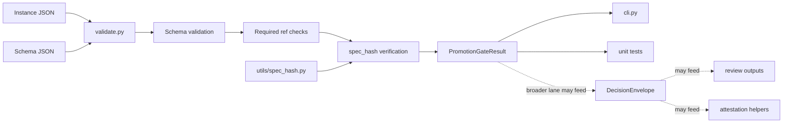
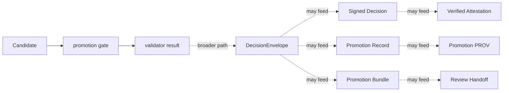

<!-- [KFM_META_BLOCK_V2]
doc_id: kfm://doc/NEEDS-VERIFICATION
title: tools/validators/promotion_gate
type: standard
version: v1
status: draft
owners: @bartytime4life
created: YYYY-MM-DD
updated: 2026-04-16
policy_label: public
related: [
  ../README.md,
  ../connector_gate/README.md,
  ../../../pipelines/soil-moisture-watch/README.md,
  ../../../contracts/README.md,
  ../../../contracts/soil_moisture/reading.schema.json,
  ../../../schemas/contracts/README.md,
  ../../../schemas/contracts/v1/README.md,
  ../../../schemas/contracts/v1/runtime/README.md,
  ../../../schemas/contracts/v1/release/README.md,
  ../../../schemas/contracts/v1/policy/README.md,
  ../../../policy/README.md,
  ../../../policy/promotion_bundle_diff_policy.json,
  ../../../data/receipts/README.md,
  ../../../data/proofs/README.md,
  ../../../data/catalog/stac/README.md,
  ../../../data/catalog/dcat/README.md,
  ../../../data/catalog/prov/README.md,
  ../../../tests/README.md,
  ../../../tests/contracts/README.md,
  ../../../tests/unit/test_promotion_gate_validate.py,
  ../../../tests/unit/test_promotion_gate_runtime_response_envelope.py,
  ../../../tests/unit/test_promotion_gate_release_manifest.py,
  ../../../tests/reproducibility/README.md,
  ../../../tools/attest/README.md,
  ../../../tools/ci/render_promotion_summary.py,
  ../../../tools/ci/render_promotion_bundle_summary.py,
  ../../../tools/ci/render_diff_summary.py,
  ../../../tools/ci/render_bundle_diff_policy_summary.py,
  ../../../tools/ci/render_promotion_review_handoff.py,
  ../../../tools/diff/stable_diff.py,
  ../../../tools/catalog/catalog_crosslink.py,
  ../../../.github/workflows/README.md,
  ../../../.github/watchers/README.md,
  ./validate.py,
  ./cli.py
]
tags: [kfm, validators, promotion, governance, evidence, ci, diff-policy, review-handoff, proofs, receipts, spec_hash]
notes: [
  Release-facing validator contract for governed promotion decisions.
  This revision preserves the stronger existing gate model, trust-chain split, and bundle-diff-policy posture while updating the lane to reflect the current thin-slice executable helpers validate.py and cli.py plus spec_hash-aware promotion checks.
  Exact mounted executable inventory, schema presence, attestation helper wiring, and merge-blocking workflow integration remain NEEDS VERIFICATION where not directly proven.
]
[/KFM_META_BLOCK_V2] -->

<a id="top"></a>

# `tools/validators/promotion_gate/`

Fail-closed, evidence-first validator surface for **governed promotion decisions** on release-bearing KFM candidates.

> [!NOTE]
> **Status:** `experimental`  
> **Document status:** `draft`  
> **Owners:** `@bartytime4life`  
> **Path:** `tools/validators/promotion_gate/README.md`  
> 
> 
> 
> 
> 
>   
> **Quick jumps:** [Scope](#scope) · [Repo fit](#repo-fit) · [Accepted inputs](#accepted-inputs) · [Exclusions](#exclusions) · [Directory tree](#directory-tree) · [Decision contract](#decision-contract) · [Gate matrix](#gate-matrix) · [Execution flow](#execution-flow) · [Outputs](#outputs) · [`run_receipt` posture](#run_receipt-posture) · [`spec_hash` rules](#spec_hash-rules) · [Runner surfaces](#runner-surfaces) · [Trust chain](#trust-chain) · [Catalog closure](#catalog-closure) · [Quickstart](#quickstart) · [Task list](#task-list) · [FAQ](#faq)

> [!IMPORTANT]
> This document defines both a **validator contract** and a **thin-slice executable shape** for promotion validation. It does **not** by itself prove that all mounted scripts, schemas, policies, tests, attestation helpers, or merge-blocking integrations are present on the active branch. Exact file inventory, schema locations, workflow wiring, and enforcement posture remain **NEEDS VERIFICATION** where not directly confirmed.

> [!TIP]
> Keep the KFM trust split visible here:
>
> **receipt ≠ proof ≠ catalog ≠ publication**
>
> `promotion_gate/` may validate declared linkage among these surfaces, and may derive release-significant trust objects, but it must not collapse them into one helper-owned authority.

> [!CAUTION]
> This lane sits **before promotion**, not after it. It may require receipt linkage, validator results, attestation visibility, and reviewer readiness, but it does not own receipt storage, signing mechanics, or publication.

| Field | Value |
|---|---|
| Path | `tools/validators/promotion_gate/` |
| Role | Deterministic release-facing validator for governed promotion decisions |
| Thin-slice executables | `validate.py`, `cli.py` |
| Thin-slice decision grammar | `allow` / `deny` |
| Current hard checks | schema validity · required refs · `spec_hash` integrity |
| Adjacent proof surfaces | `data/receipts/` · `data/proofs/` · `data/catalog/{stac,dcat,prov}/` |
| Trust reminder | `validator ≠ attest ≠ receipt store ≠ publication` |

---

## Scope

This lane decides whether a **release candidate** is promotable under KFM governance. It validates the candidate, emits a finite machine-readable decision, and routes the result into governed review. It is **not** the act of publication.

This README serves two purposes at once:

1. a **normative lane contract** for promotion decisions, and  
2. an **implementation-facing directory README** for the executable thin slice scaffolded under this path.

### Working question

> **Is this release-bearing candidate explicit, reviewable, policy-compliant, and trust-complete enough to advance into governed release flow?**

In practical terms, this lane is where a promotion candidate should be checked for:

- stable candidate identity and canonical `spec_hash`
- schema validity against declared machine contract
- required trust linkage such as `audit_ref`, proof refs, or receipt refs
- rights, sensitivity, and policy posture
- receipt, proof, and attestation linkage
- rollback, supersession, and steward review readiness
- catalog closure across STAC, DCAT, and PROV
- explicit reviewer-facing outputs without pretending publication already happened

### Thin-slice fit for soil-moisture work

For the current Mesonet-first soil-moisture slice, this gate sits **downstream of canonical normalization**. It should consume:

- canonical soil-moisture candidate rows
- deterministic `spec_hash`
- explicit source identity
- explicit policy context
- any anomaly, outage, or no-op replay signal relevant to promotion review

It should **not** repair malformed upstream candidate preparation. Weak or ambiguous candidates should fail closed here rather than be silently fixed.

### What changed in this revision

This revision makes five boundary rules more explicit:

1. **validators** decide promotability and linkage readiness
2. **attestation helpers** may sign or verify already-validated decision objects, but do not own promotion logic
3. **receipts** are required process memory inputs, but they do not become proofs merely by being present
4. **review handoff Markdown** remains derived convenience output, not sovereign machine authority
5. the current thin slice now includes concrete helpers for schema validation, required-ref enforcement, and `spec_hash` verification

### Truth labels used here

| Label | Meaning here |
|---|---|
| **CONFIRMED** | Directly supported by stable KFM doctrine or the visible document set |
| **INFERRED** | Strongly suggested by adjacent checked-in docs and lane structure |
| **PROPOSED** | Recommended thin-slice shape consistent with current doctrine |
| **UNKNOWN** | Not surfaced strongly enough to state as current repo fact |
| **NEEDS VERIFICATION** | Exact mounted file, workflow, schema, or enforcement detail should be checked on the working branch |

[Back to top](#top)

---

## Repo fit

**Path:** `tools/validators/promotion_gate/README.md`  
**Lane:** `tools/validators/`  
**Role:** deterministic release-facing validator surface for governed promotion decisions

### Upstream and adjacent anchors

| Relation | Surface | Why it matters |
|---|---|---|
| Parent lane | [`../README.md`](../README.md) | Sets the validator-family posture: deterministic, reviewable, fail-closed helpers |
| Upstream admission membrane | [`../connector_gate/README.md`](../connector_gate/README.md) | Connector admission is narrower and earlier than release promotion |
| Candidate prep lane | [`../../../pipelines/soil-moisture-watch/README.md`](../../../pipelines/soil-moisture-watch/README.md) | Soil-moisture watch produces canonical candidates that may eventually reach this gate |
| Shared contracts | [`../../../contracts/README.md`](../../../contracts/README.md) | Promotion should validate declared authority, not invent it |
| Soil-moisture contract | [`../../../contracts/soil_moisture/reading.schema.json`](../../../contracts/soil_moisture/reading.schema.json) | Canonical row shape for the first-wave Mesonet slice |
| Schema-side machine contracts | [`../../../schemas/contracts/README.md`](../../../schemas/contracts/README.md), [`../../../schemas/contracts/v1/README.md`](../../../schemas/contracts/v1/README.md) | Current schema-side machine files remain the strongest visible contract-family anchors |
| Runtime / release / policy contract neighbors | [`../../../schemas/contracts/v1/runtime/README.md`](../../../schemas/contracts/v1/runtime/README.md), [`../../../schemas/contracts/v1/release/README.md`](../../../schemas/contracts/v1/release/README.md), [`../../../schemas/contracts/v1/policy/README.md`](../../../schemas/contracts/v1/policy/README.md) | Promotion consumes these contract-bearing shapes without replacing them |
| Shared policy | [`../../../policy/README.md`](../../../policy/README.md) | Deny-by-default and obligation-bearing logic belongs there |
| Receipts | [`../../../data/receipts/README.md`](../../../data/receipts/README.md) | Process memory should remain inspectable and separate from proof |
| Proofs | [`../../../data/proofs/README.md`](../../../data/proofs/README.md) | Release-grade proof objects and bundles belong there conceptually, even if helpers here derive some artifacts |
| Attestation helper lane | [`../../../tools/attest/README.md`](../../../tools/attest/README.md) | Signing and verification helpers are adjacent consumers, not owners of promotion decision law |
| Catalog closure | [`../../../data/catalog/stac/README.md`](../../../data/catalog/stac/README.md), [`../../../data/catalog/dcat/README.md`](../../../data/catalog/dcat/README.md), [`../../../data/catalog/prov/README.md`](../../../data/catalog/prov/README.md) | Promotion should validate outward identity closure, not treat catalog fields as decorative metadata |
| Workflow boundary | [`../../../.github/workflows/README.md`](../../../.github/workflows/README.md) | Orchestration should call helpers here rather than bury policy-significant logic in workflow YAML |
| Watcher boundary | [`../../../.github/watchers/README.md`](../../../.github/watchers/README.md) | Upstream watcher lanes may emit receipts, but this lane remains promotion-facing rather than watcher-owning |
| Contract verification family | [`../../../tests/contracts/README.md`](../../../tests/contracts/README.md) | Promotion should depend on validated contract objects rather than ad hoc payloads |
| Reproducibility family | [`../../../tests/reproducibility/README.md`](../../../tests/reproducibility/README.md) | `spec_hash` stability and replay concerns belong there first, then are enforced here |
| Thin-slice tests | [`../../../tests/unit/test_promotion_gate_validate.py`](../../../tests/unit/test_promotion_gate_validate.py), [`../../../tests/unit/test_promotion_gate_runtime_response_envelope.py`](../../../tests/unit/test_promotion_gate_runtime_response_envelope.py), [`../../../tests/unit/test_promotion_gate_release_manifest.py`](../../../tests/unit/test_promotion_gate_release_manifest.py) | The gate now has documented unit-level evidence for schema, ref, and `spec_hash` enforcement |

### Boundary rule

Use `promotion_gate/` to validate **release readiness**.

Do **not** use it to:

- publish artifacts directly
- merge branches directly
- own signing logic
- own receipt storage
- own domain-specific subject validation in hydrology, hazards, soils, or other lanes
- replace runtime answer-accountability envelopes
- redefine contracts, schemas, or policy owned elsewhere
- turn CI presentation helpers into policy authority
- replace underlying machine artifacts with a single Markdown handoff document

[Back to top](#top)

---

## Accepted inputs

Accepted inputs are the minimum evidence-bearing objects required to judge one promotion candidate.

| Input | Required | Purpose |
|---|---:|---|
| candidate instance | yes | trust-bearing object under promotion review |
| schema path | yes | contract against which the instance is evaluated |
| `spec_hash` | yes | deterministic identity anchor for the candidate |
| required refs | yes | minimum linkage such as `audit_ref`, `proof_ref`, or `run_receipt_ref` |
| policy context | conditional | classification and governance posture when outcome law depends on it |
| `run_receipt` | conditional but strongly pressured | process memory proving what upstream preparation or validation occurred |
| attestation refs | conditional | carries integrity and origin evidence where release-significant |
| prior release ref / rollback posture | conditional | preserves reversal and supersession visibility |
| `ai_receipt` | conditional | required when model mediation affected the candidate |
| bundle diff policy | conditional | needed when prior/current bundle review is part of the path |

### Current thin-slice file inputs

| Input | Expected path family |
|---|---|
| instance under review | trust-bearing JSON fixture or emitted artifact |
| schema | `schemas/contracts/v1/**` |
| promotion validator | `tools/validators/promotion_gate/validate.py` |
| promotion CLI | `tools/validators/promotion_gate/cli.py` |
| `spec_hash` helper | `utils/spec_hash.py` |
| unit tests | `tests/unit/test_promotion_gate_*.py` |

### Soil-moisture first-wave candidate expectations

For the Mesonet-first soil-moisture lane, the strongest currently supported minimum candidate should arrive with:

- canonical long-form observation rows conforming to the reading contract
- deterministic `spec_hash`
- explicit source identity
- explicit schema version
- explicit policy label
- anomaly, outage, or no-meaningful-change signal when relevant

This keeps the gate deterministic and replayable while allowing promotion to remain **event-aware** rather than merely file-aware.

### Receipt / proof input rule

Promotion should treat receipts and proofs as distinct input classes:

| Input class | Role at this gate |
|---|---|
| **Receipt** | process memory proving what upstream preparation, validation, or review activity occurred |
| **Proof / attestation** | release-significant trust object or verification state carried forward into stronger review |
| **Catalog closure** | outward release identity and lineage surfaces |
| **Review handoff** | derived steward-facing convenience output, never the sole authority |

A promotable candidate may require all four without collapsing them into one object.

[Back to top](#top)

---

## Exclusions

This lane does **not**:

- publish artifacts directly
- merge branches directly
- replace domain-specific validation in subject lanes
- stand in for request-time runtime accountability such as `RuntimeResponseEnvelope`
- redefine schemas or policy owned elsewhere
- convert a README into proof that implementation already exists
- embed governance authority in helper scripts where policy should remain the source of truth
- compute general diff law inside CI renderers
- replace underlying machine artifacts with one composed Markdown reviewer handoff
- repair malformed upstream candidates that should have failed before promotion review
- own signing mechanics that belong in `tools/attest/`
- own receipt storage that belongs in `data/receipts/`

---

## Directory tree

### Current thin-slice lane

```text
tools/validators/promotion_gate/
├── README.md
├── validate.py
└── cli.py
```

### Nearby documented proof surfaces

```text
tests/unit/
├── test_promotion_gate_validate.py
├── test_promotion_gate_runtime_response_envelope.py
└── test_promotion_gate_release_manifest.py

utils/
└── spec_hash.py
```

### Broader legacy / aspirational surfaces from earlier drafts (`NEEDS VERIFICATION`)

```text
tools/validators/promotion_gate/
├── promotion_gate.py
├── prepare_candidate_fixture.py
├── validate_decision_envelope.py
├── validate_promotion_record.py
├── validate_promotion_prov.py
├── validate_promotion_bundle.py
├── write_promotion_record.py
├── write_promotion_bundle.py
├── emit_promotion_prov.py
├── evaluate_bundle_diff_policy.py
├── validate_bundle_diff_policy.py
└── policies/
```

> [!NOTE]
> Shared contracts, schemas, policy surfaces, attestation helpers, and receipt storage remain authoritative in their own repo homes. This lane validates and consumes them; it does not replace them.

[Back to top](#top)

---

## Decision contract

Every promotion attempt must end in one finite result.

### Current thin-slice decision grammar

| Result | Meaning |
|---|---|
| `allow` | candidate satisfied current gate checks strongly enough to advance |
| `deny` | candidate failed one or more current gate checks |

The current thin slice returns a `PromotionGateResult` with:

- `ok`
- `outcome`
- `reasons[]`
- `errors[]`

### Broader doctrinal grammar still matters

The broader lane contract still pressures a richer decision surface:

| Result | Meaning |
|---|---|
| `ALLOW` | candidate satisfied all required gates strongly enough to advance into governed release flow |
| `ABSTAIN` | evidence is insufficient to promote safely, but no direct contradiction has been proven |
| `DENY` | candidate failed one or more required gates |
| `ERROR` | the gate could not safely evaluate due to parse, execution, or other fail-closed faults |

> [!WARNING]
> `allow` / `deny` in the current thin slice are not proof that the full richer grammar is already encoded everywhere in mounted implementation. Keep the current executable reality and the broader lane contract distinct.

### Current thin-slice checks

| Check | Purpose |
|---|---|
| schema validation | reject malformed instances |
| required refs present | ensure minimal trust linkage is visible |
| `spec_hash` matches canonicalized material | enforce deterministic identity integrity |

[Back to top](#top)

---

## Outputs

The current thin slice emits a **validator result object**, not publication.

### Current thin-slice result shape

```yaml
ok: true | false
outcome: allow | deny
reasons: []
errors: []
```

### Output intent

| Field | Purpose |
|---|---|
| `ok` | machine-readable pass/fail summary |
| `outcome` | finite validator result |
| `reasons[]` | named failure classes such as `schema_invalid`, `missing_required_refs`, `spec_hash_invalid` |
| `errors[]` | reviewer-readable failure details |

### Secondary and derived outputs

The broader lane may eventually emit or participate in:

| Object | Purpose |
|---|---|
| `DecisionEnvelope` | finite machine-readable promotion decision |
| `promotion-summary.md` | reviewer-readable summary |
| `promotion-record.json` | compact promotion ledger entry |
| `promotion-prov.json` | minimal PROV document |
| `promotion-bundle.json` | index of the full governed promotion artifact set |
| `promotion-bundle-diff.json` | prior/current bundle diff report |
| `promotion-bundle-diff-policy.json` | machine-readable policy classification of bundle drift |
| `promotion-review-handoff.md` | composed steward-facing review document |

Those broader outputs remain **PROPOSED / NEEDS VERIFICATION** unless directly surfaced on branch.

---

## `run_receipt` posture

Promotion is not the only place receipts matter, but this gate must treat receipt presence and linkage as non-optional whenever the promoted object requires them.

### Receipt role at this lane

| Surface | Role here |
|---|---|
| `run_receipt` | process memory proving what upstream candidate-preparation or validation activity occurred |
| validator result | current thin-slice allow/deny gate result |
| DecisionEnvelope | broader release-facing promotion decision surface |
| Proof / attestation objects | release-significant trust objects that remain separate from receipts |
| Catalog objects | outward discovery and lineage surfaces, still separate from both receipts and proofs |

### Minimum expectations

At promotion review time, the strongest current posture is:

- `run_receipt_ref` should be required when the object family depends on process-memory linkage
- receipt must link coherently to the candidate subject or release-bearing activity
- receipt absence is a **gate-level failure**, not a warning
- receipt presence is **necessary but not sufficient** for promotion

### Receipt / proof boundary rule

Promotion may:

- require `run_receipt`
- require `receipt_ref`
- require proof linkage
- require attestation visibility

Promotion must **not**:

- redefine receipt storage
- treat receipt presence as equivalent to proof completeness
- silently upgrade process memory into release proof by convenience

[Back to top](#top)

---

## Gate matrix

### Current executable thin-slice gate set

| Gate | Current implementation | Failure reason |
|---|---|---|
| schema validity | validate instance against schema | `schema_invalid` |
| required refs present | enforce non-empty string refs | `missing_required_refs` |
| `spec_hash` integrity | recompute from canonical material and compare | `spec_hash_invalid` |

### Broader A–G lane model still matters

| Gate | Name | What it checks | Minimum evidence |
|---|---|---|---|
| **A** | Identity and closure | stable identifier, canonical `spec_hash`, required outward identity fields | `candidate_id`, spec bytes, declared hash, release subject identity |
| **B** | Asset integrity | every declared asset exists, is checksummed, and matches reviewed bytes | `assets[]`, checksums, manifest or STAC asset linkage |
| **C** | Geometry and CRS invariants | geometry validity, CRS allowlist, bbox consistency, deterministic generalization, sane summaries | geometry-bearing assets, CRS metadata, bbox, generalization parameters |
| **D** | Temporal and coverage semantics | valid intervals, coherent spatial / temporal coverage, freshness declarations where required | time fields, coverage metadata, source-aligned scope declarations |
| **E** | Rights, sensitivity, and policy | license, rights, policy label, sensitivity handling, deny-by-default on missing classification | rights metadata, policy label, reviewable classification context |
| **F** | Provenance, proofs, and receipts | receipts present, attestations validate, proof hashes match, catalog / provenance closure is coherent | `run_receipt`, `attestation_refs`, `catalog_refs`, proof objects |
| **G** | Reviewer intent and rollback readiness | approval present, steward recorded, rollback target exists, supersession is visible and reversible | `review`, prior release reference, correction / rollback posture |

### First-wave soil-moisture interpretation

For the Mesonet-first soil-moisture slice, the following promotion triggers remain particularly important **after** the required gates pass:

| Trigger | Why it matters |
|---|---|
| `spec_hash` changed | canonical candidate identity changed |
| new station detected | roster meaning changed |
| anomaly detected | operationally meaningful event |
| outage / degraded signal detected | operationally meaningful event |
| schema version changed | contract meaning changed |

If none of those conditions are true, the candidate may still produce a decision artifact and reviewer visibility, but should generally **not** advance as a meaningful promotion event.

[Back to top](#top)

---

## `spec_hash` rules

`spec_hash` is the deterministic identity anchor for promotion review.

### It MUST be derived from

- canonicalized candidate rows or equivalent canonical subject material
- ordered, stable content representation
- declared variable / depth whitelist or equivalent meaning-bearing configuration
- source identity / descriptor material where relevant
- transform or schema version inputs that affect meaning

### It MUST NOT be derived from

- filenames
- incidental run timestamps
- scheduler cadence
- temporary storage paths
- non-deterministic ordering

### Gate consequences

| `spec_hash` state | Gate implication |
|---|---|
| Missing | gate failure |
| Present but unsupported by canonical subject material | gate failure |
| Present and changed | promotion-meaningful if other gates pass |
| Present and unchanged, no meaningful operational event | likely no-op or review-only path |

> [!CAUTION]
> Identity drift should be treated as a release-significant concern. A weak or unexplained `spec_hash` is not a “best effort” warning; it is grounds to fail closed.

[Back to top](#top)

---

## Execution flow



### Current thin-slice execution steps

1. load the candidate instance
2. load the schema
3. validate object shape
4. check required refs
5. verify `spec_hash`
6. return finite allow / deny result
7. optionally render result through CLI or tests

### Validator / attest sequencing rule

The healthy order is:

1. validate candidate and linkage
2. emit validator result
3. only then sign or verify through `tools/attest/` if the broader lane requires it

That keeps promotion law here and signing mechanics in the adjacent helper lane.

[Back to top](#top)

---

## Runner surfaces

### `validate.py`

The current thin-slice validator exposes:

- `validate_schema(...)`
- `verify_spec_hash(...)`
- `require_refs(...)`
- `run_promotion_gate(...)`

### `cli.py`

The current CLI exposes:

- positional instance path
- positional schema path
- repeatable `--require-ref`
- exit code `0` on allow
- exit code `1` on deny

### Current tested bindings

The current thin slice has documented unit tests for:

- generic promotion-gate behavior
- runtime response envelope binding
- release manifest binding

That is enough to describe this lane as **executable**, while still keeping broader inventory claims bounded.

[Back to top](#top)

---

## Trust chain

The broader promotion lane still supports a fuller governed evidence chain even if the current executable slice is narrower.



### Trust object split

| Surface | Role |
|---|---|
| validator result | finite current thin-slice allow / deny result |
| `DecisionEnvelope` | broader machine-readable promotion decision |
| `decision-sign-result.json` | attestation helper result for signing |
| `decision-verify-result.json` | attestation helper result for verification |
| `promotion-record.json` | compact governed ledger entry |
| `promotion-prov.json` | provenance activity for promotion |
| `promotion-bundle.json` | bundle manifest indexing the full promotion artifact set |
| `promotion-review-handoff.md` | composed reviewer-facing document derived from, but not replacing, underlying machine artifacts |

> [!NOTE]
> This preserves KFM’s **receipt vs proof** doctrine. Receipts capture process memory; proofs and release-significant trust objects remain separately identifiable.

[Back to top](#top)

---

## Catalog closure

Minimal closure expectations are not decorative metadata checks. They are release-scope identity checks.

| Surface | Minimum expectation |
|---|---|
| **STAC** | release-bearing item or collection for outward spatial or spatiotemporal assets |
| **DCAT** | dataset or distribution discovery for the same promoted subject |
| **PROV** | lineage linking entity, activity, and agent for the same outward release |
| **Cross-surface rule** | STAC, DCAT, and PROV must agree on subject identity, scope, and correction posture |

[Back to top](#top)

---

## Quickstart

### Run the promotion gate directly

```bash
python -m tools.validators.promotion_gate.cli \
  tests/contracts/cases/wave-01-core/runtime-response-envelope/runtime_response_envelope.answer.valid.json \
  schemas/contracts/v1/runtime/runtime_response_envelope.schema.json \
  --require-ref audit_ref
```

### Run the runtime-envelope gate binding tests

```bash
pytest tests/unit/test_promotion_gate_runtime_response_envelope.py -q
```

### Run the release-manifest gate binding tests

```bash
pytest tests/unit/test_promotion_gate_release_manifest.py -q
```

### Run the generic promotion gate validator tests

```bash
pytest tests/unit/test_promotion_gate_validate.py -q
```

> [!TIP]
> Keep command examples aligned with mounted implementation. This README should not invent runnable paths once the active branch proves a different interface.

[Back to top](#top)

---

## Task list

### Thin-slice definition of done

- [x] promotion gate emits one finite result for each candidate
- [x] schema validity is checked explicitly
- [x] required refs can be enforced explicitly
- [x] `spec_hash` integrity is verified explicitly
- [x] current thin-slice CLI is documented
- [x] runtime-envelope binding tests exist
- [x] release-manifest binding tests exist
- [ ] `run_receipt` presence is validated explicitly for all relevant promoted families
- [ ] receipt / proof separation remains explicit in all emitted artifacts and docs
- [ ] broader DecisionEnvelope output path is branch-verified
- [ ] malformed, anonymous, or policy-unresolved candidates fail closed in all supported family bindings
- [ ] no-op or unchanged candidates do not silently masquerade as meaningful promotions
- [ ] exact mounted workflow wiring is confirmed on branch before claiming enforcement

### Open verification items

- [ ] confirm mounted executable inventory under `tools/validators/promotion_gate/`
- [ ] confirm schema presence and exact filenames under the active schema subtree
- [ ] confirm policy file presence and active usage
- [ ] confirm unit test filenames and current branch status
- [ ] confirm merge-blocking or review-blocking workflow integration
- [ ] confirm whether soil-moisture promotion uses the same full bundle path or a narrowed first-wave subset
- [ ] confirm exact attestation helper call signatures on the active branch
- [ ] confirm whether broader promotion-bundle diff-policy surfaces are mounted or still aspirational

[Back to top](#top)

---

## FAQ

### Does `promotion_gate/` publish anything directly?

No. It validates release readiness, emits a finite validator result, and prepares the next governed handoff. Publication remains a later state transition.

### Is this the same thing as `connector_gate/`?

No. `connector_gate/` is upstream and admission-facing. `promotion_gate/` is later, stronger, and release-facing.

### Why does this lane talk about receipts, proofs, and catalog closure together?

Because promotion is where those surfaces must agree without being collapsed. This lane validates their coherence; it does not erase their separate roles.

### Is the current thin-slice result the same thing as a `DecisionEnvelope`?

No. The current executable slice returns a smaller validator result object. A richer `DecisionEnvelope` surface remains broader lane doctrine and still needs branch-backed proof where not directly surfaced.

### Can this lane sign artifacts?

It may call signing or verification helpers as part of a broader flow, but signature execution mechanics still belong conceptually to adjacent attestation surfaces rather than to policy authority itself.

### How should unchanged soil-moisture candidates behave?

They may still produce a reviewable validator result, but should not be treated as meaningful promotion events unless identity, roster, anomaly, outage, or contract meaning changed.

### Can `run_receipt` alone make a candidate promotable?

No. Receipt presence is necessary process memory, not sufficient release proof.

[Back to top](#top)