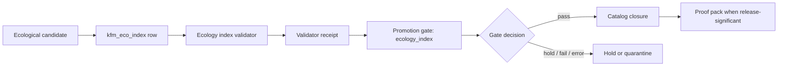

<!-- [KFM_META_BLOCK_V2]
doc_id: kfm://doc/<NEEDS_VERIFICATION_UUID>
title: Ecology Index Promotion Gate Integration
type: standard
version: v1
status: draft
owners: @bartytime4life
created: <NEEDS_VERIFICATION_CREATED_DATE>
updated: 2026-04-24
policy_label: <NEEDS_VERIFICATION_POLICY_LABEL>
related: [
  "../ecology_index/README.md",
  "../ecology_index/tests/README.md",
  "./README.md",
  "../../../schemas/ecology/kfm_eco_index.schema.json",
  "../../../data/registry/ecology/README.md",
  "../../../data/catalog/ecology/README.md",
  "../../../data/receipts/README.md",
  "../../../data/proofs/README.md"
]
tags: [kfm, ecology, promotion-gate, validator, receipts, proofs, fail-closed]
notes: [
  "PROPOSED integration guide for connecting the ecology index validator to the promotion gate.",
  "Does not claim promotion-gate code currently consumes ecology validator receipts.",
  "Owner, doc_id, created date, policy label, gate name, paths, and CI wiring require active-branch verification."
]
[/KFM_META_BLOCK_V2] -->

<a id="top"></a>

# Ecology Index Promotion Gate Integration

Promotion-gate integration guide for ecological artifacts that depend on `kfm_eco_index`.


| Field | Value |
|---|---|
| **Suggested path** | `tools/validators/promotion_gate/ecology_index.md` |
| **Truth posture** | `PROPOSED` |
| **Primary audience** | Validator maintainers, promotion-gate maintainers, ecology lane stewards |
| **Current implementation claim** | `UNKNOWN` — active branch, gate registry, CI wiring, and receipt lookup are not verified in this document |
| **Core rule** | Ecological promotion must fail closed when `kfm_eco_index` joins cannot be validated |

**Quick links:** [Scope](#scope) · [Repo fit](#repo-fit) · [Integration model](#integration-model) · [Gate inputs](#gate-inputs) · [Fail-closed matrix](#fail-closed-matrix) · [Receipt contract](#receipt-contract) · [Gate result](#gate-result-extension) · [Definition of done](#definition-of-done) · [Verification backlog](#verification-backlog)

> [!IMPORTANT]
> This document is an integration proposal. It defines the desired promotion-gate behavior for ecological artifacts that depend on `kfm_eco_index`; it does **not** assert that the current promotion-gate implementation already performs these checks.

---

## Scope

This guide describes how the ecology index validator should participate in promotion preflight.

It applies when a candidate ecological artifact, layer, dataset, claim, or derived product depends on a `kfm_eco_index` row or join relationship.

### Accepted inputs

The promotion gate may evaluate an ecological candidate when the promotion request can provide or resolve:

| Input | Required | Why it matters |
|---|---:|---|
| Candidate artifact ref | Yes | Identifies the artifact being considered for promotion. |
| `kfm_eco_index` row ref | Yes | Identifies the ecological join-index record the candidate depends on. |
| Ecology index validator receipt | Yes | Provides the validator decision and `spec_hash` used during validation. |
| Schema ref | Yes | Prevents silently validating against an unexpected contract. |
| Spec hash | Yes | Anchors the validator result to the candidate contract or canonicalized spec. |
| Evidence refs | Yes | Allows `EvidenceRef` → `EvidenceBundle` closure before outward support is claimed. |
| Catalog refs | Required for publishable artifacts | Confirms the candidate can close against catalog records before release. |
| Proof refs | Required for release-significant artifacts | Confirms release-significant artifacts have proof-pack support. |

### Exclusions

This gate integration does **not**:

- run the ecology index validator itself;
- decide ecological truth independently of evidence;
- replace source registries, catalog closure, proof packs, or policy gates;
- publish artifacts;
- turn validator receipts into proof packs;
- expose RAW, WORK, QUARANTINE, or canonical/internal stores to public clients;
- allow AI, Focus Mode, or map popups to present unsupported ecological claims.

---

## Repo fit

| Layer | Proposed repo surface | Role |
|---|---|---|
| Ecology validator | `tools/validators/ecology_index/` | Validates `kfm_eco_index` rows and emits validator receipts. |
| Promotion gate | `tools/validators/promotion_gate/` | Consumes validator receipts and decides whether the candidate may continue toward promotion. |
| Ecology schema | `schemas/ecology/kfm_eco_index.schema.json` | Defines the index contract expected by the validator. |
| Registry | `data/registry/ecology/` | Records ecology source and lane metadata. |
| Catalog | `data/catalog/ecology/` | Holds publishable catalog closure records. |
| Receipts | `data/receipts/` | Stores process-memory receipts, including validator results. |
| Proofs | `data/proofs/` | Stores release-significant proof artifacts. |

> [!NOTE]
> The path relationships above are `PROPOSED` from the supplied draft. If the active branch uses different schema, registry, receipt, proof, or validator homes, preserve the behavior and update this document through an ADR or migration note instead of creating parallel authority.

---

## Integration model

The ecology index validator should become a promotion preflight for any ecological candidate that depends on `kfm_eco_index`.

Promotion must fail closed when the candidate cannot prove that its ecological joins were validated under the same spec hash being promoted.



### Boundary of responsibility

| Component | Owns | Does not own |
|---|---|---|
| Ecology index validator | Schema-level and join-index validation for `kfm_eco_index` inputs. | Promotion, publication, catalog closure, policy decision, proof-pack creation. |
| Validator receipt | Machine-readable memory of the validation result. | Public truth, proof of release, or catalog closure. |
| Promotion gate | Fail-closed preflight, receipt validation, `spec_hash` comparison, required-ref checks, result emission. | Re-running all domain validation logic or silently repairing missing evidence. |
| Catalog closure | Publishable artifact closure against catalog records. | Validator decision or policy authorization. |
| Proof pack | Release-significant evidence and integrity support. | Routine validator receipt storage. |

---

## Gate inputs

The promotion request should provide enough context for the gate to bind the candidate, validator receipt, schema, and spec hash into one reviewable decision.

```json
{
  "gate": "ecology_index",
  "candidate_ref": "<candidate-artifact-ref>",
  "eco_index_ref": "<kfm-eco-index-row-ref>",
  "validator_receipt_ref": "<receipt-ref>",
  "schema_ref": "schemas/ecology/kfm_eco_index.schema.json",
  "spec_hash": "sha256:<canonical-spec-hash>",
  "catalog_refs": ["<catalog-ref>"],
  "proof_refs": ["<proof-ref-if-release-significant>"]
}
```

> [!WARNING]
> A candidate with a valid-looking ecology index row but no matching validator receipt must not be treated as validated.

---

## Fail-closed matrix

Promotion must fail closed or hold when any required trust object is missing, mismatched, or unresolved.

| Condition | Gate result | Candidate disposition | Notes |
|---|---|---|---|
| Validator receipt is missing | `fail` | `hold` or `quarantine` | No validated join-index support is available. |
| Validator decision is not `pass` | `fail` | `quarantine` or `hold` | Preserve validator errors and warnings in the gate result. |
| Receipt `spec_hash` does not match candidate `spec_hash` | `fail` | `quarantine` | Prevents stale or wrong-contract validation from authorizing promotion. |
| Schema ref is missing or unexpected | `fail` | `hold` | Prevents accidental validation against the wrong schema. |
| Candidate or receipt cannot resolve the `kfm_eco_index` row ref | `fail` | `hold` | Join support is not inspectable. |
| Evidence refs are unresolved | `hold` | `hold` | Candidate may need steward review or evidence repair. |
| Catalog closure is missing for publishable artifacts | `hold` | `hold` | Publishable artifacts must close against catalog records before release. |
| Proof refs are missing for release-significant artifacts | `hold` | `hold` | Proof packs remain separate from validator receipts. |
| Policy or sensitivity state blocks publication | `fail` or `hold` | `quarantine` or `hold` | Exact policy mapping is `NEEDS VERIFICATION`. |
| Gate cannot evaluate due to tool/runtime error | `fail` | `hold` | Error is not a pass. Emit reason code and preserve audit trail. |

### Decision vocabulary note

The supplied draft uses `pass`, `fail`, `hold`, `quarantine`, and `abstain`.

`NEEDS VERIFICATION`: If the active promotion gate already has a canonical enum, map these terms to that enum instead of creating a parallel vocabulary. Recommended separation:

| Term | Preferred role |
|---|---|
| `pass` | Gate decision: candidate may continue. |
| `fail` | Gate decision: candidate may not continue. |
| `hold` | Review disposition: missing or unresolved support may be repairable. |
| `quarantine` | Lifecycle disposition: candidate is unsafe or unsupported for promotion. |
| `abstain` | Runtime/UI posture: do not present the claim as supported. |

---

## Receipt contract

Promotion gate should consume a validator receipt with at least this shape:

```json
{
  "receipt_type": "validator_result",
  "validator": "tools/validators/ecology_index",
  "schema_ref": "schemas/ecology/kfm_eco_index.schema.json",
  "input_ref": "<candidate-or-fixture-ref>",
  "decision": "pass",
  "errors": [],
  "warnings": [],
  "spec_hash": "sha256:<canonical-spec-hash>",
  "generated_at": "<timestamp>"
}
```

### Receipt acceptance rules

The promotion gate should reject the receipt unless all required checks pass:

| Check | Required behavior |
|---|---|
| `receipt_type` | Must be `validator_result`. |
| `validator` | Must identify the ecology index validator. |
| `schema_ref` | Must match the expected ecology index schema. |
| `input_ref` | Must bind to the candidate, fixture, or resolved `kfm_eco_index` row under review. |
| `decision` | Must be `pass`. |
| `spec_hash` | Must equal the candidate `spec_hash`. |
| `generated_at` | Must exist and be parseable according to repo timestamp convention. |
| `errors` | Must be empty for `pass`. |
| `warnings` | May be non-empty, but must be surfaced in the gate result. |

> [!NOTE]
> The receipt is process memory. It is not a proof pack, release manifest, catalog record, or publication authorization.

---

## Gate result extension

Suggested draft-compatible promotion-gate result field:

```json
{
  "gate": "ecology_index",
  "decision": "pass",
  "receipt_ref": "<receipt-ref>",
  "spec_hash": "sha256:<canonical-spec-hash>",
  "errors": [],
  "warnings": []
}
```

When the gate fails or holds, preserve the reason rather than flattening the outcome.

```json
{
  "gate": "ecology_index",
  "decision": "fail",
  "receipt_ref": "<receipt-ref-or-null>",
  "spec_hash": "sha256:<candidate-spec-hash>",
  "errors": [
    {
      "code": "ECOLOGY_INDEX_SPEC_HASH_MISMATCH",
      "message": "Validator receipt spec_hash does not match candidate spec_hash."
    }
  ],
  "warnings": []
}
```

### Recommended reason codes

| Reason code | Trigger |
|---|---|
| `ECOLOGY_INDEX_RECEIPT_MISSING` | No validator receipt could be found. |
| `ECOLOGY_INDEX_RECEIPT_INVALID` | Receipt shape or required field validation failed. |
| `ECOLOGY_INDEX_DECISION_NOT_PASS` | Receipt exists but validator decision is not `pass`. |
| `ECOLOGY_INDEX_SPEC_HASH_MISMATCH` | Receipt hash differs from candidate hash. |
| `ECOLOGY_INDEX_SCHEMA_REF_UNEXPECTED` | Receipt schema ref is missing or unexpected. |
| `ECOLOGY_INDEX_INPUT_REF_UNRESOLVED` | Candidate, row, or input ref cannot be resolved. |
| `ECOLOGY_INDEX_EVIDENCE_UNRESOLVED` | Evidence refs do not close to EvidenceBundles. |
| `ECOLOGY_INDEX_CATALOG_OPEN` | Publishable artifact lacks catalog closure. |
| `ECOLOGY_INDEX_PROOF_MISSING` | Release-significant artifact lacks required proof refs. |
| `ECOLOGY_INDEX_GATE_ERROR` | Gate could not evaluate safely. |

---

## Promotion sequence

1. **Resolve candidate identity.** Confirm the candidate artifact ref is stable and belongs to the promotion attempt.
2. **Resolve `kfm_eco_index` dependency.** Confirm the candidate declares or resolves the index row ref it depends on.
3. **Locate validator receipt.** Find the ecology index validator receipt linked to the candidate and index row.
4. **Validate receipt contract.** Confirm required fields, expected validator, expected schema ref, timestamp, and decision.
5. **Compare `spec_hash`.** Require receipt and candidate spec hashes to match.
6. **Resolve evidence support.** Confirm required evidence refs close to EvidenceBundles.
7. **Check catalog closure.** Required for publishable artifacts.
8. **Check proof refs.** Required for release-significant artifacts.
9. **Emit gate result.** Preserve reason codes, errors, warnings, receipt ref, and spec hash.
10. **Continue or stop.** Only `pass` proceeds. Missing, mismatched, unresolved, or unevaluable support does not pass.

---

## CI and fixture expectations

`PROPOSED`: Add fixture-backed tests before wiring the gate into active promotion.

| Fixture class | Example | Expected result |
|---|---|---|
| Valid receipt | Matching candidate, schema, receipt, and spec hash | `pass` |
| Missing receipt | Candidate has no linked ecology validator receipt | `fail` |
| Failed validator | Receipt decision is `fail` or equivalent | `fail` |
| Hash mismatch | Receipt `spec_hash` differs from candidate | `fail` |
| Wrong schema | Receipt schema ref is missing or unexpected | `fail` |
| Unresolved evidence | Required EvidenceRef cannot resolve | `hold` or `fail` |
| Missing catalog closure | Publishable artifact has no catalog refs | `hold` |
| Missing proof refs | Release-significant artifact has no proof refs | `hold` |
| Gate error | Malformed receipt or evaluator failure | `fail` with error reason |

Suggested fixture homes, pending active-branch verification:

```text
tools/validators/promotion_gate/fixtures/ecology_index/pass/
tools/validators/promotion_gate/fixtures/ecology_index/fail/
tools/validators/promotion_gate/fixtures/ecology_index/hold/
tools/validators/promotion_gate/tests/test_ecology_index_gate.*
```

---

## Review outcomes

| Outcome | Meaning | Public/runtime consequence |
|---|---|---|
| `pass` | Validator receipt exists, passes, matches expected schema and spec hash, and required refs close. | Candidate may continue to catalog/proof checks and later promotion steps. |
| `fail` | Validator failed, receipt is invalid, spec hash mismatches, schema is unexpected, or the gate cannot evaluate safely. | Candidate must not promote. |
| `hold` | Evidence, catalog, proof, or stewardship state needs review before release. | Runtime claims should not be presented as supported. |
| `quarantine` | Candidate cannot be safely promoted under current evidence, policy, or sensitivity state. | Keep out of publishable surfaces. |
| `abstain` | Runtime answer posture when support cannot be established. | UI/AI should abstain rather than invent support. |

---

## Non-goals

This integration should stay narrow.

It should not expand the ecology index validator into a promotion system, and it should not expand the promotion gate into a domain validator. Adjacent governed objects remain separate and link by stable refs and `spec_hash`.

The following remain separate surfaces:

- `RunReceipt` or process-memory receipts;
- policy decisions;
- quarantine records;
- catalog records;
- proof packs;
- release manifests;
- UI Evidence Drawer payloads;
- runtime response envelopes.

---

## Definition of done

- [ ] Promotion gate recognizes the `ecology_index` gate name or configured equivalent.
- [ ] Promotion gate can locate ecology validator receipts for candidate ecological artifacts.
- [ ] Promotion gate validates the receipt shape before trusting receipt fields.
- [ ] Promotion gate verifies receipt decision is `pass`.
- [ ] Promotion gate compares receipt `spec_hash` to candidate `spec_hash`.
- [ ] Promotion gate verifies expected schema ref.
- [ ] Promotion gate fails closed on missing, mismatched, or unresolved refs.
- [ ] Evidence refs resolve before outward support is claimed.
- [ ] Catalog closure follows validator pass for publishable artifacts.
- [ ] Proof-pack requirement is enforced for release-significant artifacts.
- [ ] Gate emits structured result with reason codes, errors, warnings, receipt ref, and spec hash.
- [ ] CI includes pass, fail, hold, and error fixtures for the ecology gate.
- [ ] Adjacent docs link to this integration guide after active-branch path verification.

---

## Verification backlog

| Item | Status | Verification action |
|---|---|---|
| Target path | `NEEDS VERIFICATION` | Confirm `tools/validators/promotion_gate/ecology_index.md` is the correct active-branch home. |
| Gate enum | `NEEDS VERIFICATION` | Confirm promotion gate’s canonical decision vocabulary. |
| Receipt storage | `NEEDS VERIFICATION` | Confirm receipt directory and lookup convention. |
| Schema home | `NEEDS VERIFICATION` | Confirm `schemas/ecology/kfm_eco_index.schema.json` exists and is authoritative. |
| Ecology validator output | `NEEDS VERIFICATION` | Confirm validator emits the receipt contract or identify required adapter. |
| Catalog closure contract | `NEEDS VERIFICATION` | Confirm ecology catalog closure fields and required refs. |
| Proof-pack policy | `NEEDS VERIFICATION` | Confirm how release significance is represented. |
| CI workflow | `NEEDS VERIFICATION` | Confirm workflow naming, runner, fixture path, and toolchain. |
| Sensitivity policy | `NEEDS VERIFICATION` | Confirm ecological public-release and sensitive-location policy gates. |

---

## Neighboring docs to update

When this guide is adopted, update or cross-link:

| File | Update |
|---|---|
| `tools/validators/ecology_index/README.md` | Document receipt output contract and promotion handoff. |
| `tools/validators/ecology_index/tests/README.md` | Add fixture matrix and expected promotion-gate cases. |
| `tools/validators/promotion_gate/README.md` | Add `ecology_index` to the gate registry or gate list. |
| `schemas/ecology/kfm_eco_index.schema.json` | Confirm `$id`, version, and spec-hash input expectations. |
| `data/registry/ecology/README.md` | Document source and index-row registry relationship. |
| `data/catalog/ecology/README.md` | Document catalog closure requirement for publishable ecology artifacts. |
| `data/receipts/README.md` | Document validator receipt storage and lookup convention. |
| `data/proofs/README.md` | Document proof-pack requirement for release-significant ecology artifacts. |

---

## Rollback path

If the gate is wired incorrectly or blocks valid promotion unexpectedly:

1. Disable only the `ecology_index` gate registration or CI caller.
2. Preserve validator receipts and failed gate results for review.
3. Do not delete candidate artifacts, catalog records, or proofs as part of gate rollback.
4. Record the rollback reason and affected `spec_hash` values.
5. Re-enable only after fixture coverage proves the corrected behavior.

Rollback should remove the faulty preflight behavior, not erase evidence.

---

[Back to top](#top)
