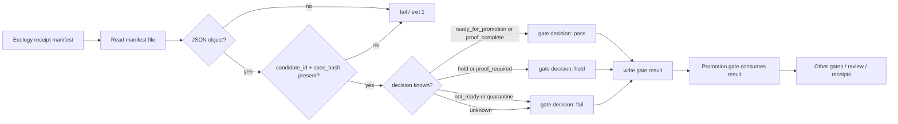

<!-- [KFM_META_BLOCK_V2]
doc_id: kfm://doc/<NEEDS_VERIFICATION_UUID>
title: Promotion Gate Ecology Manifest Evaluator
type: standard
version: v1
status: draft
owners: @bartytime4life
created: <NEEDS_VERIFICATION_CREATED_DATE>
updated: 2026-04-24
policy_label: <NEEDS_VERIFICATION_POLICY_LABEL>
related: [
  ./ecology_manifest.py,
  ./ecology_manifest_cli.py,
  ./tests/test_ecology_manifest.py,
  ./tests/test_ecology_manifest_cli.py,
  ../../../../data/receipts/ecology/README.md,
  ../../../../schemas/ecology/ecology_receipt_manifest.schema.json,
  ../README.md,
  ../../README.md
]
tags: [kfm, promotion-gate, ecology, receipts, manifest, validator]
notes: [
  "README for proposed ecology receipt manifest promotion-gate evaluator.",
  "Does not claim files exist until active-branch verification.",
  "CLI behavior reflects proposed code from this workstream.",
  "Module path, schema path, test path, CI enforcement, and receipt-storage behavior remain NEEDS VERIFICATION."
]
[/KFM_META_BLOCK_V2] -->

<a id="top"></a>

# Promotion Gate Ecology Manifest Evaluator

Evaluate an ecology receipt manifest and convert its manifest-level decision into a promotion-gate result.


> [!IMPORTANT]
> **Status:** experimental  
> **Owners:** `@bartytime4life`  
> **Suggested path:** `tools/validators/promotion_gate/ecology_manifest/README.md`  
> **Truth posture:** `PROPOSED` until the active branch verifies module files, tests, schema location, receipt storage, and CI enforcement.  
> **Quick jumps:** [Scope](#scope) · [Repo fit](#repo-fit) · [Accepted inputs](#accepted-inputs) · [Exclusions](#exclusions) · [Directory tree](#directory-tree) · [Quickstart](#quickstart) · [Decision mapping](#decision-mapping) · [Gate result](#gate-result) · [Fail-closed behavior](#fail-closed-behavior) · [Definition of done](#definition-of-done) · [Verification backlog](#verification-backlog)

---

## Scope

This evaluator is a narrow promotion-gate adapter for ecology receipt manifests.

It answers one question:

> Given an already generated ecology receipt manifest, should the promotion gate treat this candidate as `pass`, `hold`, or `fail`?

It does **not** rebuild ecological evidence, re-run upstream validators, publish artifacts, or decide source admissibility. It consumes a manifest-level decision and emits a gate-facing result object that downstream promotion logic can store, inspect, or combine with other gates.

### Truth posture used here

| Label | Meaning in this README |
|---|---|
| `PROPOSED` | Intended evaluator behavior from this workstream; not yet verified against active-branch files. |
| `NEEDS VERIFICATION` | A path, import name, test path, schema path, CI status, or enforcement claim requiring active-branch proof. |
| `UNKNOWN` | Current runtime behavior, required-check enforcement, receipt persistence, and promotion-gate integration until repo evidence is inspected. |

[Back to top](#top)

---

## Repo fit

| Field | Value |
|---|---|
| **Path** | `tools/validators/promotion_gate/ecology_manifest/README.md` |
| **Role** | Directory README and operating contract for the ecology receipt manifest gate evaluator |
| **Upstream** | Ecology receipt manifest generator; ecology validators; manifest schema |
| **Downstream** | Promotion gate, receipt storage, CI gate summaries, review surfaces |
| **Primary object** | Ecology receipt manifest JSON |
| **Emitted object** | Gate result JSON |
| **Boundary posture** | Promotion is a governed state transition, not a file move or auto-publish shortcut |

### Adjacent surfaces

> [!NOTE]
> Links below are repo-relative from the suggested README path. Verify each target before committing.

| Relation | Proposed link | Why it matters |
|---|---|---|
| Parent promotion gate | [`../README.md`](../README.md) | Gate-family behavior, finite outcomes, and integration expectations |
| Validator lane | [`../../README.md`](../../README.md) | Validator conventions and shared tooling expectations |
| Tooling lane | [`../../../README.md`](../../../README.md) | Broader tool placement and maintenance context |
| Ecology receipts | [`../../../../data/receipts/ecology/README.md`](../../../../data/receipts/ecology/README.md) | Expected receipt and manifest storage surface |
| Manifest schema | [`../../../../schemas/ecology/ecology_receipt_manifest.schema.json`](../../../../schemas/ecology/ecology_receipt_manifest.schema.json) | Machine-readable manifest contract, if confirmed |
| Local evaluator | [`./ecology_manifest.py`](./ecology_manifest.py) | Proposed evaluator implementation |
| Local CLI | [`./ecology_manifest_cli.py`](./ecology_manifest_cli.py) | Proposed command-line wrapper |
| Local tests | [`./tests/`](./tests/) | Proposed evaluator and CLI tests |

[Back to top](#top)

---

## Accepted inputs

This directory accepts an **already generated ecology receipt manifest**.

| Input | Required | Notes |
|---|---:|---|
| Manifest file path | yes | Supplied through `--manifest`. Missing file exits `2`. |
| JSON object body | yes | Malformed JSON or non-object JSON fails closed. |
| `decision` | yes | Mapped into gate result through the decision table below. |
| `candidate_id` | yes | Carried into the gate result for traceability. |
| `spec_hash` | yes | Carried into the gate result as the manifest/spec identity anchor. |
| `errors` | no | If present, should be preserved or reflected in the gate result. Exact behavior **NEEDS VERIFICATION**. |
| `warnings` | no | If present, should be preserved or reflected in the gate result. Exact behavior **NEEDS VERIFICATION**. |

> [!IMPORTANT]
> The evaluator trusts the manifest as a prior-stage artifact only after minimum fail-closed checks pass. It does not prove that the manifest was generated correctly unless active-branch implementation adds and verifies that behavior.

[Back to top](#top)

---

## Exclusions

This evaluator intentionally does **not** handle:

| Not handled here | Owning surface |
|---|---|
| Original ecological index row validation | Ecology domain validator |
| Source admission, rights, sensitivity, or steward review | Source registry, policy, and review lanes |
| Receipt generation | Ecology receipt writer |
| Catalog closure | Catalog / release proof lanes |
| Proof-pack generation | Release proof tooling |
| STAC / DCAT / PROV emission | Catalog closure tooling |
| Publication or deployment | Promotion / release workflow |
| Map layer rendering | MapLibre delivery and UI lanes |
| AI summary generation | Governed AI runtime only after evidence resolution |

The evaluator is a **gate adapter**, not an ecology pipeline.

[Back to top](#top)

---

## Directory tree

```text
tools/validators/promotion_gate/ecology_manifest/
├── README.md
├── ecology_manifest.py
├── ecology_manifest_cli.py
└── tests/
    ├── test_ecology_manifest.py
    └── test_ecology_manifest_cli.py
```

> [!WARNING]
> This tree is `PROPOSED`. If the active branch keeps tests in a top-level `tests/` lane or places the CLI in the parent `promotion_gate/` package, update this README and the KFM meta block before merge.

[Back to top](#top)

---

## Quickstart

### CLI

```bash
python -m tools.validators.promotion_gate.ecology_manifest_cli \
  --manifest data/receipts/ecology/manifests/<candidate_id>.receipt_manifest.json \
  --out data/receipts/ecology/promotion/<candidate_id>.gate_result.json
```

> [!CAUTION]
> The module path above reflects the proposed workstream command. If the active branch places the CLI under `tools/validators/promotion_gate/ecology_manifest/`, the import path may need to become:
>
> ```bash
> python -m tools.validators.promotion_gate.ecology_manifest.ecology_manifest_cli
> ```
>
> Do not document either path as enforced until the package layout and tests are verified.

### Expected exit codes

| Exit | Meaning |
|---:|---|
| `0` | Manifest evaluated to `pass`. |
| `1` | Manifest evaluated to `hold` or `fail`, or manifest input is invalid. |
| `2` | Manifest file is missing. |
| `5` | Unexpected internal error. |

[Back to top](#top)

---

## Decision mapping

The evaluator maps manifest-level decisions into gate-level decisions.

| Manifest decision | Gate decision | Promotion meaning |
|---|---|---|
| `ready_for_promotion` | `pass` | Candidate can continue to the next promotion checks. |
| `proof_complete` | `pass` | Manifest reports proof completion; this evaluator does not independently rebuild proof. |
| `hold` | `hold` | Candidate should pause for review, correction, or missing supporting work. |
| `proof_required` | `hold` | Candidate needs proof completion before promotion can continue. |
| `not_ready` | `fail` | Candidate blocks promotion. |
| `quarantine` | `fail` | Candidate blocks promotion and should remain out of release flow. |
| unknown / missing | `fail` | Unknown decisions fail closed. |

> [!NOTE]
> This README preserves the proposed lowercase evaluator vocabulary: `pass`, `hold`, `fail`. If the parent promotion gate uses uppercase finite outcomes such as `PASS`, `HOLD`, `DENY`, or `ERROR`, integration should adapt the result at the boundary without changing this evaluator’s local contract unless the implementation is updated.

[Back to top](#top)

---

## Flow



The diagram shows only the evaluator boundary. It does not imply publication, release approval, or proof-pack generation.

[Back to top](#top)

---

## Gate result

The evaluator should emit a gate result shaped like this:

```json
{
  "gate": "ecology_receipt_manifest",
  "decision": "pass",
  "manifest_ref": "data/receipts/ecology/manifests/<candidate_id>.receipt_manifest.json",
  "candidate_id": "<candidate-id>",
  "spec_hash": "<sha256>",
  "errors": [],
  "warnings": []
}
```

### Field expectations

| Field | Required | Purpose |
|---|---:|---|
| `gate` | yes | Stable gate identifier: `ecology_receipt_manifest`. |
| `decision` | yes | One of `pass`, `hold`, `fail`. |
| `manifest_ref` | yes | Path or reference to the consumed manifest. |
| `candidate_id` | yes | Candidate identity copied from the manifest. |
| `spec_hash` | yes | Manifest/spec identity anchor copied from the manifest. |
| `errors` | yes | Machine-readable or human-readable failures. |
| `warnings` | yes | Non-blocking concerns, if any. |

> [!TIP]
> Keep this result small. It should be easy for CI, promotion tooling, and review surfaces to read without re-running upstream ecology validators.

[Back to top](#top)

---

## Fail-closed behavior

The evaluator fails or blocks promotion when:

| Condition | Gate decision / exit | Reason |
|---|---|---|
| Manifest file is missing | exit `2` | The gate cannot inspect the candidate. |
| Manifest is malformed JSON | `fail` / exit `1` | Invalid input cannot support promotion. |
| Manifest JSON is not an object | `fail` / exit `1` | The manifest contract is object-shaped. |
| Manifest decision is missing or unknown | `fail` / exit `1` | Unknown decisions fail closed. |
| `candidate_id` is missing | `fail` / exit `1` | Result cannot be tied to a candidate. |
| `spec_hash` is missing | `fail` / exit `1` | Result cannot be tied to a stable spec identity. |
| Manifest decision blocks promotion | `hold` or `fail` / exit `1` | Non-pass outcomes must not look successful to CI. |
| Unexpected internal error | exit `5` | Caller should treat this as blocked until investigated. |

[Back to top](#top)

---

## Boundary with the promotion gate

This evaluator is safe only when its boundary stays small.

| Boundary rule | Status |
|---|---|
| Emits a gate result object | `PROPOSED` |
| May be imported or shell-called by parent promotion gate | `PROPOSED` |
| Stores gate result as a receipt | `NEEDS VERIFICATION` |
| Enforced as a required CI check | `NEEDS VERIFICATION` |
| Publishes artifacts | must not |
| Reads RAW / WORK / QUARANTINE directly | must not |
| Regenerates upstream ecology receipts | must not |
| Converts `pass` into automatic publication | must not |

A `pass` means “this manifest did not block the promotion gate.” It does not mean “publish.”

[Back to top](#top)

---

## Test matrix

Minimum tests should cover:

| Case | Manifest condition | Expected result |
|---|---|---|
| pass: ready | `decision=ready_for_promotion`, `candidate_id`, `spec_hash` present | `decision=pass`, exit `0` |
| pass: proof complete | `decision=proof_complete`, required identity fields present | `decision=pass`, exit `0` |
| hold | `decision=hold` | `decision=hold`, exit `1` |
| proof required | `decision=proof_required` | `decision=hold`, exit `1` |
| not ready | `decision=not_ready` | `decision=fail`, exit `1` |
| quarantine | `decision=quarantine` | `decision=fail`, exit `1` |
| unknown decision | unrecognized decision string | `decision=fail`, exit `1` |
| missing manifest | file does not exist | exit `2` |
| malformed JSON | invalid JSON syntax | exit `1` |
| non-object JSON | array, string, number, boolean, or null | exit `1` |
| missing candidate | no `candidate_id` | `decision=fail`, exit `1` |
| missing spec hash | no `spec_hash` | `decision=fail`, exit `1` |
| internal error | simulated unexpected exception | exit `5` |

[Back to top](#top)

---

## Definition of done

- [ ] Evaluator module exists.
- [ ] CLI exists.
- [ ] Tests pass for evaluator and CLI behavior.
- [ ] Manifest decision mapping is covered by tests.
- [ ] Missing file, malformed JSON, non-object JSON, unknown decision, missing `candidate_id`, and missing `spec_hash` fail closed.
- [ ] Promotion gate imports or calls evaluator.
- [ ] Gate result is stored as a receipt or equivalent reviewable artifact.
- [ ] CI check is verified.
- [ ] Required-check status is verified before documenting enforcement.
- [ ] This README’s KFM meta block placeholders are resolved or explicitly left as reviewed placeholders.
- [ ] Relative links are verified from the final committed path.

[Back to top](#top)

---

## Verification backlog

| Item | Status | Required action |
|---|---|---|
| `doc_id` | `NEEDS VERIFICATION` | Assign a real `kfm://doc/<uuid>` if the repo uses generated document IDs. |
| `created` date | `NEEDS VERIFICATION` | Replace placeholder with verified creation date. |
| `policy_label` | `NEEDS VERIFICATION` | Confirm whether this README is `public`, `restricted`, or another project label. |
| Module path | `NEEDS VERIFICATION` | Confirm whether CLI path is parent package or ecology subpackage. |
| Schema path | `NEEDS VERIFICATION` | Confirm whether ecology schema lives under `schemas/ecology/`, `schemas/contracts/v1/`, or another home. |
| Test home | `NEEDS VERIFICATION` | Confirm local `./tests/` versus top-level `tests/` convention. |
| Receipt output path | `NEEDS VERIFICATION` | Confirm final promotion receipt storage path. |
| CI workflow | `NEEDS VERIFICATION` | Confirm workflow name and required-check status before claiming enforcement. |
| Parent gate adapter | `NEEDS VERIFICATION` | Confirm import/call pattern and result envelope normalization. |

[Back to top](#top)

---

<details>
<summary>Appendix: compact maintainer checklist</summary>

Before merging this README with implementation files, verify:

1. The suggested path exists or is intentionally created.
2. The module path in the CLI quickstart runs from repo root.
3. The evaluator emits the documented gate result shape.
4. The CLI returns documented exit codes.
5. Test fixtures include valid, hold, fail, unknown, malformed, missing-file, missing-identity, and internal-error cases.
6. The parent promotion gate treats non-zero exits as blocking.
7. The gate result is saved as a reviewable artifact if that is part of the implementation.
8. No README language claims CI enforcement until required-check status is verified.
9. No README language claims publication, catalog closure, proof-pack generation, or source validation.
10. All KFM meta block placeholders are resolved or deliberately retained as reviewed placeholders.

</details>

[Back to top](#top)
