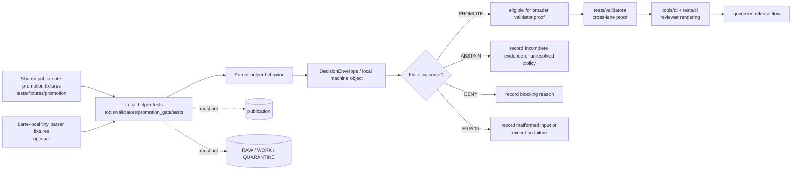

<!-- [KFM_META_BLOCK_V2]
doc_id: kfm://doc/NEEDS-VERIFICATION
title: tools/validators/promotion_gate/tests
type: standard
version: v1
status: draft
owners: @bartytime4life
created: 2026-04-24
updated: 2026-04-24
policy_label: public
related: [../README.md, ../../README.md, ../../../README.md, ../../../../README.md, ../../../../tests/validators/README.md, ../../../../tests/fixtures/promotion/, ../../../../tests/ci/README.md, ../../../../tests/e2e/README.md, ../../../../schemas/promotion/decision-envelope.schema.json, ../../../../schemas/promotion/promotion-record.schema.json, ../../../../schemas/promotion/promotion-prov.schema.json, ../../../../schemas/promotion/promotion-bundle.schema.json, ../../../../schemas/promotion/promotion-bundle-diff-policy.schema.json, ../../../../policy/README.md, ../../../../policy/promotion_bundle_diff_policy.json, ../../../../tools/ci/README.md, ../../../../tools/attest/README.md, ../../../../.github/workflows/README.md]
tags: [kfm, tools, validators, promotion-gate, tests, fail-closed, review-visible]
notes: [README-like local test annex for the Promotion Gate implementation. Owner and related paths are inherited from adjacent promotion-gate and tests documentation and require active-branch verification. Local executable inventory, CI wiring, and merge-blocking status remain NEEDS VERIFICATION.]
[/KFM_META_BLOCK_V2] -->

<a id="top"></a>

# `tools/validators/promotion_gate/tests`

Local, implementation-adjacent tests for the KFM Promotion Gate’s fail-closed and evidence-first behavior.

> [!IMPORTANT]
> **Status:** experimental  
> **Owners:** `@bartytime4life`  
> **Path:** `tools/validators/promotion_gate/tests/README.md`  
> **Repo fit:** child test annex of [`../README.md`](../README.md); upstream implementation lane [`../`](../); sibling validator lane [`../../`](../../); cross-lane proof surface [`../../../../tests/validators/README.md`](../../../../tests/validators/README.md); shared promotion fixtures [`../../../../tests/fixtures/promotion/`](../../../../tests/fixtures/promotion/); renderer proof belongs in [`../../../../tests/ci/README.md`](../../../../tests/ci/README.md); orchestration belongs in [`../../../../.github/workflows/README.md`](../../../../.github/workflows/README.md).  
>
> 
> 
> 
> 
> 
> 
>
> **Quick jumps:** [Scope](#scope) · [Repo fit](#repo-fit) · [Accepted inputs](#accepted-inputs) · [Exclusions](#exclusions) · [Directory tree](#directory-tree) · [Quickstart](#quickstart) · [Test ownership ladder](#test-ownership-ladder) · [Gate coverage](#gate-coverage) · [Fixture discipline](#fixture-discipline) · [Definition of done](#definition-of-done) · [FAQ](#faq) · [Appendix](#appendix)

> [!WARNING]
> This README describes the intended local test annex for `tools/validators/promotion_gate/`. It does **not** prove that every named script, fixture, policy, schema, workflow, or test is present on the active branch. Re-run the inventory commands in [Quickstart](#quickstart) before widening implementation claims.

---

## Scope

`tools/validators/promotion_gate/tests/` is for **small, deterministic tests that sit close to the Promotion Gate implementation**.

Use this directory when a test is best reviewed next to the helper it exercises, especially when it checks:

- parser behavior for promotion candidate inputs
- local helper functions that assemble a `DecisionEnvelope`
- deterministic `spec_hash` or execution identity handling
- helper-level `PROMOTE`, `ABSTAIN`, `DENY`, or `ERROR` outcomes
- fail-closed handling for malformed candidate JSON, missing fields, invalid checksums, or blocked policy labels
- compatibility between parent-lane helpers and shared promotion fixtures

This directory should stay narrow. It is **not** the repo-wide validator proof lane, and it is not the publication gate itself.

### Current posture

| Claim | Label | Handling in this README |
| --- | --- | --- |
| Promotion Gate is a fail-closed, evidence-first validation lane | **CONFIRMED by adjacent doctrine/docs** | Treated as the governing purpose of this test annex |
| Parent lane current executable inventory | **NEEDS VERIFICATION** | Referenced by relative links and guarded by inventory commands |
| Local files under `tools/validators/promotion_gate/tests/` | **UNKNOWN / PROPOSED** | This README defines the lane contract without claiming existing tests |
| Publication side effects from local tests | **DENIED by design** | Tests here must not publish, promote, mutate canonical stores, or reach public release paths |

[Back to top](#top)

---

## Repo fit

This directory is the **implementation-owned local test annex** for the parent Promotion Gate lane.

| Surface | Path from this README | Role |
| --- | --- | --- |
| Parent lane contract | [`../README.md`](../README.md) | Defines Promotion Gate purpose, gate chain, outputs, policy posture, and current thin slice |
| Validator implementation | [`../`](../) | Owns helper scripts, local policies, and emitted machine objects |
| Shared validator tests | [`../../../../tests/validators/README.md`](../../../../tests/validators/README.md) | Owns cross-lane validator proof and integration-style promotion checks |
| Shared fixtures | [`../../../../tests/fixtures/promotion/`](../../../../tests/fixtures/promotion/) | Preferred home for public-safe candidate fixtures reused across lanes |
| CI renderer tests | [`../../../../tests/ci/README.md`](../../../../tests/ci/README.md) | Owns Markdown summary and handoff renderer proof |
| E2E/runtime proof | [`../../../../tests/e2e/README.md`](../../../../tests/e2e/README.md) | Owns request-time and broader release/runtime proof |
| Schema authority | [`../../../../schemas/promotion/`](../../../../schemas/promotion/) | Owns promotion object schemas where active repo conventions confirm that path |
| Policy authority | [`../../../../policy/README.md`](../../../../policy/README.md) | Owns policy meaning and checked-in policy data |
| Workflow orchestration | [`../../../../.github/workflows/README.md`](../../../../.github/workflows/README.md) | Owns CI sequencing, permissions, artifacts, and merge-blocking configuration |

> [!NOTE]
> Local tests may assert how the parent helpers behave. They must not silently redefine schema authority, policy meaning, source rights, or publication readiness.

[Back to top](#top)

---

## Accepted inputs

Use this directory for tests that consume small, public-safe inputs such as:

| Input | Preferred source | Why it belongs |
| --- | --- | --- |
| Promotion candidate fixture | [`../../../../tests/fixtures/promotion/`](../../../../tests/fixtures/promotion/) | Stable reviewable candidate data for local helper checks |
| Minimal malformed candidate | lane-local `fixtures/` only when needed | Keeps parser/error behavior hermetic and tiny |
| Emitted `DecisionEnvelope` sample | temporary test workspace | Confirms finite outcomes and schema-facing shape |
| Parent helper output | `../*.py` or parent helper equivalent | Proves local implementation behavior without invoking publication |
| Checked-in diff-policy sample | [`../../../../policy/promotion_bundle_diff_policy.json`](../../../../policy/promotion_bundle_diff_policy.json) | Confirms policy-data parsing where parent helpers depend on it |
| Promotion schemas | [`../../../../schemas/promotion/`](../../../../schemas/promotion/) | Validates emitted objects against the active contract surface |

Accepted inputs must be:

- deterministic
- public-safe
- small enough to review in a PR
- free of secrets, credentials, raw source dumps, private steward records, or unpublished sensitive geometry

[Back to top](#top)

---

## Exclusions

| Does **not** belong here | Put it here instead | Reason |
| --- | --- | --- |
| Repo-wide validator integration tests | [`../../../../tests/validators/README.md`](../../../../tests/validators/README.md) | Cross-lane proof belongs in the top-level test surface |
| CI summary or handoff renderer tests | [`../../../../tests/ci/README.md`](../../../../tests/ci/README.md) | Renderer wording and reviewer presentation are a CI proof concern |
| Workflow YAML, permissions, or branch rules | [`../../../../.github/workflows/README.md`](../../../../.github/workflows/README.md) | Orchestration is outside the implementation test annex |
| Canonical policy authorship | [`../../../../policy/README.md`](../../../../policy/README.md) | Tests can assert outcomes; policy remains the authority |
| Schema design or contract changes | [`../../../../schemas/promotion/`](../../../../schemas/promotion/) and contracts docs | Tests validate schemas; they do not author them |
| Live source calls or network checks | dedicated connector/integration tests after source review | Local promotion-gate tests should remain offline and deterministic |
| Public publication logic | release/publish surfaces | Passing local tests means “behavior is locally proven,” not “release is approved” |
| Secret-bearing or sensitive fixtures | secure governed data lanes | Test surfaces must remain safe to clone and review |

[Back to top](#top)

---

## Directory tree

### Target local annex

```text
tools/validators/promotion_gate/tests/
├── README.md
├── test_<helper_or_gate_behavior>.py        # PROPOSED / NEEDS VERIFICATION
└── fixtures/                                # optional; tiny lane-local fixtures only
    ├── valid/                               # optional
    └── invalid/                             # optional
```

> [!TIP]
> Prefer shared fixtures under `tests/fixtures/promotion/` when the fixture describes a promotion candidate, bundle, diff, or review-path artifact. Use lane-local fixtures only for helper-specific parser/error cases.

### Adjacent promotion proof surface

```text
tests/validators/
├── README.md
├── test_promotion_gate_e2e.py
├── test_bundle_diff_policy.py
└── test_validate_bundle_diff_policy.py
```

### Parent lane surfaces to recheck

```text
tools/validators/promotion_gate/
├── README.md
├── prepare_candidate_fixture.py
├── promotion_gate.py
├── validate_decision_envelope.py
├── write_promotion_record.py
├── validate_promotion_record.py
├── emit_promotion_prov.py
├── validate_promotion_prov.py
├── write_promotion_bundle.py
├── validate_promotion_bundle.py
├── evaluate_bundle_diff_policy.py
├── validate_bundle_diff_policy.py
└── policies/
```

All trees above are **bounded documentation targets** until the active branch is inventoried.

[Back to top](#top)

---

## Quickstart

Run these from the repository root before adding or revising tests.

```bash
# Confirm this local annex exists and inspect what it contains.
find tools/validators/promotion_gate/tests -maxdepth 3 \( -type f -o -type d \) 2>/dev/null | sort

# Confirm the parent promotion-gate lane and adjacent proof surfaces.
find tools/validators/promotion_gate -maxdepth 2 \( -type f -o -type d \) 2>/dev/null | sort
find tests/validators -maxdepth 2 -type f 2>/dev/null | sort
find tests/fixtures/promotion -maxdepth 3 -type f 2>/dev/null | sort

# Recheck documentation references before broadening claims.
git grep -n "promotion_gate/tests\|test_promotion_gate_e2e\|DecisionEnvelope\|Promotion Gate" -- . || true
```

Run local annex tests only after the branch inventory proves the runner and path are real:

```bash
pytest -q tools/validators/promotion_gate/tests
```

Run cross-lane promotion proof from the top-level test surface:

```bash
pytest -q tests/validators/test_promotion_gate_e2e.py
pytest -q tests/validators/test_bundle_diff_policy.py
pytest -q tests/validators/test_validate_bundle_diff_policy.py
```

> [!WARNING]
> If the mounted repo uses a different test runner, package wrapper, or module layout, update this README to the real command. Do not preserve `pytest` examples as if they were verified branch behavior.

[Back to top](#top)

---

## Test ownership ladder

Promotion Gate proof is easiest to maintain when each layer owns a distinct burden.

| Ladder step | Primary owner | This directory’s role |
| --- | --- | --- |
| Helper parsing and local fail-closed behavior | `tools/validators/promotion_gate/tests/` | **Primary** |
| End-to-end validator chain | `tests/validators/` | **Escalate** once the test spans multiple helper families |
| Bundle diff and diff-policy machine meaning | `tests/validators/` or parent local tests when helper-scoped | **Use narrowest truthful home** |
| Reviewer Markdown summaries | `tests/ci/` | **Do not own** presentation wording here |
| Workflow sequencing and artifact upload | `.github/workflows/` | **Do not own** orchestration here |
| Runtime/public answer behavior | `tests/e2e/` and governed API tests | **Do not own** runtime proof here |

### Rule of thumb

If a change breaks **machine meaning**, prove it in this directory or `tests/validators/`.

If a change breaks **reviewer presentation**, prove it in `tests/ci/`.

If a change breaks **runtime exposure**, prove it in `tests/e2e/` or governed API tests.

[Back to top](#top)

---

## Gate coverage

Local tests may assert narrow gate behavior, but the parent gate remains the source of truth for emitted gate labels and outcome vocabulary.

| Gate family | Local test may assert | Escalate when |
| --- | --- | --- |
| Identity / versioning / closure | stable `candidate_id`, `spec_hash`, deterministic target, required IDs | test spans catalog closure, release refs, or rollback history |
| Asset integrity | declared assets, checksums, duplicate or unexpected file handling | test checks object storage, signatures, or attestation bundles |
| Geometry / CRS / coverage | helper-level geometry fields parse and fail closed when malformed | test requires geospatial libraries, tile artifacts, or spatial tolerances |
| Temporal semantics | valid interval ordering and freshness fields | test requires source cadence, runtime recency, or public freshness posture |
| Rights / sensitivity / policy | missing or unknown labels deny/abstain/error as expected | test authors policy or determines release eligibility |
| Provenance / proofs / receipts | required refs are present in emitted objects | test verifies full catalog triplet, proofs, or signed attestations |
| Review / rollback / operational readiness | review and rollback fields survive local envelope assembly | test checks branch protection, monitoring, or release operation |

### Finite outcomes

Local tests should preserve the finite promotion vocabulary when the parent helper emits it:

| Outcome | Meaning |
| --- | --- |
| `PROMOTE` | Candidate passed the tested gate burden and may continue to governed release review |
| `ABSTAIN` | Gate cannot safely decide because evidence, policy, catalog, or review state is incomplete |
| `DENY` | Gate found a blocking failure |
| `ERROR` | Gate or parser encountered malformed input, unavailable contract, or an execution problem |

[Back to top](#top)

---

## Fixture discipline

Fixtures used here must be boring on purpose.

| Fixture rule | Required behavior |
| --- | --- |
| Public-safe | No private source data, secrets, unpublished exact sensitive locations, or steward-only records |
| Tiny | Prefer one candidate, one minimal bundle, one malformed input, or one diff-policy object |
| Deterministic | No wall-clock dependence unless explicitly injected by the test |
| Reviewable | A maintainer should understand the fixture without running the whole system |
| Reusable | Prefer shared fixtures unless a lane-local fixture makes helper behavior clearer |
| Truth-labeled | Use `valid/`, `invalid/`, or explicit filenames instead of vague `sample.json` names |

> [!CAUTION]
> Do not copy RAW, WORK, QUARANTINE, or source-ingest artifacts into this directory. Local tests must operate over governed examples or synthetic public-safe fixtures only.

[Back to top](#top)

---

## Diagram



[Back to top](#top)

---

## Definition of done

Use this checklist when adding or revising a local Promotion Gate test.

- [ ] the tested helper or gate behavior is explicitly named
- [ ] the nearest schema, policy, fixture, or parent helper is linked
- [ ] the test uses public-safe deterministic fixtures
- [ ] at least one success path is asserted where the helper can safely succeed
- [ ] at least one failure path is asserted where the helper must fail closed
- [ ] the test asserts machine output, not only process exit code
- [ ] finite outcomes are asserted when the helper emits them
- [ ] reason codes, obligations, or failure details are checked when present
- [ ] no test publishes, promotes, mutates canonical stores, or reaches external networks
- [ ] shared fixture changes are mirrored in `tests/fixtures/promotion/` docs
- [ ] cross-lane behavior is escalated to `tests/validators/` instead of hidden here
- [ ] renderer or Markdown wording checks are kept in `tests/ci/`
- [ ] this README and [`../README.md`](../README.md) are updated when the parent helper chain changes materially

[Back to top](#top)

---

## FAQ

### Why does this directory exist if `tests/validators/` already exists?

Because some checks are easier and safer to maintain next to the implementation they exercise. This directory is for helper-local behavior. `tests/validators/` remains the shared proof surface for validator chains and repo-wide promotion behavior.

### Does passing this local test annex promote anything?

No. Passing tests here proves local helper behavior only. Promotion remains a governed state transition that depends on contracts, policy, evidence, catalog/proof closure, review state, rollback posture, and workflow enforcement.

### Should this directory duplicate fixtures from `tests/fixtures/promotion/`?

No. Reuse shared fixtures by default. Add lane-local fixtures only when they are smaller, public-safe, and specific to parser or helper behavior that would make shared fixtures harder to read.

### Can this directory contain shell tests?

Only when the active branch already uses shell helpers and the shell tests remain deterministic, public-safe, and non-publishing. Python tests are easier to inspect when the parent helper behavior is Python-based, but the repo’s actual runner convention wins.

### What should happen when a new Promotion Gate helper lands?

Add the smallest local test that proves its fail-closed behavior, then decide whether a top-level `tests/validators/` test must prove the helper’s role in the full promotion chain.

[Back to top](#top)

---

## Appendix

<details>
<summary><strong>First review pass before merge</strong></summary>

1. Confirm `tools/validators/promotion_gate/tests/` exists or is introduced by the same PR.
2. Confirm parent helper names in [`../README.md`](../README.md) still match the checked-out branch.
3. Confirm shared promotion fixtures still live under [`../../../../tests/fixtures/promotion/`](../../../../tests/fixtures/promotion/) or update links.
4. Confirm `tests/validators/` still owns cross-lane promotion proof.
5. Confirm `tests/ci/` still owns renderer and handoff proof.
6. Confirm schema links under [`../../../../schemas/promotion/`](../../../../schemas/promotion/) are real for the checked-out branch.
7. Confirm policy links under [`../../../../policy/`](../../../../policy/) are real for the checked-out branch.
8. Confirm CI workflow names and path filters before claiming merge-blocking behavior.
9. Keep local tests offline and deterministic.
10. Leave unresolved implementation depth visibly labeled instead of smoothing it into certainty.

</details>

<details>
<summary><strong>Suggested local test naming pattern</strong></summary>

Use names that say what is being protected:

```text
test_decision_envelope_fails_closed_on_malformed_candidate.py
test_spec_hash_identity_is_deterministic.py
test_missing_policy_label_denies_or_abstains.py
test_execution_identity_fields_survive_envelope_assembly.py
test_diff_policy_input_rejects_unknown_classification.py
```

Avoid names that only describe mechanics:

```text
test_helper.py
test_sample.py
test_json.py
test_main.py
```

</details>

<details>
<summary><strong>Local tests should never become hidden release logic</strong></summary>

A healthy local test annex proves behavior and then stops.

```text
good:
fixture -> helper -> machine output assertion

bad:
fixture -> helper -> implicit publish -> side-effect check
```

KFM promotion remains inspectable only when tests, validators, policy, proofs, receipts, catalog records, review artifacts, and release actions keep separate roles.

</details>

[Back to top](#top)
