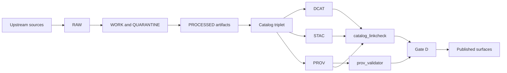

<!-- [KFM_META_BLOCK_V2]
doc_id: kfm://doc/8c8e6f0b-4b3a-44b1-b9f9-0e93c0b7b9a1
title: prov_validator
type: standard
version: v1
status: draft
owners: kfm-platform (TODO)
created: 2026-02-26
updated: 2026-02-26
policy_label: public
related:
  - tools/validators/prov_validator/
  - tools/validators/dcat_validator/
  - tools/validators/stac_validator/
  - tools/linkcheck/catalog_linkcheck/
tags: [kfm, validators, provenance, prov, catalog-triplet]
notes:
  - This README defines the contract surface for PROV validation in KFM.
[/KFM_META_BLOCK_V2] -->

# prov_validator

> Fail-closed validation for **KFM PROV** (lineage) bundles.
>
> Purpose: ensure Promotion Contract **Gate D (Catalog triplet validation)** can be enforced by CI and at runtime.


 <!-- TODO: set once implemented -->

## Navigation

- [Overview](#overview)
- [Where this fits](#where-this-fits)
- [Acceptable inputs](#acceptable-inputs)
- [Exclusions](#exclusions)
- [What gets validated](#what-gets-validated)
- [CLI contract (proposed)](#cli-contract-proposed)
- [CI integration](#ci-integration)
- [Directory layout](#directory-layout)
- [Troubleshooting](#troubleshooting)
- [Contributing](#contributing)

---

## Overview

`prov_validator` is the KFM validator responsible for ensuring PROV bundles meet the **KFM PROV profile** (minimum required fields and graph shape).

A valid PROV bundle is part of KFM’s catalog “triplet” (**DCAT + STAC + PROV**) and exists to make lineage and evidence resolvable without guessing.

## Where this fits

KFM treats catalogs as **contract surfaces** between pipelines and runtime. Promotion is blocked unless catalogs exist and validate.



**Operational expectation:** this validator is executed in CI on changed catalog artifacts; failures block merge.

[Back to top](#prov_validator)

---

## Acceptable inputs

This tool validates **metadata/lineage**, not raw datasets.

Acceptable inputs include:

- A PROV bundle in one of the KFM-accepted encodings (e.g., **JSON-LD / PROV-O**, or **PROVN**) *(encoding support depends on implementation)*
- Optional context needed for cross-checks:
  - dataset identifier / dataset_version_id (if not embedded)
  - pointers to sibling DCAT/STAC artifacts (paths or URIs)
  - run receipt reference(s), if stored separately

### Exclusions

This tool MUST NOT:

- fetch upstream data
- transform or “fix” datasets
- mint new provenance (that belongs in pipelines)
- evaluate policy decisions (that belongs in policy engine / OPA adapter)
- validate DCAT or STAC (use sibling validators)

[Back to top](#prov_validator)

---

## What gets validated

### 1) KFM PROV profile

Minimum expectations (enforced fail-closed in *strict* mode):

| Area | Fail-closed checks (minimum) |
|---|---|
| Graph shape | At least one `prov:Activity` per run; `prov:Entity` per input/output artifact; `prov:Agent` for pipeline identity and (when applicable) human approval. |
| Required edges | `prov:used` and `prov:wasGeneratedBy` are present and consistent (no orphan outputs). |
| Deterministic identifiers | Run IDs, dataset_version_id, and artifact digests are stable and match sibling catalogs/run receipts where applicable. |
| Environment capture | Record at least container image digest, git commit, and parameters digest (or equivalent) so the run is reproducible. |
| Governance hooks | Link to policy decisions/obligations when required (e.g., redaction/generalization plans for sensitive datasets recorded in PROV). |

### 2) Catalog triplet linkability

Gate D requires cross-links between **DCAT, STAC, PROV** to be present and resolvable.

- `prov_validator` focuses on the PROV profile itself.
- `catalog_linkcheck` is expected to verify *required cross-links* across DCAT/STAC/PROV.

**Recommended behavior:** `prov_validator` should optionally assert that the PROV bundle contains resolvable references (or at least stable IDs) for:

- the dataset_version it describes
- the generated artifacts (with digests)
- the producing run receipt (`run_id`)

[Back to top](#prov_validator)

---

## CLI contract (proposed)

> **NOTE**: The repo entrypoint and language are not confirmed here.
> This section defines a **contract surface** the implementation SHOULD satisfy.

### Proposed interface

```bash
prov_validator validate <path> \
  --format <jsonld|provn|auto> \
  --profile kfm \
  --strict \
  --report <path/to/report.json>

# Optional cross-checks
prov_validator validate <path> \
  --dcat <path/to/dcat.jsonld> \
  --stac <path/to/stac/collection.json> \
  --run-receipt <path/to/run_receipt.json> \
  --strict
```

### Exit codes (proposed)

- `0` — validation passed
- `2` — validation failed (profile or required checks)
- `3` — invalid CLI usage / missing file

### Report format (proposed)

```json
{
  "status": "pass",
  "profile": "kfm-prov-profile",
  "checks": {
    "graph_shape": "pass",
    "required_edges": "pass",
    "environment_capture": "pass",
    "governance_links": "warn"
  },
  "errors": [],
  "warnings": [
    {
      "code": "MISSING_POLICY_DECISION_REF",
      "message": "PROV bundle does not reference a policy decision (required for restricted datasets)."
    }
  ]
}
```

[Back to top](#prov_validator)

---

## CI integration

### Contract

CI MUST fail closed on invalid PROV.

### Example (GitHub Actions) — adapt to your repo

```yaml
- name: Validate PROV bundles
  run: |
    set -euo pipefail

    # Example only: update to your real catalog paths + CLI entrypoint
    prov_validator validate data/catalog/prov/**/*.jsonld --strict
```

### When to run

Recommended triggers:

- on PRs that change `data/catalog/prov/**` (or wherever PROV lives)
- on PRs that change pipeline code that emits provenance

[Back to top](#prov_validator)

---

## Directory layout

> **Expected layout** (update to match repo reality):

```text
tools/validators/prov_validator/
  README.md
  src/                    # implementation (language-specific)
  tests/                  # unit tests
  fixtures/               # tiny valid/invalid PROV examples
  schemas/                # profile encoding (JSON Schema / SHACL / etc.)
```

[Back to top](#prov_validator)

---

## Troubleshooting

| Symptom | Likely cause | Fix |
|---|---|---|
| “missing prov:Activity” | PROV emitted without run activity node | Ensure each run emits one Activity per run_id. |
| “orphan output entity” | Output `prov:Entity` not linked by `prov:wasGeneratedBy` | Add missing edge and ensure IDs match run_id. |
| “missing environment capture” | Container/commit/params not recorded | Add required fields to the pipeline provenance emitter. |
| Cross-link failures | DCAT/STAC/PROV not mutually linked | Run `catalog_linkcheck` and ensure required links exist. |

[Back to top](#prov_validator)

---

## Contributing

### Definition of Done (validator)

- [ ] Validator runs in CI on changed catalog artifacts
- [ ] Link checker verifies required cross-links (paired tool)
- [ ] Failing validation blocks merge
- [ ] Fixtures exist for: minimal valid PROV, missing-Activity, missing-digest, missing-environment
- [ ] Report format is stable enough to surface in CI logs and (optionally) evidence drawer debugging

### Minimum verification steps before merging

- [ ] Confirm actual module layout + build system (don’t assume Node/Python)
- [ ] Run validator locally on fixtures (pass + fail cases)
- [ ] Verify CI wiring: a deliberate failing fixture blocks the PR

[Back to top](#prov_validator)
