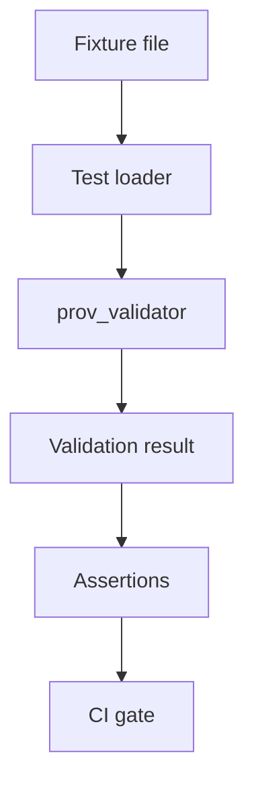

<!-- [KFM_META_BLOCK_V2]
doc_id: kfm://doc/7c98331e-8a13-4b6c-8f5a-09aee66a7bf7
title: prov_validator fixtures
type: standard
version: v1
status: draft
owners: TBD
created: 2026-02-26
updated: 2026-02-26
policy_label: TBD
related:
  - tools/validators/prov_validator/
  - tools/validators/prov_validator/fixtures/
tags: [kfm, prov, validator, fixtures, tests]
notes:
  - This README is a lightweight contract for how provenance fixtures are stored and used by CI.
  - Replace TODOs once the prov_validator CLI + test harness conventions are confirmed in-repo.
[/KFM_META_BLOCK_V2] -->

<a id="top"></a>

# prov_validator fixtures

Static, **synthetic** provenance documents used to test `tools/validators/prov_validator` (golden pass/fail cases + edge cases).


<!-- TODO: add CI badge once the workflow/job name is known -->

## Quick navigation

- [Purpose](#purpose)
- [Where this fits in KFM](#where-this-fits-in-kfm)
- [Directory layout](#directory-layout)
- [Fixture conventions](#fixture-conventions)
- [Fixture registry](#fixture-registry)
- [How to add a fixture](#how-to-add-a-fixture)
- [Running locally](#running-locally)
- [Safety, sensitivity, and “no real data” rules](#safety-sensitivity-and-no-real-data-rules)
- [Troubleshooting](#troubleshooting)
- [TODO to confirm in-repo](#todo-to-confirm-in-repo)

---

## Purpose

These fixtures exist to make provenance validation **repeatable** and **merge-blocking**:

- A small set of **valid** PROV examples (“goldens”) should always pass.
- A small set of **invalid** examples should always fail (and fail *for the right reason*).
- Edge cases should prevent silent regressions when the PROV profile evolves.

> **NOTE**
> The goal is not to be encyclopedic. The goal is to cover the invariants we rely on so CI can fail closed.

[Back to top](#top)

---

## Where this fits in KFM

KFM’s publish gate expects a “catalog triplet” (DCAT + STAC + PROV). This folder provides the **test evidence** needed to keep the PROV leg of that triplet honest.

At a high level:



[Back to top](#top)

---

## Directory layout

This README documents *intent*. The exact layout may be adapted to your test harness, but keep it predictable.

**Suggested structure**

```text
tools/validators/prov_validator/fixtures/
  README.md

  valid/            # fixtures expected to validate successfully
  invalid/          # fixtures expected to fail validation
  edge/             # “weird but allowed” or historically fragile cases

  registry.csv      # OPTIONAL: lightweight case registry (or registry.yml)
  expected/         # OPTIONAL: per-fixture expected outputs/errors
```

### Acceptable inputs

✅ Good fixture candidates:

- Minimal PROV documents (PROV-N, PROV-JSON, JSON-LD, etc.) that represent:
  - required Entities / Activities / Agents, and
  - required run metadata fields (see [Fixture conventions](#fixture-conventions)).
- Fully synthetic IDs and timestamps (or deliberately “obviously fake”).
- Tiny files that are easy to review in PR.

### Exclusions

🚫 Do **not** put these in fixtures:

- Production artifacts, digests, or real dataset contents
- API keys, bearer tokens, cookies, or internal hostnames
- Personal data (PII), private names/emails, or real operator identities
- Sensitive location coordinates (or anything that could enable targeting)

[Back to top](#top)

---

## Fixture conventions

### 1) Naming

Use stable, grep-friendly names:

- `valid/<case_id>__<short_slug>.<ext>`
- `invalid/<case_id>__<short_slug>.<ext>`
- `edge/<case_id>__<short_slug>.<ext>`

Example:

- `valid/001__minimal_run_receipt.jsonld`
- `invalid/101__missing_agent.jsonld`
- `edge/201__multiple_entities_one_activity.jsonld`

### 2) What a “valid” fixture must contain

A **valid** fixture should reflect the minimum KFM PROV expectations:

- **Entity**: source inputs + produced artifacts
- **Activity**: the transformation steps (e.g., fetch → normalize → validate → publish)
- **Agent**: runner/CI identity and (when applicable) a human approver
- **Run metadata**: include fields like:
  - `run_id`
  - `commit`
  - `deterministic_seed`

> **TIP**
> Keep identifiers deterministic and short. Prefer explicit, stable IDs over generated UUIDs unless the validator profile requires UUIDs.

### 3) What an “invalid” fixture should prove

An **invalid** fixture should fail for a single primary reason:

- missing required class (Entity/Activity/Agent)
- missing required run metadata field(s)
- broken linkage (e.g., an Activity references a non-existent Entity)
- schema/format errors (only if the validator explicitly covers them)

If possible, keep invalid fixtures “single-fault” so test failures are easy to interpret.

### 4) Optional: expected error payloads

If your harness supports it, store expectations alongside fixtures, e.g.:

- `expected/101__missing_agent.expected.json`
- `expected/101__missing_agent.expected.txt`

**TODO:** align this with the actual prov_validator error model once confirmed.

[Back to top](#top)

---

## Fixture registry

If you want faster reviews, keep a small registry table updated as fixtures are added.

| case_id | file | expected | coverage | notes |
|---:|---|---|---|---|
| 001 | `valid/001__minimal_run_receipt.jsonld` | pass | baseline minimum fields | keep tiny |
| 101 | `invalid/101__missing_agent.jsonld` | fail | required Agent | single-fault |

**TODO:** replace the example rows with the real fixture list.

[Back to top](#top)

---

## How to add a fixture

1. Pick a new `case_id` (monotonic, no re-use).
2. Add the fixture file under `valid/`, `invalid/`, or `edge/`.
3. (Optional) Add an expected-output file under `expected/`.
4. Update the [Fixture registry](#fixture-registry) table.
5. Run tests locally (see below).
6. In the PR description, state:
   - **What invariant** this fixture protects
   - **Why** it matters (what would break in KFM if it regressed)

[Back to top](#top)

---

## Running locally

**TODO:** replace these examples with the repo’s actual entrypoints (Makefile/npm/poetry/etc.).

### Example: validate a single fixture

```bash
# Example only — replace with the real CLI/module invocation.
# prov_validator --input tools/validators/prov_validator/fixtures/valid/001__minimal_run_receipt.jsonld
```

### Example: validate PROV-N using provconvert (if that’s your toolchain)

```bash
# Example from common PROV tooling — only applies if provconvert is installed in your environment.
provconvert -infile tools/validators/prov_validator/fixtures/valid/001__example.provn -validator
```

[Back to top](#top)

---

## Safety, sensitivity, and “no real data” rules

KFM is evidence-first, but fixtures are **not** a place to leak evidence.

- Use **synthetic** content only.
- If you must include geography-like data, keep it coarse and obviously fictitious.
- For any “sensitive location” scenarios, fixtures should represent the *policy/validator behavior* (e.g., redaction/generalization), **not** real coordinates.

> **WARNING**
> If you are testing “no precise coordinates leak” behavior, ensure your fixtures can’t be reverse-geocoded into a real place.

[Back to top](#top)

---

## Troubleshooting

- **Fixture passes locally but fails in CI**
  - Confirm the same validator version/profile is used in CI.
  - Confirm newline/encoding handling (especially for PROV-N).
- **Fixture fails but error message is unhelpful**
  - Prefer “single-fault” invalid fixtures.
  - Add an `expected/*.expected.*` companion file if supported.
- **Unclear whether a change should be valid or invalid**
  - Add a new fixture and make the decision explicit in tests (avoid implicit behavior).

[Back to top](#top)

---

## TODO to confirm in-repo

- [ ] Which PROV encodings are supported (JSON-LD, PROV-N, PROV-JSON, …)?
- [ ] What is the canonical `prov_validator` invocation (CLI/module)?
- [ ] What is the validator’s error model (codes/messages/JSON schema)?
- [ ] Is there a manifest/registry file already used by the tests?
- [ ] What CI job runs this validator, and on which paths?
- [ ] Are there additional “profile” constraints beyond base PROV (KFM-specific fields)?

