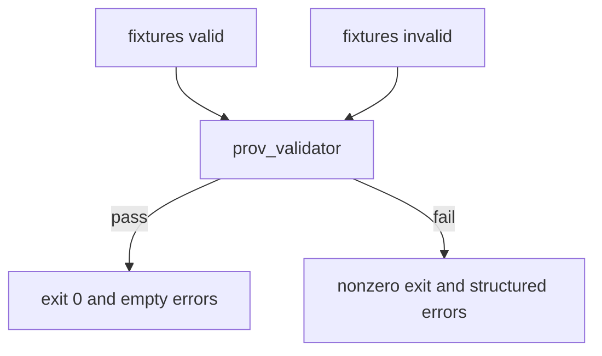

<!-- [KFM_META_BLOCK_V2]
doc_id: kfm://doc/af0ad807-0661-4763-8ec3-d9163e63e78b
title: prov_validator tests
type: standard
version: v1
status: draft
owners: TODO
created: 2026-02-26
updated: 2026-02-26
policy_label: public
related:
  - ../README.md
  - ../src/
tags: [kfm, validators, provenance, prov, tests]
notes:
  - Directory-level documentation for the prov_validator test suite.
[/KFM_META_BLOCK_V2] -->

# prov_validator tests

Fixture-based tests for **KFM PROV** (provenance) artifacts — designed to keep provenance **schema-valid, linkable, and fail-closed**.


> **WARNING**
> These tests are part of the *trust membrane*. Treat changes here as governance-impacting:
> a regression can allow invalid / non-auditable provenance to ship.

## Quick links

- [Purpose](#purpose)
- [Where this fits](#where-this-fits)
- [Directory contract](#directory-contract)
- [Directory layout](#directory-layout)
- [How the tests work](#how-the-tests-work)
- [Run locally](#run-locally)
- [Add or update fixtures](#add-or-update-fixtures)
- [Definition of Done](#definition-of-done)
- [Troubleshooting](#troubleshooting)

---

## Purpose

The **prov_validator** is expected to validate the **PROV** portion of the KFM catalog triplet (DCAT + STAC + PROV) and related *run receipts*.

This `tests/` directory exists to:

1. Prevent schema/profile drift in PROV JSON-LD artifacts.
2. Ensure **required provenance fields** remain present and correctly shaped.
3. Ensure invalid provenance **fails validation** (no silent acceptance).
4. Provide **golden fixtures** that document the intended behavior and error messages.

---

## Where this fits

KFM promotes data through lifecycle zones, including a **CATALOG/TRIPLET** zone where **DCAT + STAC + PROV** artifacts are cross-linked and validated.

This validator’s tests are one of the “fail-closed” guardrails that keep the catalog triplet valid before anything reaches governed runtime surfaces.

---

## Directory contract

### ✅ What belongs here

- Small, deterministic **fixtures** (valid + invalid PROV documents), ideally JSON-LD.
- “Golden” expected outputs (normalized JSON, expected error lists, exit codes).
- Unit/integration tests for:
  - CLI behavior (exit codes, stdout/stderr stability)
  - library API behavior (if prov_validator exposes a library function)
  - referential checks (if validator also checks links between PROV and other artifacts)

### 🚫 What must NOT go here

- Secrets, credentials, tokens, private keys.
- Large binaries or “real” upstream datasets.
- Restricted or sensitive coordinates/records (use synthetic or redacted examples).
- Snapshots that embed machine-specific paths, timestamps, or nondeterministic IDs.

---

## Directory layout

> **PROPOSED default** — adjust to match the repo if the current layout differs.

```text
tools/validators/prov_validator/tests/
  README.md
  fixtures/
    valid/        # fixtures that MUST validate cleanly
    invalid/      # fixtures that MUST fail validation
    edge/         # tricky-but-allowed patterns
  goldens/        # expected outputs (normalized docs, error payloads)
  test_*.md       # optional: spec-style tests (if used)
  test_*.*        # implementation tests (language-specific)
```

## How the tests work

The suite is designed around **fixture-driven validation**:



### Fixture types

| Fixture kind | Location (recommended) | Expectation |
|---|---|---|
| Valid PROV | `fixtures/valid/` | Validator returns success and no errors |
| Invalid PROV | `fixtures/invalid/` | Validator returns failure and an error payload |
| Edge cases | `fixtures/edge/` | Documents tricky-but-allowed patterns |
| Golden outputs | `goldens/` | Stable, reviewed expected outputs |

### Minimum PROV expectations (profile)

At minimum, fixtures SHOULD cover the required PROV “shape”:

- **Entity**: at least the source(s) and produced artifact(s)
- **Activity**: fetch/extract/normalize/validate/publish steps
- **Agent**: runner identity (CI/service) and (when applicable) human approval
- **Run metadata**: stable identifiers such as `run_id` and commit/tool version fields

> **NOTE**
> Keep the profile requirements in one place in the validator implementation and treat these
> tests as the living “contract examples.”

> **TIP**
> Keep fixtures minimal. Each fixture should exercise *one* rule (or one tightly related cluster),
> so failures point to a single contract break.

---

## Run locally

Because the repo’s language/tooling is **not confirmed from this directory alone**, pick the command that matches the actual implementation.

### Option A: Python (pytest)

```bash
pytest -q tools/validators/prov_validator/tests
```

### Option B: Node (npm / pnpm)

```bash
npm test -- tools/validators/prov_validator
# or
pnpm test --filter prov_validator
```

### Option C: Make target

```bash
make test-prov-validator
```

> **TODO (verify)**
> Confirm the canonical local command and replace the options above with the *one true* repo command.

---

## Add or update fixtures

### 1) Add a new rule test

1. Create the smallest possible fixture under `fixtures/valid/` or `fixtures/invalid/`.
2. Add (or update) the corresponding test file:
   - name it after the rule you’re testing (e.g., `test_requires_activity_agent_entity.py`).
3. If the validator emits structured errors, store expected errors in `goldens/` and assert a stable shape.

### 2) Keep IDs stable

- Prefer deterministic identifiers in fixtures (`run_id`, `dataset_version_id`, `artifact_digest`).
- Avoid “now()” timestamps unless the validator explicitly supports them; use fixed timestamps instead.

### 3) Review mindset

Fixture changes are governance-relevant. Treat them like schema changes:

- include a short rationale in the PR
- link to the policy/contract or validator rule being changed
- update golden outputs intentionally (no “accept new snapshot” without review)

---

## Definition of Done

Use this checklist when adding/altering tests:

- [ ] New/updated fixtures are minimal and deterministic
- [ ] Tests cover both **pass** and **fail** paths where applicable
- [ ] Error outputs are asserted by shape (and by message only when stable/intentional)
- [ ] Running the repo test suite locally includes these tests
- [ ] CI runs the validator tests and fails closed on regressions (no “soft fail”)

---

## Troubleshooting

<details>
<summary>Common failures and what they usually mean</summary>

- **Schema error / missing required field**  
  The PROV profile likely changed or a fixture no longer matches required minimum fields.

- **Golden mismatch**  
  Either:
  1) validator behavior changed intentionally (update goldens with review), or  
  2) output includes nondeterministic values (fix the validator or fixture to be stable).

- **Tests pass locally but fail in CI**  
  Look for OS/path differences and dependency version drift. Prefer pinned tooling versions and
  normalization steps in the validator output.

</details>

---

## Repo reality check

This README is intentionally *contract-first*. Before treating any section as authoritative, verify:

- [ ] Which runtime/language implements `prov_validator` (Python/Node/Go/other)
- [ ] The real local command to run the suite
- [ ] Where fixtures actually live (if different from the recommended layout)
- [ ] Whether the validator checks only PROV schema/profile, or also cross-links to DCAT/STAC

[Back to top](#prov_validator-tests)
