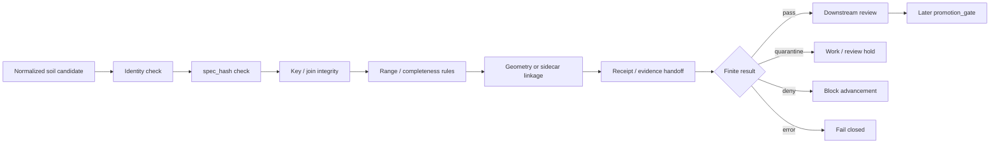

<!-- [KFM_META_BLOCK_V2]
doc_id: kfm://doc/NEEDS-VERIFICATION
title: tools/validators/soil_integrity/
type: standard
version: v1
status: draft
owners: @bartytime4life
created: NEEDS-VERIFICATION__YYYY-MM-DD
updated: 2026-04-17
policy_label: NEEDS-VERIFICATION__public_or_internal
related: [
  ../README.md,
  ../connector_gate/README.md,
  ../soil_moisture/README.md,
  ../promotion_gate/README.md,
  ../../attest/README.md,
  ../../probes/README.md,
  ../../../contracts/README.md,
  ../../../schemas/README.md,
  ../../../policy/README.md,
  ../../../data/receipts/README.md,
  ../../../data/proofs/README.md,
  ../../../data/work/README.md,
  ../../../data/catalog/README.md,
  ../../../data/registry/README.md,
  ../../../.github/workflows/README.md
]
tags: [kfm, validators, soil, integrity, fail-closed, spec_hash, receipts, provenance, mukey, cokey, chkey]
notes: [
  README-like standard doc for a soil-focused validator lane.
  This revision preserves the existing validator doctrine while tightening soil-baseline terminology, output posture, and downstream boundary language.
  Exact mounted subtree contents, created date, leaf-level ownership confirmation, and any executable inventory under this exact path remain NEEDS VERIFICATION.
]
[/KFM_META_BLOCK_V2] -->

<a id="top"></a>

# `tools/validators/soil_integrity/`

Fail-closed validator surface for deterministic soil candidate integrity, stable soil identifiers, preserved join meaning, and review-visible handoff into downstream KFM review and promotion lanes.

> [!NOTE]
> **Status:** `experimental`  
> **Document status:** `draft`  
> **Owners:** `@bartytime4life` *(grounded at parent and adjacent validator scope; exact leaf-level assignment still needs branch verification)*  
> **Path:** `tools/validators/soil_integrity/README.md`  
>        
> **Quick jumps:** [Scope](#scope) · [Repo fit](#repo-fit) · [Accepted inputs](#accepted-inputs) · [Exclusions](#exclusions) · [Current evidence posture](#current-evidence-posture) · [Directory tree](#directory-tree) · [Quickstart](#quickstart) · [Usage](#usage) · [Validation surface](#validation-surface) · [Output posture](#output-posture) · [Diagram](#diagram) · [Task list](#task-list) · [FAQ](#faq) · [Appendix](#appendix)

> [!IMPORTANT]
> This README defines a **validator lane contract** and a **conservative implementation-facing starter shape** for soil integrity checks. It does **not** by itself prove that mounted scripts, schemas, fixtures, or merge-blocking integrations already exist under this exact path.

> [!TIP]
> Keep the KFM trust split visible here:
>
> **receipt ≠ proof ≠ catalog ≠ publication**
>
> `soil_integrity/` may validate declared linkage among those surfaces, but it should not collapse them into one helper-owned authority.

---

## Scope

This lane exists for subject-level validation of **soil candidates** before they are allowed to lean on stronger downstream trust surfaces.

### Working question

> **Is this soil candidate explicit, keyed, range-safe, provenance-visible, and structurally complete enough to advance into governed review?**

### What “soil integrity” means here

In this lane, **soil integrity** means deterministic checks over whether a soil candidate preserves:

- source identity
- stable keys and joins
- declared `spec_hash`
- expected field ranges and coded domains
- declared aggregate lineage when row-level meaning has been collapsed
- geometry / raster linkage when present
- review-visible receipt and evidence handoff

It does **not** mean agronomic interpretation, runtime answer behavior, publication proof, or policy authorship.

### This lane should pressure candidates for

- canonical candidate identity and reproducible `spec_hash`
- stable soil identifiers such as `mukey`, `cokey`, `chkey`, or declared aggregate IDs
- preserved join meaning across mapunit / component / horizon shapes when relevant
- component-percentage and similar aggregate sanity rules
- explicit source validators such as `ETag`, `Last-Modified`, schema snapshot, or size when available
- explicit `run_receipt` / `evidence_refs` handoff where downstream review expects them
- fail-closed behavior on malformed, weak, or ambiguous inputs

### Truth labels used here

| Label | Meaning in this leaf |
| --- | --- |
| **CONFIRMED** | Directly supported by adjacent repo docs or attached KFM doctrine |
| **INFERRED** | Strongly suggested by lane structure and neighboring validator docs |
| **PROPOSED** | Recommended thin-slice shape consistent with current doctrine |
| **UNKNOWN** | Not surfaced strongly enough to state as current repo fact |
| **NEEDS VERIFICATION** | Exact file, schema, test, workflow, or enforcement detail should be checked on the working branch |

[Back to top](#top)

---

## Repo fit

**Path:** `tools/validators/soil_integrity/README.md`  
**Lane:** `tools/validators/`  
**Role:** subject-level soil candidate validator, upstream of release-facing promotion review

### Upstream and adjacent anchors

| Relation | Surface | Why it matters |
| --- | --- | --- |
| Parent lane | [`../README.md`](../README.md) | Sets the validator-family posture: deterministic, reviewable, fail-closed helpers |
| Adjacent subject validator | [`../soil_moisture/README.md`](../soil_moisture/README.md) | Shows the current first-wave soil-environment validator pattern and how a subject leaf stays narrower than promotion |
| Upstream admission membrane | [`../connector_gate/README.md`](../connector_gate/README.md) | Connector admission is earlier and narrower than subject integrity review |
| Later release membrane | [`../promotion_gate/README.md`](../promotion_gate/README.md) | Promotion should remain later and stronger than subject-level soil checks |
| Adjacent attestation lane | [`../../attest/README.md`](../../attest/README.md) | Signing and verification are related, but not the same thing as subject validation |
| Adjacent probe lane | [`../../probes/README.md`](../../probes/README.md) | Bounded source inspection belongs there rather than inside subject validators |
| Shared contracts | [`../../../contracts/README.md`](../../../contracts/README.md) | Contract intent should stay upstream and explicit |
| Shared schemas | [`../../../schemas/README.md`](../../../schemas/README.md) | Machine-readable shape authority should remain visible and singular |
| Shared policy | [`../../../policy/README.md`](../../../policy/README.md) | Deny-by-default logic, obligations, and rights posture belong there |
| Receipt surface | [`../../../data/receipts/README.md`](../../../data/receipts/README.md) | Receipt-shaped process memory should remain inspectable and separate from proof |
| Proof surface | [`../../../data/proofs/README.md`](../../../data/proofs/README.md) | Release-grade proof objects belong there conceptually, even when this lane checks linkage to them |
| Work surface | [`../../../data/work/README.md`](../../../data/work/README.md) | Candidates should arrive here already normalized rather than be silently repaired inside validators |
| Catalog surface | [`../../../data/catalog/README.md`](../../../data/catalog/README.md) | Catalog closure is later and stronger than subject integrity |
| Registry surface | [`../../../data/registry/README.md`](../../../data/registry/README.md) | Source identity and source-role meaning should already be explicit before deep validation |
| Workflow boundary | [`../../../.github/workflows/README.md`](../../../.github/workflows/README.md) | Workflows orchestrate this lane; they should not bury validator logic in YAML |

### Boundary rule

Use `soil_integrity/` to validate **soil candidate readiness**.

Do **not** use it to:

- poll or scrape source systems
- own schema or contract authority
- decide policy rights
- sign artifacts
- publish or promote artifacts directly
- replace `promotion_gate/`
- replace runtime answer-accountability envelopes
- quietly “repair” malformed candidates into trusted ones

[Back to top](#top)

---

## Accepted inputs

Accepted inputs are the smallest reviewable artifacts needed to judge one soil candidate honestly.

| Input class | Examples | Why it belongs here | Status |
| --- | --- | --- | --- |
| Canonical soil candidate rows | normalized mapunit, component, horizon, or aggregate rows | The lane should validate declared soil meaning, not raw upstream payloads | **CONFIRMED doctrine / PROPOSED local form** |
| Stable identifier sets | `mukey`, `cokey`, `chkey`, declared aggregate IDs | Soil watcher doctrine depends on deterministic key preservation | **CONFIRMED doctrine** |
| Candidate identity material | `spec_hash`, `schema_ver`, candidate manifest fragment | Candidate identity must stay deterministic and reviewable | **CONFIRMED doctrine / INFERRED local input** |
| Source validators | `ETag`, `Last-Modified`, size, schema snapshot, source version | Helps keep watcher refreshes and replay semantics explicit | **CONFIRMED doctrine** |
| Source-role context | registry or descriptor reference; source title and role | Prevents soil candidates from arriving as decontextualized tables | **INFERRED / PROPOSED** |
| Join-preservation evidence | explicit mapunit ↔ component ↔ horizon mapping or declared aggregate lineage | Soil integrity is not only value ranges; it is also preserved relational meaning | **CONFIRMED doctrine / PROPOSED local expression** |
| Range / domain expectations | component-percentage rules, expected field ranges, coded domains, nullability rules | Converts soil checks into machine-reviewable failures instead of prose warnings | **CONFIRMED doctrine** |
| Geometry or raster sidecars | candidate polygons, grid references, digest refs, CRS refs | When geometry or raster linkage exists, it should stay explicit and checkable | **INFERRED / PROPOSED** |
| Handoff artifacts | `run_receipt_ref`, `evidence_refs`, optional prior candidate ref | Keeps validation tied to process memory without collapsing into proof issuance | **INFERRED / PROPOSED** |
| Optional corroborative context | Mesonet / SCAN / SMAP / crop-progress context used as declared support, not as replacement truth | Keeps context visible without flattening source roles | **CONFIRMED doctrine / INFERRED local use** |

### Operating rules for accepted inputs

1. Prefer normalized, declared candidates over raw upstream pulls.
2. Keep key semantics explicit.
3. Keep optional context visibly secondary to authoritative soil baselines.
4. Prefer small fixtures over copied source dumps.
5. Treat missing source posture, missing keys, and missing handoff artifacts as fail-closed concerns when required by the check plan.
6. Do not invent “helpful defaults” for ambiguous joins, ranges, or units.

[Back to top](#top)

---

## Exclusions

| Does **not** belong here | Put it here instead | Why |
| --- | --- | --- |
| Source polling, refresh cadence, and unattended fetch logic | watcher / probe / pipeline lanes | Observation belongs upstream |
| Contract law for soil candidate meaning | [`../../../contracts/README.md`](../../../contracts/README.md) | This leaf should consume contract authority, not replace it |
| Canonical schema ownership | [`../../../schemas/README.md`](../../../schemas/README.md) | Shape authority should remain singular |
| Rights and obligation logic | [`../../../policy/README.md`](../../../policy/README.md) | Validators may apply policy, but should not own it |
| Signing, attestations, and proof-pack creation | [`../../attest/README.md`](../../attest/README.md) and `data/proofs/` | Proof remains a stronger downstream trust surface |
| STAC / DCAT / PROV publication | `data/catalog/` and later release lanes | Subject validation is not catalog closure |
| Final promotion decision | [`../promotion_gate/README.md`](../promotion_gate/README.md) | This lane is earlier and narrower |
| Runtime answer behavior | `tests/e2e/runtime_proof/` leaves | Request-time answer accountability is a different burden |
| Agronomic interpretation or narrative explanation | domain docs, runtime, or story surfaces | Integrity checks are not the same as interpretation |
| Silent cleanup of broken candidates | work / normalize / repair lanes | Fail closed here instead |

[Back to top](#top)

---

## Current evidence posture

This README stays intentionally conservative.

| Item | Status | Meaning here |
| --- | --- | --- |
| Parent validator lane is substantive and fail-closed | **CONFIRMED** | This leaf should inherit that posture |
| Adjacent `soil_moisture/` leaf is substantive | **CONFIRMED** | Strong style and burden analogue for a soil-facing validator README |
| Adjacent `promotion_gate/` leaf is substantive | **CONFIRMED** | Confirms downstream separation and trust-chain language |
| Exact mounted checkout for this target leaf was surfaced in-session | **CONFIRMED no** | Exact local file inventory under this path remains unresolved |
| Current public target surface exposed substantive checked-in content for this exact leaf | **CONFIRMED no** | This draft should be treated as a conservative leaf definition rather than an implementation-complete inventory |
| Exact scripts, fixtures, schemas, or CI wiring under `soil_integrity/` | **NEEDS VERIFICATION** | Keep any starter tree or helper names clearly proposed |

> [!WARNING]
> Adjacent docs are rich enough to suggest deeper executable shapes. This leaf should still stay smaller than what the session actually proved.

[Back to top](#top)

---

## Directory tree

### Target leaf under revision

```text
tools/validators/
└── soil_integrity/
    └── README.md
```

### Conservative starter shape (`PROPOSED` / `NEEDS VERIFICATION`)

```text
tools/validators/
└── soil_integrity/
    ├── README.md
    ├── validate_identity.py        # spec_hash, schema_ver, source posture
    ├── validate_keys.py            # mukey/cokey/chkey or aggregate lineage
    ├── validate_ranges.py          # component_pct, nullability, field/domain checks
    ├── validate_geometry.py        # optional geometry/raster linkage checks
    ├── evaluate.py                 # lane-local result emission
    ├── lib/
    │   └── README.md
    ├── fixtures/
    │   ├── pass/
    │   ├── quarantine/
    │   ├── deny/
    │   └── error/
    └── reports/
        └── README.md
```

<details>
<summary><strong>Why the proposed tree stays modest</strong></summary>

A first executable `soil_integrity/` slice should prove one subject-level seam clearly:

- one stable entrypoint
- one tiny passing candidate
- one tiny failing candidate
- one machine-readable result contract
- no hidden orchestration
- no duplicate schema ownership
- no signing or publication shortcuts

</details>

[Back to top](#top)

---

## Quickstart

Start with inspection, not invention.

### 1) Re-read the validator family posture

```bash
sed -n '1,240p' tools/validators/README.md 2>/dev/null || true
sed -n '1,280p' tools/validators/soil_moisture/README.md 2>/dev/null || true
sed -n '1,320p' tools/validators/promotion_gate/README.md 2>/dev/null || true
sed -n '1,260p' tools/validators/connector_gate/README.md 2>/dev/null || true
```

### 2) Re-read the downstream trust split

```bash
sed -n '1,240p' data/receipts/README.md 2>/dev/null || true
sed -n '1,240p' data/proofs/README.md 2>/dev/null || true
sed -n '1,240p' data/catalog/README.md 2>/dev/null || true
sed -n '1,240p' .github/workflows/README.md 2>/dev/null || true
```

### 3) Search current soil terms before adding new ones

```bash
git grep -n "mukey\|cokey\|chkey\|spec_hash\|run_receipt\|SSURGO\|gSSURGO\|gNATSGO\|Soil Data Access\|Kansas Mesonet" -- \
  tools data docs policy schemas contracts tests pipelines .github 2>/dev/null || true
```

### 4) Build the smallest credible validator slice

A good first executable slice is:

1. parse one normalized soil candidate
2. validate explicit source identity
3. validate deterministic `spec_hash`
4. validate stable key / join integrity
5. validate one range / completeness rule family
6. emit one machine-readable validator result
7. stop there

### 5) Wire to stronger lanes only after subject validation is honest

Only after the first slice is stable should this leaf feed:

- reviewer summaries
- promotion review
- stronger catalog closure
- release-significant proof assembly

[Back to top](#top)

---

## Usage

Use this lane when the main question is:

> “Does this soil candidate preserve enough structure and support to be trusted for downstream review?”

### Use this validator when

- the candidate is already normalized
- stable identifiers are supposed to survive intact
- reviewer-visible structural failures matter
- downstream promotion should not shoulder basic soil integrity triage
- the candidate may include authoritative soil baselines plus explicitly declared contextual support

### Do not use this validator when

- the main burden is raw ingestion
- the main burden is source admission
- the main burden is signing or release closure
- the main burden is runtime answer behavior
- the main burden is interpretation or narrative explanation

### Lane-local result set

To keep the behavior finite and reviewable, use a narrow local result set.

| Result | Meaning | Downstream implication |
| --- | --- | --- |
| `pass` | Candidate is structurally valid enough for downstream review. | May continue into stronger review or promotion. |
| `quarantine` | Candidate is incomplete, weakly supported, or missing declared linkage. | Hold in work/review; do not silently advance. |
| `deny` | Candidate violates a declared invariant or explicit rule. | Block advancement until corrected. |
| `error` | Validator could not determine validity because input or execution failed. | Fail closed and investigate. |

> [!IMPORTANT]
> If this validator ever checks or contributes to a downstream `DecisionEnvelope`, keep that object’s own finite grammar separate. This lane-local result set is **not** the same thing as `ANSWER / ABSTAIN / DENY / ERROR`.

### Illustrative invocation (`PROPOSED`)

```bash
python tools/validators/soil_integrity/evaluate.py \
  --candidate data/work/soils/candidate.json \
  --out data/work/soils/soil-integrity-report.json
```

Use a real branch-local invocation only after the executable entrypoint exists.

[Back to top](#top)

---

## Validation surface

### 1) Identity and source integrity

Validate that the candidate keeps the following explicit:

- source title or source ID
- source role
- candidate `schema_ver`
- reproducible `spec_hash`
- source validators when exposed (`ETag`, `Last-Modified`, size, schema snapshot, or equivalent)

Typical fail-closed outcomes:

- missing source identity → `deny`
- unreproducible or missing `spec_hash` → `deny`
- missing source validator where the contract requires it → `quarantine` or `deny`

### 2) Key and join integrity

This is the core subject burden.

Check that the candidate preserves stable relational meaning such as:

- `mukey`
- `cokey`
- `chkey`
- declared aggregate lineage when the candidate is no longer row-level

Typical checks:

- null or duplicate stable identifiers
- orphaned join rows
- silently collapsed component / horizon meaning
- aggregate rows with no declared derivation

### 3) Quantitative integrity

Check the candidate against declared numeric and completeness expectations.

First-wave examples:

- component-percentage sums remain within declared tolerance
- expected field ranges remain inside allowed bounds
- required fields are present
- schema drift is visible rather than silent
- duplicate rows are either forbidden or explicitly handled

### 4) Geometry or raster linkage integrity

When the candidate carries spatial material:

- geometry validity should be explicit
- CRS should be explicit
- raster or sidecar digests should be explicit
- geometry / raster absence should be explicit when the candidate is tabular-only

Do not assume every soil candidate is spatially complete. Make absence visible.

### 5) Evidence and handoff integrity

Before downstream review, require what the candidate says it depends on.

Typical minimums:

- `evidence_refs` when review depends on external support
- `run_receipt_ref` when replay or correction depends on process memory
- prior candidate reference when drift or supersession matters

### Reference table

| Check family | What should pass | What should quarantine or deny |
| --- | --- | --- |
| Identity | explicit source, `schema_ver`, reproducible `spec_hash` | missing source posture, missing `spec_hash`, silent schema ambiguity |
| Keys | stable identifiers present and relational meaning preserved | null / duplicate keys, orphaned joins, collapsed lineage |
| Quantitative integrity | declared percentage, range, and completeness rules hold | invalid ranges, impossible sums, missing required fields |
| Shape / sidecars | geometry / CRS / raster linkage is explicit when attached | malformed geometry, missing CRS, silent sidecar drift |
| Handoff | `run_receipt_ref` and `evidence_refs` are visible when required | downstream review expected but no machine-readable handoff |

[Back to top](#top)

---

## Output posture

Primary output should remain **machine-readable**.

A small JSON report is the preferred first trust object for this lane.

### Illustrative report shape

```json
{
  "validator": "soil_integrity",
  "result": "quarantine",
  "spec_hash": "sha256:REPLACE_ME",
  "schema_ver": 1,
  "checks": {
    "identity": "pass",
    "keys": "pass",
    "ranges": "quarantine",
    "geometry": "skip",
    "handoff": "pass"
  },
  "reason_codes": [
    "component_pct_sum_outside_tolerance"
  ],
  "evidence_refs": [
    "source:ssurgo",
    "source:sda"
  ],
  "run_receipt_ref": "kfm://receipt/NEEDS-VERIFICATION"
}
```

### Output rules

- emit one finite result
- keep report fields stable and reviewable
- do not sign here
- do not publish here
- do not substitute reviewer Markdown for the primary machine artifact

A reviewer-readable summary may exist, but it should remain secondary to the machine result.

[Back to top](#top)

---

## Diagram



[Back to top](#top)

---

## Task list

### Thin-slice definition of done

- [ ] verify exact mounted subtree contents for this path
- [ ] confirm leaf-level ownership, `doc_id`, `created`, `updated`, and `policy_label`
- [ ] land one tiny passing fixture and one tiny failing fixture
- [ ] land one stable machine-readable result contract
- [ ] add one executable validator entrypoint
- [ ] add one narrow test slice before adding CI choreography
- [ ] recheck whether geometry validation belongs in the first slice or a later helper
- [ ] wire this lane into downstream review only after subject validation stays deterministic
- [ ] replace placeholders only after branch-local verification

### Review questions before moving past `draft`

- Does the first executable slice validate soil identity before attempting richer semantics?
- Are `mukey` / `cokey` / `chkey` relationships checked without silently repairing them?
- Does the lane keep candidate validation distinct from runtime answer proof?
- Are receipt and proof boundaries still visible in outputs and examples?
- Did any example accidentally imply current runner or CI enforcement that the branch does not prove?

[Back to top](#top)

---

## FAQ

### Is this the same as `tools/validators/soil_moisture/`?

No. `soil_moisture/` is the clearer first-wave subject validator already framed around Kansas Mesonet-style observation batches, freshness, and anomaly semantics. `soil_integrity/` is the broader soil-baseline integrity seam for keys, joins, ranges, and candidate structure.

### Does this lane own receipts?

No. It may **consume** `run_receipt` references and require them for handoff discipline, but receipt storage and process-memory boundaries remain elsewhere.

### Does this lane publish STAC, DCAT, or PROV?

No. It may validate candidate readiness for later closure, but catalog publication and release proof belong downstream.

### Should this validator silently repair broken `mukey` / `cokey` relationships?

No. Broken identity or broken joins should stay visible. Repair belongs in normalization or work lanes, not here.

### Can contextual sources like Kansas Mesonet, SCAN, or SMAP replace authoritative soil baselines here?

No. They may support review, but they should remain visibly contextual rather than quietly becoming the soil candidate’s primary truth source.

[Back to top](#top)

---

## Appendix

<details>
<summary><strong>Illustrative first-wave check families</strong></summary>

| Candidate type | First check worth landing | Why start there |
| --- | --- | --- |
| SSURGO / SDA normalized rows | `mukey` / `cokey` preservation + `spec_hash` | Identity and relational meaning are the strongest early trust seam |
| Aggregated mapunit package | component-percentage completeness + aggregate lineage | Keeps weighted fields from becoming opaque |
| gSSURGO / gNATSGO-derived extract | source version + sidecar digest + schema stability | Prevents rasterized or statewide derivatives from drifting silently |
| Soil candidate with context layers | explicit evidence role labeling | Keeps contextual support from flattening into authoritative truth |

### Canonical one-line posture

A good `soil_integrity/` validator should make it harder to flatten **SSURGO**, **Soil Data Access**, **gSSURGO**, **gNATSGO**, and contextual station or satellite support into one implied truth class.

</details>

[Back to top](#top)
