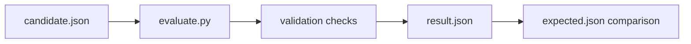

<!-- [KFM_META_BLOCK_V2]
doc_id: kfm://doc/NEEDS_VERIFICATION__soil_integrity_fixtures_readme
title: Soil Integrity Fixtures
type: standard
version: v1
status: draft
owners: @bartytime4life
created: NEEDS_VERIFICATION__YYYY-MM-DD
updated: 2026-04-17
policy_label: NEEDS_VERIFICATION__public_or_internal
related: [
  ../README.md,
  ../../soil_moisture/README.md,
  ../../promotion_gate/README.md,
  ../../connector_gate/README.md,
  ../../../../contracts/README.md,
  ../../../../schemas/README.md,
  ../../../../policy/README.md,
  ../../../../data/receipts/README.md,
  ../../../../data/proofs/README.md,
  ../../../../data/work/README.md,
  ../../../../.github/CODEOWNERS,
  ../../../../.github/workflows/README.md
]
tags: [kfm, validators, soil, integrity, fixtures, fail-closed, spec_hash, mukey]
notes: [
  Revision preserves existing soil_integrity fixture doctrine while tightening minimal-fixture discipline and validator alignment.
  Explicitly aligns fixture behavior to evaluate.py and lane-local result grammar.
  Exact subtree contents, runner wiring, and ownership confirmation remain NEEDS VERIFICATION.
]
[/KFM_META_BLOCK_V2] -->

<a id="top"></a>

# Soil Integrity Fixtures

Minimal, deterministic fixture set for validating **soil candidate integrity behavior** in the `tools/validators/soil_integrity/` lane.

> [!NOTE]
> **Status:** `experimental`  
> **Document status:** `draft`  
> **Owners:** `@bartytime4life` *(grounded at validator scope; leaf-level verification still required)*  
> **Path:** `tools/validators/soil_integrity/fixtures/README.md`  
> **Repo fit:** fixture custody for subject-level soil validation (not runtime proof, not promotion, not schema authority)  
>       
> **Quick jumps:** [Scope](#scope) · [Repo fit](#repo-fit) · [Accepted inputs](#accepted-inputs) · [Exclusions](#exclusions) · [Directory tree](#directory-tree) · [Fixture structure](#fixture-structure) · [Quickstart](#quickstart) · [Usage](#usage) · [Fixture matrix](#fixture-matrix) · [Diagram](#diagram) · [Task list](#task-list--definition-of-done) · [FAQ](#faq)

> [!IMPORTANT]
> This directory exists to **prove validator behavior**, not to store soil data.  
> Every fixture must justify its existence by demonstrating a **single validator rule**.

> [!CAUTION]
> Do NOT turn this into a data mirror of:
> - SSURGO
> - gSSURGO
> - gNATSGO
> - Soil Data Access
> - Kansas Mesonet  
>
> If a fixture looks like a dataset instead of a test case, it is wrong.

> [!TIP]
> Keep the trust split explicit:
>
> **fixture ≠ candidate ≠ receipt ≠ proof ≠ catalog ≠ publication**

---

## Scope

This directory holds **tiny, reviewable fixture pairs** that prove one soil-integrity behavior at a time.

### Working question

> “What is the smallest possible input that proves this validator rule works or fails correctly?”

### This leaf proves

- identity enforcement (`source_ref`, `spec_hash`)
- key integrity (`mukey`, `cokey`, `chkey`)
- range validation (`comppct_r`, texture %, etc.)
- join preservation (mapunit → component → horizon)
- fail-closed behavior (`deny`, `quarantine`, `error`)
- machine-readable result emission

### This leaf does NOT prove

- runtime answers (`ANSWER / ABSTAIN`)
- promotion readiness
- schema authority
- policy enforcement
- data ingestion correctness
- agronomic interpretation

---

## Repo fit

**Path:** `tools/validators/soil_integrity/fixtures/`  
**Role:** test surface for validating `evaluate.py`

### Upstream

- `../README.md` → validator contract
- `../evaluate.py` → fixture consumer
- `data/work/` → candidate origin

### Downstream

- validator tests (NEEDS VERIFICATION)
- CI (NEEDS VERIFICATION)
- promotion review (indirect)

> [!NOTE]
> Fixtures are **not shared truth surfaces**. They exist only to exercise validator logic.

---

## Accepted inputs

Fixtures must be:

- small (single candidate)
- explicit (no implied fields)
- deterministic (no randomness)
- isolated (one rule per fixture)

### Allowed files

| File | Purpose |
|------|--------|
| `candidate.json` | input to validator |
| `expected.json` | minimal expected output |
| optional `.note.json` | human clarification (optional only) |

---

## Exclusions

Fixtures must NOT include:

- full SSURGO tables
- raster tiles
- large JSON blobs
- implicit joins
- auto-repair logic
- schema definitions
- policy definitions

---

## Directory tree

### Minimum viable set

```text
fixtures/
├── pass/
│   └── minimal_valid/
│       ├── candidate.json
│       └── expected.json
├── deny/
│   └── missing_mukey/
│       ├── candidate.json
│       └── expected.json
```

### Expansion (PROPOSED)

```text
fixtures/
├── quarantine/
│   └── component_pct_out_of_range/
├── error/
│   └── malformed_candidate/
```

---

## Fixture structure

### Candidate example

```json
{
  "source_ref": "kfm://source/ssurgo-sda",
  "mukey": "123456",
  "spec_hash": "sha256:PLACEHOLDER",
  "comppct_r": 50
}
```

### Expected output (minimal assertion)

```json
{
  "validator": "soil_integrity",
  "result": "pass"
}
```

### Design rules

- assert only **required behavior**
- avoid locking entire output structure
- allow validator evolution without fixture churn

---

## Quickstart

### Run validator

```bash
python tools/validators/soil_integrity/evaluate.py \
  --candidate fixtures/pass/minimal_valid/candidate.json \
  --out /tmp/report.json
```

### Compare result

```bash
diff /tmp/report.json fixtures/pass/minimal_valid/expected.json
```

---

## Usage

### Use fixtures to test

- identity failures → `deny`
- key failures → `deny`
- range issues → `quarantine`
- malformed input → `error`
- valid candidate → `pass`

### When to add a fixture

Add ONLY when:

- introducing a new rule
- fixing a regression
- clarifying ambiguous behavior

### Naming rule

Use **one failure per fixture**

Examples:

```text
deny/missing_mukey/
deny/spec_hash_mismatch/
quarantine/component_pct_out_of_range/
error/malformed_json/
```

---

## Fixture matrix

| Fixture type | Purpose | Expected result |
|--------------|--------|----------------|
| pass | valid candidate | pass |
| quarantine | incomplete but not invalid | quarantine |
| deny | violates invariant | deny |
| error | invalid structure | error |

---

## Diagram



---

## Task list / Definition of done

- [ ] one `pass` fixture exists
- [ ] one `deny` fixture exists
- [ ] validator produces deterministic output
- [ ] fixtures are readable in <20 lines
- [ ] no fixture acts as dataset mirror

### Next steps

- [ ] add `quarantine` case
- [ ] add `error` case
- [ ] wire into test runner (NEEDS VERIFICATION)

---

## FAQ

### Why so small?

Large fixtures hide bugs.

### Why not reuse real data?

Because validator correctness ≠ dataset realism.

### Why separate candidate and expected?

To enforce explicit validation contracts.

### Should fixtures include geometry?

Only if validator checks it.

---

## Appendix

<details>
<summary>Minimal fixture philosophy</summary>

A correct fixture answers:

> "What is the smallest input that proves this rule?"

If the answer is large, the fixture is wrong.

</details>

[Back to top](#top)
