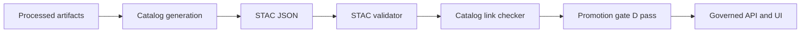

<!-- [KFM_META_BLOCK_V2]
doc_id: kfm://doc/2b1f7a3c-3b11-4c73-a5b3-f2c76be1f4e2
title: STAC Validator
type: standard
version: v1
status: draft
owners: TBD
created: 2026-02-26
updated: 2026-02-26
policy_label: public
related:
  - kfm://doc/promotion-contract-v1
  - ../dcat_validator/README.md
  - ../prov_validator/README.md
  - ../../linkcheck/catalog_linkcheck/README.md
tags: [kfm, validator, stac, catalog, promotion-contract]
notes:
  - Keep this doc evidence-first and fail-closed.
  - Replace TODOs once the implementation and CI workflow names are finalized.
[/KFM_META_BLOCK_V2] -->

# STAC Validator

**Purpose:** Validate STAC catalogs used by Kansas Frontier Matrix (KFM) so that dataset versions can pass **Promotion Contract Gate D** and safely move toward governed runtime.


- **Owners:** TBD  
- **Last updated:** 2026-02-26  

## Quick links

- [Why this exists](#why-this-exists)
- [How this fits in the repo](#how-this-fits-in-the-repo)
- [Directory contract](#directory-contract)
- [Usage](#usage)
- [Inputs](#inputs)
- [Outputs](#outputs)
- [CI integration](#ci-integration)
- [Adding fixtures](#adding-fixtures)
- [Troubleshooting](#troubleshooting)
- [Contributing](#contributing)

---

## Why this exists

KFM uses a **catalog triplet** as its interoperability and evidence surface:

- **DCAT** for dataset-level metadata
- **STAC** for spatiotemporal assets (collections, items, assets)
- **PROV** for lineage (activities, agents, entities)

This validator is the STAC piece of the Promotion Contract “fail-closed” gates.

> NOTE
> 
> Promotion is blocked when required catalogs are missing or invalid.

[Back to top](#stac-validator)

## How this fits in the repo

This directory is intended to be one of KFM’s catalog validators:

- `tools/validators/dcat_validator`
- `tools/validators/stac_validator`  ← you are here
- `tools/validators/prov_validator`
- `tools/linkcheck/catalog_linkcheck` (cross-link verification)

The architectural intent is:

- **Validators**: schema/profile correctness for each catalog family (STAC/DCAT/PROV)
- **Link checker**: referential integrity across the triplet (required cross-links resolve)

### Where this runs



[Back to top](#stac-validator)

## Directory contract

### Where it fits

- Lives under `tools/validators/` as a reusable, fail-closed validation tool.
- Called from CI (and optionally locally) to validate changed STAC artifacts.

### Acceptable inputs

- STAC **Collection**, **Item**, or **Catalog** JSON documents.
- A dataset’s STAC root (commonly a `collection.json` plus related items).

Recommended location convention (update if your repo differs):

- `data/catalog/stac/<dataset>/collection.json`
- `data/catalog/stac/<dataset>/items/*.json`

### Exclusions

This directory should **not** contain:

- Pipeline business logic (belongs in `src/pipelines/...`)
- Policy decisions (belongs in `policy/...`)
- Any process that mutates RAW/PROCESSED artifacts

[Back to top](#stac-validator)

## Usage

### Local

This repo may provide a wrapper script/entrypoint (preferred) so that the validator version is pinned:

```sh
# TODO: replace with the real repo entrypoint once implemented.
# Examples:
#   make validate-stac
#   ./tools/validators/stac_validator/run.sh <path>
#   python -m tools.validators.stac_validator <path>

<ENTRYPOINT> data/catalog/stac/<dataset>/collection.json
```

If the repo relies on the upstream CLI directly, the reference invocation looks like:

```sh
stac-validator data/catalog/stac/<dataset>/collection.json
```

### What should be validated

At minimum, CI should validate:

- every modified STAC JSON file, or
- the dataset’s `collection.json` root (if your tooling resolves linked items)

> TIP
>
> In CI, prefer validating an explicit, deterministic file list derived from `git diff`.

[Back to top](#stac-validator)

## Inputs

The validator should accept at least:

- **Local paths** (recommended for CI)
- **Repository-relative paths** (recommended in docs/examples)

Optional (only if needed and safe):

- **HTTP(S) URLs** (avoid in CI unless you pin content by digest)

[Back to top](#stac-validator)

## Outputs

### Exit behavior

This validator is expected to be **fail-closed**:

- Exit **0**: validation passed
- Exit **non-zero**: validation failed or the tool errored

### Report artifacts

If the implementation supports it, prefer emitting a machine-readable report for CI annotations:

- `build/reports/stac_validator.json` (suggested)

Minimal suggested JSON shape:

```json
{
  "tool": "stac_validator",
  "status": "pass|fail|error",
  "checked": ["path/to/collection.json"],
  "errors": [
    {
      "path": "path/to/file.json",
      "message": "...",
      "schema": "..."
    }
  ]
}
```

[Back to top](#stac-validator)

## CI integration

A conceptual GitHub Actions job (update names/paths to match your repo):

```yaml
# .github/workflows/catalog-validate.yml
name: catalog-validate
on:
  pull_request:
    paths:
      - "data/catalog/stac/**/*.json"
      - "tools/validators/stac_validator/**"

jobs:
  stac:
    runs-on: ubuntu-latest
    steps:
      - uses: actions/checkout@v4

      # TODO: install pinned toolchain (container, npm, pip, etc.)

      - name: Validate STAC
        run: |
          stac-validator data/catalog/stac/<dataset>/collection.json
```

### Merge blocking

This job should be configured as a **required check** for merge.

[Back to top](#stac-validator)

## Adding fixtures

Recommended fixture strategy:

- Keep a **golden valid** STAC collection + minimal item
- Keep **targeted invalid** examples (missing required fields, bad geometry, bad links)
- Run the validator over fixtures in CI so regressions are caught

Suggested (proposed) layout:

```text
tools/validators/stac_validator/
  README.md
  fixtures/
    valid/
    invalid/
  tests/
    ...
```

[Back to top](#stac-validator)

## Troubleshooting

- **Schema errors**: confirm the STAC JSON is valid JSON and matches the expected STAC object type.
- **Extension errors**: ensure extensions referenced in `stac_extensions` are available to the validator (or pin schemas in-repo).
- **Link/href errors**: if this validator checks href resolution, ensure paths are correct relative to the collection.

[Back to top](#stac-validator)

## Contributing

### Guardrails

- Keep changes small and reversible.
- Add/adjust fixtures whenever you tighten validation rules.
- Prefer deterministic, offline validation for CI.

### Definition of done

- [ ] Running the validator locally is documented and reproducible
- [ ] CI runs the validator on changed STAC artifacts
- [ ] Failures block merge
- [ ] Fixtures cover at least one pass and one fail case

---

<details>
<summary>Appendix: Proposed KFM STAC profile checks</summary>

The Promotion Contract requires cross-links between DCAT, STAC, and PROV to be present and resolvable.

This validator MAY (or may defer to the link checker) enforce KFM-specific requirements such as:

- Required links to dataset-level DCAT and run-level PROV artifacts
- Presence of identifiers needed by governed API resolution (dataset_id, dataset_version_id)
- Presence of policy labeling fields (public vs restricted)

If you enforce these here, document them as a versioned profile (so audits can reconstruct what rules were applied).

</details>
