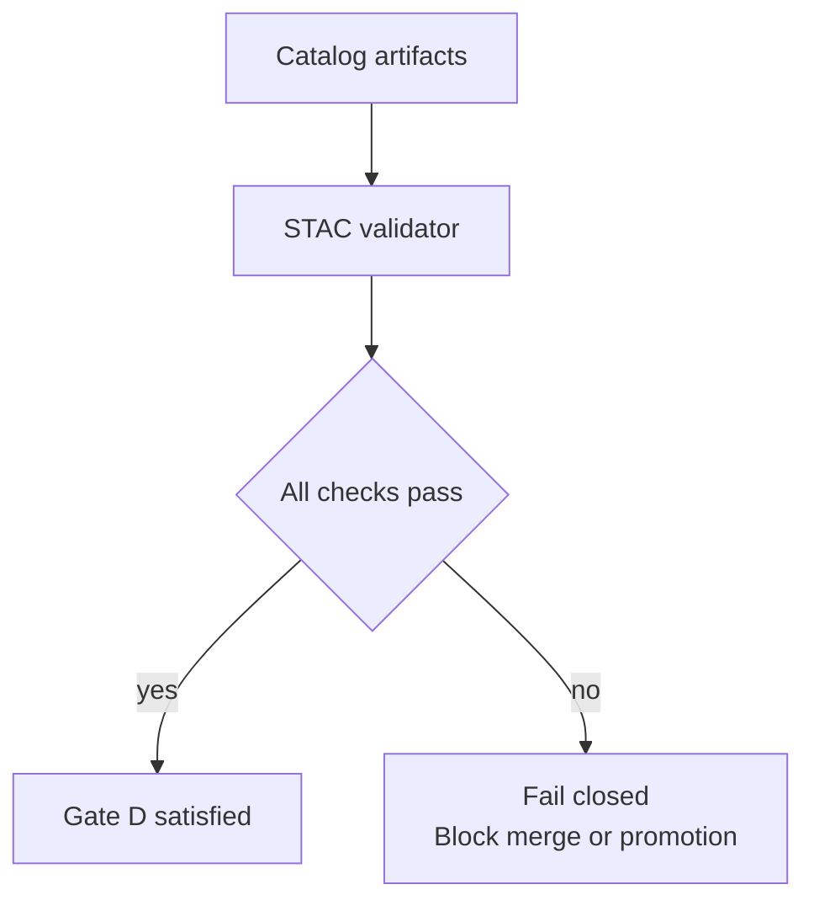

<!-- [KFM_META_BLOCK_V2]
doc_id: kfm://doc/6a2c7b4b-7a8f-4c8b-9cf3-51ad6f8a0a7b
title: STAC Validator Tests
type: standard
version: v1
status: draft
owners: kfm-platform (TODO: confirm)
created: 2026-02-26
updated: 2026-02-26
policy_label: public
related:
  - ../README.md
  - ../../README.md
tags: [kfm, stac, validator, tests]
notes:
  - Contract + regression tests for the STAC validator used in Promotion Gate D.
[/KFM_META_BLOCK_V2] -->

# STAC Validator Tests

Contract + regression tests for the **KFM STAC profile validator**.


> **TODO (repo wiring):** replace badge links with real workflow/test commands once the repo’s test runner and CI workflow path are confirmed.

## Quick links

- [What lives here](#what-lives-here)
- [How it fits in KFM promotion](#how-it-fits-in-kfm-promotion)
- [Directory layout](#directory-layout)
- [Run the tests](#run-the-tests)
- [Add or update fixtures](#add-or-update-fixtures)
- [Write a new test](#write-a-new-test)
- [Troubleshooting](#troubleshooting)
- [Maintenance checklist](#maintenance-checklist)

---

## What lives here

This directory contains tests that ensure the STAC validator:

- **Accepts valid STAC** that matches the KFM STAC profile.
- **Rejects invalid STAC** with clear, stable, developer-actionable errors.
- **Fails closed** (validation failures must be treated as blocking for promotion/merge).
- **Does not leak sensitive location detail** in “public/generalized” fixtures.

### Acceptable inputs

- Small, synthetic, non-sensitive STAC JSON fixtures:
  - `Collection`
  - `Item`
  - Asset objects (within items) with minimal-but-realistic metadata
- Test helpers (JSON loading, path resolution, deterministic ordering)
- Regression fixtures derived from past bugs **after anonymization/generalization**

### Exclusions

- ❌ Production datasets or large catalogs  
- ❌ Any restricted or private data / precise sensitive locations  
- ❌ “Golden” fixtures that require network access (tests must run offline)  
- ❌ Non-deterministic tests (time, random, filesystem order) without fixed seeds

[Back to top](#stac-validator-tests)

---

## How it fits in KFM promotion

In KFM, promoted dataset versions must ship the **catalog triplet** (DCAT + STAC + PROV) and pass validation. The STAC validator is one of the automated checks that supports this requirement and blocks promotion when catalogs are invalid.



In CI, catalog validation is typically executed alongside DCAT + PROV validation and link checking.

[Back to top](#stac-validator-tests)

---

## Directory layout

> This is the **recommended** layout for a test suite that mixes unit tests and fixture-based contract tests.  
> If the actual tree differs, update this section to match reality (tests should document themselves).

```text
tools/validators/stac_validator/
  tests/
    README.md
    fixtures/
      ok/
        minimal_collection.json
        minimal_item.json
      fail/
        missing_required_field.json
        invalid_bbox.json
    cases/
      contract_cases.json
    helpers/
      load_fixture.(ts|js)
      normalize_errors.(ts|js)
```

[Back to top](#stac-validator-tests)

---

## Run the tests

### Option A: run through the repo test runner

From the repo root:

```bash
# Typical patterns (choose the one that matches this repo)
npm test
npm test -- stac_validator
npm test -- tools/validators/stac_validator/tests
```

**Expected behavior:**

- all tests run **offline**
- output is deterministic
- failures point to:
  - the failing fixture
  - the violated rule / schema keyword
  - the remediation action

### Option B: run the validator entrypoint on a fixture

From the repo root:

```bash
# Typical CI-style invocation (adjust to match the validator entrypoint in this repo)
node tools/validators/validate_stac.js tools/validators/stac_validator/tests/fixtures/ok/minimal_collection.json
```

**Tip:** If this repo uses a different entrypoint, search for `validate_stac` in `tools/validators/` and update the command above.

[Back to top](#stac-validator-tests)

---

## Add or update fixtures

### Fixture rules

- Keep fixtures **minimal**: include only fields needed to exercise the rule.
- Prefer **synthetic IDs**, URLs, and geometries.
- Do not include precise coordinates for sensitive locations in “public” fixtures.
- If you need a “restricted” fixture, store it separately and ensure tests prove it does **not** appear in public outputs.

### Naming convention

- `ok/<scenario>.json` for fixtures that must pass validation
- `fail/<scenario>.json` for fixtures that must fail validation
- Keep scenario names specific:
  - `missing_required_field`
  - `invalid_bbox`
  - `asset_missing_media_type`
  - `datetime_out_of_range`

### Fixture DoD (Definition of Done)

- [ ] New fixture added under `fixtures/ok` **or** `fixtures/fail`
- [ ] A test case references the fixture explicitly
- [ ] The test asserts:
  - pass/fail outcome
  - stable error code(s) or message fragments (avoid brittle full-string matches)
- [ ] Tests run locally and in CI without network access

[Back to top](#stac-validator-tests)

---

## Write a new test

Use fixture-based contract tests for “profile rules” and unit tests for pure functions.

### Contract test template (pseudo)

```ts
// Pseudo-code: adapt to the repo’s actual test framework and validator API.
import { validateStac } from "../src/validateStac";
import { loadFixture } from "./helpers/load_fixture";

test("ok/minimal_collection passes", () => {
  const doc = loadFixture("ok/minimal_collection.json");
  const result = validateStac(doc);

  expect(result.ok).toBe(true);
});

test("fail/missing_required_field fails", () => {
  const doc = loadFixture("fail/missing_required_field.json");
  const result = validateStac(doc);

  expect(result.ok).toBe(false);
  expect(result.errors).toEqual(
    expect.arrayContaining([
      expect.objectContaining({ code: "STAC_REQUIRED_FIELD_MISSING" }),
    ]),
  );
});
```

### What to assert

Prefer assertions that are:

- **semantically stable** (error codes, rule IDs, schema keywords)
- **actionable** (points to JSONPath / field name)
- resilient to minor message wording changes

[Back to top](#stac-validator-tests)

---

## Troubleshooting

### “It passes locally but fails in CI”

- Ensure fixture paths are **repo-root-relative** or resolved robustly.
- Normalize filesystem order:
  - sort keys and lists before comparison
  - avoid `readdir()` ordering assumptions
- Confirm your tests don’t depend on:
  - local Node version differences
  - locale/timezone
  - OS newline differences

### “Validator errors are too noisy”

- Add an error normalization helper:
  - sort errors deterministically
  - strip irrelevant stack traces
  - keep the most specific JSONPath and rule ID

### “We need to add a new STAC profile rule”

- Add:
  1) one `ok/` fixture that should still pass  
  2) one `fail/` fixture that demonstrates the rule  
  3) a regression fixture if it came from a real incident  
- Keep the rule message short; include “how to fix” guidance.

[Back to top](#stac-validator-tests)

---

## Maintenance checklist

- [ ] Every rule has at least one positive and one negative fixture.
- [ ] Regression fixtures are labeled with an issue/PR reference (if available).
- [ ] Error outputs remain deterministic across OS and CI.
- [ ] Fixtures contain **no sensitive location detail** unless explicitly designated and protected.
- [ ] CI treats validation failures as merge/promotion blockers.

---

## Related components

- `tools/validators/dcat_validator`
- `tools/validators/prov_validator`
- `tools/linkcheck/catalog_linkcheck`
