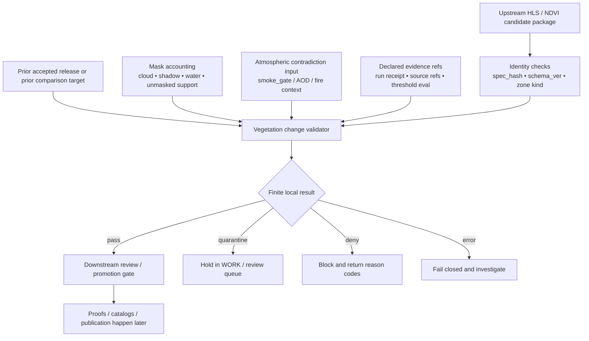

<!-- [KFM_META_BLOCK_V2]
doc_id: kfm://doc/NEEDS-VERIFICATION
title: tools/validators/vegetation_change
type: standard
version: v1
status: draft
owners: @bartytime4life
created: NEEDS-VERIFICATION__YYYY-MM-DD
updated: 2026-04-15
policy_label: public
related: [../README.md, ../promotion_gate/README.md, ../../diff/README.md, ../../air_quality/smoke_gate/README.md, ../../../pipelines/hls-ndvi/README.md, ../../../data/registry/README.md, ../../../data/receipts/README.md, ../../../data/proofs/README.md, ../../../data/catalog/stac/README.md, ../../../data/catalog/dcat/README.md, ../../../data/catalog/prov/README.md, ../../../policy/README.md, ../../../docs/operations/emit-only-watchers/SCHEMA_STUBS.md, ../../../.github/PULL_REQUEST_TEMPLATE.md, ../../../.github/CODEOWNERS]
tags: [kfm, validators, vegetation-change, hls, ndvi, receipts, evidence-bundle, decision-envelope]
notes: [Revised from the existing validator README baseline. Current public inventory, executable entrypoints, fixtures, schema files, CI callers, and exact upstream/downstream path parity remain reviewable on active branch.]
[/KFM_META_BLOCK_V2] -->

<a id="top"></a>

# `tools/validators/vegetation_change/`

Fail-closed validation helpers for HLS/NDVI-derived vegetation-change candidates, mask-aware comparison outputs, and promotion-ready review signals.

> [!NOTE]
> **Status:** `experimental`  
> **Owners:** `@bartytime4life`  
> **Path:** `tools/validators/vegetation_change/README.md`  
> 
> 
> 
> 
> 
>   
> **Quick jumps:** [Scope](#scope) · [Repo fit](#repo-fit) · [Accepted inputs](#accepted-inputs) · [Exclusions](#exclusions) · [Current public snapshot](#current-public-snapshot) · [Directory tree](#directory-tree) · [Quickstart](#quickstart) · [Usage](#usage) · [Diagram](#diagram) · [Validation surface](#validation-surface) · [Output posture](#output-posture) · [Task list](#task-list--definition-of-done) · [FAQ](#faq) · [Appendix](#appendix)

> [!IMPORTANT]
> Current public `main` is described in the baseline document as proving that `tools/validators/vegetation_change/` exists and that its checked-in inventory is `README.md` only. This file therefore does two jobs at once: it replaces an empty placeholder with a real lane contract, and it defines the narrowest credible thin slice for future executable validation.

> [!WARNING]
> Vegetation change is not a single blunt threshold. This lane should keep **source role**, **mask burden**, **atmospheric contradiction**, **zone support**, and **review linkage** explicit rather than flattening them into an unreviewable “change score.”

> [!TIP]
> Keep the trust split visible here:
>
> **receipt ≠ proof ≠ catalog ≠ publication**
>
> Validate here, decide later, promote elsewhere, publish downstream.

| Field | Value |
|---|---|
| Path | `tools/validators/vegetation_change/` |
| Role | `identity checks → support checks → contradiction checks → finite validator result → downstream review handoff` |
| Posture | `fail-closed · deterministic · review-first · validator is not publisher` |
| Typical subject | County- or HUC12-scale vegetation-change candidate package |
| Core burden | Review readiness for aggregated HLS/NDVI candidate outputs |
| Current public posture | Contract-first lane; deeper executable inventory remains **NEEDS VERIFICATION** |

---

## Scope

`tools/validators/vegetation_change/` is the narrow validator lane for answering one question:

> **Is this vegetation-change candidate package fit to move into downstream review and promotion, without bluffing about certainty?**

In practice, that means this directory should stay focused on **public-safe aggregated** vegetation-change candidates that have already been prepared upstream, typically as county- or HUC12-scale summaries rather than raw scene processing or parcel-scale interpretation.

### What this validator should check

- candidate identity is deterministic and replayable
- observed window and baseline window are explicit
- mask accounting is visible and reviewable
- spatial support is sufficient for the claimed zone summaries
- atmospheric contradiction is explicit, not implied
- materiality is declared against a prior baseline or prior accepted release
- evidence links and receipt handoff are present for downstream trust surfaces
- output remains finite, conservative, and fail-closed

### What this validator should not become

- a raw HLS discovery or ETL lane
- a smoke or aerosol science engine
- a policy-authoring surface
- a publishing shortcut
- a notebook-shaped “maybe this changed” sandbox

### Operating posture

| Posture | Meaning here |
|---|---|
| **CONFIRMED** | KFM already treats HLS/VI-based vegetation change as a viable connector path, but broader packaging remains staged. |
| **INFERRED** | A dedicated validator fits naturally between an upstream HLS/NDVI lane and downstream promotion/publication lanes. |
| **PROPOSED** | Exact entrypoints, fixture names, report filenames, reason-code registry, and CLI wiring below. |
| **UNKNOWN / NEEDS VERIFICATION** | Mounted executable inventory, schema files, CI callers, and branch-specific runtime maturity. |

This lane is **adjacent** to KFM’s environmental and EO context work. It should borrow KFM’s hydrology-first discipline, not displace it.

[Back to top](#top)

---

## Repo fit

Use this lane to validate **review readiness** for vegetation-change candidates.

Do **not** use it to own HLS transform logic, smoke-model generation, schema authority, policy authority, signing, catalog publication, or release promotion.

| Relation | Surface | Status | Why it matters |
|---|---|---|---|
| Parent lane | [`../README.md`](../README.md) | **CONFIRMED baseline reference** | Sets the family posture for `tools/validators/`: fail-closed, deterministic, inspectable helpers. |
| Upstream execution lane | [`../../../pipelines/hls-ndvi/README.md`](../../../pipelines/hls-ndvi/README.md) | **CONFIRMED baseline reference / path parity NEEDS VERIFICATION** | Principal checked-in doc named in the baseline for HLS/NDVI county- and HUC12-scale vegetation summaries. |
| Upstream watcher analogue | [`../../../pipelines/wbd-huc12-watcher/README.md`](../../../pipelines/wbd-huc12-watcher/README.md) | **CONFIRMED baseline reference / path parity NEEDS VERIFICATION** | Pattern for watcher receipts, public-safe aggregation, and proof-object handoff. |
| Adjacent atmospheric gate | [`../../air_quality/smoke_gate/README.md`](../../air_quality/smoke_gate/README.md) | **CONFIRMED baseline reference / path parity NEEDS VERIFICATION** | Smoke and air contradiction should arrive as an explicit gate result, not a hidden assumption. |
| Adjacent diff surface | [`../../diff/README.md`](../../diff/README.md) | **CONFIRMED baseline reference** | Deterministic previous/current comparison belongs in `tools/diff`, not inside ad hoc validator logic. |
| Shared watcher object stubs | [`../../../docs/operations/emit-only-watchers/SCHEMA_STUBS.md`](../../../docs/operations/emit-only-watchers/SCHEMA_STUBS.md) | **CONFIRMED baseline reference** | Plausible starter shapes for `ThresholdEvaluation`, `EvidenceBundle`, and `DecisionEnvelope`. |
| Source admission context | [`../../../data/registry/README.md`](../../../data/registry/README.md) | **CONFIRMED baseline reference** | Source role, cadence, rights, and validation intent should be declared upstream. |
| Shared policy boundary | [`../../../policy/README.md`](../../../policy/README.md) | **CONFIRMED baseline reference** | Policy authority stays in `policy/`, not here. |
| Downstream promotion gate | [`../promotion_gate/README.md`](../promotion_gate/README.md) | **CONFIRMED baseline reference** | Promotion decides release readiness later and under stronger burden. |
| Downstream receipts | [`../../../data/receipts/README.md`](../../../data/receipts/README.md) | **CONFIRMED baseline reference** | Receipts are process memory and handoff evidence, not sovereign truth. |
| Downstream proofs | [`../../../data/proofs/README.md`](../../../data/proofs/README.md) | **CONFIRMED baseline reference** | Proofs are release-bearing trust objects. |
| Downstream catalog triplet | [`../../../data/catalog/stac/README.md`](../../../data/catalog/stac/README.md) · [`../../../data/catalog/dcat/README.md`](../../../data/catalog/dcat/README.md) · [`../../../data/catalog/prov/README.md`](../../../data/catalog/prov/README.md) | **CONFIRMED baseline reference** | Catalog closure happens after validation and promotion, not inside this lane. |
| Review discipline | [`../../../.github/PULL_REQUEST_TEMPLATE.md`](../../../.github/PULL_REQUEST_TEMPLATE.md) | **CONFIRMED baseline reference** | Keep truth labels explicit and avoid smoothing over evidence gaps. |
| Ownership fallback | [`../../../.github/CODEOWNERS`](../../../.github/CODEOWNERS) | **CONFIRMED baseline reference / active-branch parity NEEDS VERIFICATION** | Current public ownership fallback for `/tools/` routes broadly to `@bartytime4life`. |

### Boundary rule

This validator should remain a **read-only, finite-outcome helper** over already-prepared candidate packages.

It should not:

- own HLS transform logic
- own smoke-model or atmospheric model generation
- own schema authority
- own policy authority
- sign artifacts
- publish STAC/DCAT/PROV records
- merge or promote releases
- bypass neighboring lanes because “the data looks fine”

[Back to top](#top)

---

## Accepted inputs

These are the kinds of inputs that belong here when they are declared, deterministic, and reviewable.

| Input surface | Why it belongs here | Status |
|---|---|---|
| HLS/NDVI candidate batch or zonal summary manifest | Primary subject of validation. | **INFERRED** |
| County or HUC12 zone references | Keeps claims public-safe and spatially bounded. | **INFERRED** |
| Observed window + baseline/reference window | Prevents silent time drift and makes comparison legible. | **INFERRED** |
| Canonicalized candidate rows + deterministic `spec_hash` | Supports replayable identity and downstream trust linkage. | **CONFIRMED doctrine** |
| `schema_ver` or equivalent declared contract version | Keeps validator behavior tied to declared shape, not guesswork. | **INFERRED** |
| Mask accounting summary | Required for cloud, shadow, water, unmasked support, and reviewer confidence. | **INFERRED** |
| Atmospheric contradiction result | Lets vegetation claims account for smoke/aerosol contamination explicitly. | **INFERRED / PROPOSED** |
| Threshold or materiality summary | Makes “changed enough to review” inspectable instead of free-text. | **PROPOSED** |
| `evidence_refs` | Connects candidate to upstream source and supporting objects. | **CONFIRMED doctrine** |
| `run_receipt_ref` | Connects process memory to validator output without pretending publication. | **CONFIRMED doctrine** |
| Optional prior accepted release or prior bundle ref | Enables deterministic comparison and diff review. | **INFERRED** |

### Accepted subject matter

- county-scale vegetation summaries
- HUC12-scale vegetation summaries
- mask-aware NDVI delta summaries
- atmospheric contradiction-aware review packages
- pre-promotion validator reports
- finite reason codes for quarantine/deny/error outcomes

### Good first-wave candidate shape

A good first-wave subject is a **review packet**, not a raw image stack:

1. one zone family (`county` **or** `huc12`)
2. one observed window
3. one baseline window
4. one deterministic `spec_hash`
5. one mask accounting summary
6. one explicit atmospheric context result
7. one prior-comparison target, if materiality is claimed
8. one receipt/evidence handoff bundle

[Back to top](#top)

---

## Exclusions

The following do **not** belong in this directory as the normal path:

- raw HLS scene discovery or download
- atmospheric model generation
- pixel-level experimentation notebooks
- free-form browser-side zonal analytics
- parcel-level or exact-point sensitive disclosures
- publication or promotion actions
- attestation and Rekor verification
- policy writing or policy bundle ownership
- contract-schema ownership
- narrative generation, story assembly, or final interpretive claims
- silent repair of malformed candidates

When one of those burdens dominates the work, route it to the lane that already owns it.

[Back to top](#top)

---

## Current public snapshot

This section is intentionally narrow: it describes what the baseline document clearly claims about the current public surface, not what a working private branch might contain.

| Evidence item | Status | How this README uses it |
|---|---|---|
| `tools/validators/vegetation_change/` exists | **CONFIRMED** | The target lane is real and linkable. |
| Current directory inventory is `README.md` only | **CONFIRMED** | This remains a contract-first lane on public `main`. |
| Checked-in `README.md` was an empty placeholder | **CONFIRMED** | Full replacement is justified. |
| `tools/validators/README.md` is substantive | **CONFIRMED** | This README inherits its family posture. |
| Sibling validator docs exist | **CONFIRMED** | Local structure and presentation are aligned to nearby validator docs. |
| `pipelines/hls-ndvi/README.md` exists | **CONFIRMED** | Used as the named upstream execution-lane reference in the baseline. |
| Parts of the HLS/NDVI lane describe themselves as mixed maturity | **CONFIRMED doc / NEEDS VERIFICATION runtime** | Upstream link is used carefully, without overclaiming executable depth. |
| `tools/air_quality/smoke_gate/README.md` exists | **CONFIRMED** | Used as the adjacent atmospheric contradiction pattern. |
| Deeper executable files, schemas, fixtures, and CI callers under this directory | **NEEDS VERIFICATION** | All such specifics below stay clearly proposed. |

[Back to top](#top)

---

## Directory tree

### Current public inventory

```text
tools/validators/vegetation_change/
└── README.md
```

### Proposed starter shape

```text
tools/validators/vegetation_change/
├── README.md
├── validate.py                  # illustrative entrypoint
├── validate_identity.py         # spec_hash, schema_ver, zone-kind, source refs
├── validate_masks.py            # cloud/shadow/water/unmasked support checks
├── validate_atmosphere.py       # smoke/aerosol contradiction checks
├── validate_materiality.py      # prior-vs-current deterministic comparison
├── fixtures/
│   ├── pass/
│   ├── quarantine/
│   ├── deny/
│   └── error/
└── reports/
    └── README.md
```

> [!NOTE]
> The tree above is **PROPOSED**. It is intentionally small. One narrow entrypoint plus a few focused helper modules is more KFM-aligned than a sprawling “environmental AI” toolbox.

[Back to top](#top)

---

## Quickstart

Start with inspection, not invention.

### 1) Read the family posture

```bash
sed -n '1,240p' tools/validators/README.md
sed -n '1,260p' tools/validators/promotion_gate/README.md
sed -n '1,260p' tools/validators/soil_moisture/README.md
```

### 2) Read the subject-adjacent lanes

```bash
sed -n '1,280p' pipelines/hls-ndvi/README.md
sed -n '1,260p' tools/air_quality/smoke_gate/README.md
sed -n '1,240p' tools/diff/README.md
sed -n '1,240p' docs/operations/emit-only-watchers/SCHEMA_STUBS.md
```

### 3) Read the downstream trust split

```bash
sed -n '1,220p' data/receipts/README.md
sed -n '1,220p' data/proofs/README.md
sed -n '1,220p' data/catalog/stac/README.md
sed -n '1,220p' data/registry/README.md
```

### 4) Search for current terms before adding new ones

```bash
git grep -n "spec_hash\|DecisionEnvelope\|EvidenceBundle\|ThresholdEvaluation\|vegetation\|ndvi\|hls" -- \
  tools pipelines data docs policy tests .github || true
```

### 5) Build the smallest credible validator slice

A good first executable slice is:

1. parse one county- or HUC12-scale candidate package
2. validate identity and `spec_hash`
3. validate mask accounting
4. require explicit atmosphere context or explicit absence reason
5. emit one machine-readable validator report
6. stop there

[Back to top](#top)

---

## Usage

Reach for this lane **after** upstream candidate preparation and **before** downstream promotion.

### Use this validator when

- the candidate is already normalized
- the claim is aggregated and public-safe
- a reviewer needs explicit support accounting
- atmospheric contradiction could materially change confidence
- downstream promotion should not shoulder basic structural triage

### Do not use this validator when

- the main burden is ingesting raw scenes
- the main burden is computing smoke or aerosol products
- the main burden is publishing, signing, or release closure
- the main burden is narrative interpretation

### Lane-local result set

To keep validator behavior finite and reviewable, use a narrow local result set.

| Result | Meaning | Downstream implication |
|---|---|---|
| `pass` | Candidate is structurally valid and ready for downstream review. | May continue into stronger review or promotion. |
| `quarantine` | Candidate is incomplete, atmospherically compromised, weakly supported, or missing declared linkage. | Hold in work/review; do not silently advance. |
| `deny` | Candidate violates a declared invariant or explicit rule. | Block advancement until corrected. |
| `error` | Validator could not determine validity because input or execution failed. | Fail closed and investigate. |

> [!IMPORTANT]
> If this validator is checking a downstream `DecisionEnvelope`, keep that object’s own outcome grammar separate. The validator’s local result (`pass/quarantine/deny/error`) is **not** the same thing as a runtime or publication outcome such as `ANSWER/ABSTAIN/DENY/ERROR`.

### Illustrative invocation

```bash
python tools/validators/vegetation_change/validate.py \
  --candidate data/work/hls-ndvi/candidate.json \
  --prior data/work/hls-ndvi/prior_release.json \
  --atmosphere data/work/air/smoke_gate.json \
  --out data/work/hls-ndvi/validator_report.json
```

### Illustrative report shape

```json
{
  "validator": "vegetation_change",
  "result": "quarantine",
  "spec_hash": "sha256:REPLACE_ME",
  "schema_ver": "v1",
  "zone_kind": "huc12",
  "observed_window": "2026-07-01/2026-07-16",
  "baseline_window": "2021-07-01/2025-07-16 seasonal baseline",
  "support_summary": {
    "zones_total": 78,
    "zones_with_change_signal": 11,
    "zones_below_unmasked_support_floor": 3
  },
  "mask_accounting": {
    "cloud_px": 10234,
    "shadow_px": 3891,
    "water_px": 1822,
    "unmasked_px": 88412
  },
  "atmosphere": {
    "status": "compromised",
    "source": "smoke_gate",
    "reason_codes": ["aod_high", "viirs_fire_nearby"]
  },
  "threshold_evaluation_ref": "data/work/hls-ndvi/threshold_eval.json",
  "evidence_refs": [
    "registry://source/hls",
    "receipt://run/2026-07-16T18-00-00Z"
  ],
  "run_receipt_ref": "receipt://run/2026-07-16T18-00-00Z",
  "next_action": "hold_for_review"
}
```

[Back to top](#top)

---

## Diagram



[Back to top](#top)

---

## Validation surface

A narrow validator becomes useful when its checks are visible and unsurprising.

| Check family | Typical checks | Blocking examples | Usual result |
|---|---|---|---|
| **Identity & contract** | parse input, require declared zone kind, require deterministic `spec_hash`, require declared version | malformed JSON, missing `spec_hash`, missing contract version | `deny` or `error` |
| **Temporal clarity** | require observed window, baseline/reference window, and explicit comparison intent | no baseline, mixed windows, silent time drift | `quarantine` or `deny` |
| **Zone support** | require county/HUC12 references, count records, detect missing zone keys | claimed county summary without county keys, duplicated zone ids | `deny` |
| **Mask accounting** | require cloud/shadow/water/unmasked support totals and support floor | changed claim with no unmasked support summary | `quarantine` |
| **Atmospheric contradiction** | require explicit smoke/aerosol contradiction result or explicit not-applicable declaration | atmosphere-sensitive run with no contradiction accounting | `quarantine` |
| **Materiality & diff** | compare prior/current totals, support declared threshold summary, keep diff deterministic | large claimed delta with no prior reference or no threshold object | `quarantine` |
| **Trust linkage** | require `evidence_refs`, `run_receipt_ref`, and stable handoff ids | report with no source refs or receipt trail | `quarantine` |
| **Finite output discipline** | emit local result and reason codes only; no silent success path | free-text “looks okay” result, direct publish side effect | `error` |

### Review rule of thumb

A vegetation-change candidate should **not** move forward merely because it contains a non-zero NDVI delta.

It should move forward only when:

- the time comparison is declared
- masks are declared
- support is declared
- atmosphere context is declared
- evidence linkage is declared
- the result is finite and reproducible

[Back to top](#top)

---

## Output posture

This lane should emit **review objects**, not **publication objects**.

| Object | Allowed here? | Why |
|---|---:|---|
| Validator report | ✅ | Core output of this lane. |
| Reason codes | ✅ | Keep failure semantics machine-readable. |
| Support summary | ✅ | Lets reviewers see whether claims are adequately supported. |
| Materiality summary | ✅ | Makes “changed enough to care” explicit. |
| `run_receipt_ref` | ✅ | Links back to process memory. |
| `evidence_refs` | ✅ | Links back to source and upstream trust objects. |
| `DecisionEnvelope` reference check | ✅ | Fine when validating a downstream object already produced elsewhere. |
| STAC/DCAT/PROV publication | ❌ | Belongs downstream after stronger gates. |
| Attestation bundle generation | ❌ | Belongs in proof/promotion lanes. |
| Policy bundle ownership | ❌ | Belongs in `policy/`. |
| Direct publish / merge action | ❌ | Not a validator responsibility. |

> [!NOTE]
> A validator report may **reference** downstream objects. It should not silently create them as if validation itself were release.

[Back to top](#top)

---

## Task list — definition of done

Use this as the thin-slice definition of done.

- [x] Replace the empty placeholder with a real lane contract.
- [x] Keep the lane consistent with the surrounding `tools/validators/` family.
- [x] Preserve the KFM split between receipts, proofs, catalogs, and publication.
- [x] Define accepted inputs and exclusions clearly.
- [x] Add one meaningful Mermaid diagram.
- [x] Add a current public snapshot so maintainers can see what is confirmed now.
- [ ] Add one executable entrypoint.
- [ ] Add one `pass` fixture.
- [ ] Add one `quarantine` fixture for atmospherically compromised support.
- [ ] Add one `deny` fixture for malformed identity or missing `spec_hash`.
- [ ] Add one `error` fixture for parse/runtime failure.
- [ ] Define lane-local reason codes and JSON report schema.
- [ ] Prove one caller path from upstream candidate package into this validator.
- [ ] Prove one handoff path from validator report into downstream promotion review.
- [ ] Add tests that replay the same input to the same result deterministically.

[Back to top](#top)

---

## FAQ

### Why is this a validator instead of part of `pipelines/hls-ndvi/`?

Because preparation and validation are different burdens. The upstream lane prepares candidate outputs; this lane asks whether those outputs are structurally honest and review-ready.

### Why require atmosphere context at all?

Because vegetation signals can be visually persuasive while still being atmospherically compromised. KFM’s trust posture gets weaker, not stronger, when that burden is hidden.

### Why county or HUC12 first?

Because KFM repeatedly favors public-safe, reviewable, aggregated surfaces before more sensitive or more speculative forms. County and HUC12 summaries are easier to inspect and govern than parcel-scale claims.

### Can this lane publish STAC items?

No. It can prepare a report that helps later lanes decide whether publication should happen, but publication belongs downstream.

### Why separate `pass/quarantine/deny/error` from `ANSWER/ABSTAIN/DENY/ERROR`?

Because a validator’s local result is about **review readiness**, while a runtime or publication envelope is about a **governed decision surface**. Collapsing those grammars too early makes review harder, not easier.

[Back to top](#top)

---

## Appendix

<details>
<summary><strong>Illustrative starter reason codes</strong></summary>

These are intentionally **PROPOSED** starter codes, not asserted mounted contracts.

| Code | Meaning |
|---|---|
| `missing_spec_hash` | Candidate lacks deterministic identity. |
| `missing_schema_ver` | Candidate does not declare its expected shape/version. |
| `missing_zone_kind` | County/HUC12 support is not declared. |
| `missing_zone_refs` | Claimed zonal output has no stable zone keys. |
| `baseline_window_undefined` | Comparison exists without a declared baseline/reference window. |
| `insufficient_unmasked_support` | Zone support falls below declared or implied floor. |
| `mask_accounting_missing` | Cloud/shadow/water/unmasked totals are absent. |
| `atmosphere_context_absent` | Smoke/aerosol contradiction burden is required but missing. |
| `smoke_gate_unstable` | Adjacent atmosphere gate cannot provide stable support. |
| `materiality_unreviewable` | Claimed change has no prior-comparison or threshold support. |
| `evidence_refs_missing` | Candidate has no declared evidence linkage. |
| `run_receipt_ref_missing` | Process-memory handoff is absent. |
| `validator_parse_error` | Validator could not parse the candidate. |
| `validator_runtime_error` | Validator execution failed before finite determination. |

</details>

<details>
<summary><strong>Illustrative contract touchpoints</strong></summary>

These are the nearby object families this lane should align to rather than redefining:

- `ThresholdEvaluation`
- `EvidenceRef`
- `EvidenceBundle`
- `DecisionEnvelope`
- `CorrectionNotice`

Where those objects already exist elsewhere, this validator should validate against them or reference them, not fork them.

</details>

[Back to top](#top)
