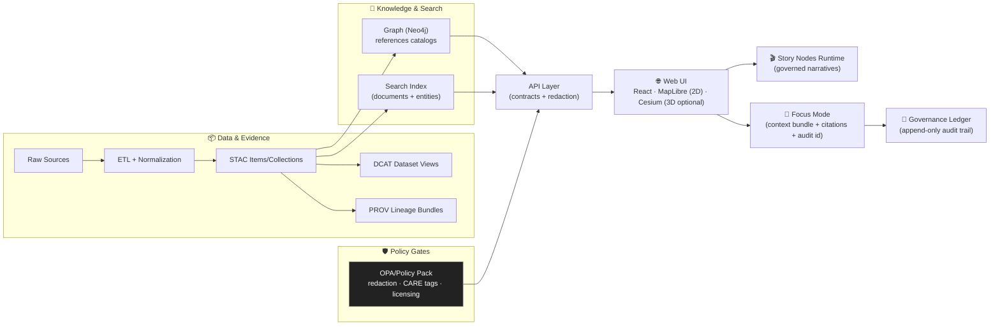

# 🌾 Kansas Frontier Matrix — Web UI (`web/`)

> **KFM Web** is the user-facing interface for exploring Kansas (and eventually other regions) as **maps + timelines + evidence + narratives**, with optional **Focus Mode (AI)** that is **opt-in**, **citation-backed**, and **policy-gated**.

**This README is a contract**: what the UI must do ✅, what it must never do 🚫, and how it stays aligned with KFM’s provenance-first + governance-first architecture.

---

## 🧭 Quick Links

- 📘 **Master Guide (v13 draft):** `../docs/MASTER_GUIDE_v13.md`
- 🧱 **Redesign Blueprint (v13):** `../docs/architecture/KFM_REDESIGN_BLUEPRINT_v13.md`
- 🧬 **Architecture (system-wide):** `../docs/architecture/`
- 🧭 **AI System Architecture:** `../docs/architecture/ai-system-architecture.md`
- ⚖️ **Governance:** `../docs/governance/`
- 🧩 **Policy Pack / Gates:** `../api/scripts/policy/`
- 🎬 **Story Nodes (canonical home):** `../docs/reports/story_nodes/`
- 🗺️ **Data catalogs:** `../data/stac/`, `../data/catalog/dcat/`, `../data/prov/`

<details>
<summary><strong>🧱 Recommended docs layout (to avoid drift)</strong></summary>

- `docs/architecture/` → system architecture, contracts, blueprints  
- `docs/reports/story_nodes/` → governed narrative content (draft/published)  
- `web/` → UI code only (no “mystery data” bundled into the client)  
- `data/` → catalogs + evidence (STAC/DCAT/PROV) and validated assets  

</details>

---

## 🧠 UI Pillars (v13)

### 1) 🗺️ Map-first exploration
- 2D map view **always available**
- Optional 3D view (terrain / 3D Tiles) when it adds value
- Layer catalog (toggle / style / opacity / attribution)
- Timeline slider for temporal navigation (range + play)
- Feature inspection + metadata + provenance drill-down

### 2) 🔎 Evidence-first trust
- Every visualization traces back to **cataloged evidence**
- Users can always open “the map behind the map” (source, license, lineage)
- Exports and shares preserve attribution + provenance links

### 3) 🎬 Narrative-first learning (Story Nodes)
- Guided, step-based narratives synced with map state + time
- Stories are **governed content**, versioned and reviewable
- Citations are visible and clickable inside stories

### 4) 🧠 Safe AI assistance (Focus Mode)
- **Opt-in** only (never auto-appears)
- Always labeled “AI-generated”
- **Citations required**, clickable to underlying evidence
- **Policy-gated** (redaction + sensitive-data protections)
- “Why am I seeing this?” disclosure (datasets used + redactions applied)

---

## 🚫 Non‑Negotiables (Read This First)

### 1) Contract-first + provenance-first ✅
If it shows up in the UI, it must be:
- discoverable through the API (contracted),
- traceable to **STAC/DCAT/PROV** (provable),
- licensed/attributed (reusable),
- classification-aware (safe to show at this zoom/detail level).

> No “mystery layers.” No hidden local data files bundled into the client.

### 2) The UI is a **client** — not a data backdoor 🚪
The UI **never**:
- queries Neo4j directly,
- reads raw datasets directly,
- embeds hidden datasets to “shortcut” the pipeline.

### 3) Story state must be reproducible 🔁
- Story Nodes are deterministic: the same story + same version → same map/time behavior
- Any “generated” view (share/export) carries enough metadata to reproduce later
- Any output meant for public trust must be reviewable

### 4) Focus Mode is advisory, transparent, governed 🧭
- AI output is **not** official truth  
- It is a **cited synthesis** (and it can refuse when data is missing or sensitive)
- AI output is **logged/auditable** where required (governance ledger pattern)

---

## 🏗️ System Flow (UI in the pipeline)



---

## 🧭 Information Architecture (What users see)

### 🗺️ Core screens
- **Map Explorer** (default): map + layers + timeline + inspector
- **Catalog**: dataset discovery (facets + filters + licensing + sensitivity)
- **Story**: Story Nodes runtime (step-based narrative)
- **Evidence**: provenance + lineage views (per layer / per feature / per claim)
- **Settings**: accessibility, performance mode, AI opt-in/out, privacy

### 🔁 One shared state model (critical)
Everything in KFM Web should be representable as a serializable “view state”:
- map camera (2D or 3D)
- active layers + styles + opacity
- timeline range + playhead (and/or story step index)
- filters (space/time/category/sensitivity)
- selected feature(s)
- focus context scope (if Focus Mode is enabled)

**Why:** deep links, share URLs, and Story Nodes require deterministic, reproducible UI state.

---

## 🗂️ What Lives in `web/`

This folder is the **single source of truth** for the user-facing web app code (excluding governed narrative content). Recommended structure:

```text
web/
├─ 📄 README.md
├─ 🧩 components/           # reusable UI components (buttons, panels, legends, charts)
├─ 🧭 views/                # page-level screens (MapPage, CatalogPage, StoryPage, EvidencePage)
├─ 🗺️ viewers/              # map viewers (MapLibre 2D, Cesium 3D) + shared map state adapters
├─ 🧠 focus_mode/           # UI-only: chat panel, citations renderer, disclosure UI, audit link UI
├─ 🔌 services/             # API clients, caching, schema validation, auth helpers
├─ 🧪 __tests__/            # UI tests (unit/integration)
├─ 🧵 workers/              # Web Workers for parsing/compute-heavy tasks (optional)
├─ 🖼️ assets/               # icons, images, fonts
├─ 🎨 styles/               # global styles, design tokens, accessibility helpers
└─ ⚠️ story_nodes/          # legacy/local story assets (see canonical home below)
```

> **v13 canonical home for Story Nodes:** `../docs/reports/story_nodes/{draft|published}/...`  
> The UI may **load** Story Nodes via API/build-time ingestion, but governed content should not drift into multiple homes.

---

## 🔌 UI ↔ API Contracts (What the web app expects)

> The web app lives and dies by contracts. If a UI feature can’t be expressed as an API contract, it’s not ready to ship.

### Required contract categories
- **Catalog:** dataset listing + facets (DCAT view + KFM extensions)
- **STAC:** items/collections retrieval + links to assets
- **Tiles/Distributions:** vector tiles, rasters, 3D Tiles, and downloads
- **Feature Query:** by bbox, id, and time range
- **Graph Views:** related entities + events + documents (via API, not Neo4j direct)
- **Search:** place search, dataset search, story search, (optional) document/entity search
- **Story Nodes:** list/get story content (draft vs published)
- **Focus Mode:** query endpoint returns:
  - answer (markdown/text),
  - citations list (resolvable),
  - datasets used + redactions applied,
  - optional confidence/uncertainty signal,
  - audit id (where governance requires it)
- **Real-time (optional):** polling endpoints and/or WebSockets for live feeds

### UI-side validation (strongly recommended)
- Validate API responses against JSON Schema (or equivalent)
- Fail “loudly” for contract breaks (with a safe UX message) instead of silently rendering junk

---

## 🗺️ Map UI Design Notes

### 2D + 3D viewers (shared state)
- **MapLibre GL JS** for 2D interactive mapping 🗺️  
- **CesiumJS** for optional 3D globe/terrain 🌍  
- 2D ↔ 3D toggling should preserve:
  - camera intent (position/zoom/heading),
  - active layers (where equivalents exist),
  - timeline state.

> 3D is for terrain, structures, and 3D Tiles — not “because it’s cool.” Keep 2D always usable.

### Timeline & temporal navigation ⏳
- Timeline supports:
  - **range** (start/end),
  - **playhead** (for animation),
  - event markers (from graph) where available.
- Layers can declare temporal validity:
  - UI should signal when a layer is out-of-range and handle gracefully.

### Layer management, legends, and “map behind the map” 🧾
Baseline controls:
- Layer catalog panel (grouped by theme/category)
- Toggle on/off + opacity
- Style selection (when multiple styles exist)
- Legend auto-renders based on layer metadata
- Layer info dialog includes:
  - source org
  - license/attribution
  - STAC/DCAT/PROV links
  - sensitivity/classification tags
  - “prepared by / processed on” where available

**Roadmap:** a **Layer Provenance Panel** that lists *all active layers* with citations and metadata, updating in real time as layers toggle.

### Feature inspection panel 🔎
When a user clicks a map feature:
- show properties + units
- show provenance links
- show related graph entities/events/documents (via API)
- show quality indicators if available (uncertainty, completeness)
- optionally show mini-charts (e.g., county population over time)

---

## 📤 Share / Export (trust-preserving outputs)

When users share a view, export a report, or snapshot a story step:
- include attribution automatically (sources + KFM processing note)
- include stable evidence links (STAC/DCAT/PROV)
- if AI text is included:
  - keep the “AI-generated” label
  - preserve citations
  - include audit id if policy requires

---

## 🎬 Story Nodes (Interactive Narratives)

Story Nodes are “machine-ingestible storytelling”:
- authored in **Markdown** (narrative, images, citations)
- paired with **JSON config** (map steps: camera, layers, timeline, highlights)

### Story runtime expectations
- Steps advance via next/prev controls (optionally scroll-driven)
- Each step can:
  - activate/deactivate layers
  - set camera position/zoom (2D/3D compatible when possible)
  - jump timeline to a time range
  - highlight features or regions (with safe styling)
  - attach citations and “source cards” to claims

### Authoring workflow (v13)
- Drafts live at: `../docs/reports/story_nodes/draft/`
- Published stories live at: `../docs/reports/story_nodes/published/`
- Stories are versioned + reviewed
- Citations/provenance are required for publish

### Story Builder GUI (planned 🧰)
To lower friction for educators and non-technical contributors:
- a future “Story Builder” lets authors set story steps by interacting with the map/timeline UI
- it generates the JSON + Markdown under the hood
- it enforces schema + citation requirements

> Until Story Builder exists: templates + examples + strict review gates.

---

## 🧠 Focus Mode (AI) UX Contract — Hard Gate

Focus Mode is a **policy-gated assistant**, not a magic oracle.

### The rules
- **Opt-in:** never displayed by default
- **Clearly labeled:** always marked “AI-generated”
- **Citations + traceability:** every claim must link back to KFM evidence
- **No speculation:** if KFM doesn’t have the data, the assistant must say so
- **No sensitive leaks:** automatically generalize/omit sensitive locations (prevent side-channels)
- **Context-aware:** scoped to selected features/layers/time range when requested

### Required UI behaviors
- A dedicated **Evidence** area for citations (click → open evidence record)
- A visible **uncertainty indicator** (even if coarse)
- A “Why am I seeing this?” disclosure panel:
  - datasets used
  - time range used
  - redactions applied
  - model/version info (when appropriate)
- Clear “report an issue” / feedback affordance for governance learning

### Explainable AI (GeoXAI) — roadmap 🧭
Where feasible, add UI affordances like:
- “Which layers influenced this answer?” overlays
- link-outs to dataset cards + provenance
- “Reasoning trace” as *evidence trace*, not chain-of-thought

---

## 🤝 Collaboration & Community (current + planned)

### Current contribution model
- Contributions happen via GitHub PRs (data, stories, fixes)
- The UI should make contribution paths obvious:
  - “Contribute data”
  - “Suggest a story”
  - “Report an issue”
  - “Code of Conduct”

### Planned collaboration features
- annotations/comments on datasets and stories
- ratings/upvotes for community signal
- user accounts + role-based access (for draft/edit/moderation)
- eventual multi-user story collaboration (long-term)

> Collaboration must be coupled to moderation + auditability + classification.

---

## 📱 Mobile, Offline Packs, and Field Use

### Responsive design
- UI must remain usable on tablets/phones:
  - bigger touch targets
  - simplified layer controls
  - fast search + basic inspection
- complex workflows may remain desktop-first (explicitly)

### Offline packs (planned) 📦
Use cases:
- museum exhibits with weak connectivity
- field researchers / rural classrooms
- traveling “KFM in a box” installs

Concept:
- user selects a region + layers + story content
- downloads an **offline bundle** (tiles + metadata + mini app)
- bundle may include:
  - PMTiles/MBTiles
  - cached story content + citations
  - limited feature query for offline browsing

### AR integration (experimental) 🧿
- AR is prioritized over VR
- AR client is “just another KFM API consumer”
- **must** respect sensitivity (no sacred sites / restricted detail leaks)

---

## 📊 Future Extensions: Dashboards, Live Data & Simulations

KFM UI is designed to grow into:
- **Real-time sensor dashboards** (e.g., river gauges, transit feeds)
- **Live map layers** (points/alerts updating on a cadence)
- **Simulation result viewers** (scenario visualization; “model projection” labels)
- Remote sensing time-series workflows (e.g., NDVI trends tied to timeline)

> Rule: model outputs are labeled as **models**, not facts, and stay evidence-linked.

---

## 🚀 Local Development

> Toolchain-agnostic. Confirm exact scripts in `web/package.json` (or monorepo runner).

### Prereqs
- Node.js (LTS recommended)
- A running KFM API (REST + optional GraphQL)
- Optional: tile/asset service (vector/raster/3D Tiles)
- Optional: auth provider (if accounts/moderation enabled)

### Typical commands
```bash
cd web
npm install
npm run dev
```

### Build
```bash
npm run build
npm run preview
```

### Recommended `.env` interface
Create `web/.env.local` (or equivalent) using this shape:

```dotenv
# Core APIs
KFM_API_BASE_URL=http://localhost:8000
KFM_GRAPHQL_URL=http://localhost:8000/graphql

# Optional: tiles & assets
KFM_TILE_BASE_URL=http://localhost:8000/tiles
KFM_ASSET_BASE_URL=http://localhost:8000/assets

# Feature flags (UI-only; server may enforce too)
KFM_ENABLE_3D=true
KFM_ENABLE_FOCUS_MODE=true
KFM_ENABLE_REALTIME=false
KFM_ENABLE_OFFLINE_PACKS=false
KFM_ENABLE_AR_EXPERIMENTS=false
```

---

## ✅ CI / Quality Gates (What your PR must pass)

KFM treats docs + data + UI as governed artifacts. Minimum gates typically include:

- ✅ Markdown protocol & YAML front-matter validation
- ✅ Link/reference validation (no broken internal refs)
- ✅ JSON Schema validation (STAC/DCAT/PROV, Story Node schemas, UI config schemas)
- ✅ UI unit/integration tests (critical paths: map render, layer toggle, inspect)
- ✅ A11y checks (keyboard + ARIA + contrast)
- ✅ Security scans (secrets, sensitive info leaks)
- ✅ Dependency hygiene (audit, updates)
- ✅ Release metadata (SBOM / provenance attestations where applicable)

> If you add a UI feature that references new data, you’re responsible for ensuring the upstream contracts exist and validate.

---

## ⚡ Performance Checklist (Front-end)

- Prefer **server paging** and “load more” over massive responses
- Cache responsibly (avoid stale evidence; respect versioning)
- Progressive loading for:
  - vector tiles
  - rasters
  - 3D tilesets
- Avoid expensive re-renders (memoize heavy layers; Web Workers for parsing)
- Measure p95/p99 UI latency for:
  - layer toggle
  - map move + tile fetch
  - feature click + metadata fetch
  - Story step transitions
  - Focus Mode response render (including citations)

---

## ♿ Accessibility Checklist

- Keyboard navigation for all controls
- Visible focus states
- ARIA labels for map controls + side panels
- High-contrast option
- Avoid color-only encoding (patterns/labels/legends must carry meaning)

---

## 🧱 Contribution Recipes

### 🗺️ Add a New Layer
> If a layer isn’t in STAC/DCAT/PROV and exposed via the API, it doesn’t exist (for UI purposes).

1) **Upstream verification**
- STAC item/collection exists  
- DCAT entry exists  
- PROV lineage exists  
- API exposes it with redaction rules

2) **UI wiring**
- Add entry to layer registry (id, type, sources, style)
- Add legend + attribution UI mapping
- Ensure sensitivity tags are honored (blur/generalize/hide)

3) **Story + Focus Mode integration**
- Ensure citations resolve to evidence records
- If dataset is sensitive, confirm Focus Mode can’t reveal restricted details

4) **Tests**
- Layer registry unit test
- “click feature → evidence panel shows provenance links” test
- Story step safe usage test (if story references it)

### 🎬 Add a Story Node
- Create draft story in `../docs/reports/story_nodes/draft/<story_id>/`
- Include:
  - `story.md` (narrative + citations)
  - `story.json` (steps + map state + timeline)
  - `assets/` if needed
- Validate against Story schema
- Submit PR → review → publish to `published/`

### 🧠 Add/Change Focus Mode UI
- Must keep:
  - opt-in gate
  - AI labeling
  - citations + evidence rendering
  - disclosure panel (datasets used + redactions)
  - safe fallback for refusals / missing data
- Add tests for:
  - “no citations → blocked UI render”
  - “sensitive dataset → generalized output + warning”
  - “audit id present → link renders”

---

## 📚 Project Library (Used to inform this UI)

<details>
<summary><strong>🏛️ KFM Core Design Docs</strong></summary>

- `Kansas Frontier Matrix – Comprehensive UI System Overview.pdf` 🧭 — end-to-end UI system design (2D/3D, timeline, story nodes, focus mode, offline, AR, dashboards)
- `Kansas Frontier Matrix (KFM) – Comprehensive Technical Documentation.pdf` 🧱 — implementation-oriented architecture + module breakdown
- `Kansas Frontier Matrix (KFM) – Comprehensive Architecture, Features, and Design.pdf` 🧬 — platform capabilities, UX patterns, security & supply chain, offline packs
- `Kansas Frontier Matrix (KFM) – AI System Overview 🧭🤖.pdf` 🧠 — Focus Mode + governance + explainability expectations
- `📚 Kansas Frontier Matrix (KFM) Data Intake – Technical & Design Guide.pdf` 📥 — evidence pipeline + streaming + policy gates
- `🌟 Kansas Frontier Matrix – Latest Ideas & Future Proposals.docx.pdf` ✨ — roadmap: story builder, “Kansas From Above”, GTFS-RT, bulk docs ingestion
- `Innovative Concepts to Evolve the Kansas Frontier Matrix (KFM).pdf` 💡 — R&D ideas: 4D digital twins, GeoXAI overlays, community validation

</details>

<details>
<summary><strong>🧰 Reference Packs (engineering + GIS + AI)</strong></summary>

- `AI Concepts & more.pdf` 🤖
- `Maps-GoogleMaps-VirtualWorlds-Archaeological-Computer Graphics-Geospatial-webgl.pdf` 🗺️🎮
- `Various programming langurages & resources 1.pdf` 🧑‍💻
- `Data Managment-Theories-Architures-Data Science-Baysian Methods-Some Programming Ideas.pdf` 🗄️📊

</details>

---

## 🧾 License & Attribution

KFM’s trust model depends on:
- showing license + attribution wherever data is displayed,
- preserving provenance links (STAC/DCAT/PROV),
- making citations clickable in Story Nodes and Focus Mode,
- ensuring exports/shares carry proper credit.

If you add or modify UI that changes *what is shown*, verify it doesn’t weaken:
- traceability 🔗
- sensitivity protections 🫥
- attribution 📜

---

## ✅ Definition of Done (UI PR)

- [ ] UI reads data only via API contracts  
- [ ] All new layers link back to STAC/DCAT/PROV evidence  
- [ ] Layer provenance is visible (Layer Info at minimum; panel if implemented)  
- [ ] Sensitive datasets enforce generalization/omission rules  
- [ ] Story Nodes (if touched) keep citations complete  
- [ ] Focus Mode remains opt-in + labeled + cited + policy-gated  
- [ ] A11y: keyboard + ARIA + contrast checks pass  
- [ ] CI gates pass (schemas, links, tests, security scans)

---

## 🧩 Next: What to build (high-impact)

- 🧾 Evidence Panel v1 (citations + provenance summaries + “open lineage”)
- 🧭 Layer Provenance Panel v1 (active layers list + citations + licenses)
- 🧠 Focus Mode “Why” disclosure v1 (datasets used + redactions applied)
- 🎬 Story Builder GUI (reduce JSON friction; preserve governance)
- 📦 Offline Pack Builder (region + layers + stories → export bundle)
- 🛰️ Real-time layer demo (e.g., transit or river gauges) with provenance stamps

---

<!--
NOTE: If you're reviewing this README for governance alignment, cross-check with:
- docs/governance/ETHICS.md
- docs/governance/SOVEREIGNTY.md
- docs/governance/ROOT_GOVERNANCE.md
- api/scripts/policy/
-->