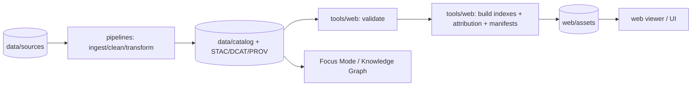

<!--
🧭 Governed Markdown (optional)
id: tools.web.readme
owner: Kansas-Matrix-System
status: draft
last_updated: 2026-01-14
-->

# 🌐 `tools/web` — Web Tooling (Provenance-First, Web-Ready Artifacts)

<p align="center">
  
</p>

<p align="center">
  
  
  
  
  
</p>

> **What this folder is:** the “bridge” between **cataloged sources → validated metadata → web-ready artifacts** (indexes, manifests, citations, attribution bundles, and optional static-site build helpers).  
> **What it is not:** a place for “mystery layers” or untracked data. If it shows up in the UI/AI, it must be traceable and reproducible.

---

## ✨ Why `tools/web` exists

KFM/Kansas-Matrix-System is built on **contract-first** + **provenance-first** principles: every dataset/layer/story snippet must have **metadata and lineage** you can inspect, validate, and cite. `tools/web` operationalizes that philosophy by turning your *catalog + provenance* into *web-consumable* outputs.

This module specifically focuses on:

- ✅ **Validation**: fail fast if metadata contracts are incomplete (license, spatial/temporal extent, processing steps, source attribution).
- ✅ **Packaging**: generate deterministic web assets (manifests, indexes, attribution bundles).
- ✅ **Traceability**: connect UI/Focus Mode outputs back to cataloged sources with citation scaffolding.
- ✅ **Reproducibility**: make “build the site / build the index” deterministic (CI-friendly, DVC-friendly, cache-friendly).

---

## 🧱 Core design pillars

### 1) 🧾 Provenance-first or it doesn’t ship
If a layer, story element, or AI answer appears anywhere, we must be able to answer:

- Where did it come from?
- Under what license can we use it?
- What transformations created it?
- What exact artifact/version is referenced?

### 2) 📜 Contract-first, validated by tooling
Metadata JSON is a **data contract**. `tools/web` assumes your pipeline enforces these contracts before data is accepted into the official catalog.

### 3) 🧩 Clean boundaries (ports/adapters mindset)
This folder should expose **stable interfaces** so that:
- the backend (FastAPI / services),
- pipelines (ETL),
- and the frontend viewer (web)
can evolve without breaking one another.

### 4) 🧠 Human-centered + ethical safeguards
The web surface is where trust is won or lost. We ship:
- transparent sourcing,
- clear AI labeling,
- and guardrails that prevent “silent, untraceable” outputs.

---

## 🗂️ What belongs in here

Think of `tools/web` as a toolbox of **build-time** and **publish-time** tasks.

### ✅ Typical responsibilities
- Build/refresh a **dataset & story index** used by the web UI (search, timeline, filters)
- Build/refresh **attribution bundles** (credits, license summaries, source lists)
- Build/refresh **citation-ready evidence objects** (for Focus Mode panels)
- Validate catalog JSON + STAC/DCAT/provenance fragments
- Generate **web manifests** for layers (tiles, COGs, GeoJSON/GeoParquet pointers)

### 🚫 What should *not* live here
- Business/domain logic (belongs in core services)
- One-off scripts with no logging, no tests, no deterministic outputs
- Anything that fetches remote data without storing provenance + license metadata

---

## 🧭 Recommended folder layout

> Adjust to match your repo — the goal is clarity + separation. ✂️

```text
🧰 tools/
  🌐 web/
    📄 README.md
    🧪 tests/
    🧩 src/
      🧱 contracts/          # schemas + validators (JSONSchema/Pydantic/etc)
      🧾 citations/          # evidence + citation builders
      🧭 index/              # search/timeline/catalog index builders
      🗺️ manifests/          # layer manifests (tiles/COGs/vector endpoints)
      🧰 build/              # web build helpers (optional)
      🔐 policy/             # safe defaults (rate limits, allowlists, robots, etc)
    📦 fixtures/             # tiny test fixtures (sample metadata, sample STAC items)
```

---

## 🚀 Quickstart

### 1) Run validations (contracts first)
```bash
# Example patterns (adapt to your runner)
python -m tools.web.contracts.validate data/catalog/**/*.json
```

### 2) Build the web indexes (deterministic output)
```bash
python -m tools.web.index.build \
  --catalog data/catalog \
  --out web/assets/index
```

### 3) Generate attribution + citations bundle
```bash
python -m tools.web.citations.build \
  --catalog data/catalog \
  --out web/assets/attribution
```

### 4) (Optional) Build/refresh the static web viewer
```bash
# If your repo uses a Makefile convention
make site
```

---

## 🧩 Interfaces & contracts (recommended)

> These are *suggested* stable interfaces so tooling stays modular.

### 🧾 `SourceRecord`
A minimal, web-friendly source record:

```json
{
  "id": "dataset:water_quality_1990s:v3",
  "title": "Water Quality Measurements (1990s)",
  "source": {
    "name": "Agency / Archive Name",
    "url": "https://example.org/dataset",
    "retrieved_at": "2026-01-14T00:00:00Z"
  },
  "license": {
    "name": "CC-BY 4.0",
    "url": "https://creativecommons.org/licenses/by/4.0/"
  },
  "spatial_extent": { "bbox": [-102.05, 36.99, -94.59, 40.00] },
  "temporal_extent": { "start": "1990-01-01", "end": "1999-12-31" },
  "processing": [
    { "step": "clean", "tool": "pipeline/water_quality_clean.py", "hash": "sha256:..." },
    { "step": "export", "format": "GeoParquet", "hash": "sha256:..." }
  ],
  "artifacts": [
    { "type": "geoparquet", "path": "data/processed/water_quality_1990s_v3.parquet" },
    { "type": "stac_item", "path": "data/stac/items/water_quality_1990s_v3.json" }
  ]
}
```

### 🔎 `WebIndex`
A single merged index that your UI can load quickly:

- `datasets[]` (title, id, tags, extents, quick links, thumbnails)
- `stories[]` (title, id, chapter, linked dataset ids)
- `places[]` (optional: knowledge graph extract for map search)
- `build_info` (git sha, build time, schema version)

### 🗺️ `LayerManifest`
One manifest per layer (tiles + vector endpoints + legend):

- tile endpoints (XYZ, PMTiles, WMTS, etc.)
- COG pointers
- legend and symbology hints
- attribution and license snippet (pulled from contracts)

---

## 🧠 How this supports Focus Mode (Evidence Panels)

`tools/web` should make it easy for the UI (and AI) to show:

- **What the claim is**
- **What dataset(s) support it**
- **What the license is**
- **How the dataset was processed**
- **How to reproduce the artifact**

A practical pattern:

- Build a **citation bundle** once at publish time
- Ship it to `web/assets/attribution/`
- UI uses it for “Sources” popovers and AI evidence panels

---

## 🛡️ Security & policy defaults

Even if this folder only does “build-time work,” it’s part of a system that:

- ingests from external sources,
- exposes outputs to the public,
- and supports AI summaries.

So we ship strong defaults:

- 🧾 **Always** require license + attribution fields
- 🧪 Validate schema in CI
- 🧯 Avoid embedding secrets in build artifacts
- 🧵 Produce structured logs for auditability
- 🧼 Strip/escape untrusted HTML if any text is packaged for UI

> Bonus: align logs/alerts with the broader platform’s audit mindset (misuse detection, anomalous behavior patterns, etc.).

---

## 🧪 Testing philosophy

**Small, deterministic, fixture-driven.**

- ✅ unit tests for validators + builders
- ✅ “golden file” tests for generated indexes/manifests
- ✅ schema regression tests (old catalogs must still validate or explicitly migrate)

---

## 🗺️ How this relates to the rest of the repo

Typical flow:



---

## 🧰 Make targets (suggested convention)

| Target | What it should do | Output |
|---|---|---|
| `make validate` | validate metadata contracts + STAC/DCAT/PROV fragments | CI gate ✅ |
| `make index` | build dataset/story/place indexes | `web/assets/index/*` |
| `make attribution` | generate citations + attribution bundle | `web/assets/attribution/*` |
| `make site` | build/refresh the web viewer | `web/dist` or `web/` |

---

## 🧭 Contribution checklist

Before a PR touching `tools/web` is “done” ✅:

- [ ] New/updated schema is versioned (no silent breaking changes)
- [ ] Tests include fixtures and deterministic expected outputs
- [ ] Generated artifacts include `build_info` (timestamp + git sha + schema version)
- [ ] Attribution fields are preserved end-to-end
- [ ] No new script bypasses provenance/contract rules

---

## 📚 Project reference library (used to shape this module)

These project docs/books inform decisions in `tools/web` (architecture, governance, UI readiness, security posture, data pipelines, and statistical validation).

<details>
  <summary><strong>📌 Architecture, governance & system design</strong></summary>

- 📘 Kansas Frontier Matrix (KFM) – Comprehensive Technical Documentation *(contracts, provenance, AI guardrails, scalable web architecture)*
- 🧩 Kansas-Frontier-Matrix — Open-Source Geospatial Historical Mapping Hub Design *(repo structure, Makefile conventions, DVC, static viewer build patterns)*
- 🧠 Introduction to Digital Humanism *(accountability, transparency, sociotechnical risks)*
- 🗃️ Data Spaces *(systems integration + modular data exchange patterns)*

</details>

<details>
  <summary><strong>🗺️ GIS, mapping, remote sensing & web delivery</strong></summary>

- ☁️ Cloud-Based Remote Sensing with Google Earth Engine *(pipelines + external compute orchestration)*
- 🧭 python-geospatial-analysis-cookbook *(GeoJSON, PostGIS workflows, practical export patterns)*
- 🗺️ Making Maps: A Visual Guide to Map Design for GIS *(cartographic communication for UI outputs)*
- 📱 Mobile Mapping: Space, Cartography and the Digital *(mobile constraints + interaction patterns)*
- 🏺 Archaeological 3D GIS *(3D spatial storytelling use-cases)*

</details>

<details>
  <summary><strong>🎨 Web UI, rendering & front-end readiness</strong></summary>

- 📐 Responsive Web Design with HTML5 and CSS3 *(layout, accessibility, responsive strategy)*
- 🧊 WebGL Programming Guide *(3D rendering foundations for map/scene viewers)*

</details>

<details>
  <summary><strong>🗄️ Databases, performance & scaling</strong></summary>

- 🐘 PostgreSQL Notes for Professionals *(practical Postgres patterns)*
- ⚡ Database Performance at Scale *(I/O, infra, disk considerations)*
- 🧬 Scalable Data Management for Future Hardware *(parallelism + future-proof storage/compute thinking)*

</details>

<details>
  <summary><strong>📊 Stats, ML, analysis quality & evaluation</strong></summary>

- 📉 Understanding Statistics & Experimental Design *(A/B tests, measurement discipline for UX & extraction)*
- 📈 Regression Analysis with Python *(model evaluation + fit diagnostics for derived analytics)*
- 🧮 Regression analysis using Python — slides *(quick reference)*
- 🎲 Think Bayes *(Bayesian reasoning for ranking/uncertainty in evidence)*
- 📊 Graphical Data Analysis with R *(exploratory analysis of pipeline + index quality metrics)*
- 🧠 Deep Learning for Coders with fastai & PyTorch *(optional: embeddings / ranking / semantic search)*

</details>

<details>
  <summary><strong>🔐 Security mindset & adversarial thinking</strong></summary>

- 🛡️ Ethical Hacking & Countermeasures *(logging, monitoring, intrusion mindset)*
- 🐍 Gray Hat Python *(defensive awareness; do not misuse—use for secure engineering context)*

</details>

<details>
  <summary><strong>🧩 Additional math/engineering references used across the system</strong></summary>

- 🧱 Scientific Modeling and Simulation (NASA-grade guide) *(rigor + reproducibility mindset)*
- 🧬 Principles of Biological Autonomy *(systems thinking inspiration)*
- 🧮 Spectral Geometry of Graphs *(graph analytics foundations)*
- 🏗️ Generalized Topology Optimization for Structural Design *(optimization mindset; not directly web, but informs pipeline discipline)*
- 🖼️ Compressed Image File Formats (JPEG/PNG/GIF/…) *(image handling for thumbnails/tiles/assets)*
- 📚 A / B-C / D-E / F-H / I-L / M-N / O-R / S-T / U-X programming books *(broad engineering reference set)*

</details>

---

## 🧭 Roadmap (optional, but recommended)

- [ ] Schema versioning + migration tool (`tools/web/contracts/migrate`)
- [ ] “Evidence pack” format for Focus Mode (claim → sources → artifacts)
- [ ] Robust license normalization + attribution formatter
- [ ] Optional `web/assets/search` builder for full-text or semantic index
- [ ] CI job that blocks publish if any artifact lacks provenance fields

---

## 🧩 Related docs

- 📄 `../../README.md` — project overview
- 🧾 `../../docs/` — architecture + governance docs
- 🗺️ `../../web/` — the viewer (if present)
- 🧪 `../../pipelines/` or `../../scripts/` — ingestion & processing

---

**If you’re unsure where to add something:**  
Ask “Is this about turning *cataloged + validated* data into *web-ready* outputs?”  
If yes ✅ → it likely belongs in `tools/web`.  
If no ❌ → it belongs elsewhere (domain/service/pipeline/frontend).

