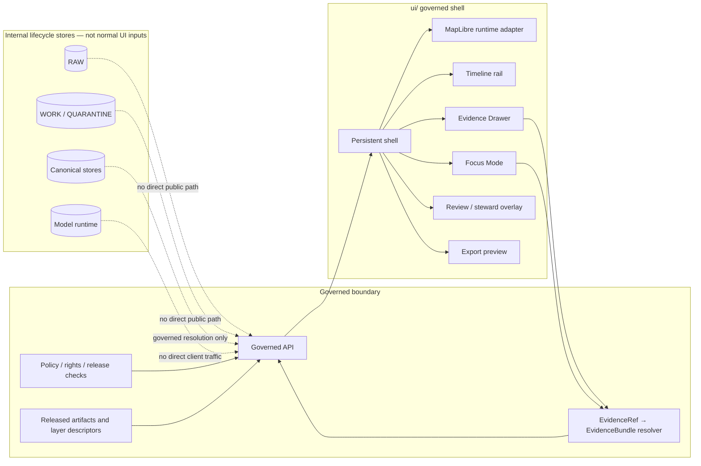

<!-- [KFM_META_BLOCK_V2]
doc_id: kfm://doc/NEEDS-VERIFICATION-ui-readme
title: ui
type: standard
version: v1
status: draft
owners: NEEDS_VERIFICATION-ui-owner
created: 2026-04-23
updated: 2026-04-23
policy_label: NEEDS_VERIFICATION
related: [
  <NEEDS_VERIFICATION: ../README.md>,
  <NEEDS_VERIFICATION: ../docs/architecture/shell/README.md>,
  <NEEDS_VERIFICATION: ../docs/architecture/ai/README.md>,
  <NEEDS_VERIFICATION: ../contracts/README.md>,
  <NEEDS_VERIFICATION: ../schemas/README.md>,
  <NEEDS_VERIFICATION: ../policy/README.md>,
  <NEEDS_VERIFICATION: ../tests/README.md>
]
tags: [kfm, ui, maplibre, shell, evidence-drawer, focus-mode, trust-visible]
notes: [
  "Requested target path is ui/README.md.",
  "Current-session workspace did not expose a mounted KFM repository tree; child paths, owner, policy label, and related repo links need maintainer verification.",
  "This README is grounded in KFM UI doctrine and should be revised after direct repo inspection confirms actual UI framework, package manager, routes, contracts, tests, and CI conventions."
]
[/KFM_META_BLOCK_V2] -->

<a id="top"></a>

# `ui/`

Map-first, time-aware, evidence-visible user interface surface for the Kansas Frontier Matrix governed shell.

> [!NOTE]
> **Status:** `experimental`  
> **Document state:** `draft`  
> **Owners:** `NEEDS_VERIFICATION-ui-owner`  
> **Path target:** `ui/README.md`  
> 
> 
> 
> 
> 
>   
> **Quick jumps:** [Scope](#scope) · [Repo fit](#repo-fit) · [Inputs](#inputs) · [Exclusions](#exclusions) · [Directory tree](#directory-tree) · [Quickstart](#quickstart) · [Usage](#usage) · [Diagram](#diagram) · [Reference tables](#reference-tables) · [Task list](#task-list) · [FAQ](#faq) · [Appendix](#appendix)

> [!IMPORTANT]
> The UI is part of the KFM evidence chain. It must not become a decorative map viewer, detached chatbot, hidden admin truth system, or direct client for raw/internal stores.

---

## Scope

`ui/` is the proposed home for KFM’s browser-facing governed shell materials when the mounted repository confirms that this directory is the UI surface.

It should orient maintainers around a persistent operating field where:

- **place and time stay coequal** through the map shell and timeline,
- **MapLibre acts as the disciplined 2D renderer**, not as the source of truth,
- **Evidence Drawer payloads remain mandatory** for consequential claims,
- **Focus Mode stays evidence-bounded** and emits finite outcomes,
- **review, correction, export, and steward views remain shell variations**, not separate truth systems.

### Current evidence snapshot

| Claim | Status | README handling |
|---|---:|---|
| KFM doctrine calls for a map-first, time-aware, evidence-first, trust-visible shell | CONFIRMED | Reflected as directory purpose and UI gates |
| MapLibre is the preferred 2D runtime inside the shell | CONFIRMED doctrine / PROPOSED realization | Treated as renderer boundary guidance |
| Evidence Drawer and Focus Mode are core trust surfaces | CONFIRMED doctrine / PROPOSED implementation | Included as required UI contract families |
| Actual `ui/` child files, framework, package manager, test runner, route names, and DTOs | UNKNOWN | Marked `NEEDS VERIFICATION` instead of invented |
| This README’s target path | CONFIRMED by user request | Authored for `ui/README.md` |

[Back to top](#top)

---

## Repo fit

`ui/` should sit downstream of governed contracts, schemas, policy, release state, and EvidenceBundle resolution. It should sit upstream of user-visible map exploration, dossier reading, story navigation, review overlays, Focus answers, compare views, and export previews.

| Relationship | Target | Status | What `ui/` should depend on |
|---|---|---:|---|
| Repository landing | `../README.md` | NEEDS VERIFICATION | Project identity, truth posture, repo-wide navigation |
| Shell doctrine | `../docs/architecture/shell/README.md` | NEEDS VERIFICATION | Persistent shell, surface taxonomy, trust-visible UX |
| Governed AI doctrine | `../docs/architecture/ai/README.md` | NEEDS VERIFICATION | Focus Mode envelope and model-runtime boundary |
| Contracts | `../contracts/README.md` | NEEDS VERIFICATION | Human-readable surface, drawer, layer, and envelope contracts |
| Schemas | `../schemas/README.md` | NEEDS VERIFICATION | Machine-readable payload validation |
| Policy | `../policy/README.md` | NEEDS VERIFICATION | Rights, sensitivity, release, role, and public-safety rules |
| Fixtures and tests | `../tests/README.md` | NEEDS VERIFICATION | Valid/invalid UI payloads and negative-state coverage |

> [!WARNING]
> Keep relative paths as review placeholders until the real checkout confirms these homes. Convert them to clickable links only after path verification.

[Back to top](#top)

---

## Inputs

The UI should consume prepared, governed, released, or review-authorized inputs only.

| Input family | Belongs here when… | Required trust posture |
|---|---|---|
| Shell state | It hydrates place, time, role, layers, release context, selected object, or active mode | Must preserve scope and release context |
| Layer metadata | It describes released or steward-authorized layer meaning, source role, freshness, review state, sensitivity, and time semantics | Must not be hidden inside style expressions alone |
| MapLibre source/style adapters | They render approved delivery descriptors and versioned styles | Must preserve source/layer/style separation |
| Evidence Drawer payloads | They expose support, provenance, rights, freshness, review, correction, and audit linkage for a claim or layer | Must remain one hop from evidence |
| Focus envelopes | They render `ANSWER`, `ABSTAIN`, `DENY`, or `ERROR` outcomes from governed API responses | Must not display raw model output |
| Review overlays | They expose role-gated queues, diffs, obligations, decisions, corrections, and rollback targets | Must use the same evidence law as public surfaces |
| Accessibility labels and trust copy | They make trust cues usable without color-only interpretation | Must travel with claims, chips, layers, and outputs |
| UI fixtures and snapshots | They verify rendering, negative states, and drawer/focus payload handling | Must include valid and invalid cases |

[Back to top](#top)

---

## Exclusions

`ui/` must not become a dumping ground for truth, policy, runtime, or data lifecycle material.

| Do **not** put here | Goes instead | Reason |
|---|---|---|
| RAW, WORK, QUARANTINE, or unpublished candidate data | `../data/` lifecycle homes after verification | Public/steward UI must not read internal lifecycle stores directly |
| Source descriptors and source activation rules | `../data/registry/` or `../docs/sources/` after verification | Source authority is not a renderer concern |
| Canonical object schemas | `../schemas/` after verification | UI consumes contracts; it does not define canonical truth alone |
| Human-readable contracts | `../contracts/` after verification | UI implements and tests contract behavior |
| Rego/policy rules or release gates | `../policy/` after verification | UI displays policy state; backend policy must enforce it |
| Model adapters, model prompts, or runtime provider config | Governed API / AI architecture home after verification | Focus Mode must not call a model runtime directly |
| Generated proof packs, receipts, release manifests, or catalogs | `../data/`, `../reports/`, or release homes after verification | UI may link to proof objects but should not become their store |
| Detached admin console behavior | Role-gated shell variation | Review state is part of meaning and should stay connected to the shell |

[Back to top](#top)

---

## Directory tree

The current session did **not** expose a mounted repo tree, so the shape below is a review scaffold, not a claim that these files exist.

```text
ui/
├── README.md                                  # this file
├── shell/                                     # NEEDS VERIFICATION: persistent shell frame, state hydration
├── maplibre/                                  # NEEDS VERIFICATION: MapLibre runtime adapter and layer bindings
├── evidence-drawer/                           # NEEDS VERIFICATION: drawer mappers, renderers, trust chips
├── focus/                                     # NEEDS VERIFICATION: finite outcome rendering and cited-evidence actions
├── story/                                     # NEEDS VERIFICATION: story surfaces that preserve map/time/evidence
├── review/                                    # NEEDS VERIFICATION: steward-only shell variation
├── compare/                                   # NEEDS VERIFICATION: asymmetric compare/split state
├── export/                                    # NEEDS VERIFICATION: trust-preserving preview and share/export views
├── accessibility/                             # NEEDS VERIFICATION: labels, keyboard flows, reduced-motion notes
└── __tests__/                                 # NEEDS VERIFICATION: UI fixtures, snapshots, negative-state tests
```

> [!TIP]
> If the real repo uses `apps/web/`, `src/`, `packages/ui/`, or another UI home, keep this README’s doctrine but migrate the path through an ADR or migration note instead of silently duplicating UI authority.

[Back to top](#top)

---

## Quickstart

Use this quickstart only after opening the real KFM repository root.

```bash
# 1. Confirm repo state before editing.
git status --short
git branch --show-current

# 2. Verify whether ui/ is the real UI home.
test -d ui && find ui -maxdepth 2 -type f | sort

# 3. Inspect adjacent documentation and machine-contract surfaces.
find docs contracts schemas policy tests data -maxdepth 2 -name README.md -print 2>/dev/null | sort

# 4. Search for existing shell, drawer, focus, and MapLibre implementation before adding new files.
grep -RInE "MapLibre|Evidence Drawer|EvidenceDrawer|Focus Mode|FocusPane|DecisionEnvelope|ANSWER|ABSTAIN|DENY|ERROR" \
  ui docs contracts schemas policy tests apps packages 2>/dev/null | head -200
```

Expected outcome:

- `CONFIRMED`: existing UI files and conventions are identified.
- `UNKNOWN`: missing framework, route, package, or contract details are recorded rather than guessed.
- `PROPOSED`: new folders or files are added only after they fit the verified repo structure.

[Back to top](#top)

---

## Usage

### Add or revise a UI surface

1. Identify the shell mode: Explore, Dossier, Story, Focus, Review, Compare, Export, or controlled 3D.
2. Confirm the governed API or released artifact that supplies the payload.
3. Verify the payload contract and schema home.
4. Render trust cues at the point of use: scope, freshness, evidence state, policy, review, knowledge character, AI participation, and correction lineage.
5. Add valid and invalid fixtures.
6. Test all negative outcomes that the surface can receive.
7. Record any path, contract, or source-status ambiguity as `NEEDS VERIFICATION`.

### Add or revise a MapLibre layer binding

A MapLibre layer binding should be thin, inspectable, and governed:

- accept released delivery descriptors,
- keep business meaning in layer metadata, not only in style JSON,
- preserve stable feature identity needed for drawer selection,
- avoid heavy analysis in the browser,
- never call raw source endpoints as a public shortcut.

### Add or revise Focus Mode rendering

Focus Mode is an evidence-bounded shell surface. It should render the governed response envelope and supporting evidence controls, not a free-form assistant transcript.

Required rendering branches:

| Outcome | Meaning | UI behavior |
|---|---|---|
| `ANSWER` | Evidence resolved and policy allows the scoped answer | Show structured synthesis, citations, scope echo, and Evidence Drawer actions |
| `ABSTAIN` | Evidence is missing, unresolved, ambiguous, stale, or insufficient | Show reason, scope, and evidence/refinement actions |
| `DENY` | Policy, role, rights, or sensitivity forbids release | Show safe denial copy and allowed next steps |
| `ERROR` | Service, schema, catalog, or resolver failure | Show fault-safe copy and avoid invented fallback answers |

[Back to top](#top)

---

## Diagram



[Back to top](#top)

---

## Reference tables

### Surface responsibilities

| Surface | Must do | Must never do |
|---|---|---|
| Explore | Keep map, time, selected layers, and trust cues coordinated | Become a generic basemap browser |
| Dossier | Present a durable claim/object view with scope, policy, evidence, and outward actions | Detach claims from evidence or release state |
| Story | Guide narrative while keeping map, time, citations, and drawer actions alive | Become citation-free storytelling |
| Evidence Drawer | Act as the mandatory trust object for claims, layers, Focus outputs, and exports | Hide support, rights, freshness, review, or correction state |
| Focus Mode | Provide evidence-bounded synthesis with finite outcomes | Operate as a sovereign free-form chatbot |
| Review / Steward | Expose review queues, diffs, obligations, corrections, and decisions as role-gated shell variations | Create a hidden administrative truth system |
| Compare | Preserve asymmetric time, support, and release context on each side | Flatten unlike states into one simplified summary |
| Export | Preview outward artifacts with trust cues and provenance intact | Strip correction, generalization, or release context |
| Controlled 3D | Carry a real explanatory burden while preserving the same trust objects | Turn KFM into spectacle-first 3D |

### State ownership

| State | UI responsibility | Source of authority |
|---|---|---|
| Camera, hover, drawer open/closed, selected shell mode | Own and persist safely where appropriate | UI shell |
| Active geography, time scope, selected layers, role, release window | Display and serialize without silently changing meaning | Shell state contract |
| Layer meaning, knowledge character, source role, freshness, review state | Render from metadata payloads | Governed API / layer metadata |
| Evidence support and citations | Open drawer and link to resolved support | EvidenceBundle resolver |
| Rights, sensitivity, policy, public-safe/generalized posture | Display clearly; do not enforce alone | Backend policy and release checks |
| Focus answer state | Render finite outcome envelope | Governed API / AI adapter boundary |
| Correction, supersession, withdrawal, rollback reference | Keep visible on affected claims and exports | Release/proof/correction records |

### MapLibre governance

| Layer | KFM rule |
|---|---|
| Source registry | Released source IDs only; no raw public source URLs |
| Layer metadata registry | Business meaning, trust cues, evidence routes, and time semantics live outside style expressions |
| Style registry | Versioned style JSON, sprites, glyphs, fonts, and visual variants are presentation assets |
| Runtime adapter registry | Protocol adapters and plugins require explicit allow-listing and auditability |
| Browser runtime | Browse, filter, inspect, highlight, and rehydrate; do not perform heavy trust-bearing computation |

[Back to top](#top)

---

## Task list

Use this as the minimum review gate before treating `ui/` changes as ready.

- [ ] `ui/` location and child tree verified in the mounted repo.
- [ ] Owner(s), policy label, and doc ID replaced with confirmed values.
- [ ] Adjacent README links converted from placeholders only after paths exist.
- [ ] No UI code reads RAW, WORK, QUARANTINE, canonical stores, graph internals, or live source endpoints directly.
- [ ] No UI code calls model runtimes directly.
- [ ] Evidence Drawer payload includes support, source role, knowledge character, EvidenceRef/EvidenceBundle identity, scope, rights, sensitivity, freshness, review, provenance, and audit linkage.
- [ ] Focus rendering covers `ANSWER`, `ABSTAIN`, `DENY`, and `ERROR`.
- [ ] Trust chips are accessible by text, not color alone.
- [ ] MapLibre source/layer/style responsibilities remain separated.
- [ ] Layer metadata includes time semantics and release/review context.
- [ ] Export preview preserves trust cues, correction state, and generalization context.
- [ ] Valid and invalid fixtures exist for drawer, focus, shell state, and layer metadata payloads.
- [ ] Tests cover empty states, denial states, stale evidence, restricted precision, schema mismatch, and resolver failure.
- [ ] Any 3D surface passes a burden-of-proof review and preserves the same drawer/policy/rollback model.
- [ ] Rollback path is documented for any new UI contract or adapter.

[Back to top](#top)

---

## FAQ

### Is `ui/` the source of truth?

No. `ui/` is a governed interpretation and interaction surface. EvidenceBundle, policy, release state, proof objects, and canonical data stores outrank UI rendering.

### Can the UI hide trust metadata to keep the interface clean?

No. The UI can design trust cues elegantly, but scope, evidence support, freshness, policy, review, and correction state must stay visible where meaning changes.

### Can Focus Mode answer without evidence?

No. Missing or inadequate evidence should produce `ABSTAIN`; forbidden release should produce `DENY`; service failure should produce `ERROR`.

### Can MapLibre styles encode business meaning?

Only presentation-level meaning. KFM business semantics, source roles, trust cues, review state, policy posture, and evidence routes belong in governed metadata/contracts, not silently inside style expressions.

### What if the real UI lives somewhere else?

Preserve this README’s doctrine, then move or cross-link it through a small ADR-backed change. Do not leave two competing UI authority pages.

[Back to top](#top)

---

## Appendix

<details>
<summary>Verification backlog for maintainers</summary>

| Item | Status | How to resolve |
|---|---:|---|
| `ui/` exists in mounted repo | NEEDS VERIFICATION | Inspect repo root and update this README |
| UI framework | UNKNOWN | Check package files and app structure |
| Package manager | UNKNOWN | Verify lockfiles and scripts |
| Component naming | UNKNOWN | Search existing shell, drawer, focus, review, and MapLibre files |
| Contract/schema homes | NEEDS VERIFICATION | Inspect `contracts/` and `schemas/` README files |
| Policy engine and policy home | NEEDS VERIFICATION | Inspect `policy/` and CI workflows |
| Test runner | UNKNOWN | Inspect package config, test directories, and CI |
| Owners | NEEDS VERIFICATION | Confirm CODEOWNERS, maintainers, or project governance docs |
| Accessibility standard | NEEDS VERIFICATION | Confirm project accessibility rules or add them |
| Release/proof/correction link targets | NEEDS VERIFICATION | Inspect release, reports, data, receipts, proofs, and catalog homes |

</details>

<details>
<summary>Useful terms</summary>

| Term | Working meaning in this README |
|---|---|
| Governed shell | Persistent KFM operating field where map, time, evidence, policy, review, and outward actions remain coordinated |
| Evidence Drawer | Mandatory trust object that exposes support, provenance, rights, sensitivity, freshness, review, correction, and audit context |
| Focus Mode | Evidence-bounded synthesis surface inside the shell, with finite runtime outcomes |
| Trust chip | Compact visible cue for scope, freshness, evidence state, policy, review, knowledge character, AI participation, or correction |
| Layer metadata | Governed meaning and trust context attached to a rendered layer |
| Style JSON | MapLibre presentation contract for drawing sources as layers |
| Released artifact | Public or steward-authorized output that passed the appropriate validation, policy, catalog, proof, and promotion gates |

</details>

[Back to top](#top)
