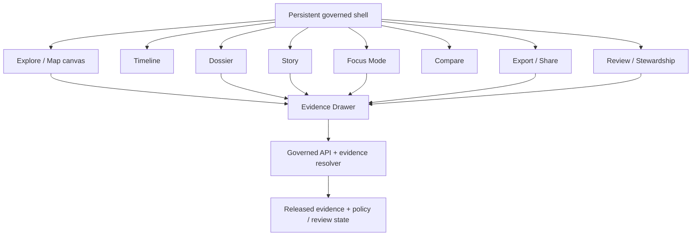

<!-- [KFM_META_BLOCK_V2]
doc_id: kfm://doc/<UUID_REVIEW_REQUIRED>
title: KFM UI
type: standard
version: v1
status: draft
owners: <OWNERS_REVIEW_REQUIRED>
created: <YYYY-MM-DD_REVIEW_REQUIRED>
updated: <YYYY-MM-DD_REVIEW_REQUIRED>
policy_label: <POLICY_LABEL_REVIEW_REQUIRED>
related: [<RELATED_PATHS_REVIEW_REQUIRED>]
tags: [kfm]
notes: [Path confirmed only as ui/README.md in this task; mounted repo tree was not directly visible; upstream/downstream links and ownership metadata remain review placeholders.]
[/KFM_META_BLOCK_V2] -->

# KFM UI

Map-first, time-aware, trust-visible shell guidance for the `ui/` directory.

> **Status:** experimental *(conservative placeholder — repo status needs verification)*  
> **Owners:** `<OWNERS_REVIEW_REQUIRED>`  
> **Path:** `ui/README.md`  
>      
> **Quick jump:** [Scope](#scope) · [Repo fit](#repo-fit) · [Quickstart](#quickstart) · [Diagram](#diagram) · [Definition of done](#definition-of-done) · [Open verification items](#open-verification-items)

> [!IMPORTANT]
> This README is doctrine-grounded and repo-tree-conservative. In the current session, `ui/README.md` is the only path directly confirmed by the task itself; any neighboring file, package, or route reference beyond that is marked `INFERRED`, `PROPOSED`, `UNKNOWN`, or `NEEDS VERIFICATION`.

## Scope

The `ui/` directory should hold the KFM shell and its trust-visible interaction surfaces, not a second truth system. In KFM, the interface is part of the evidence chain: map-first, time-aware, 2D-first by default, and one interaction away from inspectable support.

| Label | Meaning in this README |
|---|---|
| **CONFIRMED** | Supported by the current-session KFM corpus. |
| **INFERRED** | Strongly implied directory responsibility, but not repo-verified. |
| **PROPOSED** | Recommended structure or artifact to add. |
| **UNKNOWN / NEEDS VERIFICATION** | Cannot be claimed without the mounted repo tree, contracts, workflows, or runtime evidence. |

## Repo fit

| Item | Value |
|---|---|
| **Path** | `ui/` |
| **Audience** | Front-end maintainers, architecture stewards, reviewers, and contributors working on trust-visible surfaces. |
| **Local role** | Persistent shell, map runtime integration, timeline, inspection stack, dossier/story/focus surfaces, trust cues, export preview, and role-gated review overlays. |
| **Upstream links** | `NEEDS VERIFICATION` — likely governed API, evidence resolver, layer metadata contracts, shell-state contracts, and release/policy registries. See [Open verification items](#open-verification-items). |
| **Downstream links** | `NEEDS VERIFICATION` — likely public shell entrypoints, steward/review surfaces, export/share flows, and outward artifact previews. See [Open verification items](#open-verification-items). |

## Inputs

These are the kinds of inputs that belong in `ui/` or directly adjacent UI-facing contracts.

| Input family | What belongs here | Posture |
|---|---|---|
| Shell continuity state | Extent, selected geography, active time scope, active layers, compare anchors, current mode, and local accessibility preferences. | **CONFIRMED** |
| Trust-bearing payload consumption | Evidence Drawer payloads, dossier payloads, Focus request/response envelopes, surface-state registries, layer metadata, and saved-view rehydration inputs. | **CONFIRMED** |
| Map runtime integration | A KFM-owned MapLibre adapter, audited protocol adapters, and governed style/runtime bindings. | **PROPOSED** build direction |
| Style assets | Versioned style JSON, sprites, glyphs, icons, fonts, and public-safe PMTiles or raster delivery descriptors. | **CONFIRMED** doctrine / **UNKNOWN** mounted asset layout |
| Surface components | Explorer, Timeline, Dossier, Story, Evidence Drawer, Focus, Compare, Review, and Export UI surfaces. | **INFERRED** directory responsibility |
| UI verification material | Surface-state examples, payload fixtures, accessibility tests, and negative-path checks. | **PROPOSED** |

## Exclusions

The following do **not** belong here as browser-owned truth.

| Exclusion | Why it does not belong here | Where it goes instead |
|---|---|---|
| Canonical data, unpublished artifacts, promotion state, precise restricted geometry | The client must not become a convenience copy of sovereign truth. | Governed APIs and backend registries |
| Direct policy decisions or rights adjudication | Policy and review must gate runtime behavior before publication. | Policy lane, review workflows, release artifacts |
| Business meaning embedded in style expressions | Styles are for rendering, not for sovereign business logic. | Contracts, metadata registries, and governed services |
| Assistant-first free-form answers | Focus is bounded synthesis, not a detached chatbot. | Focus envelopes + evidence resolver + policy mediation |
| Hidden admin-only truth surfaces | Stewardship stays in the same shell law, not a separate epistemic system. | Role-gated review surfaces inside the same governed shell |
| Spectacle-first 3D | 3D is conditional and burden-bearing, never the default shell. | Controlled 3D mode after the 2D burden checklist is met |

## Directory tree

The mounted repo tree was **not** directly surfaced in this session, so this tree is intentionally conservative.

```text
ui/
├── README.md                           # CONFIRMED — target file for this task
├── <shell / runtime entrypoints>       # NEEDS VERIFICATION
├── <surface components>                # INFERRED — explorer, timeline, right stack, trust objects
├── <style / asset bindings>            # INFERRED — MapLibre integration and governed assets
├── <UI-facing contracts or examples>   # PROPOSED — payload examples, surface states, fixtures
└── <UI verification material>          # PROPOSED — accessibility, negative-path, and surface-state checks
```

> [!NOTE]
> Treat the tree above as a documentation scaffold, not as proof that those files already exist.

## Quickstart

Use a verification-first edit loop before assuming package managers, scripts, or app entrypoints.

```bash
# 1) Confirm what actually exists under ui/
find ui -maxdepth 3 -type f | sort

# 2) Confirm the frontend toolchain before running installs
find . -maxdepth 3 \
  \( -name package.json -o -name pnpm-lock.yaml -o -name yarn.lock -o -name bun.lockb \) \
  | sort

# 3) Confirm UI-adjacent contracts before wiring trust-bearing surfaces
find . -maxdepth 5 \
  \( -iname '*contract*' -o -iname '*schema*' -o -iname '*payload*' -o -iname '*envelope*' \) \
  | sort

# 4) Look for shell-surface terms before renaming or relocating components
grep -RInE 'EvidenceDrawer|Focus|Dossier|Timeline|MapRuntime|TrustChip|RightStack' ui . 2>/dev/null
```

```bash
# Optional: verify whether ui/ is a standalone package or part of a larger app shell
find . -maxdepth 4 -type f \
  \( -name 'tsconfig.json' -o -name 'vite.config.*' -o -name 'next.config.*' -o -name 'astro.config.*' \) \
  | sort
```

## Usage

### Work on shell continuity, not disconnected screens

KFM UI work is shell work. Changes should preserve the coordinated flow from map to timeline to dossier/story/focus to evidence, rather than splitting these surfaces into detached mini-apps.

### Consume contracts; do not infer truth in view logic

Trust chips, negative states, Evidence Drawer content, and Focus outcomes should render from explicit payload fields. The browser may own continuity state, but it must not invent missing freshness, review, policy, or provenance state.

### Keep failure calm and visible

`ABSTAIN`, `DENY`, `ERROR`, stale-visible, generalized, restricted, superseded, withdrawn, and partial states are part of the product contract. A smooth surface that hides those states is a regression, not a polish win.

### Preserve the 2D-first burden rule

The default operating surface is 2D. Any 3D addition has to prove why 2D is insufficient and must preserve the same Evidence Drawer, policy cues, release context, and correction lineage.

## Diagram



## Surface contract matrix

| Surface | Must do | Must never do |
|---|---|---|
| **Map Explorer** | Anchor place, selection, compare, story playback, and evidence-linked inspection. | Become decorative or subordinate to dashboard cards. |
| **Timeline** | Expose valid time, as-of state, chronology, compare anchors, and chapter emphasis. | Disappear into an advanced filter drawer. |
| **Dossier** | Stabilize a place or feature as a durable decision object carrying scope, freshness, policy, and evidence. | Act like a marketing card or detached profile page. |
| **Story surface** | Provide guided narrative that remains geographically anchored, time-aware, and citation-bearing. | Escape into a detached CMS article that abandons map and evidence context. |
| **Evidence Drawer** | Function as the mandatory trust object for claims, layers, Focus outputs, and exports. | Behave like an optional tooltip or developer-only appendix. |
| **Focus Mode** | Provide evidence-bounded synthesis with explicit `ANSWER / ABSTAIN / DENY / ERROR` outcomes. | Operate as a sovereign free-form chatbot. |
| **Review / Stewardship** | Expose review queues, diffs, obligations, and approval actions as a role-gated shell variation. | Become a hidden administrative truth system with different evidence law. |
| **Compare Mode** | Preserve asymmetry between compared states, including time, support, and release context on each side. | Flatten distinct states into a single simplified summary. |
| **Export / Share** | Preview outward artifacts with trust cues, policy context, and release/provenance state intact. | Strip trust cues, correction status, or generalization context. |
| **Controlled 3D** | Answer a burden-bearing question while preserving the same Evidence Drawer, policy, and rollback model. | Change KFM into a spectacle-first 3D shell. |

## Shell ownership model

| State class | Owner | Rule |
|---|---|---|
| **Shell continuity state** | Client shell store | Extent, selected object, active layers, open panels, compare anchors, mode, and local accessibility preferences may live in the shell. |
| **Trust-bearing state** | Governed APIs and backend registries | Evidence state, policy state, review state, freshness, correction lineage, and release truth remain server-owned. |
| **Persisted user products** | Governed services | Saved views, export manifests, review tasks, and compare snapshots may persist, but they rehydrate through current policy and release mediation. |
| **Forbidden client truth** | No browser ownership allowed | Canonical data, unpublished artifacts, policy decisions, promotion state, precise restricted geometry, and model-runtime internals must never become client-side truth by convenience. |

## Runtime and delivery model

| Component / asset | Role inside `ui/` | Posture |
|---|---|---|
| **MapLibre GL JS** | Default browser-side 2D renderer, camera model, hit-testing, and source/layer composition runtime. | **CONFIRMED** doctrine |
| **Style specification + governed assets** | Versioned visual treatment, sprites, glyphs, icons, fonts, and source references. | **CONFIRMED** doctrine |
| **PMTiles** | Public-safe semistatic archive delivery and offline-friendly map packaging. | **CONFIRMED** doctrine |
| **Martin** | Selective dynamic tile, style, sprite, and font delivery where operational mediation is required. | **CONFIRMED** doctrine |
| **Maputnik** | Style authoring tool; helpful in asset creation, not a runtime dependency. | **CONFIRMED** doctrine |
| **Wrappers / plugins** | Thin integrations or protocol adapters only, behind an explicit allow-list. | **CONFIRMED** doctrine / **UNKNOWN** current allow-list |
| **React + TypeScript shell** | Recommended front-end host for the governed shell. | **PROPOSED** build direction |
| **Internal MapLibre adapter** | Keeps renderer mechanics separate from KFM doctrine and contracts. | **PROPOSED** build direction |

> [!WARNING]
> Do not move business meaning into paint expressions, wrapper conventions, or plugin defaults. Source and layer meaning belong in contracts and metadata registries, not in renderer-era shortcuts.

## Definition of done

- [ ] The map remains the visual center on desktop, tablet, and mobile.
- [ ] Time remains a coequal control and does not collapse into a hidden advanced filter.
- [ ] Every consequential claim, layer, Focus result, and export preview is one interaction away from the Evidence Drawer.
- [ ] Focus preserves explicit runtime outcomes: `ANSWER`, `ABSTAIN`, `DENY`, `ERROR`.
- [ ] Trust cues remain visible at the point of use: scope, freshness, policy, review, knowledge character, AI participation, and correction lineage.
- [ ] The browser owns continuity state only; it does not own canonical or unpublished truth.
- [ ] Restricted, generalized, stale, superseded, withdrawn, and partial states remain visible and meaningful.
- [ ] Export/share flows preserve trust cues, policy context, and provenance.
- [ ] Accessibility works without pointer-only affordances, and reduced-motion mode does not hide meaning.
- [ ] Any 3D work justifies itself against the 2D burden checklist rather than bypassing it.
- [ ] At least one thin slice can prove the source-to-public chain end to end.

## FAQ

**Is `ui/` just “the front end”?**  
No. It is the trust-visible shell layer for published interaction. Rendering happens here, but truth ownership does not.

**Does Focus Mode replace dossier, story, or evidence drill-through?**  
No. Focus is bounded synthesis inside the same shell and remains subordinate to released evidence, policy, and audit linkage.

**Can review/stewardship live in a separate admin app?**  
Not by default. KFM doctrine keeps review as a role-gated variation inside the same governed shell.

**Should 3D live here?**  
Only conditionally. Controlled 3D is allowed when it carries real burden and preserves the same trust objects as 2D.

**Can style files carry policy or business meaning?**  
No. Styles are governed assets for rendering. Policy, freshness, review state, and evidence routes belong in explicit contracts and metadata registries.

## Open verification items

| Need | Why it matters | What resolves it |
|---|---|---|
| Actual `ui/` tree and adjacent package layout | Prevents placeholder documentation from drifting away from real code. | Surface the mounted repo tree and confirm neighboring directories/packages. |
| Package manager and dev/build scripts | Prevents the README from inventing commands or workspace assumptions. | Surface `package.json` files, lockfiles, and script blocks. |
| Contract and payload locations | Trust-bearing UI behavior should resolve against real schemas/examples, not prose alone. | Surface shell-state, layer metadata, Evidence Drawer, dossier, and Focus envelope files. |
| UI verification assets | Negative-path and accessibility claims need test proof. | Surface current UI tests, fixtures, and any visual or state-based checks. |
| Route and entrypoint inventory | Prevents this README from implying route structure that the repo may not actually use. | Surface app entrypoints, router definitions, and any deep-link/state rehydration code. |
| Owners, policy label, related links, doc dates | Needed to replace review placeholders in the meta block and impact header. | Confirm repository ownership metadata and documentation conventions. |

## Appendix

<details>
<summary><strong>Evidence-bearing glossary and follow-on artifacts</strong></summary>

### Core terms to keep stable

| Term | Working meaning inside `ui/` |
|---|---|
| **Evidence Drawer** | Immediate provenance inspection surface for any consequential claim, layer, score, Focus output, or export. |
| **Focus Mode** | Governed Q&A and bounded synthesis pane inside the same shell. |
| **Surface state** | User-visible trust condition such as promoted, generalized, partial, stale-visible, abstained, denied, or withdrawn. |
| **EvidenceBundle / EvidenceRef** | The support package or pointer the UI resolves when a user asks what backs a claim. |
| **Thin slice** | The smallest end-to-end governed implementation that proves the architecture on real evidence. |

### Conservative follow-on artifacts to add after repo verification

- Trust-state reference for visible shell states and their render grammar.
- Evidence Drawer payload examples with safe-preview and restricted-state cases.
- Focus envelope examples covering `ANSWER`, `ABSTAIN`, `DENY`, and `ERROR`.
- Surface-state tests for stale, restricted, generalized, superseded, and withdrawn outcomes.
- Accessibility checks for timeline control, drawer focus restoration, and reduced-motion behavior.

</details>

[Back to top](#kfm-ui)
