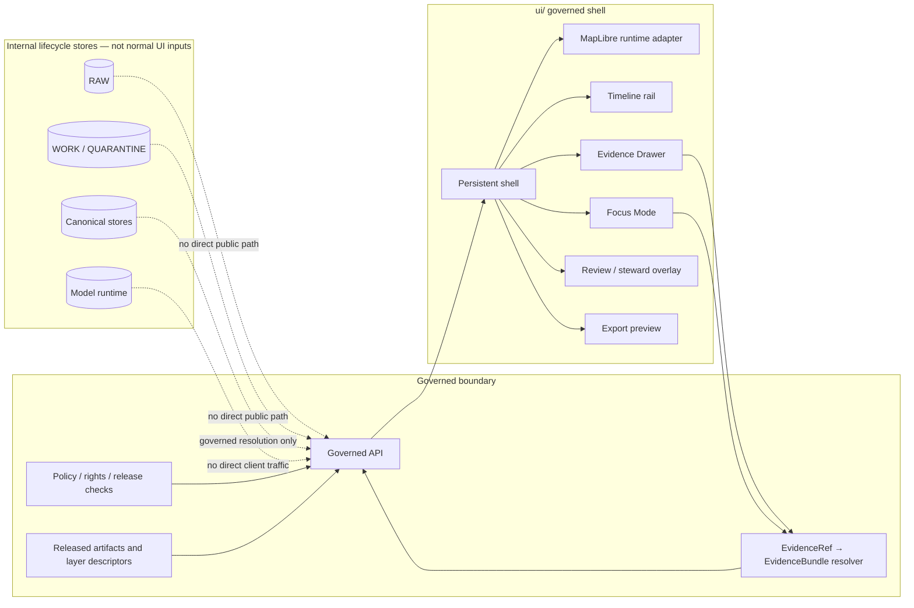

<!-- [KFM_META_BLOCK_V2]
doc_id: kfm://doc/NEEDS-VERIFICATION-ui-readme
title: ui/
type: standard
version: v1
status: draft
owners: NEEDS_VERIFICATION-ui-owner
created: 2026-04-23
updated: 2026-04-27
policy_label: NEEDS_VERIFICATION
related: [
  <NEEDS_VERIFICATION: ../README.md>,
  <NEEDS_VERIFICATION: ../docs/architecture/shell/README.md>,
  <NEEDS_VERIFICATION: ../docs/architecture/ai/README.md>,
  <NEEDS_VERIFICATION: ../contracts/README.md>,
  <NEEDS_VERIFICATION: ../schemas/README.md>,
  <NEEDS_VERIFICATION: ../policy/README.md>,
  <NEEDS_VERIFICATION: ../tests/README.md>
]
tags: [kfm, ui, maplibre, shell, evidence-drawer, focus-mode, trust-visible]
notes: [
  "Requested target path is ui/README.md.",
  "Current-session workspace did not expose a mounted KFM repository tree; child paths, owner, policy label, framework, package manager, routes, tests, CI, and related repo links need maintainer verification.",
  "This README is grounded in KFM UI, MapLibre, governed-AI, and pipeline doctrine; revise after direct repo inspection confirms actual UI framework, package manager, routes, contracts, tests, and CI conventions."
]
[/KFM_META_BLOCK_V2] -->

<a id="top"></a>

# `ui/`

<p align="center">
  <strong>Map-first • time-aware • evidence-visible • governed shell surface for Kansas Frontier Matrix</strong>
</p>

<p align="center">
  
  
  
  
  
  
</p>

<p align="center">
  <a href="#scope">Scope</a> ·
  <a href="#repo-fit">Repo fit</a> ·
  <a href="#inputs">Inputs</a> ·
  <a href="#exclusions">Exclusions</a> ·
  <a href="#directory-tree">Directory tree</a> ·
  <a href="#quickstart">Quickstart</a> ·
  <a href="#validation">Validation</a> ·
  <a href="#rollback-and-correction">Rollback</a>
</p>

> [!IMPORTANT]
> This README is repo-ready guidance, not proof of current implementation. Claims about actual files, child directories, package manager, routes, schemas, tests, workflows, CI, runtime behavior, or deployment posture remain `UNKNOWN` until verified from a mounted KFM repository checkout.

| Field | Value |
|---|---|
| Status | `draft` |
| Owners | `NEEDS_VERIFICATION-ui-owner` |
| Target path | `ui/README.md` |
| Evidence mode | `CORPUS_ONLY / NO_LOCAL_REPO_EVIDENCE` |
| Implementation depth | `UNKNOWN` |
| Policy label | `NEEDS_VERIFICATION` |
| Repo fit | `NEEDS VERIFICATION: confirm ui/ exists and is the actual browser-facing UI home` |
| Public posture | Cite-or-abstain; fail closed on unresolved rights, sensitivity, release state, or evidence closure |

| What this document does | What it does not do |
|---|---|
| Defines the governed role of `ui/` as a KFM trust surface. | Does not prove that `ui/` exists in the current repository. |
| Sets expectations for MapLibre, Evidence Drawer, Focus Mode, review, export, and shell state. | Does not authorize public release or direct source/model access. |
| Provides validation, rollback, and verification gates for maintainers. | Does not replace schema, policy, proof, release, or EvidenceBundle resolution. |

---

## Scope

`ui/` is the proposed home for KFM’s browser-facing governed shell materials when the mounted repository confirms that this directory is the UI surface.

The UI should be a persistent operating field where:

- **place and time stay coequal** through a map shell and timeline;
- **MapLibre acts as the disciplined 2D renderer**, not as the source of truth;
- **Evidence Drawer payloads remain mandatory** for consequential claims;
- **Focus Mode stays evidence-bounded** and renders finite outcomes;
- **review, correction, export, story, compare, and steward views remain shell variations**, not separate truth systems.

### Current evidence snapshot

| Claim | Status | README handling |
|---|---:|---|
| KFM doctrine calls for a map-first, time-aware, evidence-first, trust-visible shell. | `CONFIRMED doctrine` | Reflected as directory purpose and UI gates. |
| MapLibre is the preferred 2D runtime inside the governed shell. | `CONFIRMED doctrine / PROPOSED realization` | Treated as renderer boundary guidance. |
| Evidence Drawer and Focus Mode are core trust surfaces. | `CONFIRMED doctrine / PROPOSED implementation` | Included as required UI contract families. |
| Actual `ui/` child files, framework, package manager, route names, and DTOs. | `UNKNOWN` | Marked `NEEDS VERIFICATION`; no file existence is claimed. |
| This README’s target path. | `CONFIRMED by request` | Authored for `ui/README.md`. |

> [!CAUTION]
> The UI is part of the KFM evidence chain. It must not become a decorative map viewer, detached chatbot, hidden admin truth system, direct model client, or public shortcut into raw/internal stores.

<p align="right"><a href="#top">Back to top ↑</a></p>

---

## Repo fit

`ui/` should sit downstream of governed contracts, schemas, policy, release state, layer manifests, and EvidenceRef-to-EvidenceBundle resolution.

It should sit upstream of user-visible map exploration, dossier reading, story navigation, review overlays, Focus answers, compare views, and export previews.

| Relationship | Target | Status | What `ui/` should depend on |
|---|---|---:|---|
| Repository landing | `../README.md` | `NEEDS VERIFICATION` | Project identity, truth posture, repo-wide navigation. |
| Shell doctrine | `../docs/architecture/shell/README.md` | `NEEDS VERIFICATION` | Persistent shell, surface taxonomy, trust-visible UX. |
| Governed AI doctrine | `../docs/architecture/ai/README.md` | `NEEDS VERIFICATION` | Focus Mode envelope and model-runtime boundary. |
| Contracts | `../contracts/README.md` | `NEEDS VERIFICATION` | Human-readable surface, drawer, layer, and envelope contracts. |
| Schemas | `../schemas/README.md` | `NEEDS VERIFICATION` | Machine-readable payload validation. |
| Policy | `../policy/README.md` | `NEEDS VERIFICATION` | Rights, sensitivity, release, role, and public-safety rules. |
| Fixtures and tests | `../tests/README.md` | `NEEDS VERIFICATION` | Valid/invalid UI payloads and negative-state coverage. |

> [!WARNING]
> Keep relative paths as review placeholders until the real checkout confirms these homes. Convert placeholders to clickable links only after path verification.

<p align="right"><a href="#top">Back to top ↑</a></p>

---

## Inputs

The UI should consume prepared, governed, released, or review-authorized inputs only.

| Input family | Belongs here when… | Required trust posture |
|---|---|---|
| Shell state | It hydrates place, time, role, layers, release context, selected object, or active mode. | Preserve scope and release context. |
| Layer metadata | It describes released or steward-authorized layer meaning, source role, freshness, review state, sensitivity, and time semantics. | Do not hide business meaning inside style expressions alone. |
| MapLibre source/style adapters | They render approved delivery descriptors and versioned styles. | Preserve source/layer/style separation. |
| Evidence Drawer payloads | They expose support, provenance, rights, freshness, review, correction, and audit linkage for a claim or layer. | Keep consequential claims one hop from evidence. |
| Focus envelopes | They render `ANSWER`, `ABSTAIN`, `DENY`, or `ERROR` outcomes from governed API responses. | Never display raw model output as proof. |
| Review overlays | They expose role-gated queues, diffs, obligations, decisions, corrections, and rollback targets. | Use the same evidence law as public surfaces. |
| Accessibility labels and trust copy | They make trust cues usable without color-only interpretation. | Travel with claims, chips, layers, drawers, and outputs. |
| UI fixtures and snapshots | They verify rendering, negative states, and drawer/focus payload handling. | Include valid and invalid cases. |

<p align="right"><a href="#top">Back to top ↑</a></p>

---

## Exclusions

`ui/` must not become a dumping ground for truth, policy, runtime, or data lifecycle material.

| Do **not** put here | Goes instead | Reason |
|---|---|---|
| RAW, WORK, QUARANTINE, or unpublished candidate data | `../data/` lifecycle homes after verification | Public and steward UI must not read internal lifecycle stores directly. |
| Source descriptors and source activation rules | `../data/registry/` or `../docs/sources/` after verification | Source authority is not a renderer concern. |
| Canonical object schemas | `../schemas/` after verification | UI consumes contracts; it does not define canonical truth alone. |
| Human-readable contracts | `../contracts/` after verification | UI implements and tests contract behavior. |
| Rego/policy rules or release gates | `../policy/` after verification | UI displays policy state; backend policy must enforce it. |
| Model adapters, prompts, or runtime provider config | Governed API / AI architecture home after verification | Focus Mode must not call a model runtime directly. |
| Generated proof packs, receipts, release manifests, or catalogs | `../data/`, `../reports/`, or release homes after verification | UI may link to proof objects but should not become their store. |
| Detached admin console behavior | Role-gated shell variation | Review state is part of meaning and should stay connected to the same shell. |

<p align="right"><a href="#top">Back to top ↑</a></p>

---

## Directory tree

The tree below reflects the initialized `ui/` structure in this repository as of 2026-04-27. Child folders are scaffolded and ready for contract/implementation-specific expansion.

```text
ui/
├── README.md                                  # this file
├── shell/                                     # NEEDS VERIFICATION: persistent shell frame and state hydration
├── maplibre/                                  # NEEDS VERIFICATION: MapLibre runtime adapter and layer bindings
├── evidence-drawer/                           # NEEDS VERIFICATION: drawer mappers, renderers, trust chips
├── focus/                                     # NEEDS VERIFICATION: finite outcome rendering and cited-evidence actions
├── story/                                     # NEEDS VERIFICATION: story surfaces that preserve map/time/evidence
├── review/                                    # NEEDS VERIFICATION: steward-only shell variation
├── compare/                                   # NEEDS VERIFICATION: asymmetric compare/split state
├── export/                                    # NEEDS VERIFICATION: trust-preserving preview and share/export views
├── accessibility/                             # NEEDS VERIFICATION: labels, keyboard flows, reduced-motion notes
└── __tests__/                                 # NEEDS VERIFICATION: UI fixtures, snapshots, negative-state tests
```

> [!TIP]
> If the real repo uses `apps/web/`, `apps/explorer-web/`, `src/`, `packages/ui/`, or another UI home, keep this README’s doctrine but migrate the path through an ADR or migration note instead of silently duplicating UI authority.

<p align="right"><a href="#top">Back to top ↑</a></p>

---

## Quickstart

Use this verification quickstart only after opening the real KFM repository root.

```bash
# 1. Confirm repo state before editing.
git status --short
git branch --show-current

# 2. Verify whether ui/ is the real UI home.
test -d ui && find ui -maxdepth 2 -type f | sort

# 3. Inspect adjacent documentation and machine-contract surfaces.
find docs contracts schemas policy tests data -maxdepth 2 -name README.md -print 2>/dev/null | sort

# 4. Search for existing shell, drawer, focus, and MapLibre implementation before adding new files.
if command -v rg >/dev/null 2>&1; then
  rg -n "MapLibre|Evidence Drawer|EvidenceDrawer|Focus Mode|FocusPanel|DecisionEnvelope|ANSWER|ABSTAIN|DENY|ERROR" \
    ui docs contracts schemas policy tests apps packages 2>/dev/null | head -200
else
  grep -RInE "MapLibre|Evidence Drawer|EvidenceDrawer|Focus Mode|FocusPanel|DecisionEnvelope|ANSWER|ABSTAIN|DENY|ERROR" \
    ui docs contracts schemas policy tests apps packages 2>/dev/null | head -200
fi
```

Expected outcome:

- `CONFIRMED`: existing UI files and conventions are identified.
- `UNKNOWN`: missing framework, route, package, or contract details are recorded rather than guessed.
- `PROPOSED`: new folders or files are added only after they fit the verified repo structure.

<p align="right"><a href="#top">Back to top ↑</a></p>

---

## Usage

### Add or revise a UI surface

1. Identify the shell mode: Explore, Dossier, Story, Focus, Review, Compare, Export, Diagnostics, or controlled 3D.
2. Confirm the governed API or released artifact that supplies the payload.
3. Verify the payload contract and schema home.
4. Render trust cues at the point of use: scope, freshness, evidence state, policy, review, knowledge character, AI participation, and correction lineage.
5. Add valid and invalid fixtures.
6. Test all negative outcomes that the surface can receive.
7. Record any path, contract, or source-status ambiguity as `NEEDS VERIFICATION`.

### Add or revise a MapLibre layer binding

A MapLibre layer binding should be thin, inspectable, and governed:

- accept released delivery descriptors;
- keep business meaning in layer metadata, not only in style JSON;
- preserve stable feature identity needed for drawer selection;
- avoid heavy analysis in the browser;
- never call raw source endpoints as a public shortcut.

### Add or revise Focus Mode rendering

Focus Mode is an evidence-bounded shell surface. It should render the governed response envelope and supporting evidence controls, not a free-form assistant transcript.

| Outcome | Meaning | UI behavior |
|---|---|---|
| `ANSWER` | Evidence resolved and policy allows the scoped answer. | Show structured synthesis, citations, scope echo, and Evidence Drawer actions. |
| `ABSTAIN` | Evidence is missing, unresolved, ambiguous, stale, or insufficient. | Show reason, scope, and evidence/refinement actions. |
| `DENY` | Policy, role, rights, release state, or sensitivity forbids release. | Show safe denial copy and allowed next steps. |
| `ERROR` | Service, schema, catalog, resolver, runtime, or validation failure. | Show fault-safe copy and avoid invented fallback answers. |

<p align="right"><a href="#top">Back to top ↑</a></p>

---

## Diagram



<p align="right"><a href="#top">Back to top ↑</a></p>

---

## Reference tables

### Surface responsibilities

| Surface | Must do | Must never do |
|---|---|---|
| Explore | Keep map, time, selected layers, and trust cues coordinated. | Become a generic basemap browser. |
| Dossier | Present a durable claim/object view with scope, policy, evidence, and outward actions. | Detach claims from evidence or release state. |
| Story | Guide narrative while keeping map, time, citations, and drawer actions alive. | Become citation-free storytelling. |
| Evidence Drawer | Act as the mandatory trust object for claims, layers, Focus outputs, and exports. | Hide support, rights, freshness, review, correction, or audit state. |
| Focus Mode | Provide evidence-bounded synthesis with finite outcomes. | Operate as a sovereign free-form chatbot. |
| Review / Steward | Expose review queues, diffs, obligations, corrections, and decisions as role-gated shell variations. | Create a hidden administrative truth system. |
| Compare | Preserve asymmetric time, support, and release context on each side. | Flatten unlike states into one simplified summary. |
| Export | Preview outward artifacts with trust cues and provenance intact. | Strip correction, generalization, or release context. |
| Controlled 3D | Carry a real explanatory burden while preserving the same trust objects. | Turn KFM into spectacle-first 3D. |

### State ownership

| State | UI responsibility | Source of authority |
|---|---|---|
| Camera, hover, panel open/closed, selected shell mode | Own and persist safely where appropriate. | UI shell. |
| Active geography, time scope, selected layers, role, release window | Display and serialize without silently changing meaning. | Shell state contract. |
| Layer meaning, knowledge character, source role, freshness, review state | Render from metadata payloads. | Governed API / layer metadata. |
| Evidence support and citations | Open drawer and link to resolved support. | EvidenceBundle resolver. |
| Rights, sensitivity, policy, public-safe/generalized posture | Display clearly; do not enforce alone. | Backend policy and release checks. |
| Focus answer state | Render finite outcome envelope. | Governed API / AI adapter boundary. |
| Correction, supersession, withdrawal, rollback reference | Keep visible on affected claims and exports. | Release/proof/correction records. |

### MapLibre governance

| Layer | KFM rule |
|---|---|
| Source registry | Released source IDs only; no raw public source URLs. |
| Layer metadata registry | Business meaning, knowledge character, policy/freshness/review state, evidence route, compare/export eligibility, and time semantics live outside style expressions. |
| Style registry | Versioned style JSON, sprites, glyphs, fonts, and visual variants are presentation assets. |
| Runtime adapter registry | Protocol adapters and plugins require explicit allow-listing and auditability. |
| Browser runtime | Browse, filter, inspect, highlight, and rehydrate; do not perform heavy trust-bearing computation. |

<p align="right"><a href="#top">Back to top ↑</a></p>

---

## Security and exposure posture

KFM may be locally hosted and exposed through a home firewall, reverse proxy, or VPN for trusted third-party access. `ui/` must assume that UI mistakes can become public exposure mistakes.

| Boundary | UI rule |
|---|---|
| Public browser | No RAW, WORK, QUARANTINE, canonical store, graph internals, object-store handles, vector index, model runtime, credentials, or private endpoint access. |
| Governed API | All consequential claim, Focus, evidence, export, and layer-resolution behavior goes through governed routes. |
| Model runtime | No direct browser calls. Focus Mode renders backend envelopes only. |
| Telemetry | No raw evidence, prompt text, restricted geometry, secrets, or full EvidenceBundle copies. |
| Exports | Rights, sensitivity, release state, citation, correction, and proof references travel with the export or the export is denied. |
| Admin/steward controls | Role-gated, auditable, and shell-linked; not a separate public shortcut. |

> [!CAUTION]
> If access, authentication, source rights, sensitivity, or deployment posture is unclear, UI behavior should fail closed and record the verification gap.

<p align="right"><a href="#top">Back to top ↑</a></p>

---

## Validation

Use this as the minimum review gate before treating `ui/` changes as ready.

- [ ] `ui/` location and child tree verified in the mounted repo.
- [ ] Owner(s), policy label, and doc ID replaced with confirmed values.
- [ ] Adjacent README links converted from placeholders only after paths exist.
- [ ] UI framework, package manager, test runner, route system, and build scripts verified.
- [ ] No UI code reads RAW, WORK, QUARANTINE, canonical stores, graph internals, vector indexes, or live source endpoints directly.
- [ ] No UI code calls model runtimes directly.
- [ ] Evidence Drawer payload includes support, source role, knowledge character, EvidenceRef/EvidenceBundle identity, scope, rights, sensitivity, freshness, review, provenance, correction state, and audit linkage.
- [ ] Focus rendering covers `ANSWER`, `ABSTAIN`, `DENY`, and `ERROR`.
- [ ] Trust chips are accessible by text, not color alone.
- [ ] MapLibre source/layer/style responsibilities remain separated.
- [ ] Layer metadata includes time semantics and release/review context.
- [ ] Export preview preserves trust cues, correction state, and generalization context.
- [ ] Valid and invalid fixtures exist for drawer, focus, shell state, and layer metadata payloads.
- [ ] Tests cover empty states, denial states, stale evidence, restricted precision, schema mismatch, citation failure, and resolver failure.
- [ ] Any 3D surface passes a burden-of-proof review and preserves the same drawer/policy/rollback model.
- [ ] Rollback path is documented for any new UI contract, adapter, or outward-facing state.

<p align="right"><a href="#top">Back to top ↑</a></p>

---

## Definition of Done

A UI change is not done because it renders. It is done when rendering, evidence, policy, and rollback remain inspectable.

- [ ] Evidence basis is stated.
- [ ] Required placeholders are visible and tracked.
- [ ] No unsupported implementation claims appear.
- [ ] Links and badges are verified or marked `NEEDS VERIFICATION`.
- [ ] Consequential UI claims open an Evidence Drawer path.
- [ ] Focus Mode finite outcomes are rendered and tested.
- [ ] Negative states are visible and accessible.
- [ ] No direct public path exists to raw/internal stores or model runtimes.
- [ ] Validation fixtures include positive and negative cases.
- [ ] Rollback/correction path is stated where relevant.

<p align="right"><a href="#top">Back to top ↑</a></p>

---

## Rollback and correction

| Change type | Rollback path | Correction note |
|---|---|---|
| Documentation-only README update | Revert the doc PR or restore prior README version. | Preserve why the rollback happened in a verification backlog or drift register. |
| New UI route or shell mode | Disable behind feature flag; retain old route entry until links are migrated. | Record affected routes, payload contracts, and any user-visible claims. |
| Evidence Drawer change | Revert schema/component together or keep backward-compatible parser. | If drawer meaning changed publicly, issue correction notes for affected exports or docs. |
| Focus Mode change | Disable Focus route/client feature flag; leave Evidence Drawer and layer browsing intact. | Preserve finite outcome fixtures and citation-failure tests. |
| MapLibre adapter change | Swap adapter to no-op/static mock if runtime integration fails. | Keep `MapRuntimePort` or equivalent boundary so failure does not leak into truth semantics. |
| Policy ambiguity | Revert policy bundle or fail closed while ambiguous. | Do not “temporarily allow” sensitive or unresolved outputs to preserve UX polish. |
| Export behavior | Disable export creation; preserve preview with denial reason. | Do not issue outward artifacts that lose release, correction, or evidence context. |

<p align="right"><a href="#top">Back to top ↑</a></p>

---

## FAQ

### Is `ui/` the source of truth?

No. `ui/` is a governed interpretation and interaction surface. EvidenceBundle, policy, release state, proof objects, and canonical data stores outrank UI rendering.

### Can the UI hide trust metadata to keep the interface clean?

No. The UI can design trust cues elegantly, but scope, evidence support, freshness, policy, review, and correction state must stay visible where meaning changes.

### Can Focus Mode answer without evidence?

No. Missing or inadequate evidence should produce `ABSTAIN`; forbidden release should produce `DENY`; service failure should produce `ERROR`.

### Can MapLibre styles encode business meaning?

Only presentation-level meaning. KFM business semantics, source roles, trust cues, review state, policy posture, and evidence routes belong in governed metadata/contracts, not silently inside style expressions.

### What if the real UI lives somewhere else?

Preserve this README’s doctrine, then move or cross-link it through a small ADR-backed change. Do not leave two competing UI authority pages.

<p align="right"><a href="#top">Back to top ↑</a></p>

---

## Appendix

<details>
<summary>Verification backlog for maintainers</summary>

| Item | Status | How to resolve |
|---|---:|---|
| `ui/` exists in mounted repo | `NEEDS VERIFICATION` | Inspect repo root and update this README. |
| UI framework | `UNKNOWN` | Check package files and app structure. |
| Package manager | `UNKNOWN` | Verify lockfiles and scripts. |
| Component naming | `UNKNOWN` | Search existing shell, drawer, focus, review, and MapLibre files. |
| Contract/schema homes | `NEEDS VERIFICATION` | Inspect `contracts/` and `schemas/` README files. |
| Policy engine and policy home | `NEEDS VERIFICATION` | Inspect `policy/` and CI workflows. |
| Test runner | `UNKNOWN` | Inspect package config, test directories, and CI. |
| Owners | `NEEDS VERIFICATION` | Confirm CODEOWNERS, maintainers, or project governance docs. |
| Accessibility standard | `NEEDS VERIFICATION` | Confirm project accessibility rules or add them. |
| Release/proof/correction link targets | `NEEDS VERIFICATION` | Inspect release, reports, data, receipts, proofs, and catalog homes. |
| Local exposure model | `NEEDS VERIFICATION` | Inspect reverse proxy, VPN, firewall, auth, CORS, log, and secret-handling docs. |

</details>

<details>
<summary>Useful terms</summary>

| Term | Working meaning in this README |
|---|---|
| Governed shell | Persistent KFM operating field where map, time, evidence, policy, review, and outward actions remain coordinated. |
| Evidence Drawer | Mandatory trust object that exposes support, provenance, rights, sensitivity, freshness, review, correction, and audit context. |
| Focus Mode | Evidence-bounded synthesis surface inside the shell, with finite runtime outcomes. |
| Trust chip | Compact visible cue for scope, freshness, evidence state, policy, review, knowledge character, AI participation, or correction. |
| Layer metadata | Governed meaning and trust context attached to a rendered layer. |
| Style JSON | MapLibre presentation contract for drawing sources as layers. |
| Released artifact | Public or steward-authorized output that passed the appropriate validation, policy, catalog, proof, and promotion gates. |
| Public-safe geometry | Geometry generalized, redacted, delayed, or withheld as required by rights, sensitivity, steward review, or policy. |

</details>

<details>
<summary>Source-basis notes to link after repo inspection</summary>

This README was drafted from KFM UI, MapLibre, governed-AI, and pipeline doctrine available in the current project corpus.

| Source family | Repo action after verification |
|---|---|
| KFM MapLibre Operating Architecture | Link from the UI architecture docs or source ledger. |
| KFM MapLibre UI Architecture and Governed Interaction Design | Link from shell, Evidence Drawer, Focus Mode, and layer-governance docs. |
| KFM Whole-UI + Governed AI Expansion | Link from UI implementation plan, object map, and validation backlog. |
| Ollama / governed-AI runtime guidance | Link from Focus Mode and model-runtime boundary docs. |
| Pipeline Living Implementation Manual | Link from lifecycle, governed API, and object-family docs. |

</details>

<p align="right"><a href="#top">Back to top ↑</a></p>