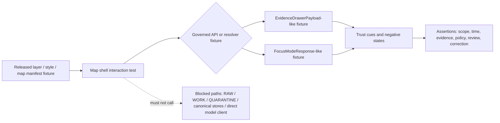

<!-- [KFM_META_BLOCK_V2]
doc_id: kfm://doc/REVIEW_REQUIRED_UUID
title: UI Test Surface
type: standard
version: v1
status: draft
owners: REVIEW_REQUIRED_OWNER
created: REVIEW_REQUIRED_CREATED_DATE
updated: 2026-04-27
policy_label: REVIEW_REQUIRED_POLICY_LABEL
related: [../README.md, ../../docs/architecture/shell/README.md, ../../docs/architecture/ai/README.md, ../../contracts/README.md, ../../schemas/README.md, ../../policy/README.md, ../../tests/fixtures/README.md]
tags: [kfm, ui, tests, evidence-drawer, focus-mode, maplibre]
notes: [Target path is ui/__tests__/README.md; current draft was prepared without mounted repo evidence; owners, created date, policy label, related paths, test runner, and local file inventory need verification against the active branch.]
[/KFM_META_BLOCK_V2] -->

# UI Test Surface

Fixture-first tests for KFM’s governed UI shell, Evidence Drawer, Focus Mode, trust cues, and renderer boundary.

> **Status:** `experimental` · **Doc status:** `draft` · **Owners:** `REVIEW_REQUIRED_OWNER`  
> **Path:** `ui/__tests__/README.md`  
>       
> **Quick jumps:** [Scope](#scope) · [Repo fit](#repo-fit) · [Inputs](#inputs) · [Exclusions](#exclusions) · [Directory tree](#directory-tree) · [Quickstart](#quickstart) · [Diagram](#diagram) · [Test matrix](#test-matrix) · [Definition of done](#definition-of-done)

> [!IMPORTANT]
> This directory should test the public UI trust membrane. It should not make the browser, renderer, popup text, fixture prose, or model output behave like canonical truth.

---

## Scope

`ui/__tests__/` is the local test surface for UI behavior that must stay faithful to KFM’s governed shell doctrine:

- MapLibre is a downstream renderer and interaction runtime.
- Evidence Drawer is the mandatory trust object for consequential map-facing claims.
- Focus Mode is evidence-bounded synthesis with finite outcomes: `ANSWER`, `ABSTAIN`, `DENY`, and `ERROR`.
- Trust cues for scope, freshness, evidence state, rights, sensitivity, review state, knowledge character, and AI participation remain visible at the point of use.
- Negative states are first-class UI states, not copywriting problems to smooth away.

Current implementation status for this directory is **UNKNOWN** until the active branch is inspected.

[:arrow_up_small: Back to top](#ui-test-surface)

---

## Repo fit

| Field | Value |
|---|---|
| Local path | `ui/__tests__/` |
| This file | `ui/__tests__/README.md` |
| Upstream UI surface | [`../README.md`](../README.md) — **NEEDS VERIFICATION** |
| Upstream shell doctrine | [`../../docs/architecture/shell/README.md`](../../docs/architecture/shell/README.md) — **NEEDS VERIFICATION** |
| Upstream AI / Focus doctrine | [`../../docs/architecture/ai/README.md`](../../docs/architecture/ai/README.md) — **NEEDS VERIFICATION** |
| Upstream contracts | [`../../contracts/README.md`](../../contracts/README.md) — **NEEDS VERIFICATION** |
| Upstream schemas | [`../../schemas/README.md`](../../schemas/README.md) — **NEEDS VERIFICATION** |
| Upstream policy | [`../../policy/README.md`](../../policy/README.md) — **NEEDS VERIFICATION** |
| Shared fixtures | [`../../tests/fixtures/README.md`](../../tests/fixtures/README.md) — **NEEDS VERIFICATION** |
| Downstream consumers | UI component tests, shell regression tests, Focus Mode fixtures, Evidence Drawer fixtures, accessibility checks, and CI jobs once verified |
| Runtime boundary | Tests here may mock governed API responses, but must not imply direct public access to `RAW`, `WORK`, `QUARANTINE`, canonical stores, hidden geometry, or model runtimes |

> [!NOTE]
> The links above are intended repo-relative homes. Validate them against the mounted repository before committing this README.

[:arrow_up_small: Back to top](#ui-test-surface)

---

## Inputs

Accepted inputs for this directory:

| Input | Belongs here when… | Minimum review posture |
|---|---|---|
| UI unit or component tests | They exercise shell-visible behavior such as trust chips, drawer opening, outcome banners, keyboard navigation, or visible negative states. | **NEEDS VERIFICATION** against local runner and component framework |
| Evidence Drawer fixtures | They represent public-safe `EvidenceDrawerPayload`-like data returned by a governed API or resolver fixture. | Must include support, scope, policy, review, freshness, and correction cues where applicable |
| Focus Mode fixtures | They represent `ANSWER`, `ABSTAIN`, `DENY`, or `ERROR` envelopes and citation-validation behavior. | Must never rely on raw model prose as the asserted truth |
| Layer / trust badge fixtures | They prove released layer metadata, source role, review state, rights/sensitivity posture, and time context are rendered visibly. | Must not include raw or restricted source paths |
| Regression fixtures | They preserve known negative-state behavior and stop future UI polish from hiding governance failures. | Must include at least one failure or withheld case, not only happy paths |
| Accessibility checks | They verify keyboard access, focus management, labels, and readable trust state for shell surfaces. | Must be paired with test-runner evidence after repo inspection |

Preferred fixture posture: small, no-network, public-safe, deterministic, and reviewable in Git.

[:arrow_up_small: Back to top](#ui-test-surface)

---

## Exclusions

Do not put these here unless the active repo already documents a local exception.

| Excluded item | Put it here instead | Reason |
|---|---|---|
| Canonical schemas | `../../schemas/` or `../../contracts/` after schema-home verification | UI tests consume contracts; they do not define canonical object shapes |
| Policy rules | `../../policy/` | UI tests assert policy-visible effects; policy logic should remain backend-enforced |
| Shared cross-domain fixtures | `../../tests/fixtures/` | Avoid duplicating fixture authority under a UI-only path |
| Live source data | `../../data/raw/`, `../../data/work/`, `../../data/quarantine/`, or source-specific lifecycle paths | UI tests must stay public-safe and no-network by default |
| Proof packs, receipts, or release manifests | `../../data/proofs/`, `../../data/receipts/`, `../../release/`, or repo-native release paths | UI tests may reference emitted objects, not become their storage home |
| Production shell components | `../` or the repo-native app/component path | This directory tests UI behavior; it should not host production components |
| CI workflow YAML | `../../.github/workflows/` | Workflows call tests and validators; they should not live inside UI test fixtures |
| Direct model-runtime tests | AI adapter / runtime package tests after repo inspection | Browser-facing tests should prove no direct model-client path |

[:arrow_up_small: Back to top](#ui-test-surface)

---

## Directory tree

**PROPOSED organization — verify against the actual `ui/__tests__/` inventory before applying.**

```text
ui/__tests__/
├── README.md
├── evidence-drawer/           # PROPOSED: drawer payload rendering and failure-state tests
├── focus-mode/                # PROPOSED: finite outcome and citation-state tests
├── map-shell/                 # PROPOSED: shell continuity, time scope, and layer selection tests
├── trust-cues/                # PROPOSED: chips, badges, review state, freshness, and sensitivity tests
├── accessibility/             # PROPOSED: keyboard and assistive-technology smoke checks
└── fixtures/                  # PROPOSED: UI-local public-safe fixtures only
```

If the mounted repo already uses another structure, keep the repo-native layout and update this README instead of moving files just to match the tree above.

[:arrow_up_small: Back to top](#ui-test-surface)

---

## Quickstart

Start with discovery. The current package manager, test runner, app framework, and CI entrypoints are **UNKNOWN** until verified from the active branch.

```bash
# Run from the repository root.
git status --short
git branch --show-current || true

# Inspect the local UI test surface.
find ui/__tests__ -maxdepth 3 -type f | sort

# Discover repo-native test tooling before running anything.
find . -maxdepth 3 \( \
  -name package.json -o \
  -name pnpm-lock.yaml -o \
  -name yarn.lock -o \
  -name package-lock.json -o \
  -name vitest.config.\* -o \
  -name jest.config.\* -o \
  -name playwright.config.\* \
\) -print

# Inspect declared scripts without assuming a package manager.
grep -RInE '"test"|"vitest"|"jest"|"playwright"|ui' package.json ./*/package.json 2>/dev/null || true
```

After discovery, run the repo-native UI test command declared by the checked-in configuration. Do not add a new test runner solely for this directory without an ADR or maintainer approval.

[:arrow_up_small: Back to top](#ui-test-surface)

---

## Diagram



The diagram is intentionally fixture-first. UI tests should prove visible trust behavior without requiring live source connectors, unpublished data, or model-runtime access.

[:arrow_up_small: Back to top](#ui-test-surface)

---

## Test matrix

| Test family | What it should prove | Must not imply |
|---|---|---|
| Renderer boundary | Map shell tests render released artifacts and identify candidate features without treating feature properties as evidence authority. | MapLibre decides truth, policy, release state, or citation validity. |
| Evidence Drawer | Consequential claims open or link to a drawer-ready payload with support, scope, policy, freshness, review, and correction cues. | Drawer is an optional tooltip, generic citation list, or raw-property dump. |
| Focus Mode | `ANSWER`, `ABSTAIN`, `DENY`, and `ERROR` render as typed outcomes with safe explanations and citation state. | Browser calls a model runtime directly or displays raw model prose without envelope context. |
| Trust cues | Scope, freshness, evidence state, rights/sensitivity, review state, knowledge character, and AI participation stay visible where meaning changes. | Trust metadata is hidden in developer-only panels or stripped during export/share flows. |
| Time state | Active time scope travels from map interaction into drawer and Focus fixtures. | Visual time and evidence time silently diverge. |
| Negative states | `MISSING_EVIDENCE`, `SOURCE_STALE`, `DENIED_BY_POLICY`, `GENERALIZED_GEOMETRY`, `RESTRICTED_ACCESS`, `CONFLICTED_SUPPORT`, `CITATION_FAILED`, `RELEASE_WITHDRAWN`, and `RUNTIME_ERROR` remain distinguishable when supported by fixtures. | Empty UI, neutral copy, or success styling hides governance failure. |
| Accessibility | Keyboard users can reach the drawer, outcome banner, evidence links, and trust chips. | Trust state depends only on color, hover, or spatial position. |
| Continuity | Existing fixtures and screenshots are preserved, migrated, or explicitly superseded. | A UI cleanup silently breaks prior review expectations. |

[:arrow_up_small: Back to top](#ui-test-surface)

---

## Fixture rules

Use this table when creating or reviewing fixtures.

| Rule | Why it matters |
|---|---|
| Keep fixtures public-safe unless a test is explicitly role-gated and redacted. | UI tests should not leak restricted geometry, steward-only fields, source secrets, or private review details. |
| Include negative cases beside happy paths. | KFM’s trust posture depends on visible abstention, denial, and error states. |
| Prefer IDs and summaries over full raw source payloads. | The public UI should consume governed payloads, not canonical stores. |
| Echo place, time, release, and review scope. | Users should know the boundary of the claim before trusting it. |
| Include citation or evidence references where claims are consequential. | Cite-or-abstain behavior must be testable. |
| Include correction or withdrawal state where relevant. | Correction lineage is part of the public meaning of a claim. |
| Keep generated artifacts out of this directory unless repo convention says otherwise. | Test output should not become fixture authority by accident. |

[:arrow_up_small: Back to top](#ui-test-surface)

---

## Definition of done

A UI test change in this directory is review-ready when the following are true:

- [ ] The active branch’s test runner and package manager have been verified.
- [ ] The test uses repo-native naming, import, fixture, and assertion conventions.
- [ ] The test does not require live source connectors by default.
- [ ] The test does not expose or assert against `RAW`, `WORK`, `QUARANTINE`, hidden geometry, direct canonical-store paths, or direct model-runtime calls.
- [ ] The visible UI state includes scope, time, evidence, policy, review, freshness, and correction cues when applicable.
- [ ] `ABSTAIN`, `DENY`, and `ERROR` cases are not hidden behind empty or success-looking UI.
- [ ] Any fixture that resembles a contract object is backed by, or clearly linked to, the canonical schema/contract home.
- [ ] Accessibility assertions cover keyboard reachability for consequential trust surfaces.
- [ ] Material behavior changes update adjacent docs or include a clear reason why docs did not change.
- [ ] Rollback is simple: remove the test/fixture and restore prior UI behavior without touching canonical data.

[:arrow_up_small: Back to top](#ui-test-surface)

---

## Review notes for maintainers

Use the narrowest truthful label during review.

| Label | Use in this directory |
|---|---|
| **CONFIRMED** | Verified from mounted repo files, tests, configs, CI output, runtime traces, or generated artifacts. |
| **INFERRED** | Reasonable from adjacent repo structure, but not directly proven by the target file or test. |
| **PROPOSED** | Design-consistent but not implemented or not verified on the active branch. |
| **UNKNOWN** | Not knowable from available files or current test evidence. |
| **NEEDS VERIFICATION** | Checkable before merge, release, or publication. |

> [!WARNING]
> Do not upgrade a fixture name, path, component boundary, schema home, or workflow name from **PROPOSED** to **CONFIRMED** because it appears in this README. Confirm it from the active branch.

[:arrow_up_small: Back to top](#ui-test-surface)

---

## FAQ

### Why are raw feature properties discouraged in UI assertions?

Because rendered features are selection candidates, not evidence authority. Assert that the UI calls or consumes a governed resolver fixture and renders a drawer-ready trust payload.

### Should Focus Mode tests cover friendly conversational behavior?

Only after finite outcome behavior is covered. Focus Mode may be helpful, but it must remain evidence-bounded and must visibly distinguish `ANSWER`, `ABSTAIN`, `DENY`, and `ERROR`.

### Can tests mock policy decisions?

Yes, when the mock is structured like the repo’s canonical policy decision shape and the test asserts the visible policy consequence. Do not replace backend policy with browser-only logic.

### What happens if the actual repo uses `web/`, `apps/`, or another test path?

Keep the actual repo convention. Update this README’s repo-fit table, directory tree, and quickstart rather than forcing a new layout.

[:arrow_up_small: Back to top](#ui-test-surface)

---

<details>
<summary>Appendix A — negative-state vocabulary to preserve</summary>

Use exact repo-native enum names if they already exist. If they do not, the following vocabulary is a KFM-aligned review target, not a confirmed implementation inventory:

- `MISSING_EVIDENCE`
- `SOURCE_STALE`
- `DENIED_BY_POLICY`
- `GENERALIZED_GEOMETRY`
- `RESTRICTED_ACCESS`
- `CONFLICTED_SUPPORT`
- `CITATION_FAILED`
- `RELEASE_WITHDRAWN`
- `RUNTIME_ERROR`

Each state should have a visible, safe explanation and should avoid leaking restricted details.

</details>

<details>
<summary>Appendix B — metadata placeholders requiring review</summary>

Before publishing this README, verify and replace:

| Placeholder | Needed evidence |
|---|---|
| `REVIEW_REQUIRED_UUID` | Repo-native document ID registry or generated UUID policy |
| `REVIEW_REQUIRED_OWNER` | `CODEOWNERS`, local ownership docs, or maintainer assignment |
| `REVIEW_REQUIRED_CREATED_DATE` | Existing file history or creation decision |
| `REVIEW_REQUIRED_POLICY_LABEL` | Repo policy-label vocabulary |
| Related links | Active branch path inventory |
| Test command | Package manager and runner config |
| Directory tree | Actual `ui/__tests__/` contents |

</details>

[:arrow_up_small: Back to top](#ui-test-surface)