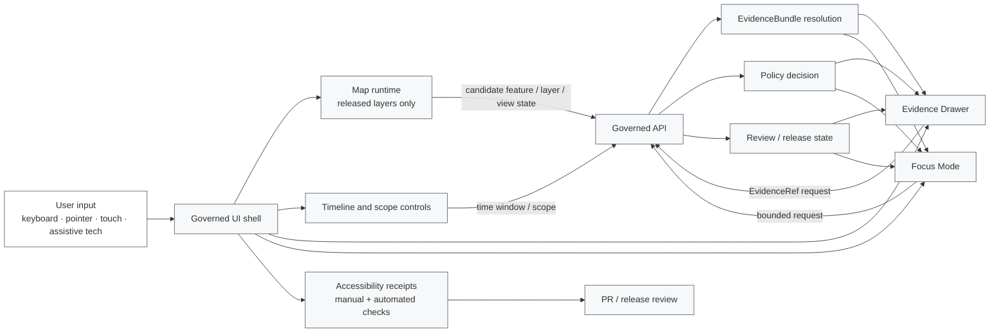

<!-- [KFM_META_BLOCK_V2]
doc_id: kfm://doc/TODO-uuid-ui-accessibility-readme
title: UI Accessibility
type: standard
version: v1
status: draft
owners: TODO: verify UI/accessibility owner
created: 2026-04-27
updated: 2026-04-27
policy_label: TODO-public-or-restricted
related: [TODO: verify parent UI README, TODO: verify UI architecture docs, TODO: verify accessibility test docs]
tags: [kfm, ui, accessibility, governed-ui, evidence-drawer, focus-mode]
notes: [Created as repo-ready draft from attached KFM doctrine; mounted repo, owner, links, doc_id, policy label, package manager, and test harness remain NEEDS VERIFICATION.]
[/KFM_META_BLOCK_V2] -->

# UI Accessibility

Accessibility guidance for KFM’s governed UI surfaces, with special attention to map-first interaction, Evidence Drawer legibility, Focus Mode outcomes, and trust-visible state.

<div align="center">


</div>

> [!IMPORTANT]
> **Status:** experimental  
> **Owners:** TODO — verify in `CODEOWNERS`, local UI team docs, or project governance records.  
> **Quick jumps:** [Scope](#scope) · [Repo fit](#repo-fit) · [Inputs](#inputs) · [Exclusions](#exclusions) · [Accessibility contract](#accessibility-contract) · [Surface checklist](#surface-checklist) · [Gates](#gates) · [Open verification](#open-verification)

---

## Scope

This directory is the accessibility control surface for the **KFM UI layer**.

Its job is to make accessibility review concrete enough that maintainers can test, discuss, and improve the public and steward-facing interface without weakening KFM’s evidence posture.

Accessibility in KFM is not only color contrast or screen-reader support. It also means:

- keyboard users can reach the same governed actions as pointer users;
- Evidence Drawer and Focus Mode outcomes are perceivable without relying only on map pixels;
- trust cues such as freshness, review state, sensitivity posture, denial, abstention, and correction status remain visible and programmatically understandable;
- map interactions have equivalent non-drag, non-hover, and non-visual paths;
- exports, stories, and review surfaces do not strip citations, release state, correction state, or generalization context.

**Working rule:** inaccessible trust cues count as hidden governance.

[Back to top](#ui-accessibility)

---

## Repo fit

| Field | Value |
|---|---|
| Target path | `ui/accessibility/README.md` |
| Parent area | `ui/` — NEEDS VERIFICATION |
| Upstream links | TODO: verify parent UI README and UI architecture docs after repo checkout is mounted |
| Downstream links | TODO: verify or create local checklist, fixtures, reports, and pattern docs |
| Primary audience | UI contributors, reviewers, stewards, QA, product owners, and documentation maintainers |
| Runtime boundary | UI surfaces must consume governed APIs and released artifacts; they must not read canonical, RAW, WORK, QUARANTINE, proof-pack, review-only, steward-only, or model-runtime stores directly |
| Accessibility standard target | PROPOSED: WCAG 2.2 Level AA as the baseline until project policy confirms another target |

> [!NOTE]
> Relative links are intentionally left as TODO placeholders because the mounted repository tree was not available during this draft. Replace them with verified repo-relative links before publication.

[Back to top](#ui-accessibility)

---

## Inputs

Accepted material for this directory:

| Input | Belongs here when it... |
|---|---|
| Accessibility checklists | Applies to KFM UI surfaces, especially map, drawer, timeline, review, export, and Focus Mode surfaces |
| Manual audit notes | Records tested browser, assistive technology, route/surface, scope, date, outcome, blocker, and remediation owner |
| Keyboard interaction maps | Defines tab order, roving focus, shortcut disclosure, non-drag alternatives, escape routes, and focus restoration |
| Evidence Drawer accessibility notes | Explains how source role, rights, sensitivity, freshness, review, correction, and audit fields are exposed to all users |
| Focus Mode accessibility notes | Explains how `ANSWER`, `ABSTAIN`, `DENY`, and `ERROR` outcomes are announced, navigable, and reviewable |
| Map interaction alternatives | Provides non-visual or non-pointer ways to select layers, query features, inspect time, and open evidence |
| Accessibility fixtures | Small public-safe UI payloads used to test statuses, negative states, sensitive geometry denial, stale sources, and citation failure |
| Test receipts | Summaries of accessibility checks that can be attached to PRs, release notes, or promotion dry runs |

[Back to top](#ui-accessibility)

---

## Exclusions

| Does not belong here | Goes elsewhere |
|---|---|
| Canonical evidence, RAW, WORK, QUARANTINE, or unpublished candidate data | Data lifecycle homes — NEEDS VERIFICATION |
| Source registry definitions | Source registry or governance docs — NEEDS VERIFICATION |
| Policy-as-code enforcement | `policy/` or equivalent policy home — NEEDS VERIFICATION |
| JSON Schemas for `EvidenceBundle`, `DecisionEnvelope`, `LayerManifest`, or `FocusModeResponse` | `schemas/`, `contracts/`, or resolved schema home — NEEDS VERIFICATION |
| UI source components | UI application source tree — NEEDS VERIFICATION |
| Security secrets, credentials, tokens, or private test accounts | Never commit; use approved secret-management path |
| Public conformance claims without test evidence | Release/proof documentation after validation |
| Emergency or life-safety instructions generated by map summaries or Focus Mode | Official-source contextual links only; KFM is not an emergency alert system |

[Back to top](#ui-accessibility)

---

## Accessibility contract

KFM UI accessibility has two layers:

1. **General web accessibility:** perceivable, operable, understandable, and robust UI behavior.
2. **KFM trust accessibility:** evidence, policy, review, sensitivity, freshness, correction, and refusal states remain visible, navigable, and testable.

### Minimum expectations

| Area | Requirement | Status |
|---|---|---|
| Keyboard access | Every interactive control must be reachable and operable without pointer-only gestures | PROPOSED |
| Focus visibility | Focus must remain visible, predictable, and not obscured by drawers, overlays, legends, popovers, or map controls | PROPOSED |
| Non-visual evidence access | Map-derived claims must be inspectable through Drawer/Dossier paths, not only through visual feature styling | PROPOSED |
| Negative states | `ABSTAIN`, `DENY`, `ERROR`, stale source, missing evidence, restricted access, and citation failure states must be explicit | CONFIRMED doctrine / PROPOSED implementation |
| Color and contrast | Trust badges, legends, layer chips, and status indicators must not depend on color alone | PROPOSED |
| Reduced motion | Time brushing, map animations, story transitions, and Focus re-highlighting must respect reduced-motion preferences | PROPOSED |
| Drag alternatives | Drag, pan, brush, and lasso interactions must have keyboard or single-pointer alternatives where feasible | PROPOSED |
| Status messages | Runtime status, validation outcomes, denied access, and async loading states must be exposed without stealing focus | PROPOSED |
| Export continuity | Export previews must preserve accessible trust metadata, citations, release IDs, correction state, and generalization notes | PROPOSED |
| No bypass | Accessibility shortcuts must not become raw/canonical access paths | CONFIRMED doctrine / PROPOSED implementation |

> [!TIP]
> Treat “can a keyboard-only user find the evidence?” as a release question, not a polish question.

[Back to top](#ui-accessibility)

---

## Surface checklist

### Map shell

| Check | Done when |
|---|---|
| Layer list is keyboard reachable | Users can open, search, toggle, and inspect layer metadata without dragging or hovering |
| Map selection has an equivalent path | Users can select by list, search, feature table, or governed query when map click is impractical |
| View state is announced or inspectable | Place, time window, active layer, release ID, and selection state are exposed outside the canvas |
| Legend is not color-only | Symbols, labels, textures, text, or equivalent descriptions identify meaning |
| Hidden/restricted features are not leaked | Generalization, withholding, or denial states are displayed without exposing protected precision |
| Popups stay non-authoritative | Popups can preview, but consequential claims route to governed Drawer/Dossier resolution |

### Evidence Drawer

| Check | Done when |
|---|---|
| Drawer title is meaningful | Claim title and evidence state are programmatically named |
| Trust fields are structured | Source role, knowledge character, rights, sensitivity, freshness, review, correction, and audit fields are navigable |
| Long evidence is scannable | Sections, headings, lists, and summaries are readable without visual layout dependence |
| Redaction is explained | Generalization or redaction transform is stated without exposing restricted details |
| Focus management is safe | Opening and closing the drawer restores focus predictably |
| Errors are first-class | Missing evidence, denied policy, stale sources, or citation failure are not hidden behind empty content |

### Focus Mode

| Check | Done when |
|---|---|
| Outcome banner is explicit | `ANSWER`, `ABSTAIN`, `DENY`, and `ERROR` are visible, announced, and not color-only |
| Scope is echoed | Geography, time window, role, release, and evidence pool are readable before and after response |
| Citations are operable | Cited evidence can be opened from keyboard and assistive technology paths |
| Refusal is useful | Abstain/deny/error states include reason codes, obligations, or next review path where policy permits |
| Generated language remains subordinate | The response does not outrank EvidenceBundle, policy, review state, or release state |
| Re-highlight is optional | Map re-highlighting is helpful but not required to understand the answer |

### Review and export

| Check | Done when |
|---|---|
| Review state is accessible | Draft, reviewed, promoted, withdrawn, superseded, corrected, or restricted states are exposed as text |
| Steward actions are guarded | Role-gated controls are named, confirmed, logged, and reversible where required |
| Export preview is inspectable | Exported map/story artifacts carry trust metadata and accessible summaries |
| Correction lineage travels | Users can discover whether an output has been corrected, superseded, or withdrawn |

[Back to top](#ui-accessibility)

---

## Diagram



[Back to top](#ui-accessibility)

---

## Proposed directory shape

NEEDS VERIFICATION: create or revise only after the real repo tree and local documentation conventions are inspected.

```text
ui/accessibility/
├── README.md                  # This file
├── CHECKLIST.md               # PROPOSED: reusable review checklist
├── patterns/                  # PROPOSED: keyboard, drawer, map, and Focus patterns
├── fixtures/                  # PROPOSED: public-safe accessibility payload fixtures
├── reports/                   # PROPOSED: manual audit and automated test receipts
└── adr/                       # PROPOSED: local accessibility decisions if repo ADR style supports this
```

[Back to top](#ui-accessibility)

---

## Quickstart

1. Confirm the local UI framework, package manager, test runner, and accessibility tooling.
2. Verify whether the project has an existing accessibility standard target, owner, and reporting format.
3. Run the manual checklist against the changed surface.
4. Attach an accessibility receipt to the PR or release dry run.
5. Block publication when evidence, policy, review state, or negative outcomes are inaccessible.

PSEUDOCODE — replace with repo-native commands after verification:

```text
# NEEDS VERIFICATION
<package-manager> run test:accessibility
<package-manager> run test:e2e -- --accessibility
<package-manager> run lint
```

[Back to top](#ui-accessibility)

---

## Gates

| Gate | Required proof | Blocks release when |
|---|---|---|
| Keyboard gate | Manual keyboard pass and automated smoke test where tooling exists | Any consequential action is pointer-only |
| Evidence gate | Evidence Drawer can be opened and read from non-map path | Claim support is only visible through map pixels or hover |
| Focus outcome gate | `ANSWER`, `ABSTAIN`, `DENY`, and `ERROR` are visible and announced | A negative outcome is indistinguishable from empty or broken UI |
| Trust badge gate | Freshness, review, sensitivity, policy, and correction states are not color-only | Trust cues disappear for screen-reader, high-contrast, or color-limited users |
| Map alternative gate | Feature/layer/time inspection has keyboard or list/search/query alternative | A map drag, brush, or click is the only access path |
| Reduced-motion gate | Animation-heavy surfaces can be reduced or skipped | Motion is required to understand evidence, time, or answer state |
| Export gate | Export preview preserves citations, release ID, correction state, and accessibility summary | Export strips trust context or accessible alternatives |
| No-bypass gate | Test or review confirms UI does not access raw/canonical stores directly | Accessibility workaround creates a trust-membrane bypass |

[Back to top](#ui-accessibility)

---

## Definition of done

A UI change that affects accessibility-sensitive surfaces is not ready until:

- [ ] owner and reviewer are identified;
- [ ] changed surfaces are listed;
- [ ] keyboard-only path is tested;
- [ ] focus order and focus restoration are tested;
- [ ] trust cues are available as text, not color alone;
- [ ] Evidence Drawer or equivalent evidence path remains available;
- [ ] Focus Mode finite outcomes remain visible and understandable;
- [ ] map-only interactions have an alternative path or a documented exception;
- [ ] reduced-motion behavior is checked for animated transitions;
- [ ] sensitive, restricted, stale, denied, withdrawn, and citation-failed states are tested where applicable;
- [ ] receipt, report, or PR note records browser, assistive technology assumptions, known gaps, and remediation owner;
- [ ] no raw/canonical access path is introduced.

[Back to top](#ui-accessibility)

---

## Appendix: manual review prompts

<details>
<summary>Keyboard and focus prompts</summary>

- Can a keyboard-only user reach every layer, timeline, drawer, Focus, review, and export control?
- Does `Tab` move between components predictably?
- Do arrow keys, roving focus, or list navigation work inside composite controls?
- Does the focus indicator remain visible on map controls, drawer controls, popovers, and dialogs?
- Does opening and closing the Evidence Drawer restore focus to the invoking control?
- Can users leave map, drawer, dialog, and Focus regions without traps?

</details>

<details>
<summary>Evidence and trust prompts</summary>

- Can users identify the active place, time window, layer, release, and selected evidence without seeing the map?
- Are freshness, sensitivity, review, correction, source role, and rights fields exposed as readable text?
- Are generalized or redacted locations explained without leaking restricted precision?
- Are stale sources and withdrawn releases clearly different from runtime errors?
- Are citations and evidence links operable and named clearly?

</details>

<details>
<summary>Map and motion prompts</summary>

- Is map click only a candidate-selection step, not evidence authority?
- Can the same candidate be selected through a list, search, table, or scoped query?
- Are legends understandable without color alone?
- Can users pause, reduce, or skip time animations and story transitions?
- Are hover-only details also available on focus or through the drawer?

</details>

<details>
<summary>Focus Mode prompts</summary>

- Is the answer outcome explicit before the prose?
- Is scope echoed in text?
- Are citations linked to evidence, not just inline decoration?
- Does `ABSTAIN` explain missing or insufficient support?
- Does `DENY` explain policy obligations where safe?
- Does `ERROR` avoid sounding like evidence failure when it is runtime failure?
- Can users reopen cited evidence and return to the Focus response predictably?

</details>

[Back to top](#ui-accessibility)

---

## Open verification

| Item | Status |
|---|---|
| Mounted repository tree | UNKNOWN |
| Whether `ui/accessibility/README.md` already exists | UNKNOWN in target repo; absent from visible `/mnt/data` workspace |
| Parent UI README path | NEEDS VERIFICATION |
| Documentation owner | NEEDS VERIFICATION |
| Policy label | NEEDS VERIFICATION |
| KFM doc UUID | NEEDS VERIFICATION |
| Existing accessibility standard target | NEEDS VERIFICATION |
| Package manager and test runner | UNKNOWN |
| UI framework and component library | UNKNOWN |
| Existing automated accessibility tooling | UNKNOWN |
| CI gate names and workflow paths | UNKNOWN |
| Where accessibility receipts should be stored | NEEDS VERIFICATION |
| Whether internal docs already define a stricter accessibility policy | NEEDS VERIFICATION |

[Back to top](#ui-accessibility)