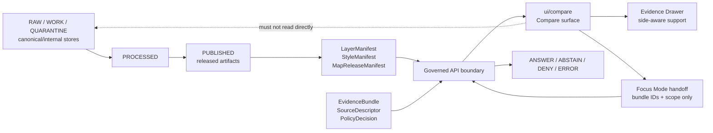

<!-- [KFM_META_BLOCK_V2]
doc_id: kfm://doc/NEEDS-VERIFICATION
title: UI Compare
type: standard
version: v1
status: draft
owners: TODO: confirm UI/documentation owner
created: 2026-04-27
updated: 2026-04-27
policy_label: NEEDS_VERIFICATION
related: [NEEDS_VERIFICATION]
tags: [kfm, ui, compare, maplibre, evidence-drawer, focus-mode]
notes: [Draft generated without mounted repo evidence; replace doc_id with registered UUID; verify owners, policy label, adjacent links, tests, and component paths before publishing.]
[/KFM_META_BLOCK_V2] -->

# UI Compare

Compare released map states without flattening their evidence, time, support, release, policy, or correction context.

## Impact

| Field | Value |
| --- | --- |
| Status | `experimental` · implementation `UNKNOWN` until verified in the mounted repository |
| Owners | `TODO: confirm UI/documentation owner` |
| Badges | [](#impact) [](#truth-posture) [](#scope) [](#acceptance-gates) |
| Quick jumps | [Scope](#scope) · [Repo fit](#repo-fit) · [Inputs](#inputs) · [Exclusions](#exclusions) · [Governed flow](#governed-flow) · [Contract sketch](#contract-sketch-proposed) · [Acceptance gates](#acceptance-gates) · [Verification backlog](#verification-backlog) |

> [!IMPORTANT]
> `ui/compare` is a trust-visible inspection surface. It is not a truth store, policy engine, publication gate, evidence resolver, model client, or source-ingestion path.

## Truth posture

| Label | Meaning in this README |
| --- | --- |
| **CONFIRMED doctrine** | The attached KFM corpus defines Compare as part of a persistent governed UI shell where trust state remains visible. |
| **UNKNOWN implementation** | The actual repository tree, adjacent docs, route names, contracts, tests, and component boundaries were not available in this session. |
| **PROPOSED contract** | Field names, fixtures, paths, and test gates below are implementation guidance until the mounted repo confirms its conventions. |
| **NEEDS VERIFICATION** | Owners, policy label, badge targets, neighboring links, package manager, schema home, and test runner must be checked before publishing. |

## Scope

`ui/compare` documents and, once implemented, should contain the Compare surface for inspecting two governed map states side by side.

Compare mode exists to show meaningful differences without collapsing context. Each side of a comparison must retain its own:

- release identity;
- time basis and active time scope;
- source support and evidence state;
- layer, style, and artifact manifest identity;
- rights, sensitivity, review, and correction state;
- negative state when evidence, policy, freshness, or runtime resolution fails.

### What Compare is for

| Use case | Expected behavior |
| --- | --- |
| Before/after release inspection | Show each side’s release ID, correction state, and resolved support independently. |
| Time-scope comparison | Keep visual time, evidence time, source publication time, review time, release time, and correction transaction time distinct where available. |
| Source-support comparison | Make support differences visible without declaring one side “true” from pixels alone. |
| Layer/style comparison | Treat layer and style changes as manifest state, not as publication approval. |
| Focus handoff | Ask bounded questions only after both sides resolve admissible evidence or emit a finite negative outcome. |

## Repo fit

| Item | Value |
| --- | --- |
| Target path | `ui/compare/README.md` |
| Directory role | README-like orientation document for the Compare UI surface. |
| Upstream links | [NEEDS VERIFICATION: governed shell, layer manifests, release manifests, evidence resolver, policy/review state](#needs-verification-upstream-and-downstream-links) |
| Downstream links | [NEEDS VERIFICATION: Evidence Drawer, Focus Mode, export/share, review/steward surfaces, tests](#needs-verification-upstream-and-downstream-links) |
| Normal consumer | Public or steward UI shell through governed APIs and released artifacts. |
| Normal non-consumer | RAW, WORK, QUARANTINE, unpublished candidate data, canonical/internal stores, and direct model runtimes. |

> [!NOTE]
> The link map intentionally uses an internal placeholder anchor until the real repository paths are inspected. Replace it with verified relative links before publishing this README.

## Inputs

Accepted inputs belong here only when they arrive through governed APIs, released manifests, or verified no-network fixtures.

| Input family | Belongs here | Required guardrail |
| --- | --- | --- |
| Compare side descriptors | `left` and `right` side state: release, layer, style, active time, selected feature candidate, and map context. | Each side resolves independently; never merge support silently. |
| Released layer context | `LayerManifest`, style identity, tile/artifact identity, trust badge state. | No direct RAW, WORK, QUARANTINE, or canonical URLs. |
| Evidence context | `EvidenceRef`, resolved `EvidenceBundle` IDs, source role, support class, review state. | Missing support yields `ABSTAIN`, not invented copy. |
| Policy and sensitivity context | policy decision, rights class, sensitivity posture, redaction/generalization transform. | Policy block yields `DENY`; restricted objects surface as safe stubs. |
| Time context | valid time, observation time, source publication time, ingestion time, review time, release time, stale/expiration time, correction transaction time where available. | Visual time and evidence time must not silently diverge. |
| Negative state payloads | `MISSING_EVIDENCE`, `SOURCE_STALE`, `DENIED_BY_POLICY`, `GENERALIZED_GEOMETRY`, `RESTRICTED_ACCESS`, `CONFLICTED_SUPPORT`, `CITATION_FAILED`, `RELEASE_WITHDRAWN`, `RUNTIME_ERROR`. | Negative states are visible UI states, not empty panels. |
| UI-only state | selected side, split emphasis, expanded drawer sections, keyboard focus, local visual affordances. | UI state must not become evidence authority. |

## Exclusions

| Do not put this in `ui/compare` | Put it here instead — **NEEDS VERIFICATION** |
| --- | --- |
| Source ingestion, normalization, deduplication, or geoprocessing | `data/`, `pipelines/`, `tools/`, or the repo’s verified ingestion home |
| Evidence resolution implementation | governed API / evidence resolver package |
| Policy evaluation and source-rights decisions | `policy/` and policy decision services |
| Publication approval or promotion decisions | release/promotion gate and steward review surfaces |
| Canonical records or internal store adapters | canonical data packages and backend services only |
| AI prompts, model adapters, or direct model calls | governed Focus/model adapter packages after route and policy verification |
| Export packaging and outward artifact signing | export/share or release packaging surface |
| Emergency, life-safety, or official-alert behavior | official alerting/source systems; KFM Compare must abstain or point to official sources when needed |

## Directory tree

Current implementation is **UNKNOWN**. The only confirmed target is this README path.

```text
ui/compare/
└── README.md
```

Candidate structure if the mounted repository confirms colocated UI modules:

```text
ui/compare/
├── README.md
├── components/          # PROPOSED: side panes, compare header, trust chips
├── fixtures/            # PROPOSED: no-network compare payloads and negative states
├── mappers/             # PROPOSED: API payload -> view model mapping
├── stories/             # PROPOSED: visual states if the repo uses Storybook or equivalent
└── tests/               # PROPOSED: unit, E2E, accessibility, and no-raw-path checks
```

> [!WARNING]
> Do not create this candidate structure until the repository’s actual UI convention is verified. If tests, stories, fixtures, or mappers are centralized elsewhere, follow the existing convention and update this README.

## Governed flow



The Compare surface receives only governed, public-safe or role-appropriate context. It can highlight, align, and explain differences; it cannot promote, publish, adjudicate truth, or bypass policy.

## Usage rules

### 1. Preserve side asymmetry

Compare must keep the left and right sides separate until a governed resolver or bounded Focus outcome explicitly explains a relationship.

| Side field | Why it matters |
| --- | --- |
| `release_id` | Prevents old/new states from being flattened into one undocumented view. |
| `active_time` | Prevents current visual state from masquerading as historical or observational truth. |
| `layer_id` and `style_id` | Distinguishes visual treatment from source support. |
| `evidence_bundle_ids` | Preserves inspectable support for each side. |
| `policy_state` | Keeps denials, redactions, and generalizations visible. |
| `correction_state` | Makes withdrawn, superseded, or corrected states inspectable. |

### 2. Treat visual difference as a question, not a claim

A pixel-level or layer-level difference may indicate a changed release, a new source, a correction, a generalization transform, a stale source, a style change, or a policy-driven redaction. The UI may surface the difference, but any consequential explanation must resolve evidence.

### 3. Keep negative states first-class

Compare must not hide trust failure behind “no results,” empty maps, or polished summary text. Use explicit negative states and show them in headers, side panels, drawer payloads, and Focus handoffs.

### 4. Hand off to Focus safely

Focus may explain a comparison only when it receives:

- scoped compare context;
- resolved EvidenceBundle IDs;
- policy context;
- side-specific release and time state;
- explicit user question.

Focus must not receive raw feature properties, hidden geometry, canonical rows, unpublished candidates, or direct source credentials from the browser.

## Contract sketch — PROPOSED

This sketch is a review aid, not a confirmed schema.

| Field | Type intent | Required | Notes |
| --- | --- | --- | --- |
| `compare_id` | stable UI/session identifier | yes | Deterministic if persisted; ephemeral if view-only. |
| `left` | compare side | yes | Includes release, layer, style, time, and evidence context. |
| `right` | compare side | yes | Same shape as `left`; never inferred from left. |
| `opened_from` | surface reference | yes | Explore, Dossier, Story, Review, Export, or other verified shell surface. |
| `map_context` | map context envelope | yes | Viewport, selected candidate, active time, user role. |
| `comparison_reason` | enum/string | no | Example: `release_delta`, `time_delta`, `source_support_delta`, `style_delta`. |
| `negative_state` | finite state | conditional | Required when either side cannot resolve support or policy. |
| `audit_ref` | receipt or trace reference | conditional | Required for governed actions and Focus handoff. |

### Compare side sketch — PROPOSED

| Field | Required | Rule |
| --- | --- | --- |
| `side_id` | yes | `left` or `right`; do not reuse ambiguous labels like “old” without release context. |
| `release_id` | yes | Must point to released or role-authorized release state. |
| `layer_id` | yes | Must correspond to a governed layer manifest. |
| `style_id` | yes | Must not carry hidden policy logic. |
| `active_time` | yes | Must specify the time axis when ambiguity matters. |
| `feature_candidate_id` | conditional | Candidate only until governed resolution succeeds. |
| `evidence_bundle_ids` | conditional | Required for consequential claims. |
| `support_state` | yes | Direct, partial, disputed, unavailable, source-dependent, or repo-approved equivalent. |
| `policy_state` | yes | Public-safe, restricted, generalized, redacted, review-required, or repo-approved equivalent. |
| `review_state` | yes | Draft, reviewed, promoted, current, stale, superseded, withdrawn, or repo-approved equivalent. |

## Surface states

| State | Trigger | UI behavior |
| --- | --- | --- |
| `READY` | Both sides resolve support and policy allows display. | Show side-aware trust chips and drawer comparison. |
| `LEFT_ABSTAINS` / `RIGHT_ABSTAINS` | One side lacks evidence, time support, or citation closure. | Keep the side visible with explicit reason; do not synthesize unsupported differences. |
| `DENIED_BY_POLICY` | Either side is blocked or must be generalized/redacted. | Show safe stub, policy chip, and permitted next action. |
| `SOURCE_STALE` | One side is past freshness/stale threshold. | Mark stale state in header, side panel, drawer, and Focus context. |
| `CONFLICTED_SUPPORT` | Evidence support differs or conflicts materially. | Show conflict marker and require Evidence Drawer inspection. |
| `RELEASE_WITHDRAWN` | One side references withdrawn release state. | Preserve correction lineage; prevent export unless policy allows. |
| `RUNTIME_ERROR` | Resolver, manifest, or payload validation fails. | Show error state and avoid raw fallback text. |

## Quickstart for maintainers

Run these from the real repository root after the checkout is mounted.

```bash
# Confirm repository state.
git status --short
git branch --show-current

# Confirm whether ui/compare already exists.
test -d ui/compare && find ui/compare -maxdepth 3 -type f | sort || true

# Inspect likely neighboring docs, schemas, policies, and tests.
find ui docs contracts schemas policy tests .github -maxdepth 3 -type f 2>/dev/null | sort | sed -n '1,200p'

# Look for existing compare, drawer, release, and trust-state vocabulary.
grep -RIn \
  "Compare Mode\|EvidenceDrawerPayload\|MapReleaseManifest\|LayerManifest\|no_public_raw_path\|no_direct_model_client" \
  ui docs contracts schemas policy tests 2>/dev/null || true
```

Replace this README’s placeholders only after the commands above identify the repo’s actual conventions.

## Acceptance gates

A Compare PR is not done until these gates are true or explicitly deferred in review.

- [ ] `ui/compare/README.md` has a registered `doc_id`, verified owners, verified policy label, and valid relative links.
- [ ] Each side of the comparison carries separate release, layer, style, time, support, policy, review, and correction context.
- [ ] The UI never reads RAW, WORK, QUARANTINE, canonical/internal stores, unpublished candidates, direct source endpoints, or model runtimes.
- [ ] Feature click or side selection resolves through a governed API before showing consequential claim text.
- [ ] Evidence Drawer can show side-aware support and does not collapse sources into a generic citation.
- [ ] Focus handoff passes scoped EvidenceBundle IDs and policy context only.
- [ ] Negative states are visible, testable, and accessible.
- [ ] Sensitive or restricted geometry cannot be revealed by client-side style toggles, permalink state, or hidden counts.
- [ ] Export/share from Compare includes trust metadata, citations, release IDs, and correction state or is denied.
- [ ] Tests include no-public-raw-path and no-direct-model-client checks.
- [ ] Accessibility coverage includes keyboard operation, screen-reader labels for left/right context, non-color-only difference markers, and reduced-motion-safe transitions.
- [ ] Rollback/correction behavior is visible when a compared release is withdrawn, superseded, or restored.

## Verification backlog

| Item | Status |
| --- | --- |
| Confirm `ui/compare` exists or create it in the repo-native UI location. | NEEDS VERIFICATION |
| Confirm adjacent README style and whether KFM Meta Block v2 is already used in repo Markdown. | NEEDS VERIFICATION |
| Confirm owner/team and CODEOWNERS expectations. | NEEDS VERIFICATION |
| Confirm schema home for Compare payloads, Evidence Drawer payloads, Focus envelopes, layer manifests, and release manifests. | NEEDS VERIFICATION |
| Confirm package manager, frontend framework, component conventions, and test runner. | NEEDS VERIFICATION |
| Confirm actual governed API routes and DTO names. | NEEDS VERIFICATION |
| Confirm existing negative-state vocabulary. | NEEDS VERIFICATION |
| Confirm link targets for upstream/downstream docs. | NEEDS VERIFICATION |
| Replace placeholder badges with CI, docs, or package badges if verified. | NEEDS VERIFICATION |

<details>
<summary id="needs-verification-upstream-and-downstream-links">Placeholder upstream/downstream link map</summary>

Replace these placeholders with verified relative links from `ui/compare/README.md`.

| Relationship | Candidate target | Status |
| --- | --- | --- |
| UI shell overview | `../README.md` | NEEDS VERIFICATION |
| Map shell / MapLibre docs | `../map/README.md` or `../../docs/architecture/maplibre.md` | NEEDS VERIFICATION |
| Evidence Drawer | `../evidence-drawer/README.md` | NEEDS VERIFICATION |
| Focus Mode | `../focus/README.md` | NEEDS VERIFICATION |
| Release manifests | `../../contracts/` or `../../schemas/` verified schema home | NEEDS VERIFICATION |
| Policy | `../../policy/` verified policy home | NEEDS VERIFICATION |
| Tests | `../../tests/` or colocated UI test convention | NEEDS VERIFICATION |

</details>

## Pre-publish checklist

- [ ] Badges present and either valid or explicitly placeholder.
- [ ] Owners present as verified values or explicit TODO.
- [ ] Status present.
- [ ] Quick jumps present.
- [ ] Required README minimums included: purpose, repo fit, inputs, exclusions.
- [ ] Directory tree included with implementation uncertainty marked.
- [ ] Mermaid diagram included and grounded in KFM doctrine.
- [ ] Tables used for scope, inputs, exclusions, states, and gates.
- [ ] Code fences are language-tagged.
- [ ] Long placeholder link map is wrapped in `<details>`.
- [ ] Relative links are verified before publishing.
- [ ] No implementation claim exceeds available evidence.
- [ ] No section implies Compare is a policy engine, evidence resolver, publication gate, or AI authority.

[Back to top](#ui-compare)