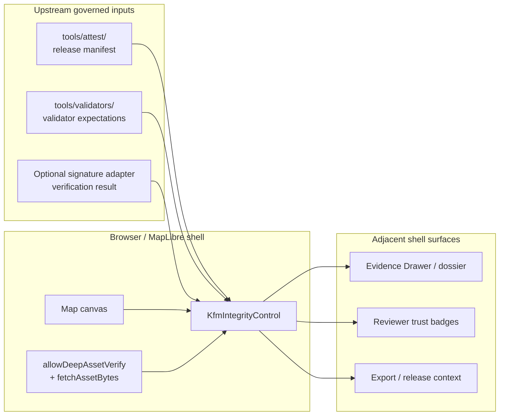

<!-- [KFM_META_BLOCK_V2]
doc_id: kfm://doc/TODO-VERIFY-UUID
title: ui/controls
type: standard
version: v1
status: draft
owners: @bartytime4life
created: 2026-04-11
updated: 2026-04-11
policy_label: public-safe
related: [../../tools/attest/README.md, ../../tools/validators/README.md, ../../policy/README.md]
tags: [kfm, ui, controls, maplibre, trust]
notes: [Current-session evidence confirms the KFM integrity control starter and this directory’s browser-side trust role. Exact doc UUID, broader repo adjacency, and wider implementation depth remain NEEDS VERIFICATION.]
[/KFM_META_BLOCK_V2] -->

# ui/controls

> Browser-side controls for governed trust cues, evidence visibility, and map-adjacent review state.

> [!IMPORTANT]
> **Status:** experimental  
> **Owners:** @bartytime4life  
>      
> **Quick jumps:** [Scope](#scope) · [Repo fit](#repo-fit) · [Inputs](#inputs) · [Quickstart](#quickstart) · [Diagram](#diagram) · [Reference tables](#reference-tables) · [Task list](#task-list) · [FAQ](#faq)

> [!NOTE]
> **Current snapshot:** the visible starter in this directory is the **KFM integrity control** for MapLibre. This README does **not** assume other controls, contract files, tests, or workflow wiring that were not surfaced in the current session.

## Scope

`ui/controls/` is where KFM keeps **browser-side trust surfaces** close to the map, not hidden in detached admin chrome. In the current visible snapshot, that means a control that reads declared release artifacts and renders four user-facing dimensions:

- **Integrity** — manifest and optional asset hashes
- **Publisher** — optional signature verification result
- **Evidence** — declared `bundle_ref` / `proof_ref`
- **Outcome** — finite KFM trust result

This directory exists to support the **trust-visible shell**, not to become a second truth system. The browser may inspect and present declared release facts, but **promotion, policy, attestation issuance, evidence resolution, and review state remain upstream**.

## Repo fit

**Path:** `ui/controls/README.md`

| Relationship | What is known here | Notes |
|---|---|---|
| Upstream | [`../../tools/attest/README.md`](../../tools/attest/README.md), [`../../tools/validators/README.md`](../../tools/validators/README.md), [`../../policy/README.md`](../../policy/README.md) | These paths are directly named by the current snapshot. |
| Directory role | Browser-side control layer for MapLibre-adjacent trust cues | Current evidence confirms the integrity control starter only. |
| Downstream surfaces | MapLibre map shell; asset drawers / dossier panels; reviewer trust badges | Surface names are confirmed; exact downstream file paths are not directly verified here. |

### Why this directory matters

KFM’s shell doctrine is explicit: consequential claims should remain **one hop from inspectable evidence**, and trust cues should stay visible at the point of use. `ui/controls/` is the lightweight browser layer that helps that happen without moving authority into the browser.

## Inputs

### Accepted inputs

The starter API and visible directory purpose confirm the following inputs and display surfaces.

| Input or surface | Status | Purpose | Notes |
|---|---|---|---|
| `manifestUrl` | **CONFIRMED** | Load the declared release manifest | Browser entry point for release-facing trust data |
| `selectedAssetId` | **CONFIRMED** | Scope rendering or deep verification to one declared asset | Keeps asset-specific trust cues focused |
| `expectedSpecHash` | **CONFIRMED** | Compare against expected artifact identity | Release-facing integrity check |
| `allowDeepAssetVerify` | **CONFIRMED** | Opt into browser-side asset-byte verification | Starter usage shows this as optional |
| `fetchAssetBytes(asset)` | **CONFIRMED** | Provide bytes for deep verification when enabled | Caller-supplied fetch strategy |
| Signature verification result | **CONFIRMED** display surface | Render publisher/signature status if available | Upstream verification adapter remains separate |
| `bundle_ref` / `proof_ref` | **CONFIRMED** display surface | Render evidence linkage for the release artifact | Exact manifest field shape remains unverified here |
| Finite trust outcome | **CONFIRMED** display surface | Present a bounded user-visible result | Exact enum names remain NEEDS VERIFICATION |

### Exclusions

What does **not** belong in this directory as the normal path:

| Excluded concern | Stays upstream / elsewhere | Why |
|---|---|---|
| Release manifest creation | [`../../tools/attest/README.md`](../../tools/attest/README.md) | The control consumes declared artifacts; it does not mint them |
| Validator source of truth | [`../../tools/validators/README.md`](../../tools/validators/README.md) | Browser rendering must not replace validator logic |
| Policy decisions and rights adjudication | [`../../policy/README.md`](../../policy/README.md) | Trust cues may display policy state; they do not decide it |
| Evidence resolution and safe preview rules | Governed API / Evidence Drawer payloads | Shared trust objects should stay consistent across surfaces |
| Review approval, promotion, rollback, correction | Steward / release workflows | This directory is map-adjacent UI, not release authority |

## Directory tree

Known starter snapshot from current-session evidence:

```text
ui/controls/
├── README.md
├── kfm-integrity-types.ts
├── kfm-integrity-control.ts
└── kfm-integrity.css
```

## Quickstart

Use the control as a **MapLibre custom control** attached to the map shell.

```ts
map.addControl(
  new KfmIntegrityControl({
    manifestUrl: "/releases/kfm-release-manifest.json",
    selectedAssetId: "kansas-rivers-pmtiles",
    expectedSpecHash: "sha256:REPLACE_ME",
    allowDeepAssetVerify: true,
    fetchAssetBytes: async (asset) => {
      const res = await fetch(asset.uri);
      if (!res.ok) throw new Error(`Asset fetch failed: ${asset.uri}`);
      return await res.arrayBuffer();
    }
  }),
  "top-right"
);
```

### Minimal startup flow

1. Serve a release-facing manifest from the attestation / release side of the system.
2. Add `KfmIntegrityControl` to the MapLibre shell.
3. Pass a `selectedAssetId` when the trust surface should focus on one declared artifact.
4. Enable deep verification only when browser-safe asset bytes are intentionally fetchable.
5. Keep the control visually close to layer inspection, dossier launch, or reviewer trust affordances.

> [!TIP]
> Treat deep verification as an **opt-in browser inspection path**, not as the only integrity mechanism. The browser should surface trust, not replace the governed release path.

## Usage

### What the integrity control renders

| Trust dimension | Current snapshot says it renders | Browser responsibility |
|---|---|---|
| Integrity | Manifest and optional asset hashes | Show declared integrity state clearly |
| Publisher | Optional signature verification result | Render result if available; do not issue signatures |
| Evidence | Declared `bundle_ref` / `proof_ref` | Keep evidence linkage visible and inspectable |
| Outcome | Finite KFM trust result | Avoid vague “looks good” UI language |

### Shell alignment rules

This directory should stay aligned with the wider KFM shell:

- **Trust stays visible at point of use.**
- **Negative or indeterminate states stay visible** rather than collapsing into silent success.
- **The browser is not the source of truth.**
- **Evidence language stays shared** with Evidence Drawer, dossier, Focus, and review surfaces when those payloads are available.
- **MapLibre is the runtime host for the control, not the shell’s entire meaning.**

> [!WARNING]
> Do not let this directory grow into a hidden policy path, detached admin widget set, or browser-only trust authority. If a change introduces new proof objects, release decisions, or review actions, document the upstream contract that still owns them.

## Diagram



The important boundary is simple: **declared release facts come in; trust cues go out; authority stays upstream**.

## Reference tables

### Starter file registry

| File | Current role | Notes |
|---|---|---|
| `kfm-integrity-types.ts` | Type surface for the integrity control | Visible by filename only in current snapshot |
| `kfm-integrity-control.ts` | MapLibre-facing control implementation | Visible by filename and starter usage |
| `kfm-integrity.css` | Trust-surface styling | Visible by filename only in current snapshot |
| `README.md` | Directory landing doc | Should describe scope, boundaries, and usage without overstating repo state |

### Boundary matrix

| Concern | Browser control | Upstream owner |
|---|---|---|
| Manifest retrieval and display | Yes | Manifest issuance still upstream |
| Selected asset hash compare | Yes | Expected hash comes from release path |
| Signature result rendering | Yes, if provided | Verification production / adapter logic stays upstream |
| Policy label rendering | Possibly, when declared | Policy engine owns the decision |
| Evidence linking | Yes | Evidence resolver owns payload and restriction logic |
| Promotion / rollback / correction | No | Steward and release workflows |

## Task list

### Review gates for changes touching this directory

- [ ] The README and code examples still match the visible starter API.
- [ ] The control still renders declared integrity, publisher, evidence, and outcome surfaces.
- [ ] Negative, partial, stale, restricted, or unavailable states are not visually hidden.
- [ ] Browser logic still **consumes** release facts rather than inventing new proof objects.
- [ ] Any new control added here states its accepted inputs and explicit exclusions.
- [ ] Accessibility review covers readable status text, keyboard reachability, and non-color-only cues.
- [ ] Upstream references to attestation, validation, and policy docs remain correct.

### Definition of done

A change in `ui/controls/` is ready for review when:

1. The browser-side boundary is still clear.
2. Trust cues remain visible and inspectable.
3. The README explains repo fit, inputs, exclusions, and quickstart without implying unverified implementation.
4. Adjacent shell trust objects are named consistently with KFM vocabulary.

## FAQ

### Is this directory the Evidence Drawer?

No. The visible starter is a **map control**, not the whole Evidence Drawer. It should align with the same trust vocabulary and launch paths, but the drawer is a broader trust object.

### Does this directory own release truth?

No. It owns **browser presentation of declared trust cues**. Release manifests, validators, policy, review, and promotion stay upstream.

### Are more controls than the integrity control confirmed here?

No. The current visible snapshot confirms the integrity control starter and its three named files. Other controls remain **UNKNOWN** in this session.

### Is deep asset verification always enabled?

Not from the visible evidence. The starter API shows it as an **optional** path via `allowDeepAssetVerify`.

### Does this imply 3D or non-MapLibre support?

No. The visible evidence grounds this directory in the **MapLibre-centered 2D shell**. Controlled 3D is a separate, conditional concern elsewhere in the corpus.

## Appendix

<details>
<summary><strong>Evidence posture for this README</strong></summary>

### CONFIRMED in the current snapshot

- The directory purpose: browser-side controls for trust cues, evidence visibility, and map-adjacent review state
- The visible starter files:
  - `kfm-integrity-types.ts`
  - `kfm-integrity-control.ts`
  - `kfm-integrity.css`
- The integrity control’s four user-facing dimensions:
  - Integrity
  - Publisher
  - Evidence
  - Outcome
- The starter usage shape:
  - `manifestUrl`
  - `selectedAssetId`
  - `expectedSpecHash`
  - `allowDeepAssetVerify`
  - `fetchAssetBytes(...)`

### INFERRED from the visible snapshot plus KFM doctrine

- Relative upstream links from this directory to `tools/attest`, `tools/validators`, and `policy`
- The need to keep this directory tightly aligned with the wider Evidence Drawer and dossier vocabulary
- The usefulness of reviewer trust badges as a downstream surface

### PROPOSED but not directly surfaced here

- A shared payload vocabulary between this control and the Evidence Drawer
- Explicit contract files for shell state, layer metadata, and Focus envelopes
- Wider control inventory under `ui/controls/`

### UNKNOWN / NEEDS VERIFICATION

- Exact doc UUID for this file
- Wider repo adjacency near `ui/controls/`
- Test coverage, workflow wiring, and package boundaries
- Exact manifest schema location
- Exact trust outcome enum names
- Default option values beyond the visible starter example

</details>

<details>
<summary><strong>Adjacent contract starter set (PROPOSED)</strong></summary>

Architecture-level KFM materials point toward a small first-wave contract family that this directory will likely need to consume or stay aligned with:

- shell-state contract
- Evidence Drawer payload
- dossier payload
- Focus envelope
- layer metadata contract
- surface-state registry

These are listed here as **adjacent planning signals**, not as directly surfaced files in the current workspace snapshot.

</details>
