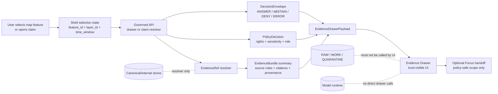

<!-- [KFM_META_BLOCK_V2]
doc_id: kfm://doc/TODO-NEEDS-UUID
title: Evidence Drawer
type: standard
version: v1
status: draft
owners: NEEDS_VERIFICATION__ui_or_shell_owner
created: 2026-04-27
updated: 2026-04-27
policy_label: NEEDS_VERIFICATION__public_or_restricted
related: [NEEDS_VERIFICATION__../README.md, NEEDS_VERIFICATION__../focus-mode/README.md, NEEDS_VERIFICATION__../../docs/architecture/shell/README.md, NEEDS_VERIFICATION__../../schemas/contracts/v1/ui/evidence_drawer_payload.schema.json, NEEDS_VERIFICATION__../../schemas/contracts/v1/runtime/runtime_response_envelope.schema.json]
tags: [kfm, ui, evidence-drawer, trust-visible, evidence-bundle]
notes: [Target path supplied by user. Current mounted repository was not available in this documentation pass; related links, owner assignment, active component paths, schema paths, and policy label require branch verification before merge.]
[/KFM_META_BLOCK_V2] -->

<a id="top"></a>

# Evidence Drawer

**Purpose:** Render every consequential KFM claim one hop away from inspectable evidence, policy posture, review state, freshness, sensitivity handling, and correction lineage.


> [!IMPORTANT]
> **Status:** `experimental`  
> **Owners:** `NEEDS_VERIFICATION__ui_or_shell_owner`  
> **Path:** `ui/evidence-drawer/README.md`  
> **Repo fit:** UI trust surface downstream of governed API + evidence resolution, upstream of Focus handoff, review display, export preview, and correction inspection.  
> **Quick jumps:** [Scope](#scope) · [Repo fit](#repo-fit) · [Accepted inputs](#accepted-inputs) · [Exclusions](#exclusions) · [Directory tree](#directory-tree) · [Quickstart](#quickstart) · [Usage](#usage) · [Diagram](#diagram) · [Operating tables](#operating-tables) · [Task list](#task-list--definition-of-done) · [FAQ](#faq) · [Appendix](#appendix)

> [!NOTE]
> This README is written from the attached KFM doctrine and current-session workspace inspection. It does **not** claim that `ui/evidence-drawer/` currently exists in the active checkout, that a component is implemented, or that linked schemas/routes are already mounted. Treat implementation-specific paths below as **NEEDS VERIFICATION** until checked against the real repository.

---

## Scope

The Evidence Drawer is KFM’s trust-visible inspection surface. It answers a narrow but critical question:

> “What backs the thing I am seeing, and what am I allowed to conclude from it?”

### CONFIRMED doctrine

KFM treats the Evidence Drawer as a mandatory trust object for consequential claims, layers, Focus outputs, and exports. It is not a decorative sidebar, tooltip, or developer appendix.

The drawer should make these visible at the point of use:

- claim or object summary
- spatial and temporal scope
- source role and knowledge character
- EvidenceRef / EvidenceBundle linkage
- release, review, freshness, and correction state
- rights, sensitivity, redaction, and generalization posture
- audit, receipt, transform, or trace references where allowed
- finite negative outcomes: `ABSTAIN`, `DENY`, and `ERROR`

### UNKNOWN active-branch status

The active repository was not mounted during this pass. These remain **NEEDS VERIFICATION**:

- exact component path
- package manager and test runner
- existing shell state model
- existing drawer payload schema
- existing governed API route for drawer resolution
- whether drawer resolution is server-shaped, client-shaped, or adapter-shaped
- whether Focus Mode already receives a standardized drawer payload section

[Back to top](#top)

---

## Repo fit

This README belongs at the supplied target path:

```text
ui/evidence-drawer/README.md
```

The Evidence Drawer should sit inside the UI trust layer, not the canonical evidence layer and not the runtime model layer.

| Relationship | Candidate relative link | Status | Expected role |
|---|---:|---|---|
| Parent UI lane | [`../README.md`](../README.md) | NEEDS VERIFICATION | Navigation and surface inventory for `ui/`. |
| Focus Mode sibling | [`../focus-mode/README.md`](../focus-mode/README.md) | NEEDS VERIFICATION | Focus handoff rules and finite outcome display. |
| Shell architecture docs | [`../../docs/architecture/shell/README.md`](../../docs/architecture/shell/README.md) | PROPOSED / NEEDS VERIFICATION | Persistent shell doctrine, timeline coequality, trust chips. |
| UI payload schema | [`../../schemas/contracts/v1/ui/evidence_drawer_payload.schema.json`](../../schemas/contracts/v1/ui/evidence_drawer_payload.schema.json) | PROPOSED / NEEDS VERIFICATION | Machine-readable drawer payload contract. |
| Runtime envelope schema | [`../../schemas/contracts/v1/runtime/runtime_response_envelope.schema.json`](../../schemas/contracts/v1/runtime/runtime_response_envelope.schema.json) | PROPOSED / NEEDS VERIFICATION | Outcome envelope consumed by drawer-capable surfaces. |
| Runtime proof fixtures | [`../../tests/e2e/runtime_proof/README.md`](../../tests/e2e/runtime_proof/README.md) | PROPOSED / NEEDS VERIFICATION | Outcome fixtures, including expected drawer payloads. |
| Governed API | [`../../apps/governed-api/README.md`](../../apps/governed-api/README.md) | PROPOSED / NEEDS VERIFICATION | Evidence resolution and drawer payload route family. |

> [!WARNING]
> Do not make this directory a shadow source of truth. The drawer may render trust state; it must not decide truth, policy, sensitivity, publication, review, or correction state on its own.

[Back to top](#top)

---

## Accepted inputs

Only released, governed, policy-safe inputs belong here.

| Input family | Belongs here when… | Minimum visible fields |
|---|---|---|
| `EvidenceDrawerPayload` | It is produced by a governed resolver or adapter. | `claim`, `outcome`, `scope`, `evidence_refs`, `support_state`, `policy_state`, `review_state`. |
| `RuntimeResponseEnvelope` | It carries finite outcome state and drawer-safe context. | `outcome`, `reason_code`, `evidence_bundle_refs`, `audit_ref`. |
| `DecisionEnvelope` | It describes the public/runtime decision made upstream. | `ANSWER` / `ABSTAIN` / `DENY` / `ERROR`, reason, citation validation state. |
| `EvidenceBundle` summary | It is resolved from `EvidenceRef` and safe for the user role. | bundle ID, source roles, citations, provenance summary, rights posture. |
| Layer / feature context | It comes from released layer metadata and selected feature IDs. | layer ID, release ID, feature ID, active time window, style ID. |
| Transform receipts | Redaction, aggregation, or generalization occurred. | transform type, reason class, receipt ID, public precision served. |
| Correction lineage | Claim has been superseded, corrected, withdrawn, or rolled back. | current state, prior claim/release refs, correction note ref. |
| Accessibility copy | It maps trust states to text labels. | visible label, ARIA label, keyboard/focus behavior. |

[Back to top](#top)

---

## Exclusions

| Does **not** belong here | Where it should go instead | Reason |
|---|---|---|
| RAW, WORK, or QUARANTINE data reads | `data/raw/`, `data/work/`, `data/quarantine/` through governed pipelines only | The public UI must not cross the trust membrane. |
| Canonical evidence store access | Governed evidence resolver / API | Drawer renders resolved evidence; it does not own canonical truth. |
| Live source API calls | Source connectors and ingestion pipelines | UI should not bypass source admission, validation, or rights checks. |
| Model runtime calls | Governed AI / Focus adapter boundary | Drawer must not send raw feature properties or hidden geometry to AI. |
| Policy decisions | Policy engine and runtime postcheck | Client-side policy decisions are not authoritative. |
| Promotion or publication decisions | Promotion gate / release workflow | Drawer can show release state; it cannot promote artifacts. |
| Review authority | Role-gated review surface | Drawer can show review state; it cannot become a hidden steward console. |
| Hidden exact sensitive geometry | Governed API with role-gated access, redaction, and receipts | Visual hiding is not a safety control. |
| Unsupported prose | Claim envelope / Focus response with citation validation | KFM cites or abstains. |

[Back to top](#top)

---

## Directory tree

PROPOSED local shape. Verify active repo conventions before creating folders.

```text
ui/evidence-drawer/
├── README.md
├── components/                 # NEEDS VERIFICATION: drawer panels, chips, empty states
├── mappers/                    # NEEDS VERIFICATION: payload -> UI view-model adapters
├── fixtures/                   # NEEDS VERIFICATION: public-safe example payloads
├── tests/                      # NEEDS VERIFICATION: unit/a11y/outcome rendering tests
└── styles/                     # NEEDS VERIFICATION: drawer layout and trust cue styling
```

Preferred local responsibility split:

| Local area | Should contain | Should not contain |
|---|---|---|
| `components/` | Rendering components and accessible layout primitives. | Evidence resolution, policy rules, source fetching. |
| `mappers/` | Pure payload-to-view mapping with no network calls. | Truth, confidence, or sensitivity decisions. |
| `fixtures/` | Public-safe, minimal examples for every finite outcome. | Live source data or sensitive geometry. |
| `tests/` | Rendering, keyboard, negative-state, and no-leak tests. | End-to-end source ingestion or promotion tests. |
| `styles/` | Layout, chips, badges, and responsive behavior. | Hidden policy meaning encoded only in color. |

[Back to top](#top)

---

## Quickstart

The first step is branch verification, not component coding.

```bash
# 1. Confirm that you are in the real KFM checkout.
git status --short
git branch --show-current

# 2. Inspect whether the target path already exists.
find ui/evidence-drawer -maxdepth 3 -type f | sort 2>/dev/null || true

# 3. Inspect adjacent UI/readme conventions before changing this file.
find ui -maxdepth 2 -name README.md -print | sort 2>/dev/null || true

# 4. Locate existing drawer, Focus, shell, or runtime envelope references.
grep -RInE "EvidenceDrawer|Evidence Drawer|Focus Mode|RuntimeResponseEnvelope|DecisionEnvelope" \
  ui apps schemas contracts docs tests 2>/dev/null | head -120
```

> [!TIP]
> After the branch inspection, replace `NEEDS_VERIFICATION` placeholders in this README with confirmed owners, links, schema paths, and test commands. Do not silently keep placeholders in a published doc.

### Repo-native test command

UNKNOWN until package manager and test framework are verified.

```bash
# NEEDS VERIFICATION — adapt to repo-native tooling.
# Examples only:
pnpm test -- evidence-drawer
npm test -- evidence-drawer
pytest tests/ui/evidence_drawer
```

[Back to top](#top)

---

## Usage

### Minimum behavior

The Evidence Drawer should open from:

- map feature selection
- layer metadata inspection
- Focus citation re-highlight
- dossier or story claim
- export preview
- review surface cross-link
- correction or rollback notice

It should render the same trust law across all of those entry points.

### Progressive disclosure

Use a two-speed design:

1. **First-load trust state:** title, outcome, scope, sensitivity/review/freshness chips, and failure state.
2. **Deeper audit:** source roles, evidence refs, bundle metadata, transform receipts, correction lineage, and audit refs.

This avoids overloading first glance while still making the support path inspectable.

### Illustrative adapter shape

The exact interface is **PROPOSED** until schema conventions are verified.

```ts
// PROPOSED illustrative shape.
// Do not treat this as active branch proof.

type RuntimeOutcome = "ANSWER" | "ABSTAIN" | "DENY" | "ERROR";

interface EvidenceDrawerPayload {
  drawer_kind: "claim" | "layer" | "focus_citation" | "review_item" | "export_preview";
  outcome: RuntimeOutcome;

  claim: {
    title: string;
    summary: string;
    supported_object_id?: string;
    knowledge_character?: "observed" | "documentary" | "derived" | "modeled" | "generalized" | "source_dependent";
  };

  scope: {
    place_label?: string;
    geometry_ref?: string;
    time_basis?: string;
    as_of?: string;
    opened_from_surface?: string;
  };

  evidence: {
    evidence_refs: string[];
    evidence_bundle_refs: string[];
    source_roles: string[];
    support_state: "direct" | "partial" | "disputed" | "unavailable" | "source_dependent";
  };

  policy: {
    rights_class?: string;
    sensitivity_posture?: string;
    precision_served?: "exact" | "generalized" | "redacted" | "withheld";
    transform_receipt_refs?: string[];
  };

  review: {
    review_state?: "draft" | "quarantined" | "reviewed" | "promoted" | "current" | "stale" | "superseded" | "withdrawn";
    correction_refs?: string[];
  };

  audit: {
    audit_ref?: string;
    run_receipt_ref?: string;
    ai_receipt_ref?: string;
  };
}
```

### Rendering rule

```ts
// PROPOSED pseudocode for mapper behavior.
function mapDrawerOutcome(payload: EvidenceDrawerPayload) {
  switch (payload.outcome) {
    case "ANSWER":
      return renderSupportedClaim(payload);
    case "ABSTAIN":
      return renderVisibleAbstention(payload);
    case "DENY":
      return renderPolicyBlockedState(payload);
    case "ERROR":
      return renderResolverFailure(payload);
    default:
      return renderSchemaError("Unknown runtime outcome");
  }
}
```

> [!CAUTION]
> Never fall back to raw feature properties when the drawer resolver fails. Resolver failure is an `ERROR`, not an invitation to invent a weaker drawer.

[Back to top](#top)

---

## Diagram



[Back to top](#top)

---

## Operating tables

### Drawer zones

| Drawer zone | Must show | Must never do |
|---|---|---|
| Header | Object or claim title, finite outcome, release/current/stale/withdrawn state, sensitivity badge. | Hide `ABSTAIN`, `DENY`, or `ERROR` behind neutral copy. |
| Claim summary | Plain-language claim with spatial and temporal scope. | Invent prose from feature properties without support. |
| Evidence stack | EvidenceRef list, source role, citation, support state, review state. | Collapse distinct sources into one generic citation. |
| Map context | Layer ID, release ID, style ID, selected feature ID, active time window. | Treat the rendered layer as canonical truth. |
| Rights and sensitivity | Rights class, sensitivity posture, precision served, redaction/generalization state. | Ship exact sensitive geometry and only hide it visually. |
| Transforms | Generalization, redaction, aggregation, or suppression receipt refs. | Treat transformed public output as unchanged canonical evidence. |
| Freshness and review | Freshness class, as-of timestamp, review state, promotion/correction state. | Hide stale, draft, withdrawn, or superseded state. |
| Correction lineage | Current/withdrawn/corrected state, prior refs, correction note. | Delete or silently replace claim history. |
| Focus handoff | Questions allowed by policy and evidence scope. | Send raw feature properties, hidden geometry, or unresolved context to AI. |
| Export control | Citation-safe readiness and missing requirements. | Export uncited or policy-blocked claims. |

### Outcome handling

| Outcome | Drawer behavior | User-facing posture |
|---|---|---|
| `ANSWER` | Render supported claim, scope echo, evidence refs, source roles, review/freshness state. | “This claim is supported in this scope.” |
| `ABSTAIN` | Render missing, weak, conflicting, stale, or unresolved support reason. | “KFM cannot support this claim from released evidence.” |
| `DENY` | Render safe policy/sensitivity reason class and no restricted detail. | “Policy blocks this surface or precision.” |
| `ERROR` | Render resolver, schema, catalog, or validation failure. | “No reliable claim has been released from this response.” |

### Trust cues

| Cue family | Signals | Where it should appear |
|---|---|---|
| Scope chips | Place, time, layer, audience lane, role. | Header and claim summary. |
| Evidence-state chips | Direct, partial, disputed, unavailable, source-dependent. | Header, evidence stack, Focus handoff. |
| Rights / sensitivity chips | Public-safe, restricted, generalized, redacted, review-required. | Header and rights section. |
| Review-state chips | Draft, quarantined, reviewed, promoted, current, stale, superseded, withdrawn. | Header and review section. |
| Knowledge-character markers | Observed, documentary, derived, modeled, generalized, source-dependent. | Claim summary and layer context. |
| AI participation badges | Model-assisted synthesis present. | Focus handoff and AI-derived claim contexts only. |

[Back to top](#top)

---

## Task list / Definition of done

### Branch verification

- [ ] Confirm `ui/evidence-drawer/` exists or create it through a reviewed PR.
- [ ] Confirm owner from CODEOWNERS or governance docs; replace `NEEDS_VERIFICATION__ui_or_shell_owner`.
- [ ] Confirm policy label and update the meta block.
- [ ] Confirm adjacent README pattern and link targets.
- [ ] Confirm schema home: `schemas/`, `contracts/`, or another canonical location.
- [ ] Confirm whether an ADR is needed for drawer payload schema ownership.

### Contract and fixtures

- [ ] Define or link `EvidenceDrawerPayload` v1.
- [ ] Align drawer payload with `RuntimeResponseEnvelope`, `DecisionEnvelope`, `EvidenceBundle`, and `PolicyDecision`.
- [ ] Add public-safe fixtures for `ANSWER`, `ABSTAIN`, `DENY`, and `ERROR`.
- [ ] Include at least one stale/superseded/corrected fixture.
- [ ] Include at least one sensitivity/generalization fixture.
- [ ] Include expected empty/error states.

### UI behavior

- [ ] First-load state shows title, outcome, scope, sensitivity, review, and freshness.
- [ ] Deeper evidence sections are keyboard accessible.
- [ ] `ABSTAIN`, `DENY`, and `ERROR` are visually explicit.
- [ ] Public payload excludes steward-only fields by construction, not by accidental omission.
- [ ] Color is not the only trust signal.
- [ ] Focus handoff carries only policy-safe scope and evidence bundle refs.
- [ ] Export preview refuses uncited or policy-blocked claims.

### Safety gates

- [ ] No direct calls to RAW, WORK, QUARANTINE, canonical stores, graph internals, model runtime, or live source endpoints.
- [ ] No browser-side assembly of consequential claims from raw feature properties.
- [ ] No client-side sensitivity decision treated as authoritative.
- [ ] Resolver failure renders `ERROR`, not fallback text.
- [ ] Hidden geometry cannot leak through props, fixtures, logs, snapshots, or test output.

### Tests

- [ ] Unit tests cover all four finite outcomes.
- [ ] Accessibility tests cover keyboard open/close, focus trap, headings, ARIA labels, and reduced-motion behavior.
- [ ] Snapshot or visual tests include trust chips and negative states.
- [ ] No-leak tests assert hidden geometry and restricted fields are absent from public drawer payloads.
- [ ] Contract tests validate payload fixtures.
- [ ] Runtime proof tests assert drawer output beside request, decision, and envelope fixtures.

[Back to top](#top)

---

## FAQ

### Is the Evidence Drawer the same as a popup?

No. A popup can summarize a rendered feature. The Evidence Drawer is the inspection surface for support, scope, rights, sensitivity, review, and correction state. It is part of the trust model.

### Can the drawer use MapLibre feature properties?

Only as non-authoritative selection context. Feature properties may help identify the selected object, but they must not become evidence authority or policy authority.

### Should the drawer show restricted records?

Public drawers should show safe stubs or safe reason classes when policy allows. Exact restricted content belongs behind role-gated steward surfaces and governed APIs.

### Can Focus Mode read from the drawer?

Focus may use drawer-safe context and resolved EvidenceBundle refs. It must not receive raw stores, hidden geometry, unresolved evidence, or uncited feature properties.

### What happens when evidence resolution fails?

The drawer shows `ERROR`. It must not substitute raw properties, cached prose, or visually plausible summaries.

[Back to top](#top)

---

## Appendix

<details>
<summary>Evidence basis and open verification register</summary>

### Source-grounded design basis

This README is grounded in the KFM doctrine that:

- the public unit of value is the inspectable claim;
- the map-first shell is a trust instrument;
- the Evidence Drawer is mandatory for consequential claims;
- MapLibre is downstream rendering, not truth authority;
- Focus Mode is evidence-bounded synthesis, not assistant sovereignty;
- public clients use governed APIs and released artifacts;
- EvidenceRef resolves to EvidenceBundle before public claims;
- policy, review, sensitivity, release, and correction state remain visible;
- AI is interpretive only and subordinate to evidence, policy, review, and release state.

### Remaining verification items

| Item | Status | Why it matters |
|---|---|---|
| Active component path | UNKNOWN | Determines whether this README documents an existing component or creates a new lane. |
| Owner | NEEDS VERIFICATION | Required for review, maintenance, and CODEOWNERS alignment. |
| Schema home | NEEDS VERIFICATION | Prevents contracts-vs-schemas authority drift. |
| Payload field names | PROPOSED | Must match machine-readable contracts. |
| API route | NEEDS VERIFICATION | Drawer must consume governed route output, not raw source data. |
| Runtime envelope shape | NEEDS VERIFICATION | Determines how finite outcomes reach UI. |
| Test runner | UNKNOWN | Required before adding real quickstart commands. |
| Existing Focus handoff | UNKNOWN | Determines whether drawer-to-Focus behavior is new or already implemented. |
| Accessibility convention | NEEDS VERIFICATION | Must align with repo UI test standards. |
| Public/steward field split | NEEDS VERIFICATION | Prevents sensitive field leakage. |

### Review note

Before publishing this README, run the repo’s documentation checker if present. At minimum verify:

- KFM Meta Block V2 fields are resolved or intentionally left reviewable.
- Relative links are valid from `ui/evidence-drawer/README.md`.
- Owners and policy label are confirmed.
- Badges match repo convention.
- This README is linked from the parent UI README.

</details>

[Back to top](#top)