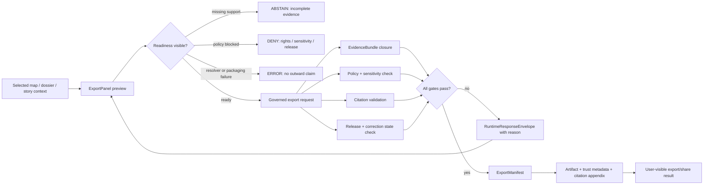

<!-- [KFM_META_BLOCK_V2]
doc_id: kfm://doc/TODO-VERIFY-ui-export-readme
title: UI Export Surface
type: standard
version: v1
status: draft
owners: TODO-VERIFY-ui-export-owner
created: 2026-04-27
updated: 2026-04-27
policy_label: TODO-VERIFY-policy-label
related: [TODO-VERIFY-ui-readme, TODO-VERIFY-exportmanifest-schema, TODO-VERIFY-governed-api-export-route]
tags: [kfm, ui, export, governed-ui, evidence, publication]
notes: [Drafted from attached KFM doctrine; target repo path, owners, policy label, related links, API prefix, schema home, and implementation depth require mounted-repo verification.]
[/KFM_META_BLOCK_V2] -->

# UI Export Surface

Governed export and share UI for outward artifacts that must preserve evidence, policy, release, correction, and provenance context.

<p align="left">
  
  
  
  
</p>

> [!IMPORTANT]
> **CONFIRMED doctrine:** exports are not decoration or convenience downloads. Exported artifacts must carry trust cues, citations, policy context, release/provenance state, correction state, and any redaction or generalization context.
>
> **UNKNOWN implementation:** the actual `ui/export/` directory, owner, component names, route binding, test runner, and schema home were not verified from a mounted repository in this session.

## Impact block

| Field | Value |
|---|---|
| **Status** | `experimental` |
| **Owners** | `TODO-VERIFY-ui-export-owner` |
| **Path** | `ui/export/` |
| **Authority class** | README-like UI surface guide; not the canonical schema, API, policy, or artifact authority |
| **Truth posture** | `CONFIRMED` doctrine / `PROPOSED` implementation shape / `UNKNOWN` mounted repo state |
| **Quick jumps** | [Scope](#scope) · [Repo fit](#repo-fit) · [Inputs](#inputs) · [Exclusions](#exclusions) · [Directory tree](#directory-tree) · [Export flow](#export-flow) · [Validation gates](#validation-gates) · [Open verification](#open-verification) |

---

## Scope

`ui/export/` owns the **browser-facing export/share surface** for KFM outward artifacts.

It should help users preview, request, and inspect exportable outputs without stripping the evidence and governance state that made the output legitimate.

This surface is responsible for:

- showing whether an export is ready, blocked, incomplete, stale, withdrawn, generalized, redacted, or policy-denied;
- keeping the active map/view/story/dossier scope visible before export;
- showing citations, EvidenceBundle references, release identifiers, correction state, and policy obligations;
- routing export requests through the governed API, not through browser-only packaging or direct data access;
- rendering negative outcomes as valid system behavior, not as blank UI.

This README is **not proof** that those components already exist.

[Back to top](#ui-export-surface)

---

## Repo fit

| Relation | Path or surface | Status | Notes |
|---|---|---:|---|
| This directory | `ui/export/` | `NEEDS VERIFICATION` | Target path from the requested doc task. Current repo contents were not mounted. |
| Parent UI surface | `ui/README.md` | `TODO-VERIFY` | Should explain the broader governed UI shell and adjacent surfaces. |
| Export schema | `schemas/contracts/v1/exportmanifest.schema.json` | `PROPOSED / NEEDS VERIFICATION` | Pipeline doctrine names `ExportManifest`; actual schema home must be verified. |
| Governed API route | `/api/v1/exports` or `/v1/exports` | `CONFLICTED / NEEDS VERIFICATION` | Attached doctrine uses both route-prefix patterns. Do not hard-code until OpenAPI is verified. |
| Evidence support | `EvidenceBundle`, `EvidenceRef`, `EvidenceDrawerPayload` | `CONFIRMED doctrine / UNKNOWN implementation` | Export must not sever the claim from its evidence chain. |
| Policy support | `DecisionEnvelope`, `PolicyDecision`, rights/sensitivity validators | `CONFIRMED doctrine / UNKNOWN implementation` | Export denial is expected when policy or citation gates fail. |
| Release support | `ReleaseManifest`, `MapReleaseManifest`, correction or withdrawal records | `CONFIRMED doctrine / UNKNOWN implementation` | Export must carry release and correction state. |

> [!NOTE]
> Links above are intentionally shown as paths or route candidates rather than clickable repo links until the mounted repository confirms neighboring files.

[Back to top](#ui-export-surface)

---

## Inputs

The export surface may accept only **governed, released, policy-checked context**.

| Input family | Belongs here | Minimum expectation |
|---|---|---|
| Selected view state | Active viewport, layers, time scope, selected feature or story/dossier context | Must be tied to release-aware state, not raw map pixels alone. |
| Evidence references | `EvidenceBundle` or `EvidenceRef` IDs already resolved or resolvable by the governed backend | Missing or unresolved support should produce `ABSTAIN` or a visible incomplete state. |
| Citation set | Citations attached to exportable claims | Citation failure blocks or downgrades export; it must not be hidden. |
| Release context | `release_id`, release state, manifest references, stale/withdrawn status | Export must identify what release or dry-run scope it represents. |
| Correction context | current/corrected/withdrawn/superseded lineage | Export must preserve correction state rather than silently replacing history. |
| Policy context | rights, sensitivity, audience lane, generalization/redaction transforms, obligations | Policy denial is a valid export result. |
| Output request | requested format, template, filename hint, share mode | Format availability must not override evidence or policy gates. |

### Illustrative request shape

This is **PROPOSED**, not a verified checked-in DTO.

```json
{
  "release_id": "TODO-VERIFY-release-id",
  "selected_view_state": {
    "bbox": [-102.1, 36.9, -94.5, 40.1],
    "active_time": "2026-04-27",
    "active_layers": ["TODO-VERIFY-layer-id"],
    "selected_feature": "TODO-VERIFY-feature-id"
  },
  "evidence_bundle_ids": ["TODO-VERIFY-evidence-bundle-id"],
  "citation_refs": ["TODO-VERIFY-evidence-ref-id"],
  "correction_state": "current",
  "policy_context": {
    "audience": "public",
    "rights": "TODO-VERIFY",
    "sensitivity": "TODO-VERIFY",
    "transforms": []
  },
  "output_format": "TODO-VERIFY-format"
}
```

[Back to top](#ui-export-surface)

---

## Exclusions

The export UI must not become a hidden publication, packaging, policy, or data-access bypass.

| Does **not** belong in `ui/export/` | Where it belongs instead | Why |
|---|---|---|
| Canonical evidence, RAW, WORK, or QUARANTINE data access | backend governed services and lifecycle stores | Public/UI surfaces must not bypass the trust membrane. |
| Export artifact storage | release/publication artifact store, object storage, or governed delivery layer | UI asks for export; it does not become the artifact authority. |
| Policy rules or sensitivity law | `policy/`, policy contracts, validators | UI may display policy state, not define it. |
| Schema definitions | `schemas/`, `contracts/`, or repo-confirmed schema home | UI consumes validated contracts. |
| Server route handlers | governed API app path after repo verification | UI client should not duplicate backend decisions. |
| Model-runtime calls | governed AI adapter behind backend policy and evidence checks | Browser must not call model runtime directly. |
| Silent client-side redaction | governed transform pipeline with receipts | Hidden client filtering can leak or misrepresent sensitive state. |
| Uncited export generation | blocked by export/citation validation | Outward artifacts must remain traceable. |

> [!WARNING]
> A successful-looking download that omits trust cues is a failure in KFM terms.

[Back to top](#ui-export-surface)

---

## Directory tree

The tree below is a **PROPOSED starter map** for review. Preserve actual repo conventions if they differ.

```text
ui/export/
├── README.md
├── ExportPanel.tsx                 # PROPOSED: export request and readiness shell
├── ExportPreview.tsx               # PROPOSED: trust-bearing preview
├── ExportRequirements.tsx          # PROPOSED: missing citations/policy/release requirements
├── ExportStatusBanner.tsx          # PROPOSED: ABSTAIN / DENY / ERROR / stale / withdrawn states
├── exportClient.ts                 # PROPOSED: governed API client wrapper, no direct data access
├── exportState.ts                  # PROPOSED: local UI state only; no truth authority
├── types.ts                        # PROPOSED: UI-local types generated or narrowed from contracts
├── fixtures/
│   ├── export-ready.fixture.json
│   ├── export-denied-policy.fixture.json
│   ├── export-abstain-incomplete-evidence.fixture.json
│   └── export-error-packaging.fixture.json
└── __tests__/
    ├── export-ready.test.tsx
    ├── export-denied-policy.test.tsx
    ├── export-missing-citations.test.tsx
    └── export-accessibility.test.tsx
```

### Placement rule

Use this tree only after confirming:

1. the real UI app location;
2. framework and package manager;
3. route/client naming convention;
4. test runner;
5. schema generation or type-import convention;
6. whether `ui/export/` is a real repo path or a documentation target awaiting migration.

[Back to top](#ui-export-surface)

---

## Export flow



### Flow law

The UI may start the export request, but the governed backend must decide whether the requested outward artifact is allowed, sufficiently supported, and safe to release.

[Back to top](#ui-export-surface)

---

## Trust requirements

| Surface element | Must show | Must never do |
|---|---|---|
| Export preview | scope chips, release ID, policy state, citation readiness, correction state | present export as a plain download when trust state is incomplete |
| Requirements panel | missing citations, unresolved EvidenceRefs, stale release, denied sensitivity, blocked rights | bury blockers in developer console output |
| Artifact summary | output format, public scope, generalization/redaction note, citation appendix status | strip generalization or redaction context |
| Negative state banner | `ABSTAIN`, `DENY`, or `ERROR` with safe reason class | replace denial with vague “not available” copy |
| Share link / permalink | redacted public-safe state only | encode steward-only context or exact restricted geometry |
| Export history | current, stale, withdrawn, superseded, or corrected state | silently replace prior export lineage |

### Starter state vocabulary

`PROPOSED` UI-local labels until contracts confirm enum names:

| State | Meaning |
|---|---|
| `ready_to_export` | Evidence, policy, citation, release, and correction checks are satisfied. |
| `missing_citations` | One or more exportable claims lack citation support. |
| `incomplete_evidence` | EvidenceBundle closure is incomplete or unresolved. |
| `denied_by_policy` | Rights, sensitivity, audience, or release policy blocks export. |
| `stale_visible` | Export may be visible with freshness warning, depending on policy. |
| `generalized_geometry` | Output geometry has been generalized intentionally. |
| `redacted_content` | Output has visible redaction context. |
| `release_withdrawn` | Requested release or claim has been withdrawn. |
| `packaging_error` | Backend could not package safely; no claim is released from the failed export. |

[Back to top](#ui-export-surface)

---

## Quickstart

Use these commands only to inspect the mounted repo before making stronger claims.

```bash
# Confirm repo state.
git status --short
git branch --show-current

# Confirm whether this directory exists and what it already owns.
find ui/export -maxdepth 3 -type f | sort

# Find adjacent UI README conventions.
find ui -maxdepth 3 -name README.md -print | sort

# Locate export-related contracts, routes, fixtures, or components.
grep -RIn \
  "ExportManifest\|ExportPanel\|/api/v1/exports\|/v1/exports\|EvidenceDrawerPayload\|RuntimeResponseEnvelope" \
  ui apps packages schemas contracts tests policy 2>/dev/null || true
```

> [!CAUTION]
> Do not add build, test, or package-manager commands here until the actual repo toolchain is verified.

[Back to top](#ui-export-surface)

---

## Usage guidance

### Export readiness checklist

An export button should be enabled only when the UI can show the user a trustworthy answer to these questions:

| Question | Required answer |
|---|---|
| What am I exporting? | visible scope: place, time, layer/story/dossier context, selected object |
| What backs it? | evidence/citation summary and EvidenceBundle route |
| What release is it from? | release ID and current/stale/withdrawn state |
| Is it public-safe? | rights and sensitivity result, including transforms |
| What changed? | correction or supersession state |
| What will travel with it? | trust metadata, citation appendix, release/provenance state |

### Export outcome rendering

| Outcome | UI behavior |
|---|---|
| `ANSWER` / success-equivalent | Show artifact readiness, trust metadata, citation appendix, and safe download/share action. |
| `ABSTAIN` | Explain missing support or incomplete evidence; offer evidence narrowing or scope refinement. |
| `DENY` | Show safe policy reason class; do not expose restricted details. |
| `ERROR` | Show packaging/resolver failure; do not substitute raw feature properties or partial export text. |

[Back to top](#ui-export-surface)

---

## Validation gates

`ui/export/` is mature enough to claim active implementation only after these checks pass in the real repo.

- [ ] `ui/export/` path and neighboring README conventions are verified.
- [ ] Owners and CODEOWNERS/review routing are confirmed.
- [ ] API base path is resolved through OpenAPI or route source evidence.
- [ ] `ExportManifest` schema home is confirmed or an ADR records the chosen home.
- [ ] Export UI uses a governed API client; no direct canonical, RAW, WORK, QUARANTINE, or model-runtime access.
- [ ] Export preview shows release ID, citation readiness, policy state, correction state, and transform context.
- [ ] Citation failure blocks or downgrades export visibly.
- [ ] Rights/sensitivity denial renders `DENY` without leaking protected details.
- [ ] Incomplete evidence renders `ABSTAIN` without pretending unsupported claims are exportable.
- [ ] Packaging/resolver failure renders `ERROR` and releases no claim.
- [ ] Withdrawn/superseded release state remains visible.
- [ ] Generalization/redaction context travels with the outward artifact.
- [ ] Accessibility smoke tests cover keyboard flow, status announcements, and no color-only status.
- [ ] Fixtures cover ready, denied, abstained, stale, withdrawn, generalized, redacted, and packaging-error cases.
- [ ] No destructive export or publication action is possible from the browser alone.

[Back to top](#ui-export-surface)

---

## Open verification

| Item | Label | Verification needed |
|---|---:|---|
| Does `ui/export/` already exist? | `UNKNOWN` | Mount the real repo and inspect the path. |
| Is this a new README or a revision? | `UNKNOWN` | Check Git history and existing file contents. |
| Owner | `TODO-VERIFY` | Check CODEOWNERS, team docs, or adjacent UI README. |
| Policy label | `TODO-VERIFY` | Check repository metadata and documentation policy. |
| API prefix | `CONFLICTED` | Resolve `/api/v1/exports` vs `/v1/exports` from OpenAPI or route source. |
| Schema home | `NEEDS VERIFICATION` | Confirm `schemas/contracts/v1/` vs `contracts/` convention. |
| Component framework | `UNKNOWN` | Confirm React/TypeScript or actual UI framework from package files. |
| Test runner | `UNKNOWN` | Confirm Vitest/Jest/Playwright or repo-native test runner. |
| Export formats | `UNKNOWN` | Confirm allowed artifact formats and templates. |
| Artifact storage | `UNKNOWN` | Confirm release/delivery layer; do not infer from UI. |
| Permission model | `UNKNOWN` | Confirm public, steward, reviewer, and admin role behavior. |

[Back to top](#ui-export-surface)

---

## FAQ

<details>
<summary>Why does export need an EvidenceBundle?</summary>

Because a KFM export is an outward-facing claim carrier. A map, story, dossier, image, PDF, CSV, or share link must remain reconstructable to the evidence and release state that supported it. If support cannot be resolved, the export should abstain, deny, or error rather than emit a confident artifact.
</details>

<details>
<summary>Can the browser package an export locally?</summary>

Only for presentation-safe work after backend gates have passed. The browser must not decide policy, publishability, citation validity, redaction, or release state. Local packaging that bypasses governed checks is out of scope.
</details>

<details>
<summary>Can export include AI-generated text?</summary>

Only if the text is visibly model-assisted, citation-validated, policy-checked, and represented through the governed runtime envelope and receipt model. Unsupported generated prose must be removed, abstained, or denied.
</details>

<details>
<summary>Can export hide sensitive geometry by client-side filtering?</summary>

No. Redaction, generalization, aggregation, and withheld counts belong to governed transforms and must be recorded. The UI may display the transform result and context, but it must not silently create its own public-safe version.
</details>

---

## Definition of done

This README is done enough for a first commit when:

- [ ] placeholders in the meta block are replaced with verified values or deliberately retained with review notes;
- [ ] adjacent README links are verified or left as non-clickable TODOs;
- [ ] the API prefix conflict is resolved or explicitly documented in an ADR;
- [ ] the proposed tree is replaced by a current tree if files exist;
- [ ] at least one ready export fixture and one negative-state fixture are linked;
- [ ] a reviewer can tell exactly what this directory owns and what it must never own;
- [ ] no sentence claims implementation maturity without repo, test, schema, or runtime evidence.

```text
Rollback: this README can be reverted as a single documentation change.
No data, generated artifact, policy, schema, or runtime migration should depend on it.
```

[Back to top](#ui-export-surface)