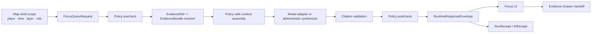

<!-- [KFM_META_BLOCK_V2]
doc_id: kfm://doc/NEEDS_VERIFICATION__ui_focus_readme
title: ui/focus
type: standard
version: v1
status: draft
owners: NEEDS_VERIFICATION__ui_focus_owner
created: 2026-04-27
updated: 2026-04-27
policy_label: NEEDS_VERIFICATION__public_or_internal
related: [
  NEEDS_VERIFICATION__ui_parent_readme,
  NEEDS_VERIFICATION__evidence_drawer_readme,
  NEEDS_VERIFICATION__trust_state_readme,
  NEEDS_VERIFICATION__governed_api_readme,
  NEEDS_VERIFICATION__runtime_response_envelope_schema,
  NEEDS_VERIFICATION__focus_query_contracts,
  NEEDS_VERIFICATION__policy_readme,
  NEEDS_VERIFICATION__tests_focus_fixtures
]
tags: [kfm, ui, focus, governed-ai, evidence-drawer, trust-state, runtime-envelope]
notes: [
  Created for requested target path `ui/focus/README.md`.
  No mounted KFM repository was available in the visible workspace, so exact ownership, adjacent paths, app framework, component inventory, route names, schemas, tests, and policy labels remain NEEDS VERIFICATION.
  Dates reflect this draft-generation pass; replace if git history proves this file already existed.
  This README treats Focus Mode as a README-like directory doc and a standard governance-facing doc.
]
[/KFM_META_BLOCK_V2] -->

<a id="top"></a>

# `ui/focus`

Evidence-bounded synthesis surface for KFM’s governed shell: Focus helps interpret released evidence without becoming a detached chatbot or a truth source.


> [!IMPORTANT]
> **Status:** experimental  
> **Owners:** `NEEDS_VERIFICATION__ui_focus_owner`  
> **Path:** `ui/focus/README.md`  
> **Quick jumps:** [Scope](#scope) · [Repo fit](#repo-fit) · [Accepted inputs](#accepted-inputs) · [Exclusions](#exclusions) · [Directory tree](#directory-tree) · [Operating model](#operating-model) · [Outcome matrix](#outcome-matrix) · [Contract touchpoints](#contract-touchpoints) · [Quickstart](#quickstart) · [Definition of done](#definition-of-done) · [FAQ](#faq) · [Appendix](#appendix)

> [!NOTE]
> This README is intentionally **placement-bounded**. The requested path is `ui/focus/README.md`; the actual mounted repository, UI framework, route tree, schema home, and component inventory were not available during this draft. Paths below are reviewable targets or placeholders unless a future repo scan confirms them.

---

## Scope

`ui/focus/` is the documentation and eventual UI home for **Focus Mode**, the KFM surface that turns a user’s current map/time/evidence context into bounded synthesis.

Focus Mode may summarize, compare, explain, and help navigate **released, policy-safe evidence**. It must preserve the same trust membrane as the map shell, Evidence Drawer, Review surface, Export surface, and governed API.

It exists to answer questions like:

- “What does the released evidence in this map view support?”
- “Which sources are stale, disputed, generalized, or restricted?”
- “Can this claim be supported, or should the system abstain?”
- “What evidence bundle, release scope, policy decision, and receipt back this answer?”

It does **not** exist to provide an open-ended model chat panel.

<p align="right"><a href="#top">Back to top ↑</a></p>

---

## Repo fit

| Relationship | Path or surface | Status | Why it matters |
|---|---|---:|---|
| This README | `ui/focus/README.md` | **PROPOSED / requested** | Orientation for the Focus UI lane. |
| Parent UI lane | `ui/README.md` | **NEEDS VERIFICATION** | Should define shared UI conventions, shell placement, and trust-state vocabulary. |
| Evidence Drawer sibling | `ui/evidence_drawer/README.md` | **NEEDS VERIFICATION** | Focus answers must drill into evidence support without losing map/time context. |
| Trust-state sibling | `ui/trust_state/README.md` | **NEEDS VERIFICATION** | Focus must render freshness, support, rights/sensitivity, review state, and AI participation cues. |
| Governed API upstream | `apps/governed_api/README.md` or repo-native equivalent | **NEEDS VERIFICATION** | Focus should consume governed response envelopes, not raw stores or model endpoints. |
| Runtime contract upstream | `schemas/contracts/v1/runtime/README.md` or repo-native equivalent | **NEEDS VERIFICATION** | Focus outward behavior should be shaped by finite runtime response envelopes. |
| Policy upstream | `policy/README.md` | **NEEDS VERIFICATION** | Policy precheck and postcheck are backend enforcement, not UI decoration. |
| Tests downstream | `tests/fixtures/focus/`, `tests/e2e/focus/`, or repo-native equivalent | **PROPOSED** | Needed to prove negative states, evidence closure, accessibility, and no-direct-model-client behavior. |

> [!WARNING]
> Do not create duplicate authority homes. If the real repo uses `apps/web/features/focus/`, `packages/ui/focus/`, or another established location, adapt this README through an ADR instead of splitting Focus documentation across competing paths.

<p align="right"><a href="#top">Back to top ↑</a></p>

---

## Accepted inputs

Focus UI may accept only inputs that are already inside the governed shell boundary.

| Input | Accepted shape | Required posture |
|---|---|---|
| Shell scope | active place, viewport, time window, selected layer, release scope, audience lane, role | Scope must be visible before the answer is read. |
| Evidence handles | `EvidenceRef`, resolved `EvidenceBundle` IDs, release IDs, catalog refs | Evidence must resolve before consequential synthesis is released. |
| Focus request | `FocusQueryRequest` or repo-native equivalent | Request must carry scope, role, release context, and evidence-bundle references. |
| Runtime response | `RuntimeResponseEnvelope` or repo-native equivalent | Response must use finite outcomes and expose policy, citations, freshness, and audit reference. |
| Trust-state payload | `TrustState`, `NegativeStatePayload`, or repo-native equivalent | Negative states are first-class UI states, not empty panels. |
| Drawer handoff | `EvidenceDrawerPayload` or repo-native equivalent | Every answer must be able to open support details. |
| Test fixtures | small, public-safe fixtures for `ANSWER`, `ABSTAIN`, `DENY`, `ERROR`, stale support, and citation failure | Fixtures should be deterministic and no-network by default. |

### Illustrative request shape

This is an **illustrative example**, not a confirmed checked-in contract.

```json
{
  "schema_version": "1.0.0",
  "object_type": "focus_query_request",
  "request_id": "req.example.focus.0001",
  "surface_class": "focus.read",
  "question": "What does this released layer support about the selected feature?",
  "scope": {
    "release_scope": ["rel.example.2026-04-27"],
    "time_window": {
      "from": "2026-04-01T00:00:00Z",
      "to": "2026-04-27T00:00:00Z"
    },
    "map_context": {
      "layer_id": "layer.example.public_safe",
      "feature_id": "feature.example.123"
    }
  },
  "evidence_bundle_refs": ["evb.example.123"],
  "role": "public"
}
```

<p align="right"><a href="#top">Back to top ↑</a></p>

---

## Exclusions

Focus must not admit or normalize shortcuts that bypass KFM’s evidence and publication controls.

| Excluded from `ui/focus/` | Goes instead | Reason |
|---|---|---|
| Direct model-runtime clients, SDK keys, or localhost model URLs | backend governed AI adapter | The browser must not become a model-client boundary. |
| RAW, WORK, QUARANTINE, canonical-store, graph-store, object-store, vector-index, or unpublished candidate reads | governed API and evidence resolver | Public UI consumes released, policy-safe payloads only. |
| Client-side policy decisions for consequential visibility, precision, or release | backend policy engine | UI renders policy outcomes; it does not decide release. |
| Hidden sensitive geometry, precise protected locations, private land data, living-person/DNA content, or steward-only fields | role-gated backend surfaces or quarantine | Focus must fail closed where sensitivity is unresolved. |
| Free-form uncited model prose | citation validation and runtime envelope | Unsupported claims become `ABSTAIN`, `DENY`, or `ERROR`. |
| Chain-of-thought or hidden model reasoning as a KFM truth object | no storage; retain envelope, citations, validation, and receipt only | EvidenceBundle outranks generated language. |
| Emergency instructions, legal determinations, title truth, medical claims, or other high-stakes action advice | official source guidance or steward review | Focus explains released KFM evidence; it is not an emergency or professional decision system. |

<p align="right"><a href="#top">Back to top ↑</a></p>

---

## Directory tree

Current mounted-repo contents are **NEEDS VERIFICATION**. This tree describes the requested documentation home and a cautious candidate structure for future implementation.

```text
ui/
└── focus/
    ├── README.md                         # this document
    ├── components/                       # PROPOSED: Focus panel, answer card, citation list
    ├── fixtures/                         # PROPOSED: public-safe outcome fixtures
    ├── mappers/                          # PROPOSED: envelope -> UI view model mapping
    ├── negative_states/                  # PROPOSED: ABSTAIN / DENY / ERROR copy and a11y labels
    └── tests/                            # PROPOSED: local UI contract/a11y tests
```

Potential adjacent homes, all **NEEDS VERIFICATION** until the real repo is mounted:

```text
ui/evidence_drawer/
ui/trust_state/
apps/governed_api/
schemas/contracts/v1/runtime/
schemas/contracts/v1/focus/
policy/
tests/fixtures/focus/
tests/e2e/focus/
```

<p align="right"><a href="#top">Back to top ↑</a></p>

---

## Operating model

Focus is a shell mode. It inherits map, time, release, evidence, and role context; then it asks the governed backend for a finite, reviewable outcome.



### Boundary rule

Focus may render a model-assisted answer only after:

1. scope is explicit,
2. release context is known,
3. evidence references resolve,
4. policy allows the surface,
5. citations validate,
6. freshness and review state remain visible,
7. the response is wrapped in a finite outcome envelope.

<p align="right"><a href="#top">Back to top ↑</a></p>

---

## Outcome matrix

| Outcome | User-visible meaning | UI behavior | Must not do |
|---|---|---|---|
| `ANSWER` | The released evidence supports a bounded answer. | Show answer, citations, scope, policy/freshness state, and Evidence Drawer link. | Overstate beyond the cited evidence. |
| `ABSTAIN` | The system cannot support the claim from released evidence. | Show missing/weak support reason and suggested narrowing path where safe. | Fill gaps with plausible model text. |
| `DENY` | Policy or sensitivity blocks release on this surface. | Show safe reason class, obligations where allowed, and no restricted details. | Leak hidden geometry, rights-sensitive material, or steward-only explanation. |
| `ERROR` | Resolver, validation, runtime, or envelope creation failed. | Show failure state and emit/report audit reference. | Fall back to raw feature properties or uncited prose. |

### Example wording patterns

| Outcome | Pattern |
|---|---|
| `ANSWER` | “Based on the released evidence in this map view, the supported answer is … Evidence: … Scope: …” |
| `ABSTAIN` | “I cannot support that claim from the released evidence in this map view. Missing or weak support: …” |
| `DENY` | “This request cannot be answered in this surface because policy or sensitivity rules block release. Reason class: …” |
| `ERROR` | “A reliable answer cannot be produced because the resolver or validation step failed. No claim has been released from this response.” |

<p align="right"><a href="#top">Back to top ↑</a></p>

---

## Contract touchpoints

| Contract or object family | Focus role | UI responsibility | Verification status |
|---|---|---|---|
| `FocusQueryRequest` | User question plus shell scope | Do not construct without visible scope and role context. | **NEEDS VERIFICATION** |
| `FocusQueryResponse` | Focus-specific response wrapper if separate from runtime envelope | Prefer thin mapping over duplicate truth semantics. | **NEEDS VERIFICATION** |
| `RuntimeResponseEnvelope` | Finite outward outcome | Render outcome, audit ref, policy, citations, freshness, and release scope. | **PROPOSED / doctrine-grounded** |
| `EvidenceBundle` | Inspectable support | Link every consequential answer back to drawer-ready support. | **PROPOSED / doctrine-grounded** |
| `EvidenceDrawerPayload` | Trust anchor payload | Preserve title, scope, evidence stack, transforms, correction lineage, and Focus handoff. | **PROPOSED / doctrine-grounded** |
| `CitationValidationReport` | Anti-hallucination gate | Never render unsupported claims as `ANSWER`. | **PROPOSED / doctrine-grounded** |
| `PolicyDecision` | Allow, deny, abstain, or error policy result | Surface safe reason/obligation state; never re-decide in UI. | **PROPOSED / doctrine-grounded** |
| `RunReceipt` / `AIReceipt` | Audit and replay support | Display receipt ID only where useful; do not expose prompt text or restricted context. | **PROPOSED / doctrine-grounded** |
| `TrustState` / `NegativeStatePayload` | Accessible visible states | Make stale, restricted, generalized, disputed, denied, and error states readable and keyboard reachable. | **PROPOSED** |

<p align="right"><a href="#top">Back to top ↑</a></p>

---

## Quickstart

Use these checks after mounting the real KFM repository. They are non-destructive and should be adapted to the repo’s actual tooling.

```bash
# From the repository root:
test -f ui/focus/README.md

# Inspect the target directory without assuming implementation depth.
find ui/focus -maxdepth 3 -type f 2>/dev/null | sort

# Locate Focus, runtime envelope, evidence drawer, and policy contract surfaces.
grep -RIn \
  "FocusQueryRequest\|FocusQueryResponse\|RuntimeResponseEnvelope\|EvidenceDrawerPayload\|CitationValidationReport\|AIReceipt\|RunReceipt" \
  ui apps packages schemas contracts tests policy 2>/dev/null | head -100
```

Expected posture:

- `ui/focus/README.md` exists and remains source-bounded.
- Focus UI does not import model SDKs or call model runtimes directly.
- Focus fixtures cover all four outcomes: `ANSWER`, `ABSTAIN`, `DENY`, `ERROR`.
- Any outward answer can open an Evidence Drawer payload.
- Any missing evidence produces `ABSTAIN`, not a persuasive guess.
- Any policy block produces `DENY`, not silent disappearance.
- Any resolver or validation failure produces `ERROR`, not raw fallback.

<p align="right"><a href="#top">Back to top ↑</a></p>

---

## Usage

### For UI contributors

Build Focus as a **view over governed envelopes**, not as a chat app.

Recommended component responsibilities:

| Component responsibility | Should do | Should not do |
|---|---|---|
| Scope header | Show place, time, release scope, role, layer, and AI participation badge. | Hide boundary conditions below the fold. |
| Question input | Submit bounded requests with visible scope. | Permit direct prompt injection into model runtime. |
| Answer card | Render finite outcome, citations, freshness, policy state, and drawer link. | Render unclassified prose-only responses. |
| Citation list | Show EvidenceRef/EvidenceBundle handles and support state. | Collapse all support into one generic source. |
| Negative-state card | Use clear `ABSTAIN`, `DENY`, and `ERROR` copy. | Use vague empty-state language for policy or evidence failures. |
| Drawer handoff | Open evidence support without changing map/time context. | Send hidden geometry or raw properties to Focus. |

### For backend/API contributors

Focus should receive a clean response envelope from the governed backend. The UI should not assemble policy-safe context by scraping feature properties.

### For reviewers

Review Focus changes as trust-boundary changes. Small visual adjustments can still weaken governance if they hide evidence state, freshness, sensitivity, or refusal semantics.

<p align="right"><a href="#top">Back to top ↑</a></p>

---

## Definition of done

A Focus change is not complete until the following gates are satisfied or explicitly marked **NEEDS VERIFICATION** with a tracked follow-up.

- [ ] **Scope visible:** active place, time, release scope, layer, audience/role, and AI participation state are visible before answer text.
- [ ] **Finite outcomes only:** `ANSWER`, `ABSTAIN`, `DENY`, and `ERROR` are the only outward answer outcomes.
- [ ] **Evidence closure:** every `ANSWER` links to resolved EvidenceBundle support.
- [ ] **Citation gate:** unsupported consequential claims are removed or converted to `ABSTAIN`.
- [ ] **Policy gate:** policy blocks produce `DENY` with a safe reason class.
- [ ] **Failure gate:** resolver/runtime/validation failure produces `ERROR`; no raw fallback.
- [ ] **Drawer handoff:** every answer state can route to Evidence Drawer or a safe negative-state explanation.
- [ ] **No direct model client:** browser code does not import model SDKs, hold model endpoint URLs, or call local/private model runtimes.
- [ ] **No raw store access:** browser code does not call RAW, WORK, QUARANTINE, canonical, graph, vector, object-store, or unpublished candidate paths.
- [ ] **A11y gate:** keyboard navigation, semantic status labels, focus management, and readable denial/error copy are covered.
- [ ] **Telemetry gate:** no raw prompt text, restricted geometry, hidden evidence, full EvidenceBundle copies, secrets, or model context are logged.
- [ ] **Fixture coverage:** positive, abstain, deny, error, stale, restricted, generalized, and citation-failure examples exist.
- [ ] **Rollback path:** Focus can be disabled without breaking map browsing or Evidence Drawer.
- [ ] **Docs synchronized:** contract, policy, fixture, and UI docs are updated together or the omission is explained.

<p align="right"><a href="#top">Back to top ↑</a></p>

---

## FAQ

### Is Focus Mode an AI chat feature?

No. Focus is a governed synthesis surface inside the map-first shell. It can use a model adapter behind the governed API, but it must remain downstream of evidence resolution, policy checks, citation validation, release state, and drawer visibility.

### Can Focus answer from feature properties visible on the map?

Not by treating those properties as truth. Rendered feature properties can help identify the selected candidate, but consequential claims must resolve through governed evidence.

### What happens when support is partial or missing?

Use `ABSTAIN`. Missing support is a valid result, not a UI failure.

### What happens when policy blocks a response?

Use `DENY`. Show only a safe reason class and permitted obligations. Do not leak restricted details to explain the denial.

### Can Focus propose actions?

Only as proposals. Any layer toggle, export, review change, publication action, or release-impacting action must pass backend authorization and review. Focus must not silently perform policy-significant actions.

### Can chain-of-thought be stored as evidence?

No. Store the response envelope, citations, validation report, and receipt. Hidden model reasoning is not a KFM truth object.

<p align="right"><a href="#top">Back to top ↑</a></p>

---

## Appendix

<details>
<summary>Verification backlog</summary>

| Item | Status | Why it remains open |
|---|---:|---|
| Exact owner for `ui/focus/` | **NEEDS VERIFICATION** | No mounted repo or CODEOWNERS file was available. |
| Whether `ui/focus/` already exists | **UNKNOWN** | Target path was not visible in the workspace scan. |
| UI framework and component conventions | **UNKNOWN** | No package files or app tree were available. |
| Schema home for Focus contracts | **NEEDS VERIFICATION** | Prior KFM materials mention both `contracts/` and `schemas/contracts/v1/` patterns. |
| Exact governed API route names | **NEEDS VERIFICATION** | Route classes are doctrinal; concrete route paths must come from repo evidence. |
| Focus fixtures and test locations | **PROPOSED** | Test tree was not available. |
| Policy engine and policy package names | **UNKNOWN** | No mounted policy files or CI workflow were available. |
| Runtime provider integration | **UNKNOWN** | Focus should be provider-neutral; adapter implementation is not confirmed. |
| Accessibility test stack | **UNKNOWN** | Repo test runner and UI framework remain unverified. |
| Deployment/local exposure posture | **NEEDS VERIFICATION** | Reverse proxy, VPN, auth, CORS, logs, and model endpoint controls require environment evidence. |

</details>

<details>
<summary>Glossary</summary>

| Term | Meaning in this README |
|---|---|
| Focus Mode | Bounded synthesis surface inside KFM’s governed shell. |
| Evidence Drawer | Mandatory trust object for inspecting support, source roles, review state, sensitivity, freshness, transforms, and correction lineage. |
| EvidenceRef | Reference that must resolve to an EvidenceBundle before a consequential claim is released. |
| EvidenceBundle | Inspectable support object that outranks generated language. |
| RuntimeResponseEnvelope | Finite outward response object carrying outcome, citations, policy, freshness, release scope, and audit reference. |
| Negative state | First-class UI state such as `ABSTAIN`, `DENY`, or `ERROR`. |
| Governed API | Backend interface that applies evidence, policy, release, and review rules before UI consumption. |
| Trust membrane | Boundary preventing public/client surfaces from reaching canonical, raw, unpublished, restricted, or model-runtime internals directly. |

</details>

<p align="right"><a href="#top">Back to top ↑</a></p>