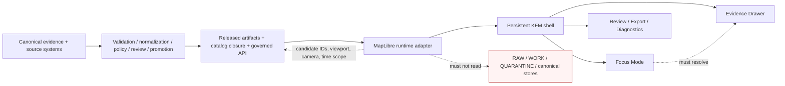
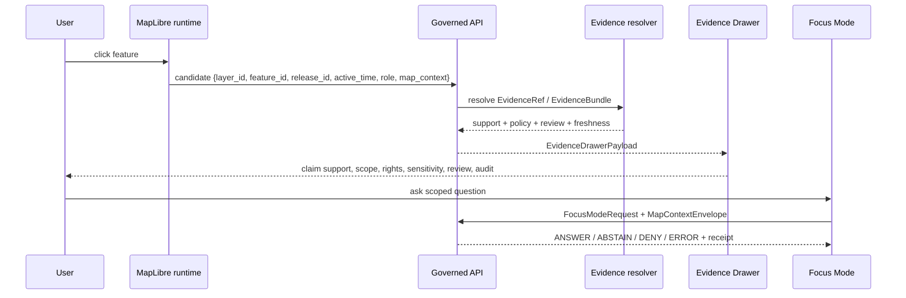

<!-- [KFM_META_BLOCK_V2]
doc_id: kfm://doc/TODO-UUID-ui-maplibre-readme
title: MapLibre UI Runtime
type: standard
version: v1
status: draft
owners: <TODO: confirm UI/platform steward>
created: 2026-04-27
updated: 2026-04-27
policy_label: <TODO: public|restricted>
related: [<TODO: confirm related repo docs, schemas, contracts, policies, and release manifests after repo mount>]
tags: [kfm, ui, maplibre, governed-ui, evidence-drawer, focus-mode]
notes: [Target path supplied by task; real repo tree not mounted during authoring; owners, policy label, related links, and adjacent file layout need verification.]
[/KFM_META_BLOCK_V2] -->

# MapLibre UI Runtime

MapLibre is the disciplined 2D renderer and interaction runtime for KFM’s governed, evidence-first map shell.

| Status | Owners | Badges | Quick jumps |
| --- | --- | --- | --- |
| **experimental** / NEEDS VERIFICATION | `<TODO: confirm UI/platform steward>` |     | [Scope](#scope) · [Repo fit](#repo-fit) · [Inputs](#accepted-inputs) · [Exclusions](#exclusions) · [Runtime flow](#runtime-flow) · [Done](#definition-of-done) |

> [!IMPORTANT]
> This README is written for `ui/maplibre/README.md`, the target path supplied for this documentation task. The surrounding repository tree was not available during authoring, so file homes, package commands, owners, and links to adjacent repo docs remain **NEEDS VERIFICATION** until a real checkout is mounted.

## Scope

This directory is the home for KFM’s MapLibre-facing UI runtime documentation and, once verified in the real repo, the runtime adapter or shell-facing assets that connect MapLibre to governed KFM map interaction.

KFM uses MapLibre as a **renderer and interaction runtime**, not as the source of truth. This README therefore documents the boundary between:

- released map artifacts and the browser map runtime;
- feature selection and evidence resolution;
- style/layer rendering and claim authority;
- UI affordances and governed API decisions;
- Focus Mode synthesis and EvidenceBundle-backed support.

The durable rule is simple:

> **Renderer downstream of trust, never upstream of it.**

[Back to top](#maplibre-ui-runtime)

## Repo fit

| Fit item | Status | Value |
| --- | --- | --- |
| Target path | CONFIRMED from task | `ui/maplibre/README.md` |
| Directory role | PROPOSED | MapLibre runtime orientation, renderer boundary, accepted inputs, exclusions, and review gates. |
| Upstream contract homes | NEEDS VERIFICATION | Expected homes may include `schemas/contracts/v1/maplibre/`, `contracts/api/maplibre/`, `policy/maplibre/`, and release/catalog/proof locations. Do not convert these to links until the repo tree confirms them. |
| Downstream UI surfaces | PROPOSED | Explore, Dossier, Story, Compare, Review, Export, Diagnostics, Evidence Drawer, and Focus Mode. |
| Canonical stores | EXCLUDED | Canonical evidence, RAW, WORK, QUARANTINE, review-only stores, proof packs, and model-runtime stores do not belong in this directory. |
| First practical proof lane | PROPOSED | A small hydrology/HUC12-style public-safe fixture that proves click → governed resolution → Evidence Drawer → Focus outcome → receipt. |

### Upstream / downstream responsibility map



[Back to top](#maplibre-ui-runtime)

## Accepted inputs

Only governed, released, policy-safe, or explicitly fixture-scoped inputs belong in or through this MapLibre runtime boundary.

| Input | Required posture | Why it belongs here |
| --- | --- | --- |
| `LayerManifest` | Released or fixture-scoped | Binds layer identity, domain, release, evidence route, time semantics, and public-safety posture. |
| `StyleManifest` / style JSON | Versioned, reviewable asset | Describes visual treatment without becoming business meaning or evidence authority. |
| `TileArtifactManifest` | Hashable released artifact | Points to MVT, PMTiles, COG, or equivalent delivery artifacts with provenance and cache behavior. |
| Map selection candidate | Runtime-only candidate | `layer_id`, `feature_id`, `release_id`, active time, viewport, camera, and role context can be passed to governed resolution. |
| `MapContextEnvelope` | Scoped shell state | Carries place, time, visible layers, release context, audience/role, and policy-relevant context into Drawer and Focus flows. |
| `EvidenceDrawerPayload` | Governed API result | Carries support summary, source role, EvidenceRef/EvidenceBundle identity, rights, sensitivity, freshness, review state, provenance, and audit linkage. |
| `FocusModeRequest` / `FocusModeResponse` | Evidence-bounded | Focus must emit `ANSWER`, `ABSTAIN`, `DENY`, or `ERROR` and preserve citations, policy state, scope, and receipt links. |
| Runtime receipts | Append-only process memory | Captures interaction outcome, timing, release IDs, and resolver results for observability and audit. |
| Dependency admission records | Review-gated | Plugins, wrappers, protocol adapters, and renderer packages need license, health, parity, accessibility, and rollback notes. |

## Exclusions

| Do not put here | Goes instead | Reason |
| --- | --- | --- |
| RAW, WORK, QUARANTINE, canonical evidence, or unpublished candidate data | Data lifecycle homes / governed backend | Public and normal UI surfaces must not bypass the trust membrane. |
| Source registry definitions | Source registry / data governance docs | Source authority, rights, and sensitivity are upstream governance concerns. |
| JSON Schemas as canonical truth | Canonical schema home after ADR | Schema-home authority is not confirmed from the mounted repo. |
| Policy-as-code decisions | `policy/` or repo-native policy home | Client logic cannot make release, sensitivity, rights, or evidence decisions. |
| Proof packs, release manifests, promotion decisions | Proof / release / catalog homes | Release-significant objects must remain auditable and separated from runtime UI. |
| Direct model-runtime clients | Governed AI adapter behind API | Focus Mode consumes governed envelopes; it is not free-form browser chat. |
| Live source connectors | Pipeline/source integration homes | Live ingestion must pass source terms, rights, credentials, cadence, validation, and promotion gates. |
| Exact sensitive geometry payloads | Policy-mediated backend / redacted artifacts | Restricted objects should surface as safe stubs or generalized forms, not leak precision. |
| Mapbox-era or third-party plugin adoption without review | Dependency admission workflow | Wrappers/plugins can introduce hidden network calls, accessibility debt, license risk, and trust bypasses. |

[Back to top](#maplibre-ui-runtime)

## Directory tree

> [!NOTE]
> Existing `ui/maplibre/` contents were not inspectable in this session. The tree below is an adaptation target, not a claim about current repo state.

```text
ui/maplibre/
└── README.md                       # this document

# Candidate homes to verify before implementation:
# ├── adapter/                       # PROPOSED: KFM-owned MapLibre adapter boundary
# ├── components/                    # PROPOSED: shell-facing components, if repo convention places them here
# ├── fixtures/                      # PROPOSED: public-safe layer/context/drawer/focus fixtures
# ├── tests/                         # PROPOSED: runtime boundary, accessibility, and no-forbidden-path tests
# └── styles/                        # PROPOSED: only if style assets are repo-local and manifest-bound
```

If the real repo already uses `apps/web`, `packages/maplibre-runtime`, `web/`, or another shell package layout, keep this README as the directory landing page and move implementation files through an ADR-backed path decision.

## Source-grounded operating law

### Renderer boundary

| MapLibre may do | MapLibre must not do |
| --- | --- |
| Render governed styles, sources, layers, sprites, glyphs, terrain, projections, and public-safe artifacts. | Read canonical, RAW, WORK, QUARANTINE, proof-pack, review-only, steward-only, or model-runtime stores directly. |
| Expose candidate feature IDs, layer IDs, viewport, camera, time-window, and interaction state. | Treat rendered pixels, feature properties, visibility state, hover text, or popups as evidence authority. |
| Use safe feature-state or global-state for emphasis and non-consequential styling. | Use client-only filters to hide policy-sensitive data where hidden features could leak. |
| Drive users to Evidence Drawer, Dossier, Review, Compare, Export, and Focus Mode through governed APIs. | Publish, approve, redact, generalize, cite, or correct claims without backend policy and review state. |
| Collect runtime timing and interaction receipts. | Hide stale source state, denied state, sensitivity transforms, citation failures, or operational errors. |

### State ownership

| Layer | Owns | Does not own |
| --- | --- | --- |
| Canonical evidence layer | SourceDescriptor, EvidenceRef, EvidenceBundle, source role, rights, sensitivity, review state, temporal scope, correction lineage. | Map rendering, style preferences, browser interactions, or AI prose. |
| Processing and publication layer | Validation, normalization, geometry transforms, tile/style generation, catalog closure, promotion, proof packs, release manifests, rollback targets. | Browser-local publication shortcuts or hidden UI trust decisions. |
| Delivery layer | Governed API, TileJSON, MVT, PMTiles, Martin endpoints, COG access, sprites, glyphs, style JSON, layer manifests, catalog records. | Canonical truth or unreviewed source access. |
| Runtime layer | MapLibre map object, sources, layers, events, feature-state, camera, query APIs, and resource timing. | Evidence authority, policy, release state, or source rights. |
| UI trust layer | Persistent shell, layer catalog, timeline, Evidence Drawer, Focus Mode, review console, correction panel, export panel, trust badges, negative states. | Direct raw data access or direct model-runtime access. |

[Back to top](#maplibre-ui-runtime)

## Runtime flow

### Feature click



### Runtime flow cards

| Flow | Required inputs | Allowed outputs | Failure outcome |
| --- | --- | --- | --- |
| Feature click | `layer_id`, `feature_id`, active time, `release_id`, user role, map context | Drawer payload, summary affordance, runtime receipt, optional Focus suggestions | `ABSTAIN` if no EvidenceBundle; `DENY` if policy blocks; `ERROR` if resolver fails |
| Time brush | Time window, active layers, time-axis choice, release manifests | Updated layer state, updated Drawer/Focus context, visible time badge | `ABSTAIN` if source does not support requested time; `DENY` if hidden time slice would leak restricted detail |
| Layer toggle | `LayerManifest`, release state | Visible layer plus trust badge and runtime receipt | `DENY` if unreleased or source rights unknown; `ERROR` if manifest/hash mismatch |
| Compare mode | Independent left/right release, time, style, and layer sets | Two explicit support contexts and Drawer comparison | `ABSTAIN` if either side cannot resolve independent evidence support |
| Focus question | `MapContextEnvelope`, EvidenceBundle IDs, policy context, question | `ANSWER`, `ABSTAIN`, `DENY`, or `ERROR`, plus AIReceipt where model-assisted | No fallback to uncited answer |

## Trust surfaces

### Evidence Drawer

The Evidence Drawer is not a tooltip. It is the mandatory trust object for consequential map claims, layer meaning, Focus outputs, exports, and review paths.

A Drawer payload should expose:

| Drawer section | Expected contents |
| --- | --- |
| Header | Claim title, evidence state, policy, review, freshness, correction state |
| What backs this? | Support summary, source role, knowledge character |
| Identity | EvidenceBundle / EvidenceRef, supported object ID, dataset or release version |
| Scope | Place or geometry, time basis, opened-from surface |
| Rights and sensitivity | Rights class, sensitivity posture, generalization or redaction transform |
| Freshness and review | Freshness class/timestamp, review state, promotion or correction state |
| Transform and provenance | Transform summary, lineage note, resolver/rule version, safe upstream pointers |
| Audit linkage | Audit reference, receipt/trace reference, authorized correction or review route |

### Focus Mode

Focus Mode is a governed pane inside the same map shell. It inherits place, time, visible layers, role, release context, and policy context. It must never become a detached assistant tab.

| Outcome | Use when | UI behavior |
| --- | --- | --- |
| `ANSWER` | Evidence is sufficient, citations validate, and policy permits release | Show bounded answer, citations, scope echo, caveats, AI badge, audit reference, and Drawer links |
| `ABSTAIN` | Evidence is absent, stale, weak, conflicted, or outside active scope | Explain missing support and suggest evidence-resolving actions without inventing answers |
| `DENY` | Policy, rights, sensitivity, exact-location, role, or access rules forbid release | Show policy-safe denial category without leaking restricted details |
| `ERROR` | Runtime or validation failure prevents reliable result | Preserve shell context, show error category, emit receipt, and offer retry/diagnostic path |

> [!WARNING]
> KFM should never hide `ABSTAIN` or `DENY` behind helpful prose. Negative outcomes are part of trust, not UI failure.

[Back to top](#maplibre-ui-runtime)

## Delivery and style posture

| Choice | KFM posture | Notes |
| --- | --- | --- |
| MapLibre GL JS | Default browser-side 2D renderer | Pin versions only after implementation-time verification. |
| Style Specification | Default governed visual contract | Business meaning belongs in contracts and metadata registries, not paint expressions. |
| MVT | Mature vector tile path | Appropriate default until KFM validates alternatives. |
| PMTiles | Good fit for immutable public-safe bundles | Use manifest checks and cache/rollback strategy. |
| Martin | Useful for dynamic or server-mediated serving | Prefer where access control or PostGIS-backed mediation matters. |
| COG | Useful for large raster / EO overlays | Requires audited adapters and source manifests. |
| MLT | Pilot / benchmark path | Do not make production default until renderer/toolchain parity is proven. |
| Maputnik | Style-authoring tool only | Not runtime authority and not a substitute for governed style manifests. |
| Plugins / wrappers | Conditional | Admit through dependency records, allow-list, accessibility review, and rollback plan. |
| 3D / terrain | Conditional | Use only when the evidence burden requires it and the same Drawer/policy/rollback model survives. |

## Dependency and plugin admission

Wrappers and plugins can be useful, but they are not doctrine. Add them only when their trust effects are visible.

A dependency admission record should include:

- package or plugin name;
- version and retrieval date;
- maintainer and support status;
- license;
- security/CVE notes;
- hidden network behavior review;
- accessibility impact;
- browser/platform support;
- data access boundary;
- rollback/removal instructions;
- reason KFM cannot meet the need with existing governed runtime code.

Deny any dependency that:

- reads forbidden stores;
- performs hidden network calls;
- exposes exact restricted geometry;
- bypasses citation validation;
- mutates release state in the browser;
- makes unsupported claims;
- blocks accessible negative-state presentation.

## Quickstart

### 1. Verify the real repo before touching implementation files

```bash
# Run from the real repository root after it is mounted.
git status --short
git branch --show-current

find ui/maplibre -maxdepth 3 -type f 2>/dev/null | sort
find docs contracts schemas policy data apps packages tests .github -maxdepth 3 -type f 2>/dev/null | sort | sed -n '1,200p'
```

### 2. Resolve file homes before adding machine contracts

```bash
# Evidence-gathering only: adapt to repo-native conventions.
find . -maxdepth 4 \( \
  -path './schemas/*' -o \
  -path './contracts/*' -o \
  -path './policy/*' -o \
  -path './apps/*' -o \
  -path './packages/*' \
\) -type f | sort | sed -n '1,240p'
```

Create or update an ADR before adding parallel schema or contract definitions.

### 3. Prove the thin slice with fixtures before widening scope

The first useful slice should be no-network and public-safe:

1. Load one released or fixture-scoped `LayerManifest`.
2. Load one manifest-bound style and tile artifact.
3. Click one feature candidate.
4. Resolve through a mock governed API.
5. Open an `EvidenceDrawerPayload`.
6. Ask one bounded Focus question.
7. Emit `ANSWER`, `ABSTAIN`, `DENY`, and `ERROR` fixtures.
8. Record runtime receipt.
9. Prove rollback target exists.

> [!CAUTION]
> Do not start with live connectors, broad domain coverage, direct AI chat, native/mobile parity, 3D terrain, MLT production default, or plugin-heavy shell polish.

[Back to top](#maplibre-ui-runtime)

## Contract and artifact handoff

| Contract / artifact | Status | Minimum purpose |
| --- | --- | --- |
| `LayerManifest.v1` | PROPOSED | Binds layer identity, release, domain, artifact refs, evidence route, time semantics, and trust badge data. |
| `StyleManifest.v1` | PROPOSED | Binds style JSON, sprite/glyph/font assets, visual treatment version, accessibility review, and style-spec posture. |
| `TileArtifactManifest.v1` | PROPOSED | Records tile/raster artifact URI, digest, delivery class, cache behavior, source link, and rollback target. |
| `MapReleaseManifest.v1` | PROPOSED | Groups map-facing artifacts into a release with digests, catalog closure, reviewer, and rollback pointer. |
| `MapContextEnvelope.v1` | PROPOSED | Captures active place, time, layers, release, role, viewport/camera, and policy context. |
| `EvidenceDrawerPayload.v1` | PROPOSED | Presents support, identity, rights, sensitivity, freshness, review, provenance, and audit links. |
| `FocusModeRequest.v1` | PROPOSED | Sends scoped user question plus evidence context to governed AI boundary. |
| `FocusModeResponse.v1` | PROPOSED | Emits finite outcome, citations, scope echo, caveats, reason codes, and audit/AIReceipt links. |
| `PolicyDecision.v1` | PROPOSED | Makes `ALLOW`, `ABSTAIN`, `DENY`, and related policy outcomes visible and testable. |
| `AIReceipt.v1` | PROPOSED | Records model/tool invocation metadata without making model language authoritative. |
| `CitationValidationReport.v1` | PROPOSED | Confirms cited evidence resolves before Focus output is shown. |

## Testing and validation

Use repo-native tooling once confirmed. Until then, this README defines the acceptance pressure, not a runnable command set.

| Gate | Test intent |
| --- | --- |
| Schema fixtures | Valid and invalid fixtures exist for layer, style, tile, release, Drawer, Focus, policy, and receipts. |
| `no_public_raw_path` | No public style/source/layer config points to RAW, WORK, QUARANTINE, canonical, proof-pack, or review-only stores. |
| `no_direct_model_client` | Browser runtime does not call model runtimes directly. |
| Click resolution smoke | Click → governed API → EvidenceBundle resolution → Drawer payload. |
| Focus finite outcomes | `ANSWER`, `ABSTAIN`, `DENY`, and `ERROR` are visually and behaviorally distinct. |
| Sensitive geometry deny | Exact restricted geometry cannot be revealed through selection, saved state, export, or Focus. |
| Stale source abstain | Stale or missing evidence cannot produce an authoritative answer. |
| Plugin admission | Wrapper/plugin dependencies require a health record and deny hidden trust bypasses. |
| Accessibility smoke | Trust chips, negative states, keyboard interaction, and Drawer/Focus navigation remain accessible. |
| Release/rollback | MapReleaseManifest closure passes and rollback target can be restored. |

## Definition of done

- [ ] Real repo scan recorded: branch, dirty state, package markers, UI/API framework, tests, workflows, schemas, contracts, policies, and existing MapLibre assets.
- [ ] Owner and policy label confirmed in the KFM meta block.
- [ ] Schema/contract home ADR accepted or updated.
- [ ] `ui/maplibre/README.md` relative links converted from TODO paths only after path verification.
- [ ] `LayerManifest`, `StyleManifest`, `TileArtifactManifest`, `MapContextEnvelope`, `EvidenceDrawerPayload`, `FocusModeRequest`, and `FocusModeResponse` fixtures exist.
- [ ] `no_public_raw_path` and `no_direct_model_client` tests pass.
- [ ] Click → Drawer → Focus fixture flow passes without live network dependencies.
- [ ] `ANSWER`, `ABSTAIN`, `DENY`, and `ERROR` are visible in UI snapshots or E2E smoke tests.
- [ ] Sensitive geometry and stale evidence fixtures fail closed.
- [ ] Dependency/plugin admission records exist for any wrapper, protocol adapter, or plugin.
- [ ] Rollback target and cache invalidation behavior are tested.
- [ ] Documentation links to architecture, schema, policy, and release docs are valid from `ui/maplibre/README.md`.

[Back to top](#maplibre-ui-runtime)

## FAQ

### Why not let MapLibre fetch source data directly?

Because public UI convenience must not outrun evidence, policy, or release state. MapLibre can render released artifacts and expose candidates. It cannot decide what is public, true, reviewed, sensitive, or cited.

### Can popups show claim text?

Only lightweight, non-authoritative summaries should appear before Drawer resolution. Consequential claim text needs EvidenceDrawerPayload support.

### Can Focus Mode change the map?

It may propose safe map actions, such as camera moves, layer toggles, time-window changes, or opening a review route. It must not execute consequential actions silently.

### Can this directory hold styles?

Only if repo convention places style assets here and every style is manifest-bound, versioned, reviewable, accessible, and tied to released sources. Otherwise style assets should live in the repo’s release or artifact home.

### Is 3D in scope?

Only conditionally. Controlled 3D belongs after the 2D burden is proven and only where vertical, globe, terrain, time-dynamic, or scene context carries real evidence burden.

## Appendix: reviewer checklist

<details>
<summary>Pre-publish review checklist</summary>

- [ ] Badges present.
- [ ] Owners present or explicitly marked TODO.
- [ ] Status present.
- [ ] Quick jumps present.
- [ ] Required README minimums included: title, purpose, repo fit, inputs, exclusions.
- [ ] Directory tree present and marked with the correct truth label.
- [ ] Quickstart snippets are language-tagged and non-destructive.
- [ ] Mermaid diagram included and evidence-grounded.
- [ ] Tables clarify mappings rather than adding decorative density.
- [ ] Definition-of-done gates included.
- [ ] Code fences valid and language-tagged.
- [ ] Long appendix wrapped in `<details>`.
- [ ] Relative links not fabricated where repo paths are unknown.
- [ ] Unknown implementation state clearly marked.
- [ ] Renderer boundary, Evidence Drawer, Focus Mode, negative states, policy posture, and rollback remain visible.
- [ ] No claim implies existing implementation without repo evidence.

</details>

[Back to top](#maplibre-ui-runtime)