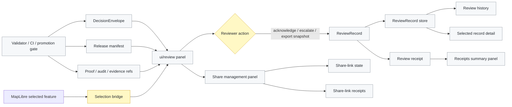

<!-- [KFM_META_BLOCK_V2]
doc_id: kfm://doc/NEEDS-VERIFICATION-ui-review-readme-uuid
title: ui/review
type: standard
version: v1
status: draft
owners: TODO-NEEDS-VERIFICATION
created: TODO-NEEDS-VERIFICATION-YYYY-MM-DD
updated: TODO-NEEDS-VERIFICATION-YYYY-MM-DD
policy_label: TODO-NEEDS-VERIFICATION
related: [../controls/README.md, ../review-records/README.md, ../../RELEASE-TRUST.md, ../../policy/README.md, ../../data/receipts/README.md, ../../tools/validators/promotion_gate/README.md]
tags: [kfm, ui, review, decision-envelope, review-record, receipts, governed-shell]
notes: [This README is source-ledgered from KFM UI/review lineage and MapLibre governed-shell doctrine; doc_id, owners, dates, policy_label, exact related-link existence, and live component inventory still need verification in the mounted repository.]
[/KFM_META_BLOCK_V2] -->

<a id="top"></a>

# `ui/review`

Reviewer-facing inspection components for governed trust objects, release evidence, reviewer dispositions, and review receipts.

<div align="left">


</div>

> [!IMPORTANT]
> `ui/review` is a **read and review surface** over governed artifacts. It does not make trust decisions, perform policy evaluation, replace validators, replace proof-pack assembly, or publish release state.

**Quick jumps:** [Scope](#scope) · [Repo fit](#repo-fit) · [Inputs](#inputs) · [Exclusions](#exclusions) · [Directory tree](#directory-tree) · [Quickstart](#quickstart) · [Usage](#usage) · [Diagram](#diagram) · [Component map](#component-map) · [Review gates](#review-gates) · [FAQ](#faq) · [Appendix](#appendix)

---

## Scope

`ui/review` gives stewards and reviewers a right-rail inspection stack for release-facing trust objects.

It is designed to render:

- finite `DecisionEnvelope` outcomes
- release manifest context
- manifest-declared assets
- evidence, proof, audit, and receipt references
- reviewer actions captured as `ReviewRecord` artifacts
- review history, selected-record detail, receipts summaries, and share-link governance state

The lane is **trust-visible UI**, not a second trust system.

| Claim | Status | Meaning |
|---|---:|---|
| The review panel is a read model over CI-produced artifacts. | CONFIRMED from source lineage | The browser should consume governed outputs instead of inventing trust logic. |
| Review actions may emit `ReviewRecord` artifacts. | SOURCE-GROUNDED / NEEDS VERIFICATION in live repo | Review disposition is explicit reviewer output over upstream decisions. |
| The composite review shell coordinates the right-rail stack. | SOURCE-GROUNDED / NEEDS VERIFICATION in live repo | One mount point should coordinate panel, history, detail, receipts, and optional sharing. |
| This README proves the component files exist in the current checkout. | UNKNOWN | The visible workspace did not include a mounted repository tree. Verify before treating the inventory as live. |

[Back to top](#top)

---

## Repo fit

**Path:** `ui/review/README.md`

**Upstream trust inputs:**

- `DecisionEnvelope` from validator / CI / promotion-gate flows
- release manifest and map/release artifact references
- review handoff or summary artifacts generated downstream of validators
- receipt summaries and review-record persistence surfaces

**Adjacent UI lanes:**

- [`../controls/README.md`](../controls/README.md) — integrity and trust cue controls *(NEEDS VERIFICATION)*
- [`../review-records/README.md`](../review-records/README.md) — standalone `ReviewRecord` artifact lane if kept separate *(NEEDS VERIFICATION)*

**Governance neighbors:**

- [`../../RELEASE-TRUST.md`](../../RELEASE-TRUST.md) — release trust doctrine *(NEEDS VERIFICATION)*
- [`../../policy/README.md`](../../policy/README.md) — policy and deny/obligation posture *(NEEDS VERIFICATION)*
- [`../../data/receipts/README.md`](../../data/receipts/README.md) — process-memory receipts *(NEEDS VERIFICATION)*
- [`../../tools/validators/promotion_gate/README.md`](../../tools/validators/promotion_gate/README.md) — promotion and decision-generation lane *(NEEDS VERIFICATION)*

**Downstream consumers:**

- persistent governed shell right rail
- MapLibre selection bridge
- steward/reviewer dashboard
- release review handoff workflows
- review receipt and share-link governance panels

> [!NOTE]
> Links above are repo-relative from `ui/review/README.md`. They are intentionally visible but still require live checkout verification before publication.

[Back to top](#top)

---

## Inputs

Only governed, release-facing, or reviewer-facing inputs belong here.

| Input | Accepted shape | Source posture | What the UI may do |
|---|---|---|---|
| `DecisionEnvelope` | finite release or validation decision | governed artifact | render status, reasons, obligations, references |
| release manifest | released or candidate manifest URL | governed artifact | render manifest-declared assets and release context |
| evidence / audit / proof refs | URLs, paths, or typed refs | governed artifact refs | link or hand off to configured reference opener |
| `ReviewRecord` | reviewer disposition artifact | reviewer output | render history and selected record detail |
| review receipts summary | published summary JSON | receipt/process memory | render counts and recent review activity |
| share-link records | scoped review-share state | steward/admin support | list, resolve, expire, revoke, and show receipt activity |
| MapLibre feature selection context | selected feature-derived release/decision scope | display context only | switch shell context through resolver-mediated URLs |

### Input boundary

```text
validator / CI / promotion gate
  -> DecisionEnvelope + release manifest + proof/audit/evidence refs
  -> ui/review right rail
  -> reviewer disposition
  -> ReviewRecord + receipt
```

The browser can display the chain. It must not become the chain.

[Back to top](#top)

---

## Exclusions

This lane does **not** belong to:

- RAW, WORK, QUARANTINE, canonical, steward-only, or model-runtime stores
- policy evaluation
- promotion-gate decision logic
- proof-pack assembly
- release approval authority
- source-rights or sensitivity adjudication
- hidden admin truth paths
- direct LLM/model interaction
- emergency/life-safety instructions
- client-side recomputation of validator law

When a reviewer action is needed, `ui/review` may produce or submit a reviewer artifact. It must not silently mutate the underlying decision, manifest, proof, policy, or release state.

[Back to top](#top)

---

## Directory tree

NEEDS VERIFICATION: this tree reflects source-ledgered lane shape and expected starter files. Confirm the live checkout before treating every file as present.

```text
ui/review/
├── README.md
├── kfm-review-panel.ts
├── kfm-review-panel.css
├── kfm-review-record-types.ts
├── kfm-review-record-store.ts
├── kfm-review-record-store-http.ts
├── kfm-review-record-list.ts
├── kfm-review-record-list.css
├── kfm-review-record-detail.ts
├── kfm-review-record-detail.css
├── kfm-review-receipts-panel.ts
├── kfm-review-receipts-panel.css
├── kfm-review-shell.ts
├── kfm-review-shell.css
├── kfm-review-selection-bridge.ts
├── kfm-review-shell-saved-contexts.ts
├── kfm-review-share-admin-client.ts
├── kfm-review-share-management-panel.ts
├── kfm-review-share-management-panel.css
├── kfm-review-share-receipts-panel.ts
├── kfm-review-share-receipts-panel.css
├── kfm-review-admin-summary-panel.ts
└── kfm-review-admin-summary-panel.css
```

> [!WARNING]
> Do not create parallel review lanes with the same authority. If the live repo already has a different home for `ReviewRecord`, share-link, or receipt panels, adapt through an ADR or migration note instead of duplicating the surface.

[Back to top](#top)

---

## Quickstart

Use the composite shell when the host application already has a right inspection stack.

```ts
import { KfmReviewShell } from "./ui/review/kfm-review-shell";
import { HttpReviewRecordStore } from "./ui/review/kfm-review-record-store-http";
import { LocalStoragePinnedContextStore } from "./ui/review/kfm-review-shell-saved-contexts";

import "./ui/review/kfm-review-shell.css";
import "./ui/review/kfm-review-panel.css";
import "./ui/review/kfm-review-record-list.css";
import "./ui/review/kfm-review-record-detail.css";
import "./ui/review/kfm-review-receipts-panel.css";
import "./ui/review/kfm-review-share-management-panel.css";
import "./ui/review/kfm-review-share-receipts-panel.css";

const reviewStore = new HttpReviewRecordStore({
  baseUrl: "/api",
});

const reviewShell = new KfmReviewShell({
  container: "#right-inspection-stack",
  title: "Governed Review",
  decisionEnvelopeUrl: "/release/kfm-main/decision-envelope.json",
  manifestUrl: "/release/kfm-main/manifest.json",
  receiptsSummaryUrl: "/reports/review-receipts-summary.json",
  reviewStore,
  pinnedContextStore: new LocalStoragePinnedContextStore(),
  shareApiBaseUrl: "/api",
  shareTtlSeconds: 86_400,
  shareQueryPrefix: "review",
  actor: {
    id: "steward:web",
    display: "Steward",
    role: "reviewer",
  },
  askEscalationMeta: async () => ({
    queue: "release-review",
    severity: "medium",
    rationale: "Manual escalation from governed review shell.",
  }),
  onReviewAction: (event) => {
    console.log("[KFM review action]", event);
  },
  onRecordSelect: (record) => {
    console.log("[KFM review record selected]", record.review_id);
  },
});

await reviewShell.mount();
```

Minimal host markup:

```html
<aside id="right-inspection-stack"></aside>
```

Optional right-rail layout:

```css
#right-inspection-stack {
  display: grid;
  grid-template-rows: auto minmax(0, 1fr);
  height: 100%;
  min-width: 0;
  overflow: auto;
}
```

[Back to top](#top)

---

## Usage

### Single review panel

Use `KfmReviewPanel` for the smallest review surface over a current `DecisionEnvelope`.

```ts
import { KfmReviewPanel } from "./ui/review/kfm-review-panel";
import { LocalStorageReviewRecordStore } from "./ui/review/kfm-review-record-store";

import "./ui/review/kfm-review-panel.css";

const panel = new KfmReviewPanel({
  container: "#right-inspection-stack",
  decisionEnvelopeUrl: "/release/kfm-release-decision-envelope.json",
  manifestUrl: "/release/kfm-release-manifest.json",
  title: "Release Review",
  reviewStore: new LocalStorageReviewRecordStore(),
  actor: {
    id: "steward:local",
    display: "Steward",
    role: "reviewer",
  },
  onAction: (event) => {
    console.log("[KFM review action]", event);
  },
});

panel.mount();
```

### Review history and detail

`ReviewRecord` history should remain read-only over the configured store. Selecting a record may populate the detail view.

```ts
import { KfmReviewRecordList } from "./ui/review/kfm-review-record-list";
import { KfmReviewRecordDetail } from "./ui/review/kfm-review-record-detail";
import { LocalStorageReviewRecordStore } from "./ui/review/kfm-review-record-store";

const store = new LocalStorageReviewRecordStore();

const detail = new KfmReviewRecordDetail({
  container: "#review-detail",
});
detail.mount();
detail.clear();

const list = new KfmReviewRecordList({
  container: "#review-history",
  store,
  releaseId: "kfm-main",
  limit: 12,
  onSelect: (record) => detail.setRecord(record),
});
list.mount();
```

### Receipts summary panel

A receipts panel may read a published summary surface and render recent review activity.

```ts
import { KfmReviewReceiptsPanel } from "./ui/review/kfm-review-receipts-panel";

const receiptsPanel = new KfmReviewReceiptsPanel({
  container: "#review-receipts",
  summaryUrl: "/reports/review-receipts-summary.json",
  title: "Receipt Summary",
});

receiptsPanel.mount();
```

### Map selection bridge

The MapLibre bridge may change the review context from selected map features. The bridge must pass candidate context, not evidence authority.

```ts
import { KfmReviewSelectionBridge } from "./ui/review/kfm-review-selection-bridge";

const bridge = new KfmReviewSelectionBridge({
  map,
  shell: reviewShell,
  layerIds: ["pmtiles-overlay"],
  resolveContext: (event) => {
    const feature = event.features?.[0];
    if (!feature) return undefined;

    const releaseId = String(feature.properties?.release_id || "kfm-main");
    const decisionId = String(feature.properties?.decision_id || "");

    return {
      releaseId,
      decisionId,
      decisionEnvelopeUrl: `/release/${releaseId}/decision-envelope.json`,
      manifestUrl: `/release/${releaseId}/manifest.json`,
      receiptsSummaryUrl: "/reports/review-receipts-summary.json",
    };
  },
});

bridge.mount();
```

### Saved views and pinned contexts

Recent contexts are automatic and bounded. Pinned contexts are intentional and persistent.

```ts
import { LocalStoragePinnedContextStore } from "./ui/review/kfm-review-shell-saved-contexts";

const shell = new KfmReviewShell({
  container: "#right-inspection-stack",
  decisionEnvelopeUrl: "/release/kfm-main/decision-envelope.json",
  reviewStore,
  pinnedContextStore: new LocalStoragePinnedContextStore(),
});
```

[Back to top](#top)

---

## Diagram



The key boundary is intentional: `ui/review` can render, coordinate, and emit reviewer artifacts. It cannot replace upstream validation, policy, proof, or promotion authority.

[Back to top](#top)

---

## Component map

| Component | Role | Status |
|---|---|---:|
| `KfmReviewPanel` | current `DecisionEnvelope` and manifest inspection | SOURCE-GROUNDED / NEEDS VERIFICATION |
| `KfmReviewRecordList` | recent reviewer dispositions | SOURCE-GROUNDED / NEEDS VERIFICATION |
| `KfmReviewRecordDetail` | selected `ReviewRecord` inspection | SOURCE-GROUNDED / NEEDS VERIFICATION |
| `KfmReviewReceiptsPanel` | published review receipt summary | SOURCE-GROUNDED / NEEDS VERIFICATION |
| `KfmReviewShell` | composite right-rail coordinator | SOURCE-GROUNDED / NEEDS VERIFICATION |
| `KfmReviewSelectionBridge` | MapLibre selection-to-review context bridge | SOURCE-GROUNDED / NEEDS VERIFICATION |
| `LocalStorageReviewRecordStore` | prototype browser-local review store | SOURCE-GROUNDED / prototype only |
| `HttpReviewRecordStore` | server-backed review record adapter | SOURCE-GROUNDED / NEEDS VERIFICATION |
| `LocalStoragePinnedContextStore` | saved/pinned review contexts | SOURCE-GROUNDED / NEEDS VERIFICATION |
| share management panels | create/list/revoke review share links | SOURCE-GROUNDED / NEEDS VERIFICATION |
| share receipts panel | show share create/revoke activity | SOURCE-GROUNDED / NEEDS VERIFICATION |
| admin summary panel | compact steward/admin activity rollup | PROPOSED / NEEDS VERIFICATION |

### Expected endpoint family

All endpoint paths are relative to the configured `apiBaseUrl` unless the component documents otherwise.

| Endpoint | Purpose | Notes |
|---|---|---|
| `GET /review-records` | list review records | supports scoped filters |
| `POST /review-records` | persist a review record | should validate schema and reject duplicates |
| `GET /review-record-receipts` | list review receipts | process memory, not proof replacement |
| `GET /review-share-links` | list share links | steward/admin surface |
| `POST /review-share-links` | create share link | TTL expected |
| `GET /review-share-links/:token` | resolve share token | must fail closed on invalid/expired token |
| `POST /review-share-links/:token/revoke` | revoke share token | should emit receipt if configured |
| `GET /review-share-receipts` | list share create/revoke receipts | optional but preferred |

Supported query filters from source lineage include:

```text
release_id
decision_id
actor
disposition
action
outcome
since
until
status
limit
```

[Back to top](#top)

---

## Review gates

A `ui/review` change is not done until these checks are true or explicitly waived in a review note.

- [ ] The component consumes `DecisionEnvelope`, manifest, receipt, or review artifacts from governed paths only.
- [ ] No component reads RAW, WORK, QUARANTINE, canonical, proof-pack internals, steward-only stores, or model-runtime stores directly.
- [ ] The browser does not recompute validator, policy, or promotion decisions.
- [ ] Reviewer action produces explicit `ReviewRecord` shape or a governed API request, not silent state.
- [ ] `ReviewRecord` includes actor, disposition, release/decision linkage, reasons/obligations, refs, and optional escalation metadata.
- [ ] Server persistence validates schema, denies duplicates, and emits receipts where configured.
- [ ] Receipts remain process memory and do not replace proof, release, or decision artifacts.
- [ ] Share links expire, can be revoked, and do not expose steward-only context beyond the active policy/release boundary.
- [ ] Map selection bridge passes scoped candidate context and reloads governed review artifacts; it does not treat feature properties as truth.
- [ ] Negative states are visible: missing evidence, denied policy, stale source, failed citation, withdrawn release, restricted access, and runtime error.
- [ ] Keyboard navigation and screen-reader labels are checked for panel, history, detail, share, and receipt surfaces.
- [ ] E2E smoke covers: load decision → render panel → reviewer action → `ReviewRecord` → history/detail → receipt summary refresh.
- [ ] Rollback removes only the review UI change and restores the previous shell mount behavior.

[Back to top](#top)

---

## FAQ

### Is `ui/review` allowed to approve a release?

No. It can render a decision and collect reviewer disposition. Release approval remains with the governed promotion/release process.

### Can the review panel show policy reasons?

Yes, when those reasons arrive inside a governed artifact such as a `DecisionEnvelope`, review payload, receipt summary, or review handoff. The panel must not create new policy determinations.

### Can reviewer actions be browser-local?

Only for prototype mode. Browser-local records are useful for UI shaping, but durable review memory should move through a governed API and receipt path.

### Can a map click drive the review shell?

Yes. A map click may provide selected release/decision scope through the selection bridge. The review shell must then reload governed review artifacts for that scope.

### What should happen when a link points to withdrawn or restricted context?

The shell should show the restricted, withdrawn, stale, or denied state rather than silently failing or reopening precise/steward-only context.

[Back to top](#top)

---

## Appendix

<details>
<summary>Status terms used in this README</summary>

| Term | Meaning |
|---|---|
| CONFIRMED | Verified from attached source corpus or current-session workspace evidence. |
| SOURCE-GROUNDED | Present in source-ledgered UI/review lineage, but live checkout presence still needs verification. |
| PROPOSED | Recommended design or implementation direction not verified as current repo state. |
| UNKNOWN | Not verifiable without the mounted repository, tests, workflows, or runtime artifacts. |
| NEEDS VERIFICATION | Must be checked in the live repo before relying on it as implementation fact. |

</details>

<details>
<summary>Accepted object vocabulary</summary>

| Object | Review-lane meaning |
|---|---|
| `DecisionEnvelope` | finite machine-readable trust or release decision |
| `ReviewRecord` | reviewer disposition over a governed trust object |
| `ReviewReceipt` | process-memory record of review action handling |
| `ReleaseManifest` | release identity and artifact inventory |
| `PromotionReviewHandoff` | derived steward-facing support document, not machine authority |
| `EvidenceRef` | reference to admissible evidence support |
| `EvidenceBundle` | resolved evidence support object outside this UI lane |
| `PolicyDecision` | policy outcome rendered only when supplied by governed artifacts |

</details>

<details>
<summary>Maintenance notes</summary>

When the real repo is mounted:

1. Replace meta-block placeholders with verified values.
2. Verify every related link from `ui/review/README.md`.
3. Reconcile this file list with the actual `ui/review/` directory.
4. Remove or downgrade any component section whose file is not present and not planned.
5. Add or update tests that prove no raw/canonical paths and no direct model clients are reachable from this lane.
6. Add a short changelog entry for any anchor-breaking section rename.

</details>

[Back to top](#top)