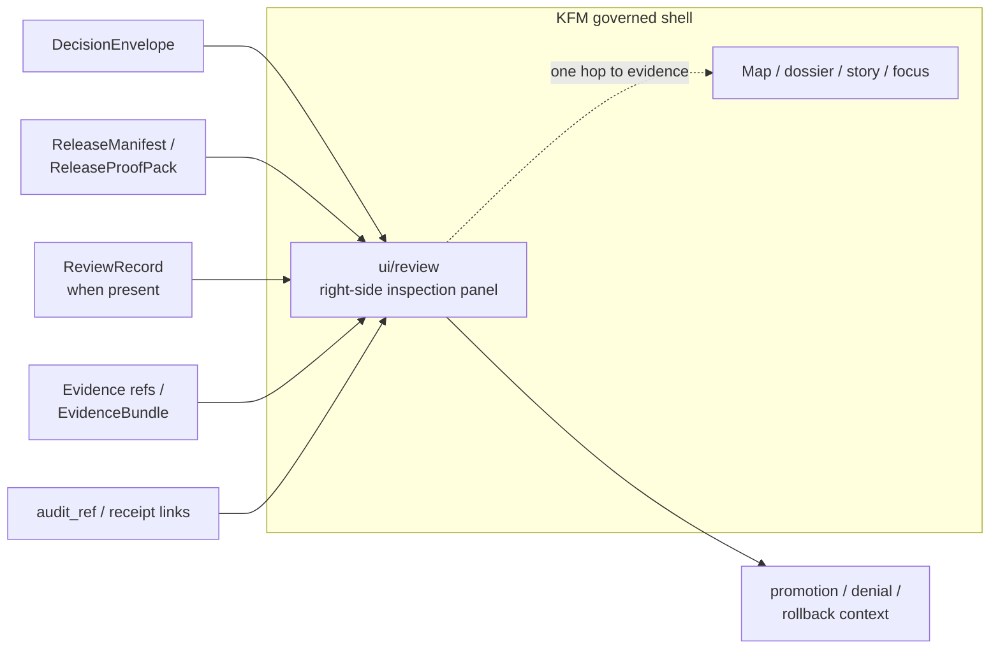

<!-- [KFM_META_BLOCK_V2]
doc_id: kfm://doc/<REVIEW-UUID>
title: ui/review
type: standard
version: v1
status: draft
owners: [@bartytime4life]
created: 2026-04-11
updated: 2026-04-11
policy_label: public-safe
related: [ui/controls/README.md, RELEASE-TRUST.md, policy/README.md]
tags: [kfm, ui, review, decision-envelope, release-evidence]
notes: [doc_id placeholder retained pending repo-issued UUID; grounded in attached KFM doctrine and the existing ui/review draft; mounted implementation depth beyond the starter snippet and named starter files remains unknown in this session.]
[/KFM_META_BLOCK_V2] -->

# ui/review

Reviewer-facing inspection components for governed trust objects and release evidence.

> Status: **Experimental**  
> Owners: **@bartytime4life**  
> Quick jumps: [Scope](#scope) · [Repo fit](#repo-fit) · [Inputs](#inputs) · [Quickstart](#quickstart) · [Inspection model](#inspection-model) · [Task list](#task-list) · [FAQ](#faq)


> [!IMPORTANT]
> KFM doctrine treats **review / stewardship** as a **shell variation inside the same governed shell** as map, dossier, story, and Focus. This lane is inspection-first, evidence-near, and policy-visible. It is not a detached admin product.

## Scope

This lane serves the **right-side governed inspection stack**. Its job is to render reviewer-readable trust state from release-bearing artifacts—especially `DecisionEnvelope` and `ReleaseManifest`—without letting UI convenience outrun release scope, policy state, or evidence drill-through.

### Evidence posture

- **CONFIRMED:** the current draft names this lane as reviewer-facing and includes starter files `kfm-review-panel.ts` and `kfm-review-panel.css`.
- **CONFIRMED:** the baseline usage snippet mounts the panel with `decisionEnvelopeUrl`, `manifestUrl`, and `title`.
- **CONFIRMED:** KFM doctrine defines review / stewardship as a shell surface whose trust-critical contents include **diff, gate results, policy labels, review notes, receipts, and no hidden approvals**.
- **INFERRED:** adjacent trust objects such as `ReviewRecord`, `ReleaseProofPack`, and `CorrectionNotice` belong in this same inspection family when the release flow exposes them.
- **UNKNOWN:** mounted repo paths, route names, schemas, fixtures, tests, and permission guards behind this lane were not directly surfaced in this session.

## Repo fit

**Path:** `ui/review/README.md`

**Upstream references:** [`../controls/README.md`](../controls/README.md), [`../../RELEASE-TRUST.md`](../../RELEASE-TRUST.md), [`../../policy/README.md`](../../policy/README.md)

**Local implementation surface:** [`./kfm-review-panel.ts`](./kfm-review-panel.ts), [`./kfm-review-panel.css`](./kfm-review-panel.css)

**Downstream role:** steward-facing inspection within the governed shell, supporting promotion, denial, rollback, and evidence drill-through.

## Inputs

This lane should accept **released or review-bearing trust objects**, not free-form UI state.

| Input | Why it belongs here | Minimum reviewer value |
|---|---|---|
| `DecisionEnvelope` | Machine-readable policy/result object for an action on a subject in a lane | finite outcome, reasons, obligations, policy basis, effective window, audit linkage |
| `ReleaseManifest` | Release assembly for outward publication | release refs, bundle scope, correction/rollback posture, gate visibility |
| Evidence references / `EvidenceBundle` links | Direct drill-through path for consequential claims | source basis, lineage summary, transform receipts, rights/sensitivity state |
| Audit references | Traceability for reviewable actions | decision trace, runtime linkage, receipt path |
| `ReviewRecord` *(when present)* | Human approval, denial, escalation, or note | reviewer role, timestamp, decision, comments |
| `CorrectionNotice` *(when present)* | Visible lineage under change | affected release, replacement release, rebuild/correction context |

## Exclusions

This lane must **not** become a second truth surface.

| Does **not** belong here | Why |
|---|---|
| Direct reads from RAW, WORK / QUARANTINE, or canonical stores | review stays behind governed APIs and control-plane artifacts |
| Hidden approval logic | KFM requires explicit review and decision artifacts |
| Detached “admin-only” workflows that sever map/time/evidence context | review is a shell variation, not a separate epistemic system |
| Derived portrayal state presented as authoritative truth | derived layers remain rebuildable unless explicitly promoted |
| Free-form synthesis without released scope, evidence resolution, and policy state | runtime trust surfaces must stay accountable and fail closed |

## Directory tree

At minimum, the current draft confirms this starter layout:

```text
ui/review/
├── README.md
├── kfm-review-panel.ts
└── kfm-review-panel.css
```

## Quickstart

Minimal starter usage preserved from the existing draft:

```ts
import { KfmReviewPanel } from "./ui/review/kfm-review-panel";
// import "./ui/review/kfm-review-panel.css";

const panel = new KfmReviewPanel({
  container: "#review-panel",
  decisionEnvelopeUrl: "/release/kfm-release-decision-envelope.json",
  manifestUrl: "/release/kfm-release-manifest.json",
  title: "Release Review",
});

panel.mount();
```

> [!NOTE]
> The snippet above is the strongest directly surfaced implementation clue for this lane. Additional constructor fields, emitted events, and schema bindings remain **NEEDS VERIFICATION** until mounted code or fixtures are inspected.

## Usage

### What this panel is for

Use `ui/review` to surface reviewer-readable state from CI-produced or release-bearing artifacts. The panel should make the review moment legible by surfacing:

- the **finite decision outcome**
- **integrity, publisher, evidence, and transparency status**
- **reason** and **obligation** cues
- publisher or release identity
- release references
- manifest-declared assets
- evidence and audit drill-through paths

### What must stay visible at the point of use

| Reviewer cue | Why it matters |
|---|---|
| Outcome | review must resolve to an inspectable decision, not an implicit vibe |
| Reason codes | denial, hold, or narrowing must be explainable |
| Obligation codes | follow-on work such as generalization, citation, correction, or rebuild must stay visible |
| Gate results | promotion readiness is a lifecycle fact, not hidden process state |
| Receipts and audit refs | reviewers need traceability, not just summaries |
| Correction / rollback posture | release evidence must preserve lineage under change |

## Diagram



## Inspection model

Review doctrine in the mounted corpus centers on a small set of trust objects. This lane should stay aligned to that contract family instead of inventing a local vocabulary.

| Trust object | Minimum purpose | What the panel should emphasize |
|---|---|---|
| `DecisionEnvelope` | express a policy result machine-readably | subject, action, lane, result, reasons, obligations, policy basis, `audit_ref`, effective window |
| `ReviewRecord` | capture human approval, denial, escalation, or note | reviewer role, decision, timestamp, refs, comments |
| `ReleaseManifest` / `ReleaseProofPack` | assemble public-safe release and its proof | version refs, catalog refs, decision refs, docs/accessibility gate, rollback/correction posture |
| `EvidenceBundle` | package support for a claim, feature, story, export preview, or answer | bundle basis, dataset refs, lineage summary, transform receipts, rights/sensitivity state |
| `CorrectionNotice` | preserve visible lineage under change | affected releases, replacements, rebuild refs, public note |

## Review rules

1. Mount **released or review-bearing artifacts only**.
2. Keep **decision grammar visible**: results, reasons, obligations, and audit linkage.
3. Preserve **release linkage** on every panel state.
4. Make **negative states first-class**: denied, abstained, stale-visible, partial, withdrawn, or generalized.
5. Never let a review convenience bypass governed evidence resolution or policy closure.

## Task list

- [ ] Confirm the target file path as `ui/review/README.md` in the mounted repo.
- [ ] Verify `kfm-review-panel.ts` and `kfm-review-panel.css` exist at the documented relative paths.
- [ ] Add or confirm fixtures for **allow**, **deny**, **review_required**, **correction**, and **rollback** cases.
- [ ] Ensure the panel renders **reason codes**, **obligation codes**, **gate results**, and **receipt links** without hidden approvals.
- [ ] Confirm role gating for reviewer-only surfaces before connecting the panel to live promotion flows.
- [ ] Link this lane to release documentation once the mounted repo surfaces the final trust-object schemas.

## FAQ

### Is this a public surface?

Not as a route family. KFM doctrine treats **review / stewardship** as an **internal governed API / shell lane**, even when it shares the same governed substrate as public-safe exploration.

### Does this panel own truth?

No. It inspects release and review artifacts that sit downstream of canonical truth and catalog/policy closure.

### Should the panel render raw evidence directly?

It should render **drill-through paths** to evidence and audit context. It should not become a substitute for canonical storage, raw source browsing, or unpublished candidate inspection outside governed review flows.

## Appendix

<details>
<summary>Illustrative assembly notes for implementation review</summary>

These notes are **illustrative** and should be checked against mounted code before implementation claims are upgraded.

- `DecisionEnvelope` is the primary review object for policy result display.
- `ReleaseManifest` or `ReleaseProofPack` provides the release-scoped context that keeps review tied to publication state.
- `EvidenceBundle` and `audit_ref` links keep the panel one hop from inspectable support.
- `ReviewRecord` and `CorrectionNotice` are adjacent review-plane objects worth rendering when present, even though the starter snippet only confirms `DecisionEnvelope` and manifest URLs.

Possible state vocabulary to keep visible in the panel UI:

| State cue | Reviewer meaning |
|---|---|
| promoted | release-backed and outwardly admissible |
| generalized | narrowed for policy or sensitivity reasons |
| partial | incomplete but explicitly disclosed |
| stale-visible | visible with freshness warning |
| withdrawn | superseded or removed from outward use |
| denied | policy or validation blocked the action |
| abstained | insufficient admissible evidence or scope |

</details>

[Back to top](#uireview)
