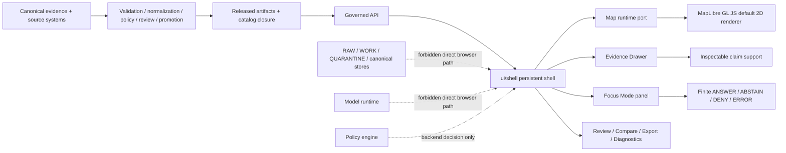
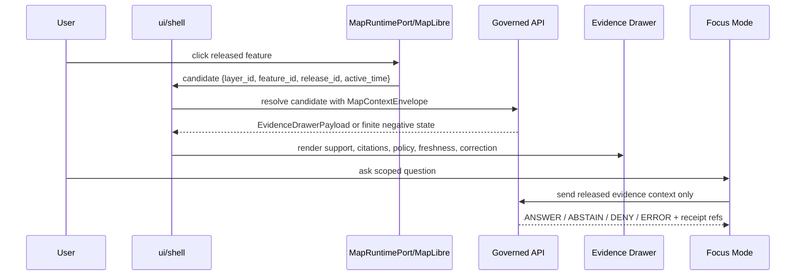

<!-- [KFM_META_BLOCK_V2]
doc_id: kfm://doc/TODO-VERIFY-UUID
title: KFM UI Shell
type: standard
version: v1
status: draft
owners: TODO-VERIFY-UI-SHELL-OWNER
created: TODO-VERIFY-YYYY-MM-DD
updated: 2026-04-27
policy_label: TODO-VERIFY-public-or-restricted
related: [ui/shell/README.md, TODO-VERIFY:docs/architecture/maplibre/, TODO-VERIFY:docs/architecture/ui/, TODO-VERIFY:schemas/contracts/v1/maplibre/, TODO-VERIFY:contracts/api/maplibre/]
tags: [kfm, ui, shell, maplibre, evidence-drawer, focus-mode, governed-ui]
notes: [doc_id owners created policy_label and related paths require repo verification; target path supplied as ui/shell/README.md; implementation state remains NEEDS VERIFICATION until checked in the mounted repo]
[/KFM_META_BLOCK_V2] -->

# KFM UI Shell

Map-first, time-aware, evidence-visible shell for the Kansas Frontier Matrix governed UI.

<a id="top"></a>

> [!IMPORTANT]
> **Current implementation state: NEEDS VERIFICATION.** This README is written for the target path `ui/shell/` using KFM doctrine and the supplied architecture corpus. It does **not** prove that the directory, components, routes, schemas, tests, or package commands already exist in the repository.

## Impact block


| Field | Value |
| --- | --- |
| **Status** | `experimental` |
| **Owners** | `TODO-VERIFY-UI-SHELL-OWNER` |
| **Target path** | `ui/shell/` |
| **Primary role** | Persistent governed shell: map, time, evidence, policy, review state, negative states |
| **Default renderer posture** | MapLibre-first 2D shell; conditional 3D handoff only after admission and parity checks |
| **Quick jumps** | [Scope](#scope) · [Repo fit](#repo-fit) · [Inputs](#accepted-inputs) · [Exclusions](#exclusions) · [Tree](#directory-tree) · [Diagram](#operating-flow) · [Gates](#definition-of-done) · [FAQ](#faq) |

---

## Scope

`ui/shell/` is the proposed home for the **trust-visible operating shell**: the UI frame that keeps geography, time, evidence, policy, release state, review state, correction lineage, and governed actions visible while users move through KFM.

This shell is not a decorative wrapper around a map. It is the point where users should see whether a claim is supported, stale, restricted, generalized, denied, withdrawn, or ready for inspection.

### What this shell is responsible for

| Responsibility | Shell behavior |
| --- | --- |
| **Map-first navigation** | Hosts the persistent map surface and renderer adapter boundary. |
| **Time-aware context** | Carries active time scope into layer state, Evidence Drawer, Focus Mode, Compare, Story, and Export. |
| **Evidence visibility** | Opens the Evidence Drawer for consequential selections and claim contexts. |
| **Trust cues** | Displays release, freshness, policy, sensitivity, review, correction, and negative-state badges. |
| **Governed interaction** | Converts user interaction into governed API requests, not local truth decisions. |
| **Accessibility** | Provides keyboard map controls, non-color trust cues, focus order, and non-map alternatives. |
| **Safe diagnostics** | Shows schema/API/manifest status without leaking canonical, raw, work, quarantine, or steward-only stores. |

### What this shell is not

The shell is **not** the canonical evidence store, policy engine, source registry, promotion authority, citation validator, model runtime, proof-pack generator, tile pipeline, or publication system.

> [!WARNING]
> Rendered pixels, local feature properties, popups, camera state, visibility toggles, and AI prose are not KFM truth objects.

[Back to top](#top)

---

## Repo fit

| Relation | Path or surface | Status | Notes |
| --- | --- | --- | --- |
| **This README** | `ui/shell/README.md` | `PROPOSED / TARGET PROVIDED` | Target path was provided by the task. Existing repo file status is `NEEDS VERIFICATION`. |
| **Upstream inputs** | [Accepted inputs](#accepted-inputs) | `PROPOSED` | Manifest, drawer, Focus, policy, and runtime payloads should arrive through governed contracts/API. |
| **Downstream outputs** | [Shell outputs](#shell-outputs) | `PROPOSED` | Runtime receipts, safe telemetry, export requests, and user-visible trust states. |
| **Adjacent docs** | `docs/architecture/ui/`, `docs/architecture/maplibre/`, `docs/adr/` | `TODO-VERIFY` | Use repo-native documentation homes if they differ. |
| **Machine contracts** | `schemas/contracts/v1/`, `contracts/api/` | `TODO-VERIFY` | Resolve schema/API homes by ADR before creating parallel authorities. |
| **Governed API** | `apps/governed-api/` or repo-native equivalent | `TODO-VERIFY` | Browser must call governed routes only; no direct raw/canonical/model path. |
| **Fixtures/tests** | `tests/fixtures/ui/`, `tests/fixtures/maplibre/`, or repo-native equivalent | `TODO-VERIFY` | No-network fixtures first; live data later only after source and rights gates. |

### Upstream governed inputs

The shell should consume payloads that have already passed backend evidence, policy, validation, review, release, and citation rules.

| Input family | Expected use inside shell | Must be produced by |
| --- | --- | --- |
| `LayerManifest` | Layer identity, time model, sensitivity, stale policy, support level, release binding | Governed API / manifest registry |
| `StyleManifest` | Versioned style treatment, sprite/glyph/font references, visual semantics | Publication layer |
| `TileArtifactManifest` | PMTiles/MVT/COG artifact identity, bounds, content hash, cache policy | Tiling/publication pipeline |
| `MapReleaseManifest` | Release state, rollback target, proof pack, public scope | Promotion/release process |
| `EvidenceDrawerPayload` | Drawer support, citations, policy badges, withheld counts, correction state | Evidence resolver |
| `MapContextEnvelope` | Viewport, active layers, time scope, selected feature, release IDs, user role | Shell + governed API boundary |
| `FocusModeResponse` | Finite `ANSWER`, `ABSTAIN`, `DENY`, or `ERROR` result | Governed Focus endpoint |
| `PolicyDecision` / `TrustState` | Visible decision badges, obligations, denial/abstention reasons | Policy engine |

### Shell outputs

| Output | Purpose | Boundary rule |
| --- | --- | --- |
| `MapRuntimeReceipt` | Records map interaction, release IDs, layer IDs, resolution outcome, timing, non-sensitive errors | Audit-only; do not store sensitive user content unnecessarily. |
| Safe telemetry | Reports shell health, manifest mismatch, API failures, accessibility smoke status | Must not leak raw data, hidden feature counts, private geometry, or source secrets. |
| Export request | Requests governed export package with release metadata and trust cues | Shell requests; backend decides. |
| Review navigation | Opens role-gated review routes or queues | Review state changes must be explicit, logged, and separate from public shell behavior. |

[Back to top](#top)

---

## Accepted inputs

Content belongs in `ui/shell/` when it helps the browser render, route, or test the **governed shell** without manufacturing truth.

| Accepted input | Belongs here when | Example handling |
| --- | --- | --- |
| Released layer descriptors | Already validated and safe for public or role-gated display | Render in Layer Catalog with trust badges. |
| Map release state | Bound to release manifest and rollback target | Show release chip and stale/withdrawn state. |
| Feature selection candidates | Produced by renderer interaction only | Send candidate to governed API for evidence resolution. |
| Drawer payloads | Already resolved from EvidenceBundle or finite negative state | Render Evidence Drawer; do not reconstruct evidence in-browser. |
| Focus responses | Already citation-validated and policy-checked | Render finite outcome banner and citations. |
| UI feature flags | Returned by runtime bootstrap or repo-native config | Enable or disable surfaces without bypassing policy. |
| Accessibility alternatives | Needed for non-map interaction and keyboard control | Provide result lists, landmarks, focus order, and text alternatives. |
| Mock fixtures | Contract-valid, clearly marked, no-network | Use for tests and local demos only. |

[Back to top](#top)

---

## Exclusions

The shell must not become a quiet shortcut around KFM’s trust membrane.

| Does not belong in `ui/shell/` | Put it instead in | Reason |
| --- | --- | --- |
| `RAW`, `WORK`, or `QUARANTINE` data | `data/raw/`, `data/work/`, `data/quarantine/` or repo-native lifecycle homes | Public UI cannot read pre-publication stores. |
| Canonical evidence stores | Backend evidence services / canonical data layer | UI is a consumer of governed payloads, not source truth. |
| Proof packs and release authority | `data/proofs/`, `release/`, promotion services | Publication is a governed state transition. |
| Source registries and rights decisions | `data/registry/`, policy/source steward workflows | UI displays decisions; it does not create source authority. |
| Policy-as-code | `policy/` or repo-native policy home | Browser must not decide sensitivity, rights, or release gates. |
| Model runtime adapters | Governed API / AI adapter package | No direct browser-to-model path. |
| Citation validation logic | Governed API / citation validator | UI displays validation state; it does not certify citations. |
| Tile generation or transformation pipelines | `tools/`, `pipelines/`, `packages/geo/`, or repo-native equivalents | Derived assets are prepared upstream. |
| Secrets, tokens, private scopes | Secret manager / server-side mediation | Never expose private credentials or steward-only scopes to the shell. |
| Emergency or life-safety instructions | Official source systems and alerting channels | KFM can contextualize evidence; it is not an emergency alert system. |

[Back to top](#top)

---

## Directory tree

> [!NOTE]
> This tree is a **PROPOSED local shape** for `ui/shell/`. Adapt it to the real repo after inspecting current conventions. Do not create duplicate schema, API, policy, or package authorities.

```text
ui/shell/
├── README.md                         # This file
├── ShellFrame.*                      # PROPOSED: persistent app frame, nav, trust header
├── routes/                           # PROPOSED: Explore, Dossier, Story, Focus, Compare, Review, Export, Diagnostics
├── map/
│   ├── MapRuntimePort.*              # PROPOSED: renderer-agnostic port
│   ├── maplibre/                     # PROPOSED: MapLibre-specific adapter
│   └── layers/                       # PROPOSED: validated layer/source/style builders
├── timeline/                         # PROPOSED: active time scope and visible time controls
├── evidence/
│   └── EvidenceDrawer.*              # PROPOSED: drawer host and payload rendering
├── focus/
│   └── FocusPanel.*                  # PROPOSED: governed Focus UI; no direct model calls
├── review/                           # PROPOSED: read-only or role-gated steward/review surfaces
├── compare/                          # PROPOSED: separate release/time/support contexts
├── export/                           # PROPOSED: governed export request UI
├── diagnostics/                      # PROPOSED: safe schema/API/manifest status
├── accessibility/                    # PROPOSED: keyboard map controls and non-map alternatives
├── state/                            # PROPOSED: shell-scoped view state only
├── fixtures/                         # PROPOSED: local contract fixtures if repo convention permits
└── __tests__/                        # PROPOSED: component, adapter, a11y, and interaction tests
```

[Back to top](#top)

---

## Operating flow



### Feature-click flow



The acceptance test for this flow is simple: **visual candidate → governed lookup → EvidenceBundle or visible negative state → Drawer payload → optional bounded Focus response**.

[Back to top](#top)

---

## Shell surfaces

| Surface | Primary role | Trust requirement |
| --- | --- | --- |
| **Explore** | Navigation, layer visibility, filtering, feature selection, trust cues | Selection opens governed resolution; popup text stays lightweight and non-authoritative. |
| **Dossier** | Durable object or claim view | Consequential claims resolve to EvidenceBundle and review/release state. |
| **Story** | Map-anchored narrative or walkthrough | Narrative cannot detach from evidence, temporal scope, source role, citation state, or release state. |
| **Focus** | Evidence-bounded AI inside the shell | Finite outcomes only: `ANSWER`, `ABSTAIN`, `DENY`, `ERROR`. |
| **Compare** | Side-by-side or before/after inspection | Each side carries separate release ID, source support, time basis, and correction state. |
| **Review** | Role-gated steward/reviewer variation | Review state changes are explicit, logged, and separate from public shell behavior. |
| **Export** | Outward artifact request and preview | Trust metadata, citations, release ID, and correction state travel with export packages. |
| **Diagnostics** | Authorized runtime and manifest inspection | Never becomes a backdoor for raw, canonical, proof-pack, review-only, or steward-only access. |

[Back to top](#top)

---

## State ownership

The shell may coordinate view state. It must not own truth state.

| State | Shell may own | Shell must not own |
| --- | --- | --- |
| Viewport and camera | Current viewport, zoom, bearing, selected projection | Spatial truth, legal boundary claims, source geometry authority |
| Active time scope | User-selected visible time window and time-axis selection | Valid-time truth, observation-time truth, correction-time history |
| Layer visibility | Visible layers and local UI grouping | Release approval, source rights, sensitivity class |
| Feature selection | Candidate layer/feature IDs and interaction context | Evidence support or claim validity |
| Drawer display | Open/closed state and rendered payload | EvidenceBundle construction or citation certification |
| Focus panel | Question draft, scope chips, result display | Model adapter calls, uncited synthesis, hidden reasoning as proof |
| Review shell | Route/access affordance and visible queue state | Review approval unless backend has recorded it |
| Diagnostics | Safe status rendering | Secret inspection, private scopes, internal data browsing |

### Negative states

The shell should render these states clearly, not hide them behind empty panels:

| State | Meaning |
| --- | --- |
| `MISSING_EVIDENCE` | Candidate cannot resolve to sufficient support. |
| `SOURCE_STALE` | Source or release is outside freshness expectations. |
| `DENIED_BY_POLICY` | Policy blocks display, synthesis, export, or precision. |
| `GENERALIZED_GEOMETRY` | Location has been transformed for public safety or rights reasons. |
| `RESTRICTED_ACCESS` | User role cannot access the requested support or geometry. |
| `CONFLICTED_SUPPORT` | Sources or evidence roles disagree enough to prevent confident output. |
| `CITATION_FAILED` | Citation validation failed or referenced support is missing. |
| `RELEASE_WITHDRAWN` | Release is withdrawn and should no longer be treated as current. |
| `RUNTIME_ERROR` | Resolver, manifest, API, or adapter failed. |

[Back to top](#top)

---

## Interaction rules

| Interaction | Allowed behavior | Forbidden shortcut |
| --- | --- | --- |
| Feature click | Send candidate to governed API; open Drawer or visible negative state | Treat popup properties as evidence authority. |
| Hover | Show affordance or low-risk label | Show consequential claims unless already Drawer-validated. |
| Box select / extent query | Send viewport geometry to governed aggregation endpoint | Compute policy-sensitive aggregates in browser. |
| Layer toggle | Change visible manifest-bound layer state | Treat visibility as publication approval. |
| Style switch | Apply released style treatment | Use ad hoc style changes to change meaning without manifest update. |
| Time brushing | Send active time scope to Drawer/Focus context | Let visual time and evidence time diverge silently. |
| Deep link / permalink | Save public-safe state only | Encode restricted geometry, steward-only state, or private source context. |
| 3D / terrain handoff | Enter only after admission and drawer parity checks | Make 3D a second ungoverned truth surface. |

[Back to top](#top)

---

## Contracts and payloads

Use repo-native schema and API homes after verification. The shell should not invent payload dialects.

| Contract | Why the shell needs it | First shell test |
| --- | --- | --- |
| `LayerManifest` | Know what a layer may show, withhold, compare, export, and time-filter | Invalid unreleased layer renders `DENIED_BY_POLICY`. |
| `StyleManifest` | Keep visual meaning tied to versioned style governance | Style mismatch produces visible diagnostic state. |
| `TileArtifactManifest` | Bind tiles/rasters to digests, bounds, cache policy, and release | Hash mismatch produces `RUNTIME_ERROR` or deny state. |
| `MapReleaseManifest` | Tie layer/style/tile visibility to release, proof pack, and rollback | Withdrawn release disappears or renders withdrawn banner. |
| `EvidenceDrawerPayload` | Render support, citations, policy badges, transforms, withheld counts, correction state | Clicked fixture opens Drawer with support and trust cues. |
| `MapContextEnvelope` | Pass viewport, layers, time, user role, selected feature, and policy context safely | Focus request contains released evidence context only. |
| `FocusModeRequest` / `FocusModeResponse` | Render finite governed AI outcomes | `ANSWER`, `ABSTAIN`, `DENY`, and `ERROR` fixtures all render distinctly. |
| `AIReceipt` | Link Focus output to model/runtime permissions and evidence context | Receipt ref appears without exposing hidden reasoning. |
| `CitationValidationReport` | Prevent fluent uncited claims from looking authoritative | Missing citation renders `CITATION_FAILED`. |
| `PolicyDecision` | Make policy outcomes visible and testable | Sensitive fixture renders deny/generalized state. |
| `MapRuntimeReceipt` | Record interaction and resolution outcome | Click flow emits non-sensitive runtime receipt. |

[Back to top](#top)

---

## Quickstart

### 1. Verify the repo before implementing

Run from the repository root before treating this README as implementation evidence.

```bash
pwd
git status --short
git branch --show-current || true

find ui/shell -maxdepth 3 -type f 2>/dev/null | sort || true
find . -maxdepth 3 \( \
  -name package.json -o \
  -name pnpm-lock.yaml -o \
  -name yarn.lock -o \
  -name package-lock.json -o \
  -name pyproject.toml -o \
  -name Cargo.toml -o \
  -name go.mod -o \
  -name Makefile \
\) -print 2>/dev/null | sort
```

Record the result in the first implementation PR or linked ADR.

### 2. Discover the repo-native test path

Do not assume a package manager. After verification, replace these placeholders with the repo-native commands.

```bash
# Illustrative only — replace after repo verification.
# npm test -- ui/shell
# pnpm test --filter ui-shell
# yarn test ui/shell
```

### 3. Validate the first shell slice

A minimal first slice should be no-network and fixture-based:

```bash
# Illustrative validation checklist, not a confirmed repo command.
# 1. Validate LayerManifest / MapReleaseManifest / EvidenceDrawerPayload fixtures.
# 2. Run component tests for negative states and trust badges.
# 3. Run adapter tests proving no direct raw/canonical/model path.
# 4. Run E2E smoke: click -> governed resolution -> Drawer -> Focus finite outcome.
# 5. Run accessibility smoke: keyboard flow, focus order, non-color trust cues.
```

[Back to top](#top)

---

## Usage patterns

### Feature selection handler

```ts
// Pseudocode — adapt to the repo-native framework and API client.

type FeatureCandidate = {
  layerId: string;
  featureId: string;
  releaseId: string;
  activeTime?: string;
};

async function onFeatureSelected(candidate: FeatureCandidate) {
  const contextEnvelope = buildMapContextEnvelope({
    candidate,
    viewport: shellState.viewport,
    activeLayers: shellState.activeLayers,
    activeTime: shellState.activeTime,
    userRole: shellState.userRole,
  });

  const result = await governedApi.resolveFeatureCandidate(contextEnvelope);

  if (result.outcome === "ANSWER") {
    evidenceDrawer.open(result.drawerPayload);
    return;
  }

  renderNegativeState(result.outcome, result.reasonCode, result.auditRef);
}
```

### Focus request

```ts
// Pseudocode — Focus receives released evidence context only.

async function askFocus(question: string) {
  const request = {
    schema: "kfm.ai.focus_mode_request.v1",
    question,
    contextEnvelopeId: shellState.currentMapContextEnvelopeId,
    evidenceScope: evidenceDrawer.currentEvidenceBundleIds,
  };

  const response = await governedApi.focus(request);

  renderFocusOutcome(response.outcome, {
    answer: response.answer,
    citations: response.citations,
    abstainReason: response.abstain_reason,
    denialReason: response.denial_reason,
    auditRef: response.ai_receipt_id,
  });
}
```

[Back to top](#top)

---

## Definition of done

A `ui/shell/` change is not done until it preserves KFM trust boundaries.

- [ ] Repo conventions, package manager, app path, schema home, API home, policy tooling, and test runner have been verified.
- [ ] `README.md` metadata placeholders have been replaced or explicitly retained with review notes.
- [ ] Browser cannot reach `RAW`, `WORK`, `QUARANTINE`, canonical evidence stores, proof packs, or direct model runtime.
- [ ] Feature click resolves through governed API, not local popup properties.
- [ ] Evidence Drawer opens from a valid payload or a visible finite negative state.
- [ ] Focus Mode receives released evidence context only.
- [ ] Focus Mode renders `ANSWER`, `ABSTAIN`, `DENY`, and `ERROR` as separate typed states.
- [ ] Sensitive, stale, missing-evidence, citation-failed, withdrawn-release, and generalized-geometry fixtures render visibly.
- [ ] Layer/style/tile state is manifest-bound.
- [ ] Time state travels to Drawer and Focus without silently changing evidence time.
- [ ] Keyboard navigation, non-map alternatives, focus order, reduced-motion behavior, and non-color trust cues have smoke coverage.
- [ ] Export and Review routes are role- and policy-aware.
- [ ] Runtime receipts or safe telemetry avoid secrets, hidden reasoning, private geometry, and sensitive user content.
- [ ] Rollback can disable the shell slice or restore the prior safe route without data migration.
- [ ] Documentation, ADRs, fixtures, and schema references changed in the same PR as behavior.

[Back to top](#top)

---

## Security and local exposure posture

For local or semi-public deployments, the shell should assume deny-by-default access and least privilege.

| Risk | Shell posture |
| --- | --- |
| Browser-to-raw data path | Deny. Only governed API and released artifacts. |
| Browser-to-model runtime path | Deny. Focus must go through governed API and citation/policy checks. |
| Sensitive exact location | Redact, generalize, suppress, or deny before public display. |
| Hidden client-side filtering | Avoid for consequential or policy-sensitive data. |
| Private tokens/scopes | Never expose to client. Use server-side mediation. |
| Reverse proxy/VPN exposure | Keep auth, CORS, CSP, audit logging, and route allowlists explicit. |
| Error copy | Use visible negative states without leaking sensitive internals. |
| Diagnostics | Role-gate and redact; diagnostics are not a public data browser. |

[Back to top](#top)

---

## Rollback path

For shell-only changes, rollback should be small and reversible.

1. Turn off the shell feature flag or route registration.
2. Restore the previous governed API route map or runtime bootstrap response.
3. Revert UI components and fixtures from the PR.
4. Restore prior `LayerManifest`, `StyleManifest`, or `MapReleaseManifest` references if the change touched release-bound UI.
5. Invalidate UI caches if stale release or drawer payloads could remain visible.
6. Preserve correction, receipt, and review history; do not delete audit context to hide a failed release.
7. Open a verification item for the root cause.

[Back to top](#top)

---

## FAQ

### Is MapLibre the source of truth?

No. MapLibre is the default 2D renderer and interaction runtime. It can expose candidates and draw released artifacts, but it cannot decide truth, safety, release, policy, review, or citation state.

### Can this shell call an LLM directly?

No. Focus Mode must use a governed API path. EvidenceBundle, policy, release state, and citation validation outrank model language.

### Can popups make claims?

Only low-risk labels or already validated summaries. Consequential claim text belongs in the Evidence Drawer or a governed dossier surface.

### Can the shell hide denied or stale states?

No. Negative states are part of the trust model and must remain visible in badges, Drawer payloads, Focus responses, exports, and review queues.

### Can 3D be added here?

Only conditionally. The 2D shell remains the default. A 3D story or scene mode must pass admission, evidence, policy, parity, rollback, and drawer-equivalence checks before public use.

### What should be built first?

A no-network, public-safe fixture slice: validated layer/release manifests, a MapLibre adapter boundary, feature click resolution, Evidence Drawer payload, finite Focus fixture, negative states, accessibility smoke tests, and rollback.

[Back to top](#top)

---

## Appendix: open verification items

<details>
<summary>Items to verify before first implementation PR</summary>

| Item | Status | How to retire |
| --- | --- | --- |
| Does `ui/shell/` already exist? | `NEEDS VERIFICATION` | Inspect mounted repo tree. |
| Existing README conventions near target path | `NEEDS VERIFICATION` | Inspect adjacent READMEs and docs templates. |
| Repo package manager | `UNKNOWN` | Check lockfiles and package metadata. |
| UI framework and route conventions | `UNKNOWN` | Inspect UI app source and router setup. |
| Schema home | `UNKNOWN / POSSIBLY CONFLICTED` | Resolve with ADR before adding schema references. |
| Governed API route names | `UNKNOWN` | Inspect backend route tree and API contracts. |
| Existing MapLibre adapter | `UNKNOWN` | Search app/packages for renderer boundary. |
| Existing Evidence Drawer | `UNKNOWN` | Search UI features/components and fixtures. |
| Existing Focus Mode | `UNKNOWN` | Search API/UI/model adapter code and contracts. |
| Existing tests and CI gates | `UNKNOWN` | Inspect test directories and workflow files. |
| Current owners | `TODO-VERIFY` | Check CODEOWNERS, docs ownership, or team conventions. |
| Policy label | `TODO-VERIFY` | Check repository documentation policy labels. |

</details>