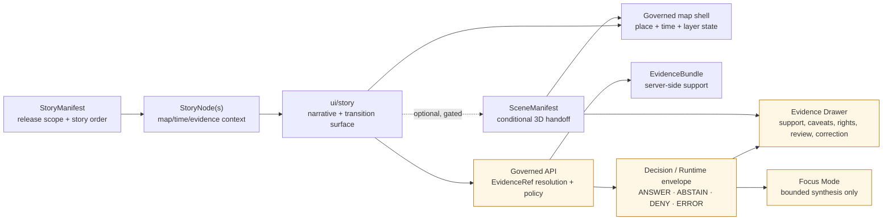

<!-- [KFM_META_BLOCK_V2]
doc_id: kfm://doc/<uuid-TODO-ui-story-readme>
title: ui/story README
type: standard
version: v1
status: draft
owners: TODO: assign UI/story owner(s)
created: 2026-04-27
updated: 2026-04-27
policy_label: TODO: confirm public|restricted policy label
related: [TODO: confirm parent ui README, TODO: confirm StoryManifest schema path, TODO: confirm Evidence Drawer payload contract path, TODO: confirm Focus Mode contract path]
tags: [kfm, ui, story, governed-ui, evidence-drawer, focus-mode]
notes: [Authored from attached KFM doctrine and current-session workspace inspection; mounted repo files were not available, so owners, policy label, adjacent links, framework conventions, and local directory inventory remain NEEDS VERIFICATION.]
[/KFM_META_BLOCK_V2] -->

<a id="top"></a>

# ui/story README

Map-anchored story surfaces for KFM narratives that preserve evidence, time, policy, release state, and return paths to the governed shell.

| Impact | Value |
|---|---|
| Status | `experimental` |
| Owners | `TODO: assign UI/story owner(s)` |
| Badges |      |
| Quick jumps | [Scope](#scope) · [Repo fit](#repo-fit) · [Inputs](#inputs) · [Exclusions](#exclusions) · [Directory tree](#directory-tree) · [Quickstart](#quickstart) · [Usage](#usage) · [Validation](#validation) · [FAQ](#faq) |
| Evidence posture | `CONFIRMED` doctrine / `PROPOSED` directory guidance / `UNKNOWN` implementation inventory |
| Policy posture | Cite-or-abstain; fail closed on unresolved rights, sensitivity, evidence, release, or review state |
| Verification note | This README is repo-ready guidance, not proof that local Story files, routes, schemas, tests, owners, or CI gates exist. |

> [!IMPORTANT]
> Story surfaces are narrative paths through governed evidence, not story-shaped exceptions to governance. A story may guide, sequence, compare, animate, or export; it may not detach claims from EvidenceBundle resolution, policy state, citations, review state, release state, or correction lineage.

| What this document does | What it does not do |
|---|---|
| Defines the governed role of `ui/story/`. | Does not prove that `ui/story/` currently exists. |
| Names accepted story inputs and trust states. | Does not authorize public release of any story. |
| Sets Evidence Drawer, Focus Mode, and 3D handoff guardrails. | Does not replace EvidenceBundle, policy, review, release, or correction workflows. |
| Provides validation and rollback expectations. | Does not claim local routes, components, schemas, tests, owners, or CI gates exist. |

---

## Scope

`ui/story/` is the proposed home for UI code, fixtures, and local documentation that present KFM Story surfaces inside the governed map-first shell.

A KFM Story may:

- sequence released or review-safe claims across map, time, and narrative context;
- display Story Nodes, transitions, captions, timeline beats, evidence badges, and trust-visible negative states;
- request Evidence Drawer payloads through governed APIs;
- pass bounded context to Focus Mode only after evidence and policy context are resolved;
- coordinate optional 3D story moments when scene-manifest and drawer-parity gates pass.

A KFM Story must not become:

- a canonical source of truth;
- a publication approval path;
- a direct raw-data browser;
- a detached chatbot or generated article surface;
- a cinematic bypass around evidence, sensitivity, review, or release controls.

### Local truth split

| Label | Meaning for this README |
|---|---|
| `CONFIRMED` | KFM doctrine requires map-first, evidence-first, time-aware, governed UI behavior. Current workspace inspection did not find a mounted KFM Git checkout. |
| `PROPOSED` | Local file families, validation checks, Story object roles, and component names are repo-ready guidance until the real tree is inspected. |
| `UNKNOWN` | Actual `ui/story/` contents, package manager, component names, route names, test runner, schema paths, owners, and CI gates. |
| `NEEDS VERIFICATION` | Adjacent links, local framework conventions, exact schema homes, owner assignments, policy label, and whether this directory already exists. |

<p align="right"><a href="#top">Back to top ↑</a></p>

---

## Repo fit

| Field | Value |
|---|---|
| Target path | `ui/story/` |
| Path status | `NEEDS VERIFICATION`: requested target path, not confirmed present in a mounted checkout. |
| Parent surface | TODO: verify `../README.md` or the repo-native parent UI README before linking. |
| Upstream contract links | TODO: confirm `StoryManifest`, `StoryNode`, `StoryTransition`, `StoryEvidenceGate`, `LayerManifest`, `EvidenceDrawerPayload`, `RuntimeResponseEnvelope`, `FocusModeRequest`, and `FocusModeResponse` schema paths. |
| Upstream runtime | Governed API only. Story UI should receive release-aware, policy-checked payloads rather than raw canonical, RAW, WORK, QUARANTINE, unpublished, or direct model output. |
| Downstream surfaces | Story route/view, persistent map shell, Evidence Drawer, Focus Mode, Review, Compare, Export, diagnostics — TODO: confirm local names and links. |
| Neighbor docs to add or link | TODO: `ui/README.md`, Story contract docs, Evidence Drawer contract docs, Focus Mode contract docs, renderer boundary docs. |

### Boundary rule

```text
RAW -> WORK / QUARANTINE -> PROCESSED -> CATALOG / TRIPLET -> PUBLISHED
                                                     -> governed API
                                                     -> ui/story
                                                     -> Evidence Drawer / Focus / Export
```

`ui/story` belongs on the public-facing side of the trust membrane. It should consume governed, released, or role-authorized payloads. It should not normalize sources, adjudicate policy, approve publication, mutate evidence, call canonical stores directly, or call model runtimes directly.

<p align="right"><a href="#top">Back to top ↑</a></p>

---

## Inputs

Accepted inputs are story-facing artifacts that already carry, or can resolve to, evidence and governance state.

| Input | Status | Belongs here when... | Required trust posture |
|---|---:|---|---|
| `StoryManifest` | `PROPOSED` contract | It declares story ID, release scope, story nodes, ordering, transitions, evidence gates, and optional scene handoffs. | Must carry release refs, evidence refs, policy/review state, and negative-state handling. |
| `StoryNode` | `PROPOSED` contract | It anchors one narrative beat to map/time/evidence context. | Must expose spatial scope, temporal scope, provenance, citations, sensitivity, and correction path where consequential. |
| `StoryTransition` | `PROPOSED` contract | It moves users between nodes, map states, timelines, compare views, or optional 3D scenes. | Must preserve evidence state and return path to the governed shell. |
| `StoryEvidenceGate` | `PROPOSED` contract | It blocks, labels, or downgrades story content that lacks support. | Must render `ABSTAIN`, `DENY`, stale, restricted, generalized, or conflicted states visibly. |
| `EvidenceDrawerPayload` | `CONFIRMED` doctrine / `PROPOSED` local contract | Story content opens an inspectable support surface. | Must be returned or resolved through governed API; do not derive it from raw map properties alone. |
| `LayerManifest` / released layer descriptors | `CONFIRMED` doctrine / `PROPOSED` local contract | Story nodes reference map layers, tiles, symbols, or legends. | Must include release, source, rights, sensitivity, freshness, and correction affordances. |
| `FocusModeRequest` / `FocusModeResponse` | `CONFIRMED` doctrine / `PROPOSED` local contract | Story offers bounded synthesis or explanation. | Must use finite outcomes and citations; no direct browser-to-model call. |
| Public-safe assets | `PROPOSED` | Story uses captions, screenshots, thumbnails, symbols, or scene assets. | Must be released, attributed, rights-checked, and safe for the viewer role. |

### Minimum Story Node fields

A Story Node should not be accepted for consequential display unless it can supply or resolve:

- stable story and node identifiers;
- human-readable title and short summary;
- spatial scope or explicit non-spatial reason;
- temporal scope or explicit timeless/static reason;
- evidence refs or reason for abstention;
- source roles and citation state;
- sensitivity and rights state;
- release, review, and correction state;
- visible `what_this_does_not_prove` caveat when the scene or narrative could over-imply.

<p align="right"><a href="#top">Back to top ↑</a></p>

---

## Exclusions

| Do not place in `ui/story/` | Put it elsewhere |
|---|---|
| RAW, WORK, QUARANTINE, or unpublished source data | Governed data lifecycle homes; exact paths `NEEDS VERIFICATION`. |
| Canonical truth records or source registries | Canonical stores, registries, or catalog/proof layers; paths `NEEDS VERIFICATION`. |
| Policy decisions or promotion gates | Policy/promotion systems; Story UI only displays outcomes and obligations. |
| Direct model prompts, provider SDK calls, or browser-to-model traffic | Governed API / Focus adapter boundary. |
| Direct public access to exact restricted geometry | Public-safe generalized/redacted artifacts plus Evidence Drawer explanation. |
| Uncited narrative claims | Story manifest/node content must resolve to evidence or render abstention/caveat. |
| 3D scene assets that lack evidence parity | Scene manifest / release manifest / 3D admission gate; paths `NEEDS VERIFICATION`. |
| Review-state mutation controls | Role-gated review surfaces; Story may show review state but must not silently change it. |
| Export packaging logic | Export surface and release/export manifests; Story may request export preview only through governed flow. |

> [!WARNING]
> If a story feels persuasive but cannot explain itself through the same evidence, release, sensitivity, and correction payloads as the 2D shell, it is not ready for governed use.

<p align="right"><a href="#top">Back to top ↑</a></p>

---

## Directory tree

> [!NOTE]
> `NEEDS VERIFICATION`: no mounted KFM checkout was available during this README pass. The only confirmed target path is the requested file path. Replace this section with the actual local tree after inspecting the real repository.

```text
ui/story/
└── README.md
```

### Target local shape to verify before adoption

| Local concern | Candidate file family | Truth label |
|---|---|---|
| Story view shell | Component or route file following repo-native UI framework | `NEEDS VERIFICATION` |
| Story node rendering | Node/card/timeline components | `NEEDS VERIFICATION` |
| Transition orchestration | Transition controller or adapter | `NEEDS VERIFICATION` |
| Evidence gate mapping | Gate helper that maps governed outcomes to UI states | `PROPOSED` |
| Fixtures | Positive and negative `StoryManifest` / `StoryNode` fixtures | `PROPOSED` |
| Tests | Rendering, accessibility, negative-state, and no-direct-call tests | `PROPOSED` |
| Types/contracts | Imports from canonical schema/contract home, not local duplicates | `PROPOSED` |

<p align="right"><a href="#top">Back to top ↑</a></p>

---

## Quickstart

Start with inventory, not implementation. Run these only after the real repository is mounted.

```bash
# Confirm this directory's actual contents.
find ui/story -maxdepth 3 -type f | sort

# Find neighboring story, drawer, focus, and shell conventions.
find ui -maxdepth 4 -type f \
  \( -iname '*story*' -o -iname '*drawer*' -o -iname '*focus*' -o -iname '*shell*' \) \
  | sort

# Search likely source and contract homes without assuming they exist.
grep -RInE 'StoryManifest|StoryNode|StoryTransition|StoryEvidenceGate|EvidenceDrawer|FocusMode|RuntimeResponseEnvelope' \
  ui docs schemas contracts apps packages 2>/dev/null | head -200
```

> [!TIP]
> If the search finds existing Story, Drawer, Focus, Scene, Review, or Export conventions, preserve and extend them instead of replacing them with the proposed names in this README.

<p align="right"><a href="#top">Back to top ↑</a></p>

---

## Usage

Story mode should be a governed shell surface. It should preserve one shared sense of place, time, release scope, trust state, and correction state as users move through narrative steps.



### Interaction rules

| Interaction | Allowed behavior | Guardrail |
|---|---|---|
| Open story | Load `StoryManifest` and render initial shell state. | If release/evidence state is missing, show `ABSTAIN` or setup error rather than a polished unsupported story. |
| Select node | Move map/time context and show node narrative. | Do not display consequential text without evidence/citation state. |
| Open drawer | Request or display Evidence Drawer payload. | Drawer payload remains the support surface; story text does not replace it. |
| Ask Focus | Send bounded story context to governed API. | No direct model calls; `ANSWER`, `ABSTAIN`, `DENY`, and `ERROR` are all legitimate. |
| Transition 2D → 3D | Use only if scene manifest, release refs, cited evidence, and drawer parity exist. | If parity fails, remain in 2D and explain why. |
| Export story | Request export preview/manifest through governed export path. | Trust metadata and citations must travel with the export. |
| Review story | Show role-gated review state where authorized. | Review mutations must be explicit, audited, and outside ordinary public story playback. |

<p align="right"><a href="#top">Back to top ↑</a></p>

---

## Story state model

Story UI should distinguish visual state from truth state.

| State family | Examples | UI responsibility |
|---|---|---|
| Navigation state | Active node, scroll position, map camera, selected feature | Keep orientation stable; never imply this state is evidence. |
| Time state | Story interval, node valid time, observation time, publication time | Show the active temporal basis and warn when visual time differs from evidence time. |
| Evidence state | Evidence refs, bundle refs, citation validation, support conflicts | Keep drawer access one hop away. |
| Policy state | Public, restricted, denied, generalized, steward-only | Render obligations and withheld/blurred/generalized status visibly. |
| Release state | Draft, review, published, withdrawn, superseded | Prevent stale or withdrawn story content from looking current. |
| Focus state | Answer, abstain, deny, error, citation failure | Render finite outcomes without hiding refusal or missing evidence. |
| Correction state | Correction notice, supersession, rollback target | Carry correction lineage into story playback and exports. |

### Negative states

Do not collapse negative states into blank UI. At minimum, Story should render distinct copy or badges for:

- `MISSING_EVIDENCE`
- `CITATION_FAILED`
- `DENIED_BY_POLICY`
- `RESTRICTED_ACCESS`
- `GENERALIZED_GEOMETRY`
- `SOURCE_STALE`
- `CONFLICTED_SUPPORT`
- `RELEASE_WITHDRAWN`
- `RUNTIME_ERROR`

> [!TIP]
> Treat negative states as designed states, not as edge-case copy. A visible `ABSTAIN` can be more trustworthy than a confident unsupported paragraph.

<p align="right"><a href="#top">Back to top ↑</a></p>

---

## 3D story handoff

KFM can use 3D as conditional explanatory context, not as a replacement truth surface.

A 3D story handoff is allowed only when all of the following are true:

- the `StoryManifest` declares the handoff;
- the `SceneManifest` or equivalent carries release refs, evidence refs, camera/transition behavior, source roles, and return path;
- the same Evidence Drawer payload logic works for 2D and 3D;
- restricted geometry and sensitive context are redacted or generalized for the viewer role;
- Focus Mode receives a bounded context envelope, not unbounded camera, DOM, or renderer state;
- failure falls back to the 2D shell with a visible reason.

```text
2D Story Node
  -> admission gate
  -> optional 3D scene
  -> same Evidence Drawer
  -> same release / correction state
  -> explicit return to 2D shell
```

> [!CAUTION]
> A technically successful scene is not automatically a governed Story Node. Drawer parity is the admission test.

<p align="right"><a href="#top">Back to top ↑</a></p>

---

## Security, sensitivity, and public release

Story is a high-persuasion surface. It must not turn unresolved trust states into polished public narratives.

| Risk | Default posture |
|---|---|
| Exact restricted geometry | `DENY` public exact display; use redaction/generalization plus explanation. |
| Archaeology, sacred sites, burials, cultural heritage | Fail closed unless steward/cultural review and public-safe transform are recorded. |
| Rare species, nests, dens, roosts, sensitive habitat | Fail closed on exact occurrence exposure; require geoprivacy transform. |
| Living-person, DNA, private landowner, or title-like claims | Restrict by default; separate assertions from canonical records and evidence roles. |
| Critical infrastructure and operational hazards | Keep contextual, non-life-safety, and source-role labels visible. |
| AI-generated synthesis | Interpretive only; must resolve evidence, policy, and citations before display. |
| Local exposed system | No public RAW/WORK/QUARANTINE access; no public direct model endpoint; deny by default. |

> [!IMPORTANT]
> Narrative polish cannot upgrade evidence quality. When support is missing, stale, restricted, conflicted, or withdrawn, Story should make that state legible.

<p align="right"><a href="#top">Back to top ↑</a></p>

---

## Validation

### Pre-publish checklist

- [ ] Confirm `ui/story/` exists and replace the [Directory tree](#directory-tree) section with actual repo inventory.
- [ ] Confirm owner(s), CODEOWNERS entry, and escalation path.
- [ ] Confirm the canonical schema/contract home for `StoryManifest` and `StoryNode`.
- [ ] Confirm Story imports shared evidence/focus/drawer contracts rather than duplicating them locally.
- [ ] Confirm Story UI never calls raw/canonical stores, unpublished data, or model runtimes directly.
- [ ] Add fixtures for `ANSWER`, `ABSTAIN`, `DENY`, and `ERROR`.
- [ ] Add fixtures for stale, restricted, withdrawn, conflicted, generalized, and citation-failed states.
- [ ] Prove at least one story node opens an Evidence Drawer payload.
- [ ] Prove Focus Mode abstains when evidence is absent.
- [ ] Prove 3D handoff is blocked when scene/drawer parity fails.
- [ ] Verify keyboard navigation, semantic labels, non-color-only status, and readable drawer/focus content.
- [ ] Verify story export carries release, evidence, citation, and correction metadata.
- [ ] Document rollback: remove StoryManifest release, withdraw export, or revert feature flag without deleting evidence.

### Suggested test families

| Test family | Purpose |
|---|---|
| Contract fixtures | Validate `StoryManifest` and `StoryNode` shapes, including negative fixtures. |
| Rendering tests | Confirm nodes, timeline, trust badges, and drawer affordances render from safe payloads. |
| Policy-state tests | Confirm restricted/denied/generalized states cannot appear as ordinary public claims. |
| Focus tests | Confirm no model call occurs without evidence/policy precheck and finite envelope output. |
| 3D admission tests | Confirm Story blocks 3D scenes without release refs and drawer parity. |
| Accessibility smoke | Confirm keyboard path, status labels, focus order, and non-map alternatives. |
| No-direct-call tests | Confirm Story does not call raw source URLs, canonical stores, or model endpoints. |

### Validation command placeholders

Replace these with repo-native commands after package manager and test runner are confirmed.

```bash
# Illustrative only — NEEDS VERIFICATION against mounted repo conventions.
# Run repo-native typecheck.
npm run typecheck

# Illustrative only — NEEDS VERIFICATION against mounted repo conventions.
# Run repo-native unit/component tests.
npm test -- --runInBand ui/story

# Illustrative only — NEEDS VERIFICATION against mounted repo conventions.
# Run repo-native accessibility or E2E smoke tests.
npm run test:e2e -- story

# Illustrative only — NEEDS VERIFICATION against mounted repo conventions.
# Run schema validation against canonical StoryManifest fixtures.
npm run validate:schemas -- StoryManifest StoryNode
```

<p align="right"><a href="#top">Back to top ↑</a></p>

---

## Rollback and correction

Story rollback should remove or disable the presentation path without deleting canonical evidence.

| Rollback trigger | Smallest safe rollback |
|---|---|
| Story manifest has unresolved evidence refs | Withdraw or disable the manifest; retain receipt and failed validation report. |
| Story displays stale or withdrawn release state as current | Revert release reference, clear cache, and show withdrawn/superseded state. |
| 3D handoff fails drawer parity | Disable scene handoff and keep 2D node available with visible explanation. |
| Focus response fails citation validation | Render `ABSTAIN` or `ERROR`; retain runtime/citation report according to repo policy. |
| Restricted geometry exposed | Remove public route/layer/story immediately, publish correction notice if applicable, and record redaction receipt. |
| Accessibility smoke fails | Disable public story release until keyboard, label, and non-color-only states pass. |

A rollback must preserve enough trace to answer: what changed, why it was withdrawn, which release or story manifest was affected, what evidence remains valid, and what user-facing correction is required.

---

## Definition of done

A Story change is ready for review when it can answer these questions without hand-waving:

| Question | Done condition |
|---|---|
| What evidence supports this story beat? | Evidence Drawer opens from the beat or the beat visibly abstains. |
| What time is being shown? | Story time, evidence time, and publication/release time are visible or explicitly not applicable. |
| What does this not prove? | Consequential nodes carry caveats where visual/narrative context could overstate support. |
| What happens when support is missing? | `ABSTAIN` or `DENY` renders as designed, not as empty content. |
| What happens if a release is withdrawn? | Story shows withdrawn/superseded state or is removed through release gating. |
| Can a user audit it? | Evidence refs, release refs, source roles, sensitivity, review state, and correction lineage are reachable. |
| Can a maintainer roll it back? | Story feature flag, manifest release, or route registration can be reverted without altering canonical evidence. |

---

## Open verification backlog

- [ ] Confirm whether `ui/story/` exists.
- [ ] Confirm parent UI README and navigation conventions.
- [ ] Confirm package manager, framework, route naming, and component conventions.
- [ ] Confirm schema home for Story contracts.
- [ ] Confirm Evidence Drawer payload contract path.
- [ ] Confirm Focus Mode request/response contract path.
- [ ] Confirm whether Story belongs in `ui/`, `apps/`, `packages/`, or a framework-specific route tree.
- [ ] Confirm owner(s), CODEOWNERS coverage, and review path.
- [ ] Confirm policy label for this README and any public-facing Story artifacts.
- [ ] Confirm local test runner, accessibility tooling, and CI gates.
- [ ] Confirm whether any existing Story, scene, drawer, focus, review, or export implementations must be preserved.

---

## FAQ

### Is Story a truth source?

No. Story is a presentation and navigation surface. Truth remains in EvidenceBundle-backed, policy-aware, review/release-governed objects.

### Can Story use Focus Mode?

Yes, but only as bounded synthesis inside the governed shell. Story passes scoped context; the governed API resolves evidence and policy; Focus returns a finite envelope.

### Can Story include 3D?

Yes, conditionally. A 3D story moment must have scene/manifest support, release refs, citations, Evidence Drawer parity, sensitivity handling, and an explicit return path to the 2D shell.

### Can Story copy be editorial or narrative?

Yes, but consequential claims must resolve to evidence or be visibly caveated. Narrative style cannot upgrade weak support into authority.

### Can Story show restricted material to public users?

No. Public users receive public-safe, generalized, redacted, or denied output according to policy. Reviewer/steward variants must be role-gated and audited.

<p align="right"><a href="#top">Back to top ↑</a></p>

---

## Appendix

<details>
<summary>Maintainer notes for first implementation pass</summary>

Start small. The first useful Story slice should prove one published or review-safe story path with:

1. one `StoryManifest` fixture;
2. two `StoryNode` fixtures;
3. one `ANSWER` drawer payload;
4. one `ABSTAIN` missing-evidence payload;
5. one `DENY` restricted-support payload;
6. one story transition that preserves map/time/evidence context;
7. no direct model calls;
8. no raw/canonical store access;
9. one accessibility smoke check;
10. rollback by disabling the story manifest or route registration.

Do not start with a broad story authoring CMS, live source harvesting, public export automation, or a cinematic 3D demo. Those can arrive after the evidence/drawer/focus path is proven.

</details>

<details>
<summary>Glossary</summary>

| Term | Working meaning |
|---|---|
| `StoryManifest` | Proposed story-level contract declaring nodes, transitions, release scope, evidence gates, and optional scene handoffs. |
| `StoryNode` | Narrative unit anchored to map, time, provenance, evidence, and governance state. |
| `StoryTransition` | Bounded movement between story nodes, map states, timelines, compare views, or optional 3D scenes. |
| `StoryEvidenceGate` | Guard that blocks, labels, or downgrades story content when evidence, policy, citation, or release checks fail. |
| Evidence Drawer | Mandatory trust surface exposing support, source roles, rights, sensitivity, review, release, freshness, caveats, correction, and rollback context. |
| Focus Mode | Evidence-bounded synthesis surface with finite outcomes; not a detached chatbot or truth authority. |
| Drawer parity | Requirement that 2D and 3D story surfaces expose equivalent evidence/release/sensitivity/correction support. |
| Public-safe asset | Released or role-safe visual/text artifact whose rights, sensitivity, and attribution are acceptable for the viewer. |

</details>
