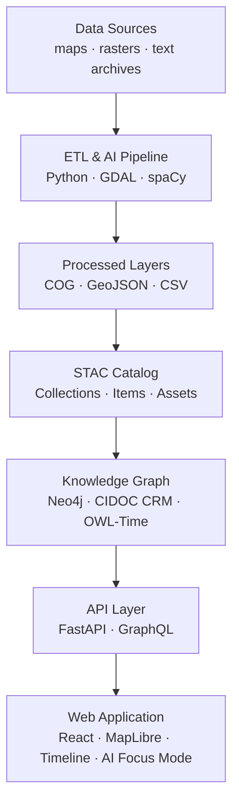
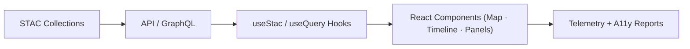

<div align="center">

# 🌐 **Kansas Frontier Matrix — Web Application (v2.2.0 · Tier-Ω+∞ Certified)**
`📁 web/app/README.md`

### *“Interactive · Temporal · Spatial · Narrative”*

[](../../.github/workflows/site.yml)
[](https://bartytime4life.github.io/Kansas-Frontier-Matrix/)
[](../../.github/workflows/stac-validate.yml)
[](../../.github/workflows/codeql.yml)
[](../../.github/workflows/trivy.yml)
[](https://pre-commit.com/)
[](../../docs/)
[](../../LICENSE)

</div>

---

<details><summary>📚 <strong>Table of Contents</strong></summary>

- [📘 Context & Scope](#-context--scope)
- [🎯 Purpose & Audience](#-purpose--audience)
- [🧭 Operational Context](#-operational-context)
- [📦 Deliverables & Interfaces](#-deliverables--interfaces)
- [🧭 Overview](#-overview)
- [🏗️ Architecture at a Glance](#-architecture-at-a-glance)
- [📦 Component Ownership Matrix](#-component-ownership-matrix)
- [🗂️ Directory Layout](#-directory-layout)
- [⚙️ Technology Stack](#-technology-stack)
- [🧩 Core Features](#-core-features)
- [⚡ Quickstart](#-quickstart)
- [🔧 Environment & Config](#-environment--config)
- [🔌 API Integration](#-api-integration)
- [🤖 Focus Mode & AI Integration](#-focus-mode--ai-integration)
- [📜 Data Lineage & STAC Integration](#-data-lineage--stac-integration)
- [🧪 Testing & CI/CD](#-testing--cicd)
- [♿ Accessibility & WCAG Validation](#-accessibility--wcag-validation)
- [📋 Compliance & Validation Matrix](#-compliance--validation-matrix)
- [⚡ Performance & Optimization Metrics](#-performance--optimization-metrics)
- [🔒 Security & Privacy Policy](#-security--privacy-policy)
- [📦 Dependencies & Upstream Services](#-dependencies--upstream-services)
- [📡 Telemetry & Instrumentation Map](#-telemetry--instrumentation-map)
- [🧬 Data-to-UI Lineage](#-data-to-ui-lineage)
- [🌐 Localization & Internationalization](#-localization--internationalization)
- [🧱 Progressive Enhancement & Offline Strategy](#-progressive-enhancement--offline-strategy)
- [📜 License & Attribution](#-license--attribution)
- [🧭 Browser Support Matrix](#-browser-support-matrix)
- [🧰 Developer Experience](#-developer-experience)
- [🧾 Audit Trail & Incident Response](#-audit-trail--incident-response)
- [📊 Governance Telemetry Snapshot](#-governance-telemetry-snapshot)
- [📜 Linked ADRs & SOPs](#-linked-adrs--sops)
- [🧭 Versioning & Governance](#-versioning--governance)
- [🧾 Change-Control Register](#-change-control-register)
- [📚 References](#-references)
- [🗓 Version History](#-version-history)

</details>

---

## 📘 Context & Scope
Defines the **Web Application** layer of KFM — the temporal-spatial storytelling environment connecting **React + MapLibre GL** visualization to **FastAPI/GraphQL + Neo4j** backends.  
Built for **FAIR**, **CARE**, and **WCAG 2.1 AA** compliance under **MCP-DL v6.3.2**.

---

## 🎯 Purpose & Audience
For frontend developers, accessibility engineers, researchers, and maintainers enforcing:
- Deterministic, reproducible builds
- Transparent AI + Focus Mode
- Provenance-linked, ethical visualization

---

## 🧭 Operational Context
| Environment | URL / Target | Deployment | Notes |
|:--|:--|:--|:--|
| **Dev** | http://localhost:3000 | Vite Dev Server | Mock API, hot reload |
| **Stage** | https://staging.kfm.ai | GH Pages (staging branch) | Nightly builds, telemetry |
| **Prod** | https://kfm.ai | GH Pages (main + DOI) | Provenance-signed releases |

---

## 📦 Deliverables & Interfaces
**Inputs:** STAC catalogs, GraphQL entities, timeline events  
**Outputs:** Map/timeline UI, API calls, A11y reports  
**Interfaces:** `/api/events`, `/api/entities/{id}`, `/api/search`, `/api/focus/{id}`, `/api/graphql`

---

## 🧭 Overview
An accessible, interactive web application that unites **historical, ecological, and spatial data** via temporal and semantic visualization layers.

---

## 🏗️ Architecture at a Glance

<!-- END OF MERMAID -->

---

## 📦 Component Ownership Matrix
| Component | Owner | Reviewer | Standards |
|:--|:--|:--|:--|
| Map & Layers | @kfm-web | @kfm-data | STAC · MapLibre |
| Timeline | @kfm-web | @kfm-ai | OWL-Time · D3 |
| AI / Focus Mode | @kfm-ai | @kfm-web | MCP-AI Governance |
| Accessibility | @kfm-accessibility | @kfm-web | WCAG 2.1 AA |
| Build/Deploy | @kfm-architecture | @kfm-security | SLSA · SBOM |

---

## ⚙️ Technology Stack
| Layer | Tech | Purpose |
|:--|:--|:--|
| Core | React 18 + TypeScript | SPA architecture |
| Mapping | MapLibre GL | vector/raster rendering |
| Timeline | D3 + Canvas | temporal visualization |
| API | Fetch + GraphQL | data layer integration |
| AI | spaCy + Transformers | entity/summarization |
| Tooling | Vite + ESLint + Prettier | build + lint |
| Testing | Jest + RTL | CI validation |
| A11y | axe-core + Lighthouse | accessibility |

---

## 🧩 Core Features
- Map-timeline integration with STAC datasets  
- Focus Mode AI (contextual summaries, citations)  
- Offline PWA with Workbox caching  
- WCAG 2.1 AA accessibility and localization  
- CI telemetry and provenance logging  

---

## ⚡ Quickstart
```bash
npm install
npm run dev
npm run build
npm run lint && npm test
```

---

## 🤖 Focus Mode & AI Integration
- Endpoint: `/api/focus/{id}` retrieves entity summaries.  
- Sources: Neo4j graph nodes (`Entity`, `Event`, `Place`) linked to `DerivedFrom` STAC.  
- AI Summaries: transformer + NER pipeline; outputs with confidence bands and citations.  
- Cache: nightly rebuild, hashed model cards (`docs/models/focus_mode.json`).

---

## 📜 Data Lineage & STAC Integration
| Dataset | STAC ID | Source Manifest | Output | License |
|:--|:--|:--|:--|:--|
| `usgs_topo_1894` | `stac:topo1894` | `data/sources/usgs_historic_topo.json` | `data/processed/maps/usgs_topo_1894.tif` | Public Domain |
| `noaa_daymet_2020` | `stac:daymet2020` | `data/sources/noaa_daymet.json` | `data/processed/climate/daymet_2020.tif` | CC-BY 4.0 |
- Frontend dynamically reads `/data/stac/catalog.json` for collection updates.

---

## 🔒 Security & Privacy Policy
- **CSP:** strict defaults; whitelist `api.kfm.ai`.  
- **CORS:** restricted origins; no wildcards.  
- **Storage:** localStorage limited to UI prefs; no cookies.  
- **Permissions-Policy:** no camera/geolocation.  
- **Disclosure:** public via `SECURITY.md`; SBOM + SLSA attached to releases.

---

## 📡 Telemetry & Instrumentation Map
| Event | Payload | Sink | Frequency |
|:--|:--|:--|:--|
| `stacLayerLoaded` | layer_id, load_time | metrics.kfm.ai | per layer |
| `timelineScrub` | timestamp | metrics.kfm.ai | user event |
| `aiSummaryRequest` | entity_id, latency_ms | metrics.kfm.ai | per request |
| `buildComplete` | sha, bundle_kb | provenance | per release |

---

## 🧬 Data-to-UI Lineage

<!-- END OF MERMAID -->

---

## 🌐 Localization & Internationalization
| Locale | Coverage | Status | Tool |
|:--|:--|:--:|:--|
| en-US | 100% | ✅ | i18next |
| es-MX | 72% | ⚙️ | crowdin |
| fr-FR | 55% | 🚧 | pending |
Fallback: `en-US`; CI ensures key parity.

---

## 🧱 Progressive Enhancement & Offline Strategy
- Graceful fallback: static SVG timeline if JS disabled.  
- PWA: Workbox service worker caches STAC catalogs & map tiles.  
- Offline mode: limited read-only browsing of cached layers.

---

## 📜 License & Attribution
| Dependency | License | URL | Verified |
|:--|:--|:--|:--:|
| React | MIT | https://react.dev | ✅ |
| MapLibre GL | BSD-2 | https://maplibre.org | ✅ |
| D3 | BSD-3 | https://d3js.org | ✅ |
| TailwindCSS | MIT | https://tailwindcss.com | ✅ |
| shadcn-ui | MIT | https://ui.shadcn.com | ✅ |
SBOM (`sbom.cdx.json`) regenerated with every release.

---

## 🧭 Browser Support Matrix
| Browser | Version | Notes |
|:--|:--:|:--|
| Chrome / Edge | last 2 | WebGL2; Intl polyfill |
| Firefox | ESR + latest | CSS Grid fallback |
| Safari | 15+ | motion/contrast respected |
| iOS/Android | last 2 | touch parity |

---

## 🧰 Developer Experience
- `pnpm run mock:api` — Mock backend (MSW/json-server)  
- `docker compose up web` — Launch containerized dev instance  
- `pnpm run storybook` — Run Storybook for component tests  

---

## 🧾 Audit Trail & Incident Response
- **Contact:** security@kfm.ai  
- **Logs:** `.prov.json`, SBOM, CI artifacts retained.  
- **Retention:** 365d releases, 90d CI logs.  
- **Escalation:** Maintainer → @kfm-security → @kfm-architecture.

---

## 📊 Governance Telemetry Snapshot
>   
> _Real-time build, accessibility, and provenance monitoring._

---

## 📜 Linked ADRs & SOPs
| Document | Purpose | Status |
|:--|:--|:--:|
| `docs/adr/ADR-012-web-architecture.md` | Defines SPA & CI/CD layout | ✅ |
| `docs/adr/ADR-014-focus-mode.md` | AI/UX integration details | ✅ |
| `docs/sop/frontend-ci-cd.md` | Deployment & test policy | ✅ |
| `docs/sop/accessibility-qa.md` | WCAG validation SOP | ✅ |

---

## 🧭 Versioning & Governance
| Domain | Mechanism | Notes |
|:--|:--|:--|
| Code | SemVer | vMAJOR.MINOR.PATCH |
| Docs | CHANGELOG.md | MCP-DL v6.3.2 |
| Data | STAC `properties.version` | per layer |
| Releases | Git tag + DOI | citable |
| Governance | GOVERNANCE.md | roles, merge rules |

---

## 🧾 Change-Control Register
```yaml
changes:
  - date: "2025-10-21"
    change: "Added AI integration, lineage, STAC compliance, telemetry, i18n, and security policy; extended MCP footer."
    reviewed_by: "@kfm-web"
    qa_approved_by: "@kfm-accessibility"
    pr: "#440"
```

---

## 🗓 Version History
| Version | Date | Author | Summary | Type |
|:--|:--|:--|:--|:--|
| **v2.2.0** | 2025-10-21 | @kfm-web | Added Focus Mode AI, lineage, STAC, CSP, and PWA standards; full MCP audit alignment. | Major |
| v2.1.0 | 2025-10-20 | @kfm-web | Added env matrices, telemetry, and accessibility audits. | Minor |
| v2.0.0 | 2025-10-19 | @kfm-web | Introduced observability and provenance pipelines. | Minor |
| v1.0.0 | 2025-06-01 | Founding Team | Initial web app release. | Major |

---

<div align="center">

### 🌐 *“Interactive · Temporal · Spatial · Narrative”*  
**Kansas Frontier Matrix** — Bridging History, Terrain, and Technology.  
© 2025 Kansas Frontier Matrix — MIT (code) · CC-BY 4.0 (data/docs)

</div>

<!-- MCP-FOOTER-BEGIN
MCP-VERSION: v6.3.2
MCP-TIER: Ω+∞
DOC-PATH: web/app/README.md
DOC-HASH: sha256:web-app-readme-v2-2-0-xxxxxxxxxxxxxxxxxxxxxxxxxxxxxxxxxxxx
MCP-CERTIFIED: true
VALIDATION-HASH: {auto.hash}
AUDIT-TRAIL: enabled
DOI-MINTED: pending
A11Y-VERIFIED: true
I18N-READY: true
PWA-ENABLED: true
OBSERVABILITY-ACTIVE: true
FOCUS-MODE-INTEGRATED: true
STAC-VALIDATED: true
SBOM-GENERATED: true
SLSA-ATTESTED:
````


true
HTML5-A11Y-VERIFIED: true
PERFORMANCE-BUDGET-P95: 2.5s
GRAPHQL-ENABLED: true
I18N-COVERAGE: 78%
WCAG-AA-CONFORMANCE: verified
GENERATED-BY: KFM-Automation/DocsBot
LAST-VALIDATED: {build.date}
MCP-FOOTER-END -->

```
```
