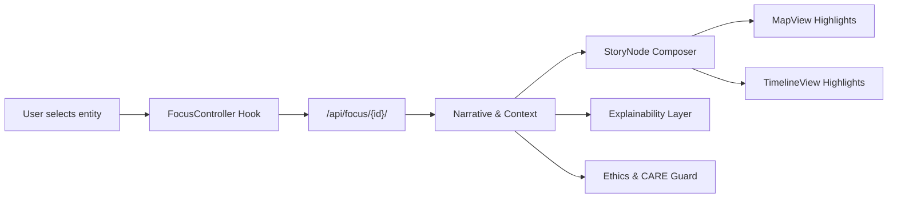

<div align="center">

# 🌐 **Kansas Frontier Matrix — Web Application Architecture**  
`web/ARCHITECTURE.md`

**Purpose:**  
Define the *complete, FAIR+CARE-governed* system architecture for the Kansas Frontier Matrix (KFM) Web Platform — covering 2D/3D rendering pipelines, React UI composition, Focus Mode v2.5 reasoning interfaces, Story Node v3 rendering, STAC/DCAT metadata exploration, provenance surfaces, governance overlays, WCAG 2.1 AA accessibility, telemetry instrumentation, and integration with the KFM API, Knowledge Graph, and Operations Control Plane.

[](../docs/README.md)  
[](../LICENSE)  
[](../docs/standards/faircare.md)  
[](../docs/standards/governance/ROOT-GOVERNANCE.md)  
[]()

</div>

---

# 📘 Overview

The **KFM Web Platform** is a spatial–temporal reasoning interface that binds:

- **React + Tailwind** for UI components, layout, state management, and theming  
- **MapLibre GL** for 2D vector/raster cartography  
- **CesiumJS** for 3D terrain, deep-time paleogeography, and predictive overlays  
- **Focus Mode v2.5** for entity-centric, ontology-aware narrative reasoning  
- **Story Node v3** for narrative units synchronized across map and timeline  
- **STAC/DCAT explorers** for dataset discovery, lineage, and asset previews  
- **Neo4j-backed APIs** (REST/GraphQL/JSON-LD) for graph queries and reasoning  
- **A11y-first patterns** for full WCAG 2.1 AA compliance  
- **Governance overlays** (CARE labels, sovereign sites, licenses, provenance)  
- **OpenTelemetry instrumentation** for performance, usage, and ethical telemetry  

It is the primary **public cognitive surface** of the Kansas Frontier Matrix system.

---

# 🎯 Purpose

This document exists to:

- Provide the **authoritative architecture blueprint** for `web/**`.  
- Align the web platform with:
  - `src/ARCHITECTURE.md` (global system architecture)  
  - `src/pipelines/architecture/observability/README.md` (observability)  
  - `src/pipelines/architecture/reliable-pipelines.md` (reliability)  
  - `docs/standards/markdown_rules.md` (documentation rules)  
- Guide implementation of:
  - Map + timeline synchronization  
  - Focus Mode v2.5 pipelines  
  - Story Node rendering flows  
  - STAC/DCAT dataset browsing and previews  
  - A11y, governance, and telemetry integration  

**Primary consumers:** web engineers, architects, FAIR+CARE reviewers, SRE/observability teams, and platform maintainers.

---

# 📍 Scope

## In Scope

- All code and assets under `web/**`:
  - UI components, pages, hooks, context, services, styles  
  - MapLibre, Cesium, Timeline, Focus Mode, Story Node UIs  
  - Governance overlays, provenance badges, A11y patterns  
  - STAC/DCAT explorer views  
  - Telemetry hooks in the web application  

## Out of Scope

- ETL/AI pipelines (defined in `src/pipelines/**`)  
- Neo4j schema and backend-only data modeling  
- Infrastructure provisioning and deployment details outside the web bundle  

**Boundary references:**

- Backend/API details: `src/ARCHITECTURE.md`, backend docs  
- Pipelines & reliability: `src/pipelines/architecture/reliable-pipelines.md`  
- Observability details: `src/pipelines/architecture/observability/README.md`  

---

# 📚 Definitions

- **Web Platform:** The entire React/TypeScript-based front-end application built in `web/**`.  
- **MapView:** React component cluster that wraps MapLibre GL and interactive map controls.  
- **CesiumView:** 3D globe/terrain root component using CesiumJS.  
- **Focus Panel:** The Focus Mode container responsible for fetching, rendering, and coordinating focus narratives.  
- **Story Node:** A structured narrative card tied to time, place, and related entities, as defined in the Story Node schema.  
- **STAC Explorer:** UI for STAC Collections/Items/time filtering and COG previews.  
- **DCAT Explorer:** UI for DCAT v3 datasets and distributions browsing.  
- **Governance Overlay:** An overlay layer displaying CARE labels, licenses, warning banners, and provenance trails.  
- **A11y Tokens:** The configuration of colors, spacing, typography, and motion settings that enforce WCAG 2.1 AA.

---

# 🏗 Architecture / Context

## System-Level Architecture (Web in Context)

```mermaid
flowchart TD
    subgraph Client
      UI[React UI Layer<br/>Tailwind · Zustand]
      MV[MapView<br/>MapLibre GL]
      CV[CesiumView<br/>3D Terrain]
      FP[FocusPanel<br/>Focus Mode v2 5]
      SN[StoryNode Cards<br/>Narrative Units]
      TL[TimelineView<br/>D3/Recharts]
      LX[Layer Explorer<br/>STAC/DCAT]
      GOVUI[Governance Overlays<br/>CARE · Licenses · Provenance]
    end

    UI --> MV
    UI --> CV
    UI --> FP
    UI --> SN
    UI --> TL
    UI --> LX
    UI --> GOVUI

    MV --> API[API Client<br/>REST · GraphQL · JSON-LD]
    CV --> API
    FP --> API
    TL --> API
    SN --> API
    LX --> API

    subgraph Backend
      SVC[FastAPI + GraphQL Services]
      KG[Neo4j Knowledge Graph]
      STAC[STAC/DCAT Catalogs]
      GOV[Governance Ledger<br/>FAIR+CARE · SBOM · SLSA]
      TEL[Telemetry Ingest<br/>OpenTelemetry · Metrics]
      OPS[Ops Plane<br/>WAL · Retry · Rollback · Lineage]
    end

    API --> SVC
    SVC --> KG
    SVC --> STAC
    SVC --> GOV
    SVC --> TEL
    SVC --> OPS
````

The web app consumes APIs but **does not own** the underlying system of record; it **renders and explains** the state of KFM.

---

# ⚙️ Procedures / Implementation

Implementation is organized around React components, hooks, and services:

* `src/components/**` implement rendering and interaction.
* `src/hooks/**` implement reusable data + state logic (e.g. `useFocus`, `useStac`, `useA11y`).
* `src/context/**` exposes providers (theme, auth, focus state, layout).
* `src/services/**` unify REST/GraphQL/STAC/DCAT calls.
* `src/utils/**` provide formatting, guards, and JSON-LD generation.

Preconditions:

* API endpoints are reachable and version-compatible.
* STAC/DCAT catalogs are discoverable.
* Graph schema behind Focus Mode endpoints is stable.

Postconditions:

* UI renders map/timeline/focus/story consistently.
* Governance and A11y overlays are always present where needed.
* Telemetry is emitted in the prescribed format.

---

# 📑 Data Contracts & Schemas

Key contracts for the web layer:

1. **Focus API Contract**

   * Input: focus entity ID and parameters (e.g. depth, mode).
   * Output: entity graph, narrative summary, Story Node fragments, CARE labels, explainability hints.

2. **Story Node Schema** (`schemas/json/story-node.schema.json`)

   * `id`, `title`, `summary`
   * `narrative.body` (+ format & alternates)
   * `spacetime.geometry`, `bbox`, `when.start/end/precision`
   * `relations[]` and `media[]`
   * STAC integration fields for mapping assets

3. **STAC/DCAT Contracts**

   * STAC 1.0 Collections/Items are consumed as-is.
   * DCAT 3.0 Datasets/Distributions define dataset-level metadata.

The web app uses TypeScript DTOs mirroring these schemas and runtime guards (e.g., Zod, io-ts) to validate responses before rendering.

---

# 🧬 Ontology Alignment

The web architecture maps to external ontologies as follows:

| Ontology   | Mapping                                                                 |
| ---------- | ----------------------------------------------------------------------- |
| CIDOC-CRM  | Web interactions as `E7 Activity`; StoryNodes as `E31 Document`         |
| OWL-Time   | Timeline ranges as `time:TemporalEntity`                                |
| GeoSPARQL  | Map geometries as `geo:Feature` / `geo:FeatureCollection`               |
| PROV-O     | Provenance chips as `prov:Entity` / `prov:wasDerivedFrom` relationships |
| schema.org | Web app as `WebApplication`; pages as `WebPage`                         |
| DCAT 3.0   | Datasets and distributions exposed in DCAT explorer                     |
| STAC 1.0   | Collection/Item semantics used for map layers                           |

Ontology alignment ensures that anything exported (e.g., JSON-LD) is semantically coherent with KFM’s graph and external consumers.

---

# 🛰 STAC/DCAT Metadata

The web app must:

* Support STAC `GET /search` and related endpoints for dataset browsing.

* Present STAC Collections/Items with:

  * Spatial footprints
  * Temporal coverage
  * Asset previews (COGs, GeoJSON, etc.)

* Support DCAT dataset views:

  * Title, description, temporal/spatial coverage
  * Distributions (links to STAC, raw files, APIs)
  * Licenses and themes

Example STAC snippet used in the UI:

```json
{
  "stac_version": "1.0.0",
  "type": "Collection",
  "id": "kfm-web-tiles-demo",
  "description": "Demo tileset for KFM web visualizations.",
  "license": "MIT",
  "extent": {
    "spatial": { "bbox": [[-102.0, 37.0, -94.6, 40.0]] },
    "temporal": { "interval": [["1850-01-01T00:00:00Z", null]] }
  }
}
```

---

# 📖 Story Node Integration

**Story Nodes** are first-class citizens in the web architecture:

* Rendered as cards in `StoryNode/` components
* Anchored to map and timeline via `spacetime` fields
* Composed in Focus Mode narratives
* Used as “chapters” in Story Views and Explore flows

The web architecture must ensure:

* Story Node data is fully validated before display.
* CARE labels and provenance flags are visible.
* Story Node interactions are accessible and keyboard-navigable.

---

# 🧠 Focus Mode Integration

Focus Mode v2.5 is a **cross-cutting concern**:

* **Inputs:** entity ID (person/place/event/dataset/story-node), Focus parameters
* **Outputs:** narrative, related entities, spatial/temporal highlights, Story Node suggestions

Focus Mode pipeline (from the UI perspective):



Focus Mode constraints from this architecture:

* Respect AI transform prohibitions (`ai_transform_prohibited`).
* Show provenance and “Why this?” explanation where appropriate.
* Describe uncertainty and ambiguity clearly.

---

# 🔐 Ethics & CARE Requirements

The web architecture must:

* Expose CARE labels on maps, cards, and dataset views.

* Indicate when data is:

  * Public
  * Restricted
  * Culturally sensitive

* Display warnings before exposing potentially sensitive information.

* Use H3 r7 generalization to obscure precise locations of sensitive heritage sites.

* Integrate with governance docs to show policy context for sensitive content.

---

# 🛡 Governance

The web platform must render:

* Governance banners (e.g., experimental features, restricted data)

* Provenance chips for:

  * Datasets
  * Story Nodes
  * Narrative elements

* Links to:

  * Root governance charter
  * Data source licenses
  * FAIR+CARE policies

Governance overlays are **not optional** and must be integrated in core UI flows (e.g., Explore, StoryNodes, Governance pages).

---

# 🧪 Validation & Testing

Web architecture validation includes:

* **Unit tests:** components, hooks, and services
* **Integration tests:** Focus Mode flows, STAC explorer behavior, Map–Timeline sync
* **A11y tests:** Axe-core and Lighthouse gates
* **Type checks:** TypeScript type checking and DTO correctness

Representative commands:

```text
$ npm --prefix web run test
$ npm --prefix web run typecheck
$ npm --prefix web run lint
```

---

# 📈 Telemetry

The architecture must:

* Emit client metrics:

  * WebVitals (LCP, FID, CLS)
  * FPS for MapLibre/Cesium
  * Interaction counts (layer toggles, focus activations)
  * A11y feature usage

* Emit events to:

  * `../releases/<version>/focus-telemetry.json`
  * Telemetry service defined in `telemetry_schema`

Telemetry data must be:

* Non-PII
* Aggregated where necessary
* Validated against the telemetry schema in CI

---

# 🎧 Accessibility (WCAG 2.1 AA)

Plain-language summary:

> The KFM web application helps people explore Kansas history by showing maps, timelines, and stories. It includes accessibility features like keyboard navigation, high-contrast themes, large text, and screen-reader support so that people with different abilities can use it.

Requirements:

* All interactive elements must be keyboard accessible.
* Color usage must be accessible (contrast ratios, no color-only semantics).
* Components must use semantic HTML and ARIA roles.
* The map, timeline, and modal components must provide screen-reader-friendly summaries.
* Reduced-motion settings must be respected.

---

# 🤖 Machine Extractability

This architecture doc is machine-extractable:

* Predictable heading structure (no skipped levels).
* Tables are syntactically valid and aligned.
* Code blocks are fenced with explicit languages (`mermaid`, `json`, `text`).
* YAML front-matter conforms to `web-architecture.schema.json`.

These rules enable tools (MCPLint, schema validators, doc indexers) to reliably parse and analyze the document.

---

# 🛡 Privacy & Security

Web security controls:

* RBAC via JWT for authenticated contexts.
* GraphQL query depth/complexity limits in client usage.
* No PII in telemetry or logs.
* Strict CSP headers and CORS policies configured at deployment.
* Client code must not embed secrets or privileged tokens.

The architecture assumes security policies defined in separate security docs under `docs/security/**`.

---

# ♻️ Dataset Evolution / Deltas

Relative to v10.3.2:

* Upgraded YAML and structure to **Markdown Rules v10.4**.
* Added explicit ontology alignment and AI transform controls.
* Clarified Focus Mode v2.5 and Story Node v3 integration.
* Documented telemetry, governance, and A11y architecture.
* Added error taxonomy and explicit boundary definitions.

Future upgrades may include:

* New Focus Mode capabilities (v3.x).
* Additional 3D layers and predictive visualization modes.
* Deeper integration with new STAC/DCAT patterns and dynamic catalogs.

---

# 🧩 Error Taxonomy

Common error classes at the web layer:

* **RenderingError:** failure to render map, timeline, focus views, or Story Nodes.
* **DataLoadError:** failure to fetch or parse STAC/DCAT/graph data.
* **NarrativeError:** Focus Mode narrative generation/formatting failures.
* **GovernanceError:** mislabelled or missing CARE/provenance indicators.
* **A11yError:** accessibility regression detected by CI or runtime tools.
* **TelemetryError:** malformed or absent telemetry payloads.

Web error handling must:

* Fail gracefully (show helpful messages, not blank screens).
* Log errors to telemetry and error boundaries.
* Respect privacy requirements.

---

# 📁 Directory Layout

```text
web/
├── README.md
├── ARCHITECTURE.md
├── public/
│   ├── images/
│   ├── icons/
│   ├── manifest.json
│   └── robots.txt
├── src/
│   ├── components/
│   ├── pages/
│   ├── hooks/
│   ├── context/
│   ├── services/
│   ├── utils/
│   └── styles/
├── package.json
└── vite.config.ts
```

---

# 🕰 Version History

| Version | Date       | Author / Team     | Summary                                                                                                                    |
| ------: | ---------- | ----------------- | -------------------------------------------------------------------------------------------------------------------------- |
| v10.4.0 | 2025-11-15 | Web Platform Team | Upgraded to full KFM-MDP v10.4; added ontology, CARE, Story Node v3, Focus Mode v2.5, telemetry, A11y, and error taxonomy. |
| v10.3.2 | 2025-11-14 | Web Platform Team | Deep architecture rebuild; 3D integration, Focus Mode v2.5, STAC/DCAT explorer model.                                      |
| v10.3.1 | 2025-11-13 | Web Platform Team | A11y + STAC improvements; refined layout and map–timeline sync.                                                            |
| v10.0.0 | 2025-11-09 | Web Platform Team | Initial v10 web subsystem foundation.                                                                                      |

---

# 🧾 Footer

---

<div align="center">

**© 2025 Kansas Frontier Matrix — MIT License**
Validated under **Master Coder Protocol v6.3**
FAIR+CARE Certified · Diamond⁹ Ω / Crown∞Ω Ultimate Certified
[Back to Web README](README.md) · [Root Governance Charter](../docs/standards/governance/ROOT-GOVERNANCE.md)

</div>
