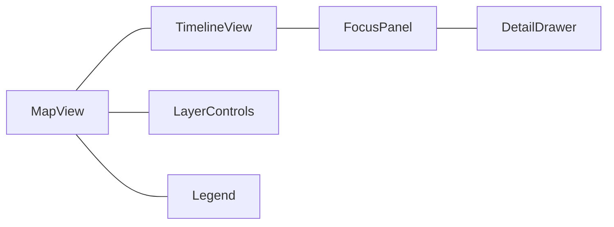
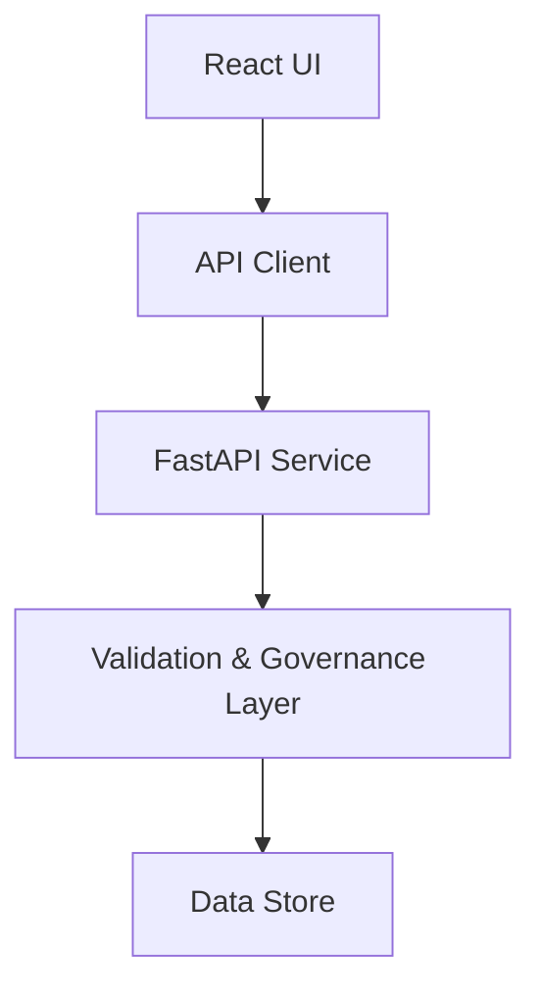

<div align="center">

# 🌐 **Kansas Frontier Matrix — Web Application Architecture**  
`web/ARCHITECTURE.md`

**Purpose:**  
Define the FAIR+CARE-aligned technical architecture of the **KFM Web Application** — a modular, accessible, and AI-aware frontend for exploring historical, geospatial, and environmental data.  
Specifies stack, module boundaries, data/telemetry contracts, governance integration, and CI/CD touchpoints for the web tier.

[](../docs/README.md)
[](../LICENSE)
[](../docs/standards/faircare.md)
[](../releases/v10.2.0/manifest.zip)

</div>

---

## 📘 Overview

The **KFM Web Application** renders the **timeline + map** experience and **Focus Mode v2.1** insights over a **Neo4j-backed knowledge graph** served via **FastAPI/GraphQL**.  
The web tier is **standards-first** (STAC 1.0, DCAT 3.0, JSON-LD/RDF, WCAG 2.1 AA) and **MCP-governed** with telemetry and governance ledgers for each build and release.

**Design Goals**
- **Accessibility by default:** WCAG 2.1 AA, semantic HTML, ARIA, keyboard ops  
- **Ethical AI:** Explainable Focus Mode, CARE safeguards, consent-aware views  
- **Interoperability:** STAC/DCAT catalogs, JSON-LD semantics, stable APIs  
- **Reproducibility:** Pinned toolchain, SBOM, deterministic builds, telemetry

---

## 🗂️ Directory Layout

```
web/
├── README.md                          # Web tier index
├── ARCHITECTURE.md                    # This file
│
├── public/                            # Static assets (no secrets)
│   ├── images/                        # PNG/SVG with documented alt text
│   ├── icons/                         # App/feature icons (a11y-ready)
│   └── manifest.json                  # PWA metadata (name, theme, icons)
│
├── src/                               # React + TypeScript application
│   ├── components/                    # Presentational & a11y-first components
│   │   ├── MapView/                   # MapLibre (2D) & Cesium (3D)
│   │   ├── TimelineView/              # Time navigation + density bands
│   │   ├── FocusPanel/                # AI summaries + links + explainability
│   │   ├── LayerControls/             # STAC/DCAT toggles, opacity, presets
│   │   └── Accessibility/             # Skip links, focus traps, ARIA helpers
│   ├── pages/                         # Routes: Home, Explore, Governance, About
│   ├── hooks/                         # useTelemetry, useGovernance, useFocus, useStac
│   ├── context/                       # Providers (Theme, Focus, Auth)
│   ├── services/                      # API clients (REST/GraphQL, STAC/DCAT adapters)
│   ├── utils/                         # Formatters, i18n, schema guards
│   └── styles/                        # Tailwind config, tokens, variables
│
├── package.json                       # Pinned deps + scripts
├── vite.config.ts                     # Vite build config (or next.config.js)
└── telemetry.json                     # Optional local web telemetry cache
```

---

## 🧩 Frontend Stack & Responsibilities

| Layer | Technology | Responsibility |
|---|---|---|
| **Framework** | React 18 + TypeScript | Component model, routing, state |
| **Styling** | Tailwind CSS | Tokenized, responsive, accessible UI |
| **Map** | MapLibre GL JS / Cesium | Vector rendering, COG overlays, 3D scenes |
| **Charts** | D3 / Recharts | Timeline density, histograms, KPIs |
| **State** | React Context + lightweight store | Focus, theme, a11y, layer state |
| **Data** | STAC/DCAT, GraphQL, JSON-LD | Catalog discovery + entity details |
| **AI** | Focus v2.1 (server-side) | Narratives, relatedness, explainability |
| **A11y** | Semantics + ARIA + axe CI | WCAG 2.1 AA compliance |
| **Telemetry** | Web Vitals + custom hooks | Perf, a11y, energy & ethics metrics |

---

## 🧱 Component Boundaries



- **MapView:** Base map (2D/3D), layer management, selections, keyboard ops  
- **TimelineView:** Zoomable scale, break markers, forecast ranges  
- **FocusPanel:** AI insights, related entities, provenance & citations  
- **LayerControls:** STAC/DCAT toggles, opacity, styles, presets  
- **DetailDrawer / Legend:** Context metadata and symbology

---

## 🧠 Focus Mode (Ethical AI v2.1)

**Objective:** Center the experience on a single entity and **explain** its relationships.

| Aspect | Implementation |
|---|---|
| API | `GET /api/focus/{entity_id}` → narrative + subgraph + citations + ethics flags |
| Model | `focus_transformer_v2.1` (server inference); UI displays results |
| Explainability | SHAP/LIME views; “Why this?” chips; on-map causal hints |
| CARE Safeguards | Sensitive content gating; consent & license badges |
| Telemetry | `focus` events → `../releases/v10.2.0/focus-telemetry.json` with a11y/ethics flags |

---

## 🧩 Data Contracts & Catalogs

| Contract | Purpose | Source |
|---|---|---|
| **STAC v1.0** | Layer registration & temporal search | `data/stac/**` |
| **DCAT 3.0** | Dataset cataloging | STAC↔DCAT bridge |
| **API DTOs** | Strongly typed responses for UI | `src/services/*` |
| **A11y Contract** | Route-level a11y thresholds | `accessibility_scan.yml` |

**Validation:** CI enforces schema/contract compliance prior to deploy.

---

## ⚙️ Build, Env & Security

| Area | Standard | Notes |
|---|---|---|
| Build | Vite/Next | Deterministic builds, pinned deps |
| Images | Non-root base | CI blocks on **CRITICAL** (Trivy) |
| Headers | CSP / CORP / COEP | Applied at hosting/CDN |
| Secrets | None client-side | Keys remain server-side |
| SBOM | SPDX for web deps | Linked in release manifest |

---

## 🔁 CI/CD (Web Tier) — Workflow → Artifact Mapping

| Workflow | Enforces | Primary Artifacts |
|---|---|---|
| `docs-lint.yml` | Markdown/YAML/JSON style + front-matter | `reports/self-validation/docs/lint_summary.json` |
| `build-and-deploy.yml` | Build integrity & deployment | `docs/reports/telemetry/build_metrics.json` |
| `telemetry-export.yml` | Merge metrics from all jobs | `../releases/v10.2.0/focus-telemetry.json` |
| `codeql.yml` / `trivy.yml` | Static code & CVE scans | `reports/security/*` |
| `accessibility_scan.yml` | Lighthouse/axe a11y budget | `reports/self-validation/web/a11y_summary.json` |

---

## ♿ Accessibility & Inclusive Design

**Core Rules**
- Keyboard navigation: tab order, focus indicators, skip links  
- Contrast ≥ **4.5:1** (text), **3:1** (large text/icons)  
- Alt text for all non-text assets; ARIA labels for landmarks & controls  
- Reduced motion option; content reflow for narrow viewports  
- Lighthouse/axe checks each release (`accessibility_scan.yml`)

**Docs:** `../docs/standards/ui_accessibility.md`.

---

## 📊 Telemetry & Governance

- **Web Vitals** and **a11y/ethics** metrics exported via hooks  
- Build metrics recorded in `docs/reports/telemetry/build_metrics.json`  
- Release snapshot aggregates to `../releases/v10.2.0/focus-telemetry.json`  
- Governance events (e.g., sensitive layer flags) ledgered under `../docs/reports/audit/`

**Example Telemetry Snippet**
```json
{
  "component": "MapView",
  "web_vitals": { "cls": 0.03, "lcp_ms": 1330, "fid_ms": 8 },
  "a11y": { "contrast_ok": true, "keyboard_ok": true },
  "ethics": { "care_flag": false },
  "timestamp": "2025-11-12T18:11:03Z"
}
```

---

## 🧭 Integration with Backend



- UI fetches **entities** (GraphQL) and **layers** (STAC/DCAT).  
- Focus Mode runs server-side; only summarized outputs return to UI.  
- Provenance chips deep-link to ledger entries and catalog metadata.

---

## 🕰️ Version History

| Version | Date | Author | Summary |
|---|---|---|---|
| v10.2.2 | 2025-11-12 | Web Architecture Team | Aligned to v10.2: Focus v2.1, streaming catalog, a11y/energy telemetry, JSON-LD provenance. |
| v10.0.0 | 2025-11-09 | Web Architecture Team | Focus v2, 3D scenes, streaming STAC bridge, a11y budgets, telemetry v2. |
| v9.7.0 | 2025-11-05 | KFM Core Team | MCP alignment; workflow→artifact map, a11y/ethics telemetry, contracts table. |
| v9.6.0 | 2025-11-03 | KFM Core Team | Sustainability & a11y telemetry; Focus safeguards. |
| v9.5.0 | 2025-11-02 | KFM Core Team | Explainability and governance middleware. |

---

<div align="center">

**© 2025 Kansas Frontier Matrix — MIT / CC-BY 4.0**  
Maintained under **Master Coder Protocol v6.3** · FAIR+CARE Certified · Diamond⁹ Ω / Crown∞Ω Ultimate Certified  
[Back to Web Index](README.md) · [Governance Charter](../docs/standards/governance/ROOT-GOVERNANCE.md)

</div>