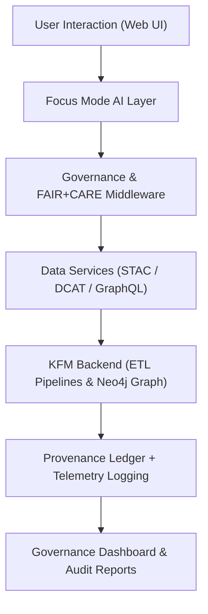

<div align="center">

# 🌐 Kansas Frontier Matrix — **Web Application Architecture**
`web/ARCHITECTURE.md`

**Purpose:**  
Defines the FAIR+CARE-aligned technical architecture of the Kansas Frontier Matrix (KFM) web interface — a modular, responsive, and AI-driven application for exploring historical, geospatial, and environmental data.  
This architecture ensures transparency, accessibility, and provenance continuity through open web technologies and ethical AI integrations.

[](../docs/standards/faircare-validation.md)
[](../LICENSE)
[](../docs/architecture/repo-focus.md)
[]()

</div>

---

## 🧭 Overview

The **KFM Web Application** provides an interactive visualization environment for exploring linked data, AI-driven insights, and FAIR+CARE-certified historical datasets.  
It integrates the Focus Mode AI assistant, geospatial visualization (MapLibre + Deck.gl), and time-based storytelling (ChronoView) under a modular monorepo design.

### Core Principles:
- **FAIR+CARE-first:** Web modules inherit metadata, accessibility, and ethics constraints.  
- **Accessibility & Openness:** WCAG 2.1 AA and ISO 9241-210 compliant UI.  
- **AI Transparency:** Integrated Focus Mode provides explainable, ethical AI insights.  
- **Reproducibility:** Frontend builds are version-controlled and SBOM-verified.  

---

## 🗂️ Directory Overview

```plaintext
web/
├── README.md                             # High-level documentation of web directory
├── ARCHITECTURE.md                       # This file — system design documentation
│
├── public/                               # Static assets (images, icons, UI tokens)
│   ├── images/
│   ├── icons/
│   └── manifest.json
│
├── src/                                  # Core application source (React + TypeScript)
│   ├── components/                       # UI components (FAIR+CARE accessible patterns)
│   ├── pages/                            # Route-based pages (Home, Explorer, Governance)
│   ├── hooks/                            # Shared state management & custom hooks
│   ├── context/                          # Global app context (telemetry, ethics state)
│   ├── utils/                            # Helper functions (API, metadata, telemetry)
│   └── services/                         # API & data fetching services (STAC/DCAT)
│
├── package.json                          # Web dependencies and build metadata
├── next.config.js                        # Next.js / Vite configuration for frontend
└── telemetry.json                        # Focus Mode and environmental telemetry data
```

---

## ⚙️ Frontend Technology Stack

| Layer | Technology | Purpose |
|-------|-------------|----------|
| **Framework** | React 18 + Next.js | Declarative, component-based UI architecture |
| **Styling** | Tailwind CSS + CSS Modules | Modular, responsive, and accessible UI styling |
| **Data Visualization** | MapLibre GL + Deck.gl + Recharts | Interactive geospatial and analytical charts |
| **AI Integration** | OpenAI GPT + Focus Mode SDK | Context-aware ethical AI interaction |
| **Data Access** | STAC, DCAT 3.0, GraphQL | FAIR+CARE-compliant data layer abstraction |
| **State Management** | Zustand + React Context | Lightweight global state and governance sync |
| **Accessibility** | Headless UI + ARIA + WCAG 2.1 | Inclusive, standards-aligned components |
| **Telemetry** | Web Vitals + Sustainability.js | Performance, energy, and accessibility monitoring |

---

## 🧩 System Architecture Diagram



### Architecture Summary:
1. **Frontend (A):** Responsive UI built on accessible FAIR+CARE design tokens.  
2. **Focus Mode (B):** AI reasoning layer interprets user queries with ethical constraints.  
3. **Governance Middleware (C):** Validates every request for provenance integrity.  
4. **Data Services (D):** Fetches harmonized metadata from FAIR+CARE-compliant APIs.  
5. **Backend Integration (E–F):** Syncs validated data and telemetry with ledger systems.  

---

## 🧠 FAIR+CARE + Accessibility Governance Matrix

| Principle | Implementation | Oversight |
|------------|----------------|------------|
| **Findable** | URLs map to dataset and ledger entities. | @kfm-data |
| **Accessible** | WCAG 2.1 AA + ISO 9241-210 compliance validated each release. | @kfm-accessibility |
| **Interoperable** | Follows DCAT, STAC, and FAIR metadata exchange standards. | @kfm-architecture |
| **Reusable** | Open APIs and UI components licensed under MIT. | @kfm-design |
| **Collective Benefit** | Ensures open access to Kansas’s cultural and scientific history. | @faircare-council |
| **Authority to Control** | FAIR+CARE Council governs ethical AI & accessibility settings. | @kfm-governance |
| **Responsibility** | Frontend logs environmental and ethical metrics to telemetry. | @kfm-sustainability |
| **Ethics** | Bias-tested Focus Mode responses and inclusive UX validated per release. | @kfm-ethics |

Audit and validation results stored in:  
`data/reports/audit/data_provenance_ledger.json`  
and  
`data/reports/fair/data_care_assessment.json`

---

## ⚙️ Governance & Telemetry Integration

- All UI interactions and API calls are monitored through **Focus Mode Telemetry**.  
- Sustainability metrics (energy use, performance impact) logged in `focus-telemetry.json`.  
- Accessibility audits automatically triggered in `web_vitals_audit.yml`.  
- Provenance chain updates registered via `governance_sync.yml`.  

Example Telemetry Record:
```json
{
  "component": "MapView",
  "average_runtime_ms": 142,
  "energy_use_wh": 0.42,
  "fairstatus": "certified",
  "accessibility_score": 98.7,
  "ai_explainability": true
}
```

---

## 🧩 Deployment & CI/CD Summary

| Pipeline | Tool | Purpose |
|-----------|------|----------|
| `docs_validate.yml` | GitHub Actions | Validates documentation consistency |
| `web_build.yml` | Next.js + Vercel | Builds and deploys FAIR+CARE-certified frontend |
| `telemetry_report.yml` | Sustainability.js | Monitors web sustainability performance |
| `accessibility_scan.yml` | Lighthouse CI | Ensures WCAG 2.1 and ISO 9241-210 compliance |
| `governance_sync.yml` | FAIR+CARE Governance | Registers audit and provenance metrics |

---

## 🧾 Internal Use Citation

```text
Kansas Frontier Matrix (2025). Web Application Architecture (v9.6.0).
Defines the ethical, accessible, and FAIR+CARE-aligned frontend architecture for the Kansas Frontier Matrix web ecosystem.
Integrates governance, telemetry, and Focus Mode AI for transparent open-data exploration.
```

---

## 🧾 Version Notes

| Version | Date | Notes |
|----------|------|--------|
| v9.6.0 | 2025-11-03 | Added sustainability telemetry and AI accessibility audits. |
| v9.5.0 | 2025-11-02 | Integrated Focus Mode explainability and ethics middleware. |
| v9.3.2 | 2025-10-28 | Established baseline FAIR+CARE web architecture. |

---

<div align="center">

**Kansas Frontier Matrix** · *Accessible Web Design × FAIR+CARE Governance × Ethical AI Visualization*  
[🔗 Repository](https://github.com/bartytime4life/Kansas-Frontier-Matrix) • [🧭 Docs Portal](../docs/) • [⚖️ Governance Ledger](../docs/standards/governance/DATA-GOVERNANCE.md)

</div>
