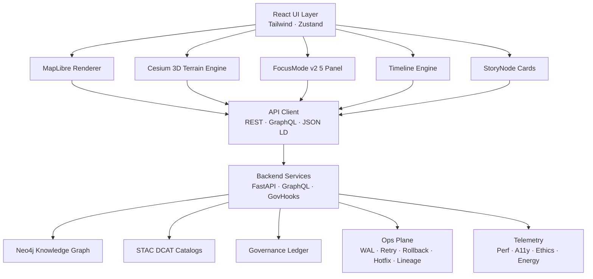
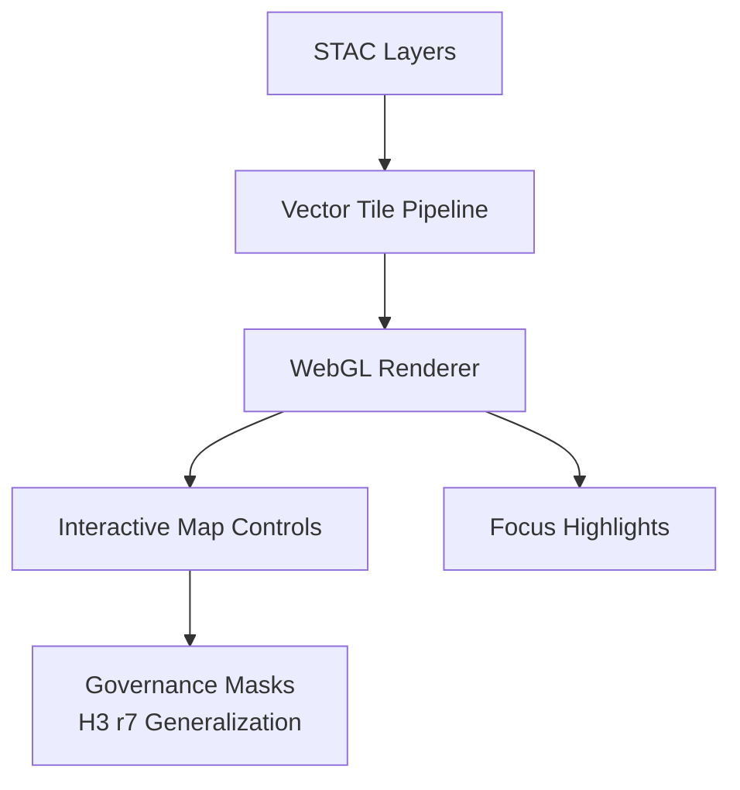
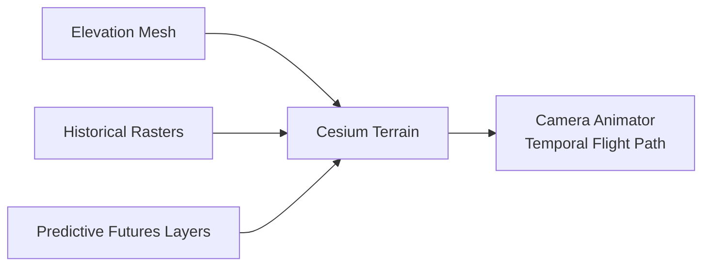
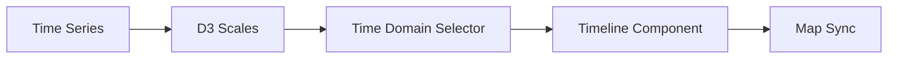
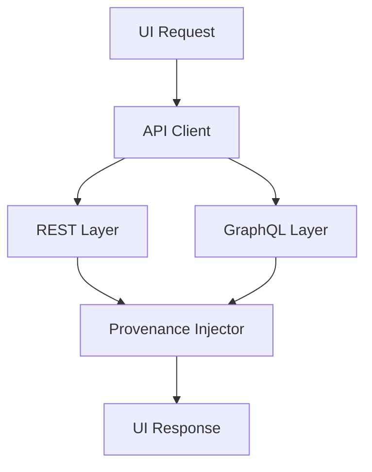
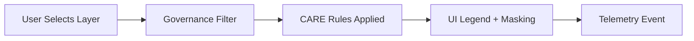
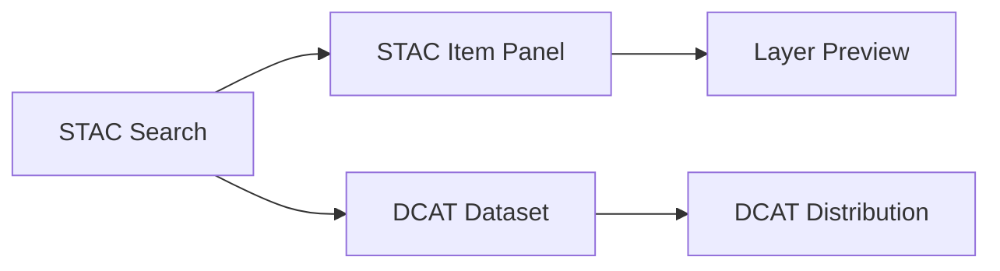
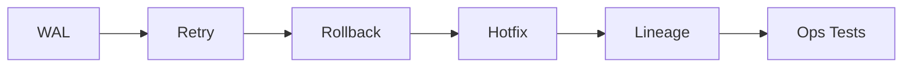
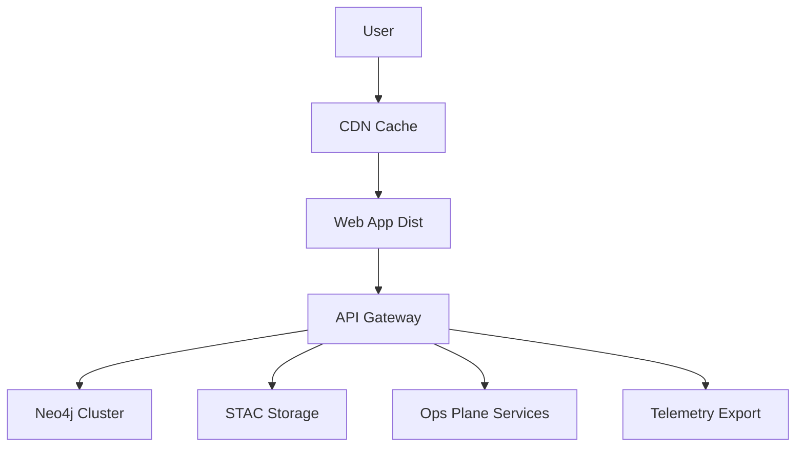

<div align="center">

# 🌐 **Kansas Frontier Matrix — Web Application Architecture**  
`web/ARCHITECTURE.md`

**Purpose:**  
Define the *complete*, *deep-level*, FAIR+CARE-governed system architecture for the Kansas Frontier Matrix Web Platform — covering 2D/3D rendering pipelines, UI state management, Focus Mode v2.5 reasoning interfaces, STAC/DCAT metadata exploration, provenance surfaces, governance overlays, accessibility (WCAG 2.1 AA), telemetry instrumentation, and integration with the KFM API, Knowledge Graph, and Operations Control Plane.

[]()
[]()
[]()
[]()
[]()

</div>

---

# 📘 Executive Summary

The **KFM Web Platform** is a **spatial-temporal reasoning interface** connecting:

- **React UI** (components, router, state, context)
- **MapLibre GL** (2D vector rendering)
- **CesiumJS** (3D terrain, deep-time earth models)
- **Focus Mode v2.5** (AI-assisted reasoning)
- **STAC/DCAT explorers**
- **Story Node visualizations**
- **Timeline engine (D3/Recharts)**
- **A11y and governance overlays**
- **Operations Control Plane integrations**  
- **Telemetry and sustainability monitoring**

It is the *public cognitive surface* of KFM.

---

# 🧬 Full System Architecture (Top-Level)



---

# 🧱 Directory Structure (Authoritative v10.3.2)

```
web/
├── README.md
├── ARCHITECTURE.md               # This file
│
├── public/                       # Static assets
│   ├── images/
│   ├── icons/
│   ├── manifest.json
│   └── robots.txt
│
├── src/
│   ├── components/
│   │   ├── MapView/             # 2D mapping (MapLibre)
│   │   ├── CesiumView/          # 3D terrain & globe
│   │   ├── TimelineView/        # Time navigation
│   │   ├── FocusPanel/          # Focus Mode v2.5 UI
│   │   ├── StoryNode/           # Narrative unit components
│   │   ├── Governance/          # CARE labels, masking icons
│   │   ├── StacExplorer/        # Dataset browsing
│   │   ├── DcatExplorer/
│   │   ├── LayerSwitcher/
│   │   └── Shared/
│   │
│   ├── pages/
│   │   ├── Home/
│   │   ├── Explore/
│   │   ├── StoryNodes/
│   │   ├── Governance/
│   │   └── About/
│   │
│   ├── hooks/                   # useFocus • useTelemetry • useStac • useA11y
│   ├── context/
│   ├── services/                # STAC/DCAT clients · GraphQL · REST · provenance injectors
│   ├── utils/                   # Formatters, schema guards, JSON-LD generators
│   └── styles/                  # Tailwind tokens & theming
│
├── package.json
└── vite.config.ts
```

---

# 🧠 Focus Mode v2.5 – Internal Architecture

### Purpose  
Provide AI-driven narrative analysis of people, places, events, treaties, ecological changes, and Story Nodes.

### Internal Modules  
- **FocusController** – orchestrates API calls  
- **NarrativeRenderer** – high-level narrative UI  
- **ExplainabilityLayer** – SHAP overlays & Why-This explanations  
- **EthicsGuard** – CARE filters, sovereignty rules  
- **TemporalAligner** – timeline-aware story placement  
- **SpatialHighlighter** – map feature highlighting  

---

## Focus Mode v2.5 Pipeline

```mermaid
flowchart LR
    E1[User selects entity] --> E2[FocusController]
    E2 --> API[/api/focus/{id}/]
    API --> E3[Narrative Generator]
    E3 --> E4[Story Node Builder]
    E3 --> X1[Explainability Layer]
    E3 --> X2[Ethics/Care Filter]
    E4 --> MAP[MapView Highlight]
    E4 --> TL[Timeline Sync]
```

---

# 🌍 Mapping Engine — MapLibre Deep Architecture



### MapLibre Guarantees
- GPU-accelerated vector rendering  
- COG raster fallback  
- H3-masked geometries for sensitive sites  
- Colorblind-safe ramps  
- Framerate-optimized tile caching  

---

# 🌎 CesiumJS — 3D Terrain & Time Engine



Features:
- Paleogeographic layers  
- Forecasting overlays (climate, hydrology)  
- Timeline-bound terrain morphing  
- 3D Story Node extrusion  

---

# 📊 Timeline Engine — D3 / Recharts



---

# 🔧 API Client Architecture

### Principles
- TypeScript DTO schema guards  
- JSON-LD provenance injection  
- Ethics filters pre-response  
- STAC/DCAT pagination  
- GraphQL delegation for subgraph queries  
- Exponential backoff + retry logic  



---

# ♿ Accessibility (WCAG 2.1 AA+ Architecture)

Accessibility is non-negotiable and mandated by governance.

### Components:
- **ARIA roles** for map, timeline, panels  
- **A11y Tokens** (high contrast, large text, reduced motion)  
- **Keyboard-first map control**  
- **Screen-reader narrative explanations**  
- **A11y CI Gate** (Axe-core/Lighthouse ≥ 95%)

Tokens defined in:

```
docs/design/tokens/a11y-tokens.md
```

---

# 🛡️ Governance Integration Architecture

### Governance UI Features
- Consent-required data banners  
- CARE label warnings  
- License chips  
- Provenance traces (Story Node → Dataset → STAC → Source)  
- Masking for sensitive tribal/heritage areas  

Governance flow:



---

# 📦 STAC/DCAT Explorer Architecture

### Features  
- STAC search  
- COG previews  
- DCAT dataset → distribution mapping  
- Keyword filters  
- Spatial/temporal slicers  
- Lineage chips  
- Provenance flow-out  



---

# 📈 Telemetry & Observability Architecture

Telemetry export to:

```
../releases/v10.3.2/focus-telemetry.json
```

Metrics:
- WebVitals (LCP, FID, CLS)  
- A11y scanning  
- Layer toggles  
- AI reasoning depth  
- GPU framerate (MapLibre/Cesium)  
- Sustainability: energy (Wh) & carbon (gCO₂e)  
- Error boundary events  

---

# 🛡️ Security & Privacy Architecture

### Controls
- RBAC + OAuth2/JWT  
- Query depth limiting for GraphQL  
- CORS + strict CSP headers  
- Sanitized STAC/DCAT inputs  
- Sensitive geometry masking (H3 r7)  
- No secrets in client bundle  
- Dependency pinning  
- SBOM-backed verification at build time  

---

# 🧵 Operations Control Plane (WAL → Retry → Rollback → Hotfix → Lineage)



The Web UI interfaces with Ops APIs for:
- Provenance display  
- Ethics warnings  
- Layer-level rollback previews  
- Hotfix result summaries  

---

# ☁️ Multi-Cloud Deployment Architecture



---

# 🚀 Development & Build

### Setup

```bash
npm --prefix web install
npm --prefix web run dev
```

### Build

```bash
npm --prefix web run build
```

Output served from:

```
web/dist/
```

---

# 🕰️ Version History

| Version | Date | Summary |
|--------|-------|---------|
| **v10.3.2** | 2025-11-14 | Fully rebuilt deep architecture; added rendering pipelines, governance UI, STAC/DCAT explorer model, Focus Mode v2.5 flows, accessibility architecture, multi-cloud, security, telemetry. |
| **v10.3.1** | 2025-11-13 | Upgraded v10 architecture. |
| **v10.2.2** | 2025-11-12 | Preliminary predictive overlay support. |
| **v10.0.0** | 2025-11-09 | Initial v10 web subsystem. |

---

<div align="center">

**Kansas Frontier Matrix — Web Architecture**  
Spatial Reasoning × Narrative AI × Ethical UX  
© 2025 KFM — MIT License  
[Back to Web README](README.md) · [System Architecture](../src/ARCHITECTURE.md)

</div>
