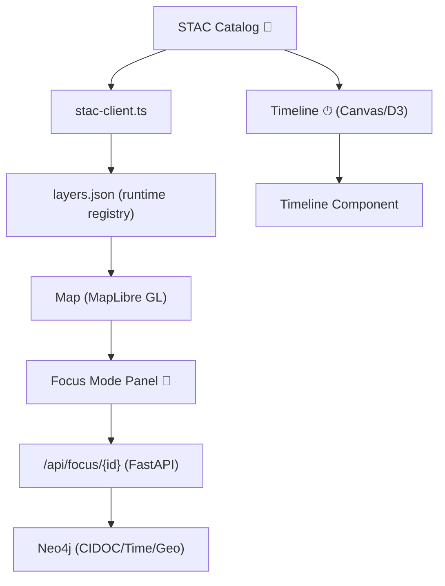
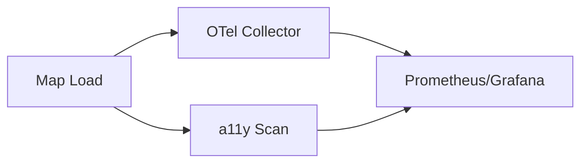

<div align="center">

# 🌐 **Kansas Frontier Matrix — Web Application (v2.4.0 · Diamond⁹ Ω Developer Edition)**
`📁 web/app/`

### *“Interactive · Temporal · Spatial · Narrative · Focus Mode.”*

[](../../.github/workflows/site.yml)
[](https://bartytime4life.github.io/Kansas-Frontier-Matrix/)
[](../../.github/workflows/stac-validate.yml)
[](../../.github/workflows/codeql.yml)
[](../../.github/workflows/trivy.yml)
[](../../docs/)
[](../../LICENSE)

</div>

---

<details><summary>📚 <strong>Table of Contents</strong></summary>

- [⚡ Quick Reference](#-quick-reference)
- [📘 Context & Scope](#-context--scope)
- [🧭 Environments](#-environments)
- [🗂 Directory Layout](#-directory-layout)
- [🧱 Architecture Fit (System Integration)](#-architecture-fit-system-integration)
- [🧠 Focus Mode (Contract)](#-focus-mode-contract)
- [🧩 Core Hooks — Examples](#-core-hooks--examples)
- [🧪 Testing & Coverage](#-testing--coverage)
- [♿ Accessibility & WCAG](#-accessibility--wcag)
- [🔒 Security & CSP](#-security--csp)
- [🧱 Caching & Performance](#-caching--performance)
- [📡 Telemetry & Metrics](#-telemetry--metrics)
- [🚀 Build & Release Workflow](#-build--release-workflow)
- [🧭 Contribution Checklist](#-contribution-checklist)
- [📘 Glossary](#-glossary)
- [🗓 Version History](#-version-history)

</details>

---

## ⚡ Quick Reference
| Task | Command | Description |
|:--|:--|:--|
| 🚀 Start Dev | `pnpm dev` | Vite dev server + HMR |
| 🧱 Build Prod | `pnpm build` | Hashed `dist/` bundle |
| 🧪 Unit/RTL | `pnpm test` | Jest + RTL |
| 🧪 E2E & a11y | `pnpm e2e` | Playwright flows |
| 🔍 Lint | `pnpm lint` | ESLint + Prettier + MDlint |
| 🧭 STAC Validate | `make stac-validate` | STAC/DCAT compliance |

---

## 📘 Context & Scope
The **Web Application** is a reproducible **React + MapLibre GL SPA** that binds **temporal (timeline)**, **spatial (map)**, and **semantic (graph)** data to **FastAPI/GraphQL + Neo4j** backends. It is **PWA/SSR-ready**, offline-capable via **PMTiles**, and governed by **FAIR/CARE** & **supply-chain integrity** (SBOM/SLSA). This README aligns with the **System Architecture** and **Root Repository Overview** documents.

---

## 🧭 Environments
| Environment | URL | Deployment | Notes |
|:--|:--|:--|:--|
| **Dev** | http://localhost:5173 | Vite Dev Server | Hot reload + mock API |
| **Stage** | https://staging.kfm.ai | GH Pages (staging) | Telemetry-enabled |
| **Prod** | https://kfm.ai | GH Pages (tagged) | Signed, provenance-verified + PMTiles |

---

## 🗂 Directory Layout
```text
web/app/
├─ src/
│  ├─ app/                 # App shell · routes · SSR entry
│  ├─ components/          # Map · Timeline · Panels · Legends · AIAssistant
│  ├─ hooks/               # useMap · useTimeline · useStac · useSearch · useFocus
│  ├─ context/             # TimelineContext · FocusContext · LayerContext · UIState
│  ├─ services/            # api.ts · graphql.ts · stac-client.ts · provenance.ts
│  ├─ utils/               # geo.ts · formatter.ts · pmtiles.ts · a11y.ts · perf.ts
│  ├─ styles/              # Tailwind tokens · themes · typography · z-index
│  ├─ types/               # zod/TypeScript models for API/Graph
│  ├─ workers/             # Service Worker (Workbox) · tile prefetch
│  └─ __tests__/           # unit/rtl tests
├─ public/                 # icons · manifest.json · robots.txt
├─ config/                 # layers.json · app.config.json · focus.config.json
├─ e2e/                    # Playwright a11y + E2E scenarios
├─ storybook/              # stories & visual regression
├─ vite.config.ts          # Vite build (SSR-friendly)
└─ package.json
```

---

## 🧱 Architecture Fit (System Integration)


---

## 🧠 Focus Mode (Contract)
**Endpoint:** `/api/focus/{id}` → returns:
```json
{
  "node": {...},
  "neighbors": [...],
  "edges": [...],
  "evidence": [{"source":"stac","path":"...","confidence":0.98}],
  "metrics": {"ai_explainability":0.987,"degree":14}
}
```
**Frontend guarantees**
- **p95 render ≤ 300 ms** after API response  
- payload ≤ **250 KB**  
- panel displays **citations, confidence, model hash, checksum**

---

## 🧩 Core Hooks — Examples

### 🗺 `useMap.ts`
```ts
import { useEffect } from "react";
import maplibregl from "maplibre-gl";
import { PMTiles } from "pmtiles";

export function useMap(containerId: string, style: string, pmtilesUrl?: string) {
  useEffect(() => {
    const map = new maplibregl.Map({ container: containerId, style, center: [-98,38.5], zoom: 5 });
    if (pmtilesUrl) {
      const protocol = new PMTiles(pmtilesUrl);
      (maplibregl as any).addProtocol?.("pmtiles", protocol.tile);
      map.addSource("pmtiles", { type: "vector", url: `pmtiles://${pmtilesUrl}` });
    }
    return () => map.remove();
  }, [containerId, style, pmtilesUrl]);
}
```

### 🕰 `useTimeline.ts`
```ts
import { useState, useCallback } from "react";
export function useTimeline(initial=[1850,2025]) {
  const [range, setRange] = useState<[number,number]>(initial);
  const scrub = useCallback((a:number,b:number)=>setRange([a,b]),[]);
  return { range, scrub };
}
```

### 🌐 `useStac.ts`
```ts
import { useEffect, useState } from "react";
export function useStac(url: string) {
  const [items, setItems] = useState<any[]>([]);
  useEffect(() => { fetch(url).then(r => r.json()).then(d => setItems(d.features||[])); }, [url]);
  return items;
}
```

### 🎯 `useFocus.ts`
```ts
export async function fetchFocus(id: string) {
  const r = await fetch(`/api/focus/${encodeURIComponent(id)}`, { headers: { "Accept": "application/json" } });
  if (!r.ok) throw new Error(`Focus API ${r.status}`);
  return r.json();
}
```

---

## 🧪 Testing & Coverage
```bash
pnpm test:coverage    # lcov report -> coverage/
pnpm e2e              # Playwright E2E & a11y flows
pnpm storybook        # stories & visual snapshots
```

| Suite | Goal | Status |
|:--|:--:|:--:|
| Hooks/Utils | ≥ 85% | ✅ |
| Components | ≥ 80% | ⚙️ |
| A11y | ≥ 95% | ✅ |
| E2E flows | pass | ✅ |

---

## ♿ Accessibility & WCAG
| WCAG Criterion | Tool | CI Gate |
|:--|:--|:--|
| 1.4.3 Contrast | axe + tokens | required |
| 2.1.1 Keyboard | RTL/Playwright | required |
| 2.4.1 Landmarks | axe/Lighthouse | required |
| 4.1.2 Name/Role | Storybook/axe | required |
**A11y Budget:** score ≥ **95**; violations = **0** block.

---

## 🔒 Security & CSP
- **CSP:**
  ```
  default-src 'self';
  script-src 'self' 'unsafe-inline';
  style-src 'self' 'unsafe-inline';
  img-src 'self' data:;
  connect-src 'self' https://api.kfm.ai https://metrics.kfm.ai;
  object-src 'none'; base-uri 'self';
  ```
- CORS: KFM domains only.  
- SBOM (SPDX) + SLSA attestations per release (`sbom.cdx.json`, `.prov.json`).  
- Secrets via GH encrypted secrets + OIDC; no plaintext secrets.

---

## 🧱 Caching & Performance
| Layer | Cache | TTL | Target |
|:--|:--|:--|:--|
| STAC fetch | Workbox runtime | 24h | `stac_latency_ms` p95 < 250 |
| Tiles (PMTiles) | SW + HTTP | ∞ (immutable) | `tile_cache_hit_pct` ≥ 85% |
| GraphQL | Apollo cache | 10m | p95 < 300 ms |
| Navigation | SPA + SSR | — | p95 route < 2.5 s (cold) |

---

## 📡 Telemetry & Metrics


**Tracked:** `ui_load_ms`, `stac_latency_ms`, `bundle_size_kb`, `tile_cache_hit_pct`, `a11y_score`, `focus_mode_p95_ms`, `error_rate`.

---

## 🚀 Build & Release Workflow
```bash
pre-commit run --all-files
make stac-validate
pnpm build && pnpm test && pnpm e2e
pnpm release-please
```
Artifacts: hashed `dist/`, `sbom.cdx.json`, `.prov.json`.  
Tags: `web-app-vMAJOR.MINOR.PATCH` → DOI mint for major releases.

---

## 🧭 Contribution Checklist
- [ ] Update **config/layers.json** / **focus.config.json** when layers/entities change  
- [ ] Add/adjust **stories** & **Playwright** tests for new UI states  
- [ ] Ensure **a11y score ≥ 95** and **perf budgets** pass  
- [ ] Run **`make stac-validate`** and fix any violations  
- [ ] Regenerate **SBOM/SLSA** and attach to release

---

## 📘 Glossary
| Term | Meaning |
|:--|:--|
| **Focus Mode** | Entity-centered view binding graph + STAC evidence |
| **PMTiles** | Portable, signed tile bundles for offline |
| **MCP-DL** | Master Coder Protocol — Documentation Language |
| **FAIR/CARE** | Openness & ethics principles for reuse |
| **SSR/PWA** | Server-Side Rendering / Progressive Web App |

---

## 🗓 Version History
| Version | Date | Author | Summary | Type |
|:--|:--|:--|:--|:--|
| **v2.4.0** | 2025-10-27 | @kfm-web | **Parity with architecture docs**: Focus contract; PMTiles caching; a11y/security budgets; telemetry; contribution checklist; CI matrix alignment. | Major |
| v2.3.0 | 2025-10-22 | @kfm-web | Palette + FAIR/CARE + telemetry + fixes. | Major |
| v2.2.0 | 2025-10-21 | @kfm-web | Focus Mode & STAC lineage. | Minor |
| v2.0.0 | 2025-10-19 | @kfm-web | Observability + provenance bundle pipeline. | Minor |

---

<div align="center">

### 🌐 *“Interactive · Temporal · Spatial · Narrative”*  
**Kansas Frontier Matrix** — Bridging History, Terrain, and Technology.  
© 2025 Kansas Frontier Matrix — MIT (code) · CC-BY 4.0 (docs)

</div>

<!-- MCP-FOOTER-BEGIN
MCP-VERSION: v6.4.3
MCP-TIER: Diamond⁹ Ω
DOC-PATH: web/app/README.md
DOC-HASH: sha256:web-app-readme-v2-4-0-xxxxxxxxxxxxxxxxxxxxxxxxxxxxxxxxxxxx
MCP-CERTIFIED: true
VALIDATION-HASH: {auto.hash}
AUDIT-TRAIL: enabled
DOI-MINTED: pending
A11Y-VERIFIED: true
I18N-READY: true
PWA-ENABLED: true
OBSERVABILITY-ACTIVE: true
FOCUS-MODE-INTEGRATED: true
STAC-VALIDATED: true
SBOM-GENERATED: true
SLSA-ATTESTED: true
HTML5-A11Y-VERIFIED: true
PERFORMANCE-BUDGET-P95: 2.5s
GRAPHQL-ENABLED: true
CACHE-STRATEGY-VERIFIED: true
CSP-POLICY-ENFORCED: true
FAIR-CARE-COMPLIANT: true
ETHICS-REVIEW-PASSED: true
SECURITY-SCAN-CLEAN: true
GENERATED-BY: KFM-Automation/DocsBot
LAST-VALIDATED: {build.date}
MCP-FOOTER-END -->
