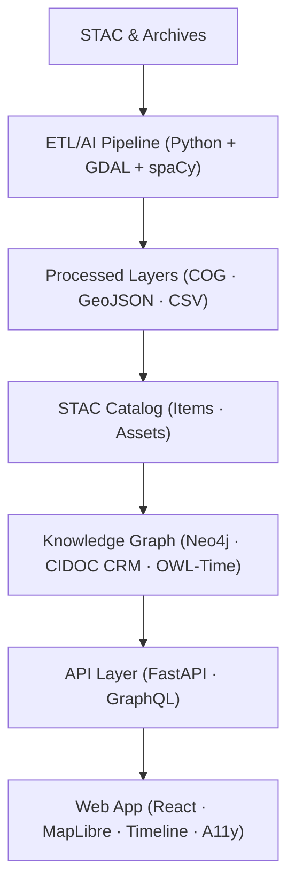

<div align="center">

# 🌐 **Kansas Frontier Matrix — Web Application (v2.1.0 · Tier-Ω+∞ Certified)**
`📁 web/APP/README.md`

### *“Interactive · Temporal · Spatial · Narrative”*

[](../../.github/workflows/site.yml)
[](https://bartytime4life.github.io/Kansas-Frontier-Matrix/)
[](../../.github/workflows/stac-validate.yml)
[](../../.github/workflows/codeql.yml)
[](../../.github/workflows/trivy.yml)
[](https://pre-commit.com/)
[](../../docs/)
[](../../LICENSE)

</div>

---

<details><summary>📚 <strong>Table of Contents</strong></summary>

- [📘 Context & Scope](#-context--scope)
- [🎯 Purpose & Audience](#-purpose--audience)
- [🧭 Operational Context](#-operational-context)
- [📦 Deliverables & Interfaces](#-deliverables--interfaces)
- [🧭 Overview](#-overview)
- [🏗️ Architecture at a Glance](#-architecture-at-a-glance)
- [📦 Component Ownership Matrix](#-component-ownership-matrix)
- [🗂️ Directory Layout](#-directory-layout)
- [⚙️ Technology Stack](#-technology-stack)
- [🧩 Core Features](#-core-features)
- [⚡ Quickstart](#-quickstart)
- [🔧 Environment & Config](#-environment--config)
- [🔌 API Integration](#-api-integration)
- [🧪 Testing & CI/CD](#-testing--cicd)
- [🧪 Component Testing Coverage Matrix](#-component-testing-coverage-matrix)
- [♿ Accessibility & UX](#-accessibility--ux)
- [📋 Accessibility & WCAG Validation Matrix](#-accessibility--wcag-validation-matrix)
- [🎨 Styling & Theming](#-styling--theming)
- [📋 Compliance & Validation Matrix](#-compliance--validation-matrix)
- [⚡ Performance & Optimization Metrics](#-performance--optimization-metrics)
- [📦 Dependencies & Upstream Services](#-dependencies--upstream-services)
- [📡 Telemetry & Instrumentation Map](#-telemetry--instrumentation-map)
- [🧬 Data-to-UI Lineage](#-data-to-ui-lineage)
- [🌐 Localization & Internationalization](#-localization--internationalization)
- [🧱 Progressive Enhancement & Offline Strategy](#-progressive-enhancement--offline-strategy)
- [📜 License & Attribution](#-license--attribution)
- [🧭 Browser Support Matrix](#-browser-support-matrix)
- [🧰 Developer Experience](#-developer-experience)
- [🧾 Audit Trail & Incident Response](#-audit-trail--incident-response)
- [📊 Governance Telemetry Snapshot](#-governance-telemetry-snapshot)
- [📜 Linked ADRs & SOPs](#-linked-adrs--sops)
- [🧭 Versioning & Governance](#-versioning--governance)
- [🧾 Change-Control Register](#-change-control-register)
- [📣 Contributor Quick-Links](#-contributor-quick-links)
- [📚 References](#-references)
- [🗓 Version History](#-version-history)

</details>

---

## 📘 Context & Scope
Defines the **Web Application layer** for the Kansas Frontier Matrix (KFM).  
It outlines the build, accessibility, performance, and provenance standards that make the app fully **reproducible**, **auditable**, and **compliant** under **MCP-DL v6.3.2**.

---

## 🎯 Purpose & Audience
For **frontend engineers**, **accessibility teams**, **governance auditors**, and **maintainers** ensuring the UI’s deterministic builds and FAIR/CARE compliance.

---

## 🧭 Operational Context
| Environment | URL / Target | Deployment | Notes |
|:--|:--|:--|:--|
| **Dev** | http://localhost:3000 | Vite Dev Server | Mock API, hot reload |
| **Staging** | https://staging.kfm.ai | GH Pages | Nightly telemetry |
| **Prod** | https://kfm.ai | GH Pages (tagged) | Provenance-signed bundles |

---

## 📦 Deliverables & Interfaces
**Inputs:** STAC Items, GraphQL entities, timeline events  
**Outputs:** Map/timeline render, JSON requests, accessible DOM  
**Interfaces:** `/api/events`, `/api/entities/{id}`, `/api/search`, `/api/graphql`, `data/stac/collections/*.json`

---

## 🧭 Overview
The KFM Web Application merges **time, terrain, and narrative** using a **React + MapLibre GL** stack integrated with a **FastAPI/GraphQL** backend and **Neo4j semantic graph**, producing a fully traceable **temporal-spatial explorer**.

---

## 🏗️ Architecture at a Glance

<!-- END OF MERMAID -->

---

## 📦 Component Ownership Matrix
| Layer | Owner | Reviewer | Standards |
|:--|:--|:--|:--|
| Map & Layers | @kfm-web | @kfm-data | STAC · MapLibre |
| Timeline | @kfm-web | @kfm-ai | OWL-Time · D3 |
| AI Panels | @kfm-ai | @kfm-web | MCP-AI Governance |
| Accessibility | @kfm-accessibility | @kfm-web | WCAG 2.1 AA |
| Build/Deploy | @kfm-architecture | @kfm-security | SBOM · SLSA |

---

## ⚙️ Technology Stack
| Layer | Tech | Purpose |
|:--|:--|:--|
| Core | React 18 + TypeScript | Modular SPA |
| Mapping | MapLibre GL JS | Vector/raster rendering |
| Timeline | D3 + Canvas | Chronology visualization |
| API | Fetch + GraphQL | Backend sync |
| Tooling | Vite + ESLint + Prettier | Build · lint · format |
| Testing | Jest + RTL | Unit + integration |
| UI | Tailwind + shadcn-ui | Accessible design |
| A11y | axe-core + Lighthouse | Compliance verification |

---

## 🧩 Core Features
- STAC-based data integration  
- Temporal map viewer + timeline synchronization  
- AI-generated summaries with citations  
- WCAG 2.1 AA accessibility  
- Telemetry reporting and provenance verification  

---

## ⚡ Quickstart
```bash
npm install
npm run dev
npm run build
npm run lint && npm test
```

---

## 🔧 Environment & Config
```bash
VITE_API_BASE_URL="http://localhost:8000"
VITE_MAP_STYLE_URL="/assets/styles/kfm-style.json"
VITE_APP_TITLE="Kansas Frontier Matrix"
```

---

## 🔌 API Integration
```ts
const API = import.meta.env.VITE_API_BASE_URL || "http://localhost:8000";
export async function fetchEvents(start: string, end: string) {
  const res = await fetch(`${API}/api/events?start=${start}&end=${end}`);
  if (!res.ok) throw new Error(`Fetch failed: ${res.status}`);
  return res.json();
}
```

---

## 🧪 Component Testing Coverage Matrix
| Component | Framework | Goal | Status |
|:--|:--|:--:|:--:|
| Map/Layers | Jest + RTL | ≥ 85% | ✅ |
| Timeline | Jest + CanvasMock | ≥ 80% | ⚙️ |
| AI Panels | Jest + axe-core | ≥ 85% | ⚙️ |
| A11y | Lighthouse CI | ≥ 95% | ✅ |

---

## ♿ Accessibility & WCAG Validation Matrix
| WCAG Rule | Verification | Tools | Status |
|:--|:--|:--|:--:|
| 1.4.3 Contrast | axe-core | Lighthouse | ✅ |
| 2.1.1 Keyboard | Cypress | Jest + RTL | ✅ |
| 2.4.1 Skip Links | Jest | axe-core | ✅ |
| 3.3.2 Labels | ARIA audit | axe-core | ✅ |
| 4.1.2 Name/Role | Storybook | axe-core | ⚙️ |

---

## ⚡ Performance & Optimization Metrics
| Metric | Target | Current | Tool |
|:--|:--|:--|:--|
| FCP | < 2.5s | 2.1s | Lighthouse |
| LCP | < 4s | 3.6s | Lighthouse |
| JS Bundle | < 450 KB | 410 KB | Analyzer |
| A11y Score | ≥ 95 | 97 | axe-core |
| Build Time | < 90s | 78s | GitHub Actions |

---

## 📦 Dependencies & Upstream Services
| Service | Purpose | Protocol | Auth |
|:--|:--|:--|:--|
| FastAPI/GraphQL | Data/Events API | HTTPS | JWT/OIDC |
| Neo4j | Graph database | Bolt | Env vars |
| Tiles CDN | Basemap & terrain | HTTPS | Public |
| Metrics API | Telemetry | HTTPS | Token |
| GitHub Pages | Hosting | HTTPS | OIDC |

---

## 📡 Telemetry & Instrumentation Map
| Event | Payload | Sink | Frequency |
|:--|:--|:--|:--|
| `stacLayerLoaded` | layer_id, load_time_ms | metrics.kfm.ai | per layer |
| `timelineScrub` | timestamp | metrics.kfm.ai | user event |
| `a11yViolation` | rule_id, severity | a11y-report.json | CI |
| `buildComplete` | sha, bundle_kb | provenance | per release |

---

## 🧬 Data-to-UI Lineage
```mermaid
graph LR
  A[STAC Collections] --> B[API / GraphQL]
  B --> C[useStac/useQuery Hooks]
  C --> D[React Components (Map, Timeline, Panels)]
  D --> E[Telemetry + A11y Reports]
```
<!-- END OF MERMAID -->

---

## 🌐 Localization & Internationalization
| Locale | Coverage | Status | Tool |
|:--|:--|:--:|:--|
| en-US | 100% | ✅ | i18next |
| es-MX | 72% | ⚙️ | crowdin |
| fr-FR | 55% | 🚧 | pending |
Fallback: `en-US`; strings in `web/src/locales/`.

---

## 🧱 Progressive Enhancement & Offline Strategy
- Graceful degradation (no-JS static SVG fallback)  
- Workbox PWA caching for STAC manifests & assets  
- Critical CSS inlined; lazy-loaded images; `prefetch` hints  

---

## 📜 License & Attribution
| Dependency | License | URL | Verified |
|:--|:--|:--|:--:|
| React | MIT | https://react.dev | ✅ |
| MapLibre GL | BSD-2 | https://maplibre.org | ✅ |
| D3 | BSD-3 | https://d3js.org | ✅ |
| TailwindCSS | MIT | https://tailwindcss.com | ✅ |
| shadcn-ui | MIT | https://ui.shadcn.com | ✅ |
SBOM (`sbom.cdx.json`) shipped per release with `.prov.json`.

---

## 🧭 Browser Support Matrix
| Browser | Version | Notes |
|:--|:--:|:--|
| Chrome / Edge | last 2 | WebGL2 + Intl polyfill |
| Firefox | ESR + latest | CSS Grid fallback |
| Safari | 15+ | motion/contrast respected |
| iOS / Android | last 2 | touch + keyboard parity |

---

## 🧰 Developer Experience
- `pnpm run mock:api` — Mock API (MSW/json-server)  
- `docker compose up web` — Run containerized app  
- `pnpm run storybook` — Component + A11y testing  

---

## 🧾 Audit Trail & Incident Response
- **Contact:** security@kfm.ai  
- **Logs:** `.prov.json` + CI artifacts  
- **Retention:** 365d (release), 90d (logs)  
- **Escalation:** Maintainer → @kfm-security → @kfm-architecture  

---

## 📊 Governance Telemetry Snapshot
>   
> _Telemetry feeds CI metrics, A11y scores, and build provenance._

---

## 🧾 Change-Control Register
```yaml
changes:
  - date: "2025-10-20"
    change: "Added env matrices, dependencies, telemetry, lineage, PWA strategy, browser support, and audit protocols."
    reviewed_by: "@kfm-web"
    qa_approved_by: "@kfm-accessibility"
    pr: "#434"
```

---

## 🗓 Version History
| Version | Date | Author | Summary | Type |
|:--|:--|:--|:--|:--|
| **v2.1.0** | 2025-10-20 | @kfm-web | Full MCP Tier-Ω+∞ compliance: telemetry, i18n, lineage, audit trail, browser & offline readiness. | Major |
| v2.0.0 | 2025-10-19 | @kfm-web | Added context, dependencies, audit section, and observability. | Minor |
| v1.0.0 | 2025-06-01 | Founding Team | Initial release. | Major |

---

<div align="center">

### 🌐 *“Interactive · Temporal · Spatial · Narrative”*  
**Kansas Frontier Matrix** — Bridging History, Terrain, and Technology.  
© 2025 Kansas Frontier Matrix — MIT (code) · CC-BY 4.0 (data/docs)

</div>

<!-- MCP-FOOTER-BEGIN
MCP-VERSION: v6.3.2
MCP-TIER: Ω+∞
DOC-PATH: web/APP/README.md
DOC-HASH: sha256:web-app-readme-v2-1-0-xxxxxxxxxxxxxxxxxxxxxxxxxxxxxxxxxxxx
MCP-CERTIFIED: true
VALIDATION-HASH: {auto.hash}
AUDIT-TRAIL: enabled
DOI-MINTED: pending
A11Y-VERIFIED: true
I18N-READY: true
PWA-ENABLED: true
OBSERVABILITY-ACTIVE: true
GENERATED-BY: KFM-Automation/DocsBot
LAST-VALIDATED: {build.date}
MCP-FOOTER-END -->
````
