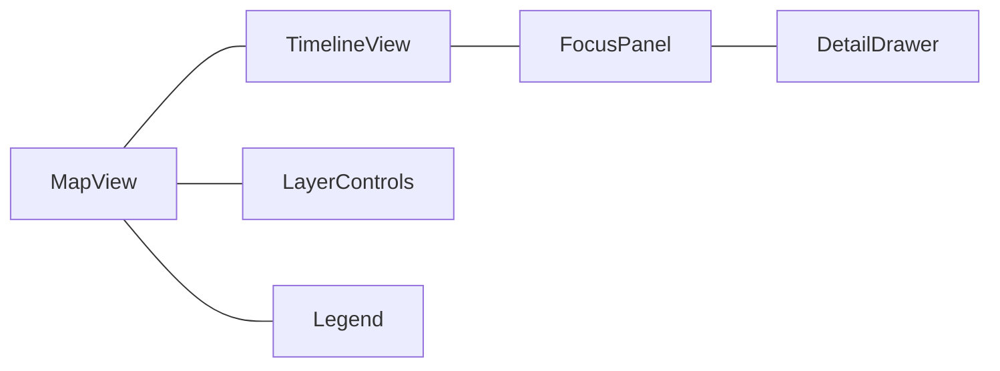
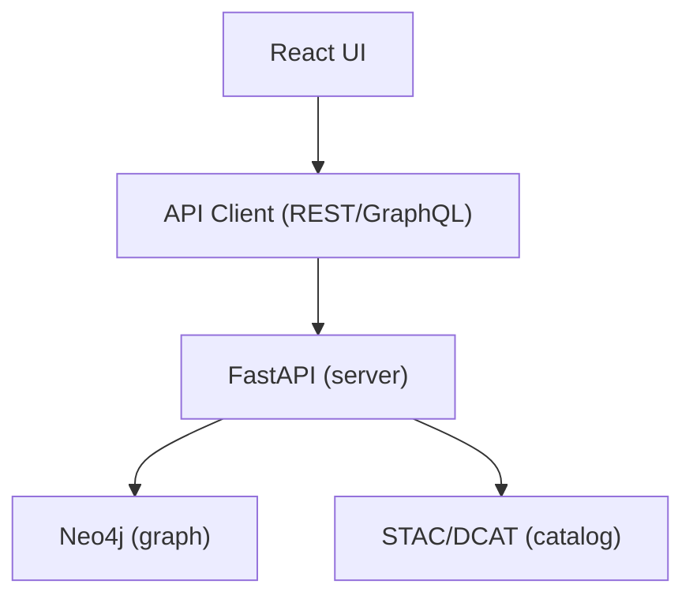

<div align="center">

# 🌐 **Kansas Frontier Matrix — Web Application Architecture**
`web/ARCHITECTURE.md`

**Purpose:** Define the FAIR+CARE-aligned technical architecture of the KFM web application — a modular, accessible, and AI-aware frontend for exploring historical, geospatial, and environmental data. This document specifies stack, module boundaries, data/telemetry contracts, governance integration, and CI/CD touchpoints for the web tier.

[](../docs/README.md)
[](../LICENSE)
[](../docs/standards/faircare.md)
[]()

</div>

---

## 📘 Overview

The **KFM Web Application** is the user-facing layer that renders the **timeline + map** experience and **Focus Mode** insights over a **Neo4j-backed knowledge graph** served via **FastAPI/GraphQL**.  
The web tier is **standards-first** (STAC 1.0.0, DCAT 3.0, JSON-LD, WCAG 2.1 AA) and **MCP-governed** with telemetry and governance ledgers for every build and release.

**Design goals**
- **Accessibility by default:** WCAG 2.1 AA, semantic HTML, ARIA, keyboard ops.  
- **Ethical AI:** Explainable Focus Mode, CARE safeguards, opt-out surfaces.  
- **Interoperability:** STAC/DCAT catalogs, JSON-LD semantics, stable APIs.  
- **Reproducibility:** Pinned toolchain, SBOM, deterministic builds, telemetry.

---

## 🗂️ Directory Layout

```
web/
├── README.md                          # Web tier index
├── ARCHITECTURE.md                    # This file
│
├── public/                            # Static assets (no secrets)
│   ├── images/                        # PNG/SVG w/ alt text in docs
│   ├── icons/                         # App/feature icons (a11y-ready)
│   └── manifest.json                  # PWA metadata (name, theme, icons)
│
├── src/                               # React + TypeScript application
│   ├── components/                    # Presentational & a11y components
│   │   ├── MapView/                   # MapLibre map + layers
│   │   ├── TimelineView/              # Time navigation + density bands
│   │   ├── FocusPanel/                # AI summaries + related links
│   │   ├── LayerControls/             # STAC/DCAT layer toggles
│   │   └── Accessibility/             # Skip links, focus traps, helpers
│   ├── pages/                         # Route-level screens (Home, Explore)
│   ├── hooks/                         # useTelemetry, useGovernance, useFocus
│   ├── context/                       # App providers (Theme, Focus, Auth)
│   ├── services/                      # API clients (REST/GraphQL, STAC/DCAT)
│   ├── utils/                         # Formatters, intl, schema guards
│   └── styles/                        # Tailwind config, tokens, variables
│
├── package.json                       # Pinned deps + scripts
├── vite.config.ts                     # Vite build config (or next.config.js)
└── telemetry.json                     # Optional local web telemetry cache
```

---

## 🧩 Frontend Stack & Responsibilities

| Layer | Technology | Responsibility |
|------|------------|----------------|
| **Framework** | React 18 + TypeScript | Component model, state, routing |
| **Styling** | Tailwind CSS | Responsive, tokenized, accessible UI |
| **Map** | MapLibre GL JS | Vector map rendering, tiled COG overlays |
| **Charts** | D3 / Recharts | Timeline density, histograms, KPI charts |
| **State** | React Context + lightweight store | Focus Mode, theme, a11y mode |
| **Data** | STAC/DCAT (HTTP), GraphQL | Catalog discovery + entity details |
| **AI** | Focus Mode (backend inference) | Summaries, relatedness, explainability |
| **A11y** | Semantics + ARIA + Headless patterns | WCAG 2.1 AA conformance |
| **Telemetry** | Web Vitals + custom hooks | Perf, a11y, and ethics metrics export |

---

## 🧱 Component Boundaries



- **MapView:** Base map, layer management, selections, keyboard map ops  
- **TimelineView:** Zoomable time scale, focus markers, range brushing  
- **FocusPanel:** AI insights, related people/places/events, provenance chips  
- **LayerControls:** STAC/DCAT layer toggles, opacity, style presets  
- **DetailDrawer/Legend:** Contextual metadata and symbology

> **Mermaid note:** node labels are quoted; single diagram per section per alignment rules.

---

## 🧠 Focus Mode (Ethical AI)

**Objective:** contextually center on an entity and **explain** the connections.

| Aspect | Implementation |
|-------|-----------------|
| API | `GET /api/focus/{entity_id}` → summary + subgraph |
| Model | `focus_transformer_v1` (server-side); UI renders outputs only |
| Explainability | SHAP/LIME views linkable from FocusPanel |
| CARE Safeguards | Suppress or gate sensitive content; show consent/citation |
| Telemetry | `focus` events → `focus-telemetry.json` with a11y & ethics flags |

---

## 🧩 Data Contracts & Catalogs

| Contract | Purpose | Source |
|---------|---------|--------|
| **STAC Items/Collections** | Geospatial layers, temporal bounds | `data/stac/**` |
| **DCAT 3.0** | Dataset catalog for search & metadata | STAC↔DCAT bridge |
| **Web → API DTOs** | Strongly typed responses for UI | `src/services/*` |
| **A11y Contract** | Route-level a11y test gates | `web_vitals_audit.yml` |

**Validation:** CI enforces schema/contract compliance before deploy.

---

## ⚙️ Build, Env & Security

| Area | Standard | Notes |
|------|----------|------|
| Build | Vite (or Next) | Deterministic, pinned deps |
| Images | Non-root base | Fail CI on CRITICAL (Trivy) |
| Headers | CSP / CORP / COEP | Enforced at hosting layer |
| Secrets | None client-side | All keys server-side only |
| SBOM | SPDX for web deps | Referenced in release manifest |

---

## 🔁 CI/CD (Web Tier) — Workflow → Artifact Mapping

| Workflow | Enforces | Primary Artifacts |
|----------|----------|-------------------|
| `docs-lint.yml` | Markdown/YAML/JSON style + front-matter | `reports/self-validation/docs/lint_summary.json` |
| `build-and-deploy.yml` | Build + deploy web app | `docs/reports/telemetry/build_metrics.json` |
| `telemetry-export.yml` | Merge metrics from all jobs | `releases/v9.7.0/focus-telemetry.json` |
| `codeql.yml` / `trivy.yml` | Static/code & CVE scans | `reports/security/*` |

---

## ♿ Accessibility & Inclusive Design

**Core rules**
- Keyboard navigation: tab order, focus rings, skip links.  
- Contrast ≥ **4.5:1** (text), **3:1** (large).  
- Alt text for all non-text assets; ARIA labels for landmarks and controls.  
- Reduced motion option; content reflow for narrow viewports.  
- Lighthouse/axe checks run per release (`accessibility_scan.yml`).

**Docs:** see `../docs/standards/ui_accessibility.md`.

---

## 📊 Telemetry & Governance

- **Web Vitals** and custom **a11y/ethics** metrics exported via hooks.  
- Build metrics recorded in `docs/reports/telemetry/build_metrics.json`.  
- Release snapshot aggregates to `../releases/v9.7.0/focus-telemetry.json`.  
- Governance events (e.g., feature flags for sensitive content) are ledgered under `docs/reports/audit/`.

**Example Telemetry Snippet**
```json
{
  "component": "MapView",
  "web_vitals": { "cls": 0.03, "lcp_ms": 1340, "fid_ms": 8 },
  "a11y": { "contrast_ok": true, "keyboard_ok": true },
  "ethics": { "care_flag": false },
  "timestamp": "2025-11-05T18:11:03Z"
}
```

---

## 🧭 Integration with Backend



- UI fetches **entity details** (GraphQL) and **layers** (STAC/DCAT).  
- Focus Mode requests are server-executed; only summarized outputs return to UI.  
- Provenance chips link to ledger entries and STAC/DCAT metadata.

---

## 🕰️ Version History

| Version | Date | Author | Summary |
|----------|------|---------|----------|
| v9.7.0 | 2025-11-05 | KFM Core Team | Alignment to MCP v6.3; added workflow→artifact map, a11y/ethics telemetry, contracts table. |
| v9.6.0 | 2025-11-03 | KFM Core Team | Introduced sustainability & a11y telemetry; Focus Mode guardrails. |
| v9.5.0 | 2025-11-02 | KFM Core Team | Added Focus Mode explainability and governance middleware. |
| v9.3.2 | 2025-10-28 | KFM Core Team | Established baseline FAIR+CARE web architecture. |

---

<div align="center">

**© 2025 Kansas Frontier Matrix — MIT / CC-BY 4.0**  
Maintained under **Master Coder Protocol v6.3** · FAIR+CARE Certified · Diamond⁹ Ω / Crown∞Ω Ultimate Certified  
[Back to Documentation Index](../docs/README.md) · [Governance Charter](../docs/standards/governance/ROOT-GOVERNANCE.md)

</div>