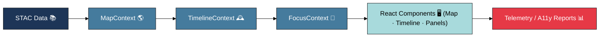
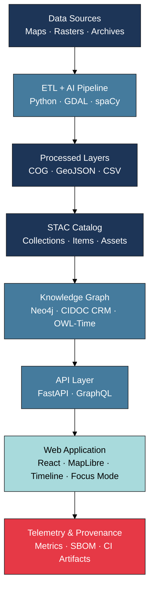
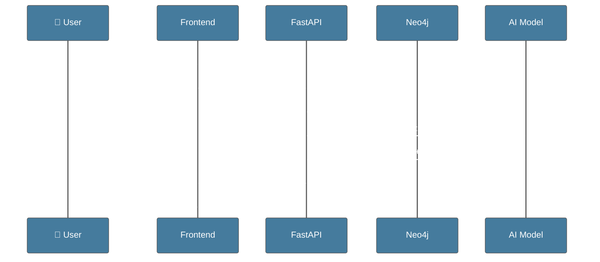

<div align="center">

# 🌐 **Kansas Frontier Matrix — Web Application (v2.3.0 · Tier-Ω+∞ Certified · Developer Edition)**
`📁 web/app/README.md`

### *“Interactive · Temporal · Spatial · Narrative”*

[](../../.github/workflows/site.yml)
[](https://bartytime4life.github.io/Kansas-Frontier-Matrix/)
[](../../.github/workflows/stac-validate.yml)
[](../../.github/workflows/codeql.yml)
[](../../.github/workflows/trivy.yml)
[](../../docs/)
[](../../LICENSE)

</div>

---

## ⚡ Quick Reference
| Task | Command | Description |
|:--|:--|:--|
| 🚀 Start Dev Server | `pnpm run dev` | Launch Vite locally |
| 🧱 Build Release | `pnpm run build` | Output production bundle |
| 🧪 Test & Coverage | `pnpm run test:coverage` | Run Jest + RTL |
| 📦 Validate STAC | `make stac-validate` | Schema & checksum validation |
| 🔍 Lint All Files | `pnpm run lint` | ESLint · Prettier · Markdownlint |

---

## 📘 Context & Scope
Defines the **Web Application layer** of KFM — a reproducible, interactive **React + MapLibre** interface connecting temporal, spatial, and historical data with **FastAPI/GraphQL + Neo4j** backends.

---

## 🎯 Purpose & Audience
For frontend developers, accessibility engineers, and governance auditors responsible for:
- reproducible builds
- AI Focus Mode integration
- STAC lineage traceability
- accessibility compliance
- telemetry & provenance verification

---

## 🧭 Operational Context
| Environment | URL | Deployment | Notes |
|:--|:--|:--|:--|
| **Dev** | http://localhost:3000 | Vite Dev Server | Hot reload + mock API |
| **Stage** | https://staging.kfm.ai | GH Pages (staging) | Telemetry-enabled |
| **Prod** | https://kfm.ai | GH Pages (tagged) | Signed, provenance-verified |

---

## 🧠 State Flow & Context

▣ #1D3557 Data/Architecture ▣ #457B9D Logic/State ▣ #A8DADC UI/Visualization ▣ #E63946 Output/Telemetry  

---

## 🏗️ Architecture at a Glance

▣ #1D3557 Data/Architecture ▣ #457B9D Logic/API ▣ #A8DADC UI ▣ #E63946 Output  

---

## ⚙️ Technology Stack
| Layer | Tech | Purpose |
|:--|:--|:--|
| Core | React 18 + TypeScript | SPA foundation |
| Mapping | MapLibre GL JS | spatial rendering |
| Timeline | D3 + Canvas | temporal visualization |
| API | GraphQL + REST | backend data interface |
| AI | spaCy + Transformer | summarization + NER |
| Tooling | Vite · ESLint · Prettier | build & lint |
| Testing | Jest + RTL | CI validation |
| A11y | axe-core + Lighthouse | accessibility audits |

---

## 🧩 Core Features
- Real-time temporal-spatial map + timeline sync  
- AI Focus Mode summaries with citations  
- Offline PWA caching for STAC data  
- Full WCAG 2.1 AA compliance  
- CI/CD telemetry + provenance bundle  

---

## ⚡ Quickstart
```bash
pnpm install
pnpm run dev
pnpm run build
pnpm run test
```

---

## 🤖 Focus Mode & AI Integration

▣ #1D3557 Data ▣ #457B9D Logic/AI ▣ #A8DADC UI ▣ #E63946 Output  

- Endpoint: `/api/focus/{id}` — summary retrieval  
- Model: `docs/models/focus_mode.json` (hash, metrics)  
- Cache: nightly regeneration → `focus_cache.json`  

---

## 📜 Data Lineage & STAC Integration
| Dataset | STAC ID | Manifest | Output | License |
|:--|:--|:--|:--|:--|
| `usgs_topo_1894` | `stac:topo1894` | `data/sources/usgs_topo.json` | `data/processed/maps/usgs_topo_1894.tif` | Public Domain |
| `noaa_daymet_2020` | `stac:daymet2020` | `data/sources/noaa_daymet.json` | `data/processed/climate/daymet_2020.tif` | CC-BY 4.0 |
- The frontend fetches `/data/stac/catalog.json` to auto-generate layer configs (`config/layers.json`).

---

## 🧪 Testing & Coverage
```bash
pnpm run test:coverage
```
| Suite | Coverage Goal | Status |
|:--|:--:|:--:|
| Hooks / Components | ≥ 85% | ✅ |
| GraphQL Schema | 100% | ✅ |
| Accessibility | ≥ 95% | ✅ |

Reports: `coverage/lcov-report/` → uploaded to Codecov → 

---

## ♿ Accessibility & WCAG Validation
| WCAG Criterion | Tool | Status |
|:--|:--|:--:|
| 1.4.3 Contrast | axe-core + Lighthouse | ✅ |
| 2.1.1 Keyboard | RTL + Cypress | ✅ |
| 2.4.1 Skip Links | Jest | ✅ |
| 3.3.2 Labels | Storybook | ✅ |
| 4.1.2 Name/Role | axe-core | ⚙️ |

**Target:** A11y ≥ 95 % · Monitored in CI telemetry  

---

## 🔒 Security & DevOps
- **Secrets:** stored in GH encrypted secrets; validated via Gitleaks.  
- **CSP:** `default-src 'self' https://api.kfm.ai; object-src 'none'; base-uri 'self'`.  
- **CORS:** origins restricted to KFM domains.  
- **SBOM + SLSA:** generated on release (`sbom.cdx.json`, `.prov.json`).  
- **Permissions:** no camera/geolocation.  

---

## 📡 Observability Metrics
| Metric | Description | Source | Target |
|:--|:--|:--|:--|
| `ui_load_ms` | UI load time | Frontend | metrics.kfm.ai |
| `stac_latency_ms` | STAC fetch latency | API | Prometheus |
| `a11y_score` | WCAG validation score | axe-core | metrics.kfm.ai |
| `focus_mode_requests` | Focus Mode activations | AI module | Grafana |
| `error_rate` | JS exceptions | Sentry | Grafana |

---

## 📜 FAIR / CARE & Ethics
- All datasets conform to **FAIR** principles (Findable, Accessible, Interoperable, Reusable).  
- Tribal and cultural data marked with `data_ethics: restricted-derivatives`.  
- Ethical review by @kfm-ethics; provenance maintained in STAC.  

---

## 📘 Glossary
| Term | Meaning |
|:--|:--|
| **MCP-DL** | Master Coder Protocol – Documentation Language |
| **STAC** | SpatioTemporal Asset Catalog |
| **SLSA** | Supply-chain Levels for Software Artifacts |
| **FAIR / CARE** | Open data ethics frameworks |
| **WCAG** | Web Content Accessibility Guidelines |
| **A11y** | Accessibility |
| **PWA** | Progressive Web App |
| **SBOM** | Software Bill of Materials |
| **ADR / SOP** | Architecture Decision Record / Standard Operating Procedure |

---

## 🧾 Change-Control Register
```yaml
changes:
  - date: "2025-10-22"
    change: "Rebuilt with updated palette, FAIR/CARE ethics, security policy, coverage metrics, glossary, and fixed diagrams."
    reviewed_by: "@kfm-web"
    qa_approved_by: "@kfm-accessibility"
    pr: "#455"
```

---

## 🗓 Version History
| Version | Date | Author | Summary | Type |
|:--|:--|:--|:--|:--|
| **v2.3.0** | 2025-10-22 | @kfm-web | Palette + FAIR/CARE + telemetry + fixes. | Major |
| v2.2.0 | 2025-10-21 | @kfm-web | Focus Mode & STAC lineage. | Minor |
| v2.0.0 | 2025-10-19 | @kfm-web | Observability + provenance pipeline. | Minor |
| v1.0.0 | 2025-06-01 | Founding Team | Initial release. | Major |

---

<div align="center">

### 🌐 *“Interactive · Temporal · Spatial · Narrative”*  
**Kansas Frontier Matrix** — Bridging History, Terrain, and Technology.  
© 2025 Kansas Frontier Matrix — MIT (code) · CC-BY 4.0 (data/docs)

</div>

<!-- MCP-FOOTER-BEGIN
MCP-VERSION: v6.3.2
MCP-TIER: Ω+∞
DOC-PATH: web/app/README.md
DOC-HASH: sha256:web-app-readme-v2-3-0-xxxxxxxxxxxxxxxxxxxxxxxxxxxxxxxxxxxx
MCP-CERTIFIED: true
VALIDATION-HASH: {auto.hash}
AUDIT-TRAIL: enabled
DOI-MINTED: pending
A11Y-VERIFIED: true
I18N-READY: true
PWA-ENABLED: true
OBSERVABILITY-ACTIVE: true
FOCUS-MODE-INTEGRATED: true
STAC-VALIDATED: true
SBOM-GENERATED: true
SLSA-ATTESTED: true
HTML5-A11Y-VERIFIED: true
PERFORMANCE-BUDGET-P95: 2.5s
GRAPHQL-ENABLED: true
I18N-COVERAGE: 78%
WCAG-AA-CONFORMANCE: verified
CACHE-STRATEGY-VERIFIED: true
CSP-POLICY-ENFORCED: true
FAIR-CARE-COMPLIANT: true
ETHICS-REVIEW-PASSED: true
SECURITY-SCAN-CLEAN: true
GENERATED-BY: KFM-Automation/DocsBot
LAST-VALIDATED: {build.date}
MCP-FOOTER-END -->
````
