<div align="center">

# 🏗️ Kansas Frontier Matrix — **Web Application Architecture**
`web/ARCHITECTURE.md`

**Purpose:** Describes the technical design, modular architecture, and integration points for the Kansas Frontier Matrix web interface.  
Defines frontend–backend communication layers, component hierarchy, and governance integration per **MCP-DL v6.3** and **FAIR+CARE** standards.

[](../.github/workflows/site.yml)
[](https://www.w3.org/WAI/WCAG21/quickref/)
[](../LICENSE)
[](../docs/standards/faircare-validation.md)
[](../docs/architecture/repo-focus.md)

</div>

---

## 📚 Overview

The **Kansas Frontier Matrix Web Application** is a modular, open-source React + MapLibre frontend.  
It provides **temporal, spatial, and semantic navigation** through Kansas’s historical, cultural, and environmental datasets.  
The web layer connects to the backend API (FastAPI + Neo4j) and integrates directly with the AI **Focus Mode** engine for contextual insights.

**Architectural Principles:**
- Documentation-first development (MCP-DL)  
- FAIR+CARE-aligned transparency and ethics  
- Accessibility-first design (WCAG 2.1 AA)  
- Modular, scalable, and reproducible build system  
- Strong provenance integration between UI and data governance

---

## 🧩 System Architecture Diagram

```mermaid
flowchart TD
A[User Interface · React + MapLibre] --> B[State Management · Redux Toolkit]
B --> C[Data Services · GraphQL + REST APIs]
C --> D[Backend · FastAPI + Neo4j Graph Database]
D --> E[AI/ML Focus Mode · Python Transformers]
E --> F[STAC & FAIR Metadata · JSON-LD / DCAT / CIDOC CRM]
F --> G[Governance Ledger + Telemetry]
G --> H[GitHub Pages Deployment + Focus Telemetry Sync]
```



**End-to-End Flow:**
1. UI components trigger API calls to retrieve geospatial, temporal, and graph-based data.  
2. Responses include FAIR metadata and governance identifiers.  
3. Focus Mode AI summaries render dynamically, with ethical disclaimers and provenance visible to users.  
4. Logs and telemetry feed back into the FAIR+CARE ledger for accountability.

---

## 🧠 Core Modules

| Module | Directory | Purpose |
|---------|------------|----------|
| **Map Module** | `src/features/map/` | Renders MapLibre layers, STAC tiles, and geospatial overlays. |
| **Timeline Module** | `src/features/timeline/` | Handles time slider interactions and temporal queries. |
| **Focus Mode Module** | `src/features/focus/` | Integrates AI summaries, entity linkage, and explainability. |
| **API / GraphQL Client** | `src/api/` | Typed clients for REST/GraphQL (FastAPI ↔ Neo4j) and request hooks. |
| **Global Store** | `src/store/` | Redux-based global state and event synchronization. |
| **UI Components** | `src/components/` | Reusable and accessible interface elements. |
| **Styling / Design System** | `src/styles/` | TailwindCSS and ShadCN UI for consistent theming. |
| **Telemetry Layer** | `src/utils/telemetry.js` | Captures user interactions and focus analytics for governance. |

> **Fix:** Standardized the API client path to `src/api/` across this document.

---

## ⚙️ Component Hierarchy

```plaintext
App.jsx
├── Layout/
│   ├── Header.jsx
│   ├── Sidebar.jsx
│   ├── Footer.jsx
│   └── ThemeProvider.jsx
│
├── Features/
│   ├── Map/
│   │   ├── MapView.jsx
│   │   ├── LayerControls.jsx
│   │   └── LegendPanel.jsx
│   ├── Timeline/
│   │   ├── TimelineView.jsx
│   │   ├── TimeSlider.jsx
│   │   └── EventMarkers.jsx
│   ├── Focus/
│   │   ├── FocusPanel.jsx
│   │   ├── EntitySummary.jsx
│   │   └── ExplainabilityWidget.jsx
│
├── Components/
│   ├── Button.jsx
│   ├── Modal.jsx
│   ├── Tooltip.jsx
│   └── Accordion.jsx
│
└── Hooks/
    ├── useMapData.js
    ├── useTimeline.js
    ├── useFocusMode.js
    └── useTelemetry.js
```

---

## 🔗 Backend API Integration

The frontend communicates with backend APIs defined in **FastAPI**.

| Endpoint | Description | Response |
|-----------|--------------|-----------|
| `/api/stac/items` | Returns available STAC items with metadata. | JSON (GeoJSON / STAC) |
| `/api/focus/{entity_id}` | Returns entity-linked AI summaries and relationships. | JSON-LD + provenance |
| `/api/events?start=1850&end=1900` | Retrieves historical events for timeline. | Array of event objects |
| `/api/graph/query` | Runs Neo4j graph queries via GraphQL. | GraphQL JSON response |

**Client Location:** Query helpers, schema types, and hooks live in `src/api/` (e.g., `src/api/client.ts`, `src/api/hooks.ts`).

---

## 🧩 Data & Governance Integration

### FAIR+CARE Metadata Pipeline

```mermaid
flowchart TD
A[Frontend Data Request] --> B[API Response w/ STAC Metadata]
B --> C[Provenance Layer (Checksum + Source Attribution)]
C --> D[Focus Mode AI Context + Ethical Tags]
D --> E[Telemetry Log → Governance Ledger]
E --> F[FAIR+CARE Dashboard Updates]
```

**Data Provenance Fields:**
- `source` — Data origin (organization, API, file)  
- `checksum` — Hash of dataset or tile  
- `license` — Data usage license  
- `governance_ref` — Reference to ethics approval or FAIR+CARE review  
- `confidence` — AI reasoning confidence value  
- `timestamp` — Processing or inference time  

---

## 🧱 Build & Deployment Workflow

Frontend deployment is handled automatically via **GitHub Actions** → `.github/workflows/site.yml`.

**Process Steps:**
1. Lint & pre-commit validation (Markdown, JS, accessibility).  
2. Run frontend build (`npm run build`) with Vite.  
3. Validate generated assets against FAIR+CARE accessibility standards.  
4. Deploy `/dist` to **GitHub Pages** (default) or **Netlify** (optional).  
5. Push telemetry results to `releases/v9.3.2/focus-telemetry.json`.  

**Artifacts:**
- `/dist` → Production build  
- `/releases/v9.3.2/manifest.zip` → Version metadata  
- `/reports/ui-accessibility.json` → Accessibility validation results  

---

## 🧠 Focus Mode Architecture

```mermaid
flowchart LR
A[User Selects Entity on Map/Timeline] --> B[API Query to Neo4j Graph]
B --> C[AI Summarization Engine (Transformers)]
C --> D[Explanation Layer (SHAP/LIME)]
D --> E[UI Rendering: FocusPanel + Summary + Provenance Links]
E --> F[Telemetry + Governance Ledger Update]
```

Focus Mode operates as a **contextual reasoning engine**, displaying:
- Historical context via Neo4j queries  
- Environmental overlays via MapLibre  
- AI summaries with confidence and ethical metadata  
- Explainability visualizations for user transparency  

---

## ♿ Accessibility & UI Governance

Accessibility is enforced through:
- WCAG 2.1 AA standards  
- ARIA-compliant navigation  
- Keyboard focus states and skip-links  
- Contrast-checked color tokens in Tailwind theme  

Governance alignment:
- Ethical use statements displayed in Focus Mode panels  
- “Why this data?” metadata button for each dataset  
- Public provenance visualizations for transparency  

---

## 🛡️ Security & Validation

| Layer | Mechanism | Tool |
|--------|------------|------|
| **Dependency Scanning** | Automated CVE checks | Trivy |
| **Code Quality** | ESLint, Prettier | Pre-commit hooks |
| **Accessibility Testing** | Pa11y / Axe | CI validation |
| **Governance Logging** | Checksum + JSON-LD provenance | FAIR+CARE pipeline |

---

## 🧾 Version History

| Version | Date       | Author             | Summary |
|----------|------------|--------------------|----------|
| v9.3.2   | 2025-10-28 | @kfm-architecture  | Standardized API client path, clarified build outputs, and aligned deployment notes. |
| v9.3.1   | 2025-10-27 | @bartytime4life    | Integrated accessibility and provenance governance schema. |
| v9.3.0   | 2025-10-26 | @kfm-ui-lab        | Established modular React architecture and CI/CD pipeline linkages. |

---

<div align="center">

**Kansas Frontier Matrix** · *Web Architecture × Semantic Visualization × FAIR+CARE Integrity*  
[🔗 Repository](https://github.com/bartytime4life/Kansas-Frontier-Matrix) • [🧭 Docs Portal](../docs/) • [⚖️ Governance Ledger](../docs/standards/governance/)

</div>
