# 🌐 Kansas Frontier Matrix — **Web Application**

### *“Interactive · Temporal · Spatial · Narrative”*

[](../../.github/workflows/site.yml)  
[](https://bartytime4life.github.io/Kansas-Frontier-Matrix/)  
[](../../.github/workflows/stac-validate.yml)  
[](../../.github/workflows/codeql.yml)  
[](../../.github/workflows/trivy.yml)  
[](https://pre-commit.com/)  
[](../../docs/)  
[%20%7C%20CC--BY%204.0%20(docs)-blue)](../../LICENSE)

---

```yaml
---
title: "Kansas Frontier Matrix — Web Application"
version: "v1.8.0"
last_updated: "2025-10-14"
authors: ["KFM Web Team"]
status: "Stable"
maturity: "Production"
tags: ["web","react","vite","typescript","maplibre","timeline","stac","ai","mcp"]
license: "MIT (code) | CC-BY 4.0 (docs)"
semantic_alignment:
  - CIDOC CRM
  - OWL-Time
  - DCAT 2.0
  - STAC 1.0
---
````

---

## 📚 Table of Contents

* [Overview](#🧭-overview)
* [Architecture at a Glance](#🏗️-architecture-at-a-glance)
* [Directory Layout](#🗂️-directory-layout)
* [Quickstart](#⚡-quickstart)
* [Core Components](#🧩-core-components)
* [Data Standards](#🗺️-data-standards)
* [Configuration](#⚙️-configuration)
* [Accessibility](#♿-accessibility)
* [Security](#🛡️-security)
* [Performance](#⚡️-performance)
* [Developer Reference](#🧪-developer-reference)
* [Troubleshooting](#🧰-troubleshooting)
* [References](#📚-references)

---

## 🧭 Overview

The **Kansas Frontier Matrix Web Application** is the interactive exploration layer of the KFM ecosystem — a **React + MapLibre GL** single-page experience that unites **time, terrain, and story**.
It visualizes treaties, trails, hydrology, climate, and cultural data linked to a **FastAPI + Neo4j** semantic backend built on **CIDOC CRM** and **OWL-Time**, merging spatial and temporal narratives into an intuitive map-timeline interface.

---

## 🏗️ Architecture at a Glance

```mermaid
flowchart TD
  A["Sources<br/>maps · rasters · vectors · text archives"]
    --> B["ETL Pipeline<br/>Makefile · GDAL · Checksums"]
  B --> C["Processed Layers<br/>COG · GeoJSON · CSV"]
  B --> I["AI/ML Enrichment<br/>NER · OCR · Geocoding · Summaries"]
  C --> D["STAC Catalog<br/>Collections · Items · Assets"]
  D --> H["Knowledge Graph<br/>Neo4j · CIDOC CRM · OWL-Time"]
  I --> H
  D --> J["API Layer<br/>FastAPI · GraphQL · REST"]
  H --> J
  J --> F["Web Frontend (React + MapLibre)<br/>Map · Timeline · AI Panels"]
%% END OF MERMAID
```



---

## 🗂️ Directory Layout

```text
web/
├─ src/
│   ├─ components/   # TimelineView · MapView · LayerControls · DetailPanel · SearchBar · AIAssistant
│   ├─ hooks/        # useMap · useTimeline · useStac · useSearch
│   ├─ context/      # Global state (timeline window, layer toggles)
│   ├─ utils/        # API client · formatters · geometry helpers
│   ├─ styles/       # Tailwind / SCSS tokens
│   └─ types/        # Shared TypeScript interfaces
├─ public/           # Static assets (icons, manifest)
├─ config/           # Auto-generated (layers.json, app.config.json)
├─ package.json      # Node project metadata
├─ vite.config.ts    # Vite build configuration
└─ README.md         # This file
```

---

## ⚡ Quickstart

### Prerequisites

* Node.js **18+**
* Backend API running → [`../docs/sop.md`](../docs/sop.md)

### Environment

```bash
VITE_API_BASE_URL=http://localhost:8000
VITE_MAP_STYLE_URL=https://basemaps.cartocdn.com/gl/positron-gl-style/style.json
VITE_APP_TITLE="Kansas Frontier Matrix"
```

### Setup

```bash
cd web
npm install
npm run dev
npm run build
npm run preview
```

---

## 🧩 Core Components

| Component         | Purpose                                                                         |
| :---------------- | :------------------------------------------------------------------------------ |
| **TimelineView**  | GPU-accelerated Canvas timeline (zoom/pan/filter → emits time window)           |
| **MapView**       | MapLibre GL map; renders GeoJSON & COG layers; integrates with timeline filters |
| **LayerControls** | Toggles, legends, and opacity controls driven by STAC metadata                  |
| **DetailPanel**   | Displays entity dossiers, AI summaries, and linked citations                    |
| **SearchBar**     | Graph search autocomplete → flyTo & highlight entities                          |
| **AIAssistant**   | Conversational Q&A with contextual map/timeline responses                       |

---

## 🗺️ Data Standards

* **GeoJSON** — vector features
* **COG (Cloud-Optimized GeoTIFF)** — raster overlays
* **STAC Catalog** — standardized metadata for spatial-temporal assets
* **CIDOC CRM + OWL-Time** — semantic ontology for historical events, places, and intervals

---

## ⚙️ Configuration

Example layer entry (`config/layers.json`):

```json
{
  "id": "usgs_topo_larned_1894",
  "label": "USGS Topographic Map — Larned (1894)",
  "type": "raster-cog",
  "source": { "url": "/tiles/usgs_topo_larned_1894.tif", "minzoom": 0, "maxzoom": 14 },
  "time": { "start": "1894-01-01", "end": "1894-12-31" },
  "legend": { "category": "Historic Topographic Maps" },
  "visible": false,
  "opacity": 0.8
}
```

Vectors use `"type": "vector-geojson"` with `"source": {"url": ".../layer.geojson"}`.
The `time` block syncs each layer to the timeline range.

---

## ♿ Accessibility

* Keyboard navigation (`←`/`→` zoom timeline, `f` focus map, `s` search)
* WAI-ARIA roles, labels, skip-links, focus indicators
* High-contrast & reduced-motion modes

---

## 🛡️ Security

* No secrets embedded (only `VITE_` public vars)
* HTTPS required in production
* Sanitize AI HTML output
* Analytics disabled by default (opt-in only)

---

## ⚡️ Performance

* Offscreen Canvas rendering · rAF redraw
* MapLibre with pre-tiled COGs and vector simplification
* Lazy-load panels & assets · Brotli/Gzip compression

---

## 🧪 Developer Reference

```bash
npm run dev       # start dev server
npm run build     # build production bundle
npm run preview   # serve built site
npm run lint      # lint/format
npm run test      # Jest unit tests
```

**Key Files**
`src/components/TimelineView.tsx` · `MapView.tsx` · `DetailPanel.tsx` · `config/layers.json`

**Add New Layer**

1. Create STAC item under `data/stac/`
2. Rebuild config → toggle appears automatically

---

## 🧰 Troubleshooting

| Issue                 | Solution                                    |
| :-------------------- | :------------------------------------------ |
| Timeline empty        | Ensure `/events` returns valid range (UTC). |
| Missing layer         | Verify `config/layers.json` path & CORS.    |
| Blurry raster         | Include internal overviews in GeoTIFF.      |
| AI silent             | Confirm backend `/ask` endpoint health.     |
| Mermaid fails in docs | Rename class `end` → `done`.                |

---

## 📚 References

* [`web/ARCHITECTURE.md`](./ARCHITECTURE.md)
* [`../docs/architecture.md`](../docs/architecture.md)
* [`../docs/sop.md`](../docs/sop.md)
* [`../docs/model_card.md`](../docs/model_card.md)

---

**Made with ❤️ for Kansas — bridging history, climate, and technology.**
*Automation with Integrity · Every Workflow Proven · Versioned for Future Scholars.*

```
```
