# 🌐 **Kansas Frontier Matrix — Web Application Architecture (v11)**  
`web/ARCHITECTURE.md`

Defines the governed **frontend architecture** of the Kansas Frontier Matrix (KFM) Web Platform:  
rendering pipelines, narrative systems, Focus Mode v3 flows, STAC/DCAT explorers,  
accessibility requirements, sovereignty/CARE overlays, and all frontend governance constraints.

· 
· 

---

## 📘 1. Overview

The KFM Web Platform is the **primary spatial and narrative interface** for the system. It provides:

- Map exploration (2D / 3D)  
- Timeline-driven navigation  
- Story Node v3 rendering and browsing  
- Focus Mode v3 reasoning and explorable explanations  
- Dataset discovery via STAC/DCAT explorers  
- Governed interaction with data (no direct writes to core data)  

The web client:

- **Never bypasses backend governance**  
- Uses only approved REST, GraphQL, and JSON-LD endpoints  
- Enforces FAIR+CARE, sovereignty, and accessibility at the UI layer  
- Aligns with system-wide standards (KFM-MDP, KFM-OP, KFM-STAC, KFM-DCAT)  

---

## 🧱 2. Architecture Layers

The Web Platform conforms to a **layered architecture**:

1. **Rendering Layer**  
   - MapLibre (2D), Cesium (3D), charts, overlays, A11y affordances.

2. **Narrative Layer**  
   - Story Node v3 cards and detail views.  
   - Narrative layouts synchronized with time and space.  

3. **Focus Layer**  
   - Focus Mode v3 panels and flows.  
   - Entity-centric reasoning and explainable summaries.  

4. **State Layer**  
   - TimeContext, FocusContext, GovernanceContext, ThemeContext, SearchContext.  
   - Predictable, testable state containers (e.g., React context + reducer or global store).  

5. **API Integration Layer**  
   - REST / GraphQL client modules.  
   - JSON-LD, STAC, and DCAT client helpers.  

6. **Governance Layer**  
   - CARE labels, sovereignty flags, masking indicators.  
   - “Why is this masked?” and “Show provenance” components.  

7. **Telemetry Layer**  
   - OpenTelemetry v11 for performance, energy, carbon, a11y usage, and Focus Mode behavior.  

Layer boundaries are **explicit**: higher layers never reach down into lower layers without going through the appropriate interfaces.

---

## 🗂 3. Web Directory Layout (v11.2.2)

This architecture file and the platform overview (`web/README.md`) share a consistent directory view.

~~~text
web/
├── 📄 README.md                      # Web platform overview (behavioral contract)
├── 🧱 ARCHITECTURE.md                # This architecture spec
├── 📦 package.json                   # Dependencies & scripts
├── 📦 package-lock.json              # Deterministic dependency lock
├── ⚙️ vite.config.ts                 # Build configuration
│
├── 📦 public/                        # Static assets
│   ├── 📄 index.html
│   ├── 📜 manifest.json
│   ├── 🧿 icons/
│   └── 🖼️ images/
│
└── 🧩 src/                           # React/TypeScript SPA
    ├── 📄 main.tsx
    ├── 📄 App.tsx
    ├── 🧱 components/                # map/, timeline/, focus/, story/, governance/, stac/, layout/
    ├── 📄 pages/                     # Route-level containers
    ├── 🧵 hooks/
    ├── 🧠 context/
    ├── 🌐 services/
    ├── 🛠 utils/
    └── 🎨 styles/
~~~

Any structural change under `web/**` must be reflected here and in `web/README.md`.

---

## 🧩 4. Component Interaction Architecture

```mermaid
flowchart TD
    subgraph UI["UI Layer · React + State Mgmt"]
      MV["MapView · MapLibre GL"]
      CV["CesiumView · 3D Terrain"]
      FP["FocusPanel · Focus Mode v3"]
      SN["StoryNode Cards · Story Node v3"]
      TL["TimelineView"]
      LX["Layer Explorer · STAC/DCAT"]
      GOV["GovernanceOverlay"]
    end

    UI --> API["API Client · REST/GraphQL/JSON-LD"]
    API --> BE["Backend Services · FastAPI / GraphQL"]
    BE --> KG["Knowledge Graph · Neo4j"]
    BE --> STC["Catalog Services · STAC/DCAT"]
    BE --> GOVDB["Governance Ledgers · FAIR+CARE · SBOM · SLSA"]
    BE --> TEL["Telemetry · OTel v11 · Energy · Carbon · A11y"]
```

Key constraints:

- UI is **read-only** with respect to core datasets.  
- All mutations (if any) are limited to local preferences and client-side caches.  
- Governance decisions are always enforced by backend services; the web never overrides them.

---

## 🎯 5. Focus Mode v3 Architecture

Focus Mode v3 is the **governed reasoning surface** of the Web Platform.

### Inputs

- Neo4j entity neighborhood (2-hop)  
- Story Nodes linked to the entity  
- STAC/DCAT datasets and telemetry records  
- Governance metadata (CARE, sovereignty, energy/carbon)  

### Outputs

- Short and long-form narratives, grounded in data.  
- Lists of related entities, documents, and datasets.  
- “Why am I seeing this?” explanations.  
- Visual highlighting on map/timeline/story components.  

### Architecture Responsibilities

- FocusPanel consumes **FocusContext** (entity ID, mode, filters).  
- All AI-based explanations are generated/filtered server-side; the web only displays them.  
- FocusPanel enforces `ai_transform_prohibited` configuration (no speculative additions, no unverified claims).  
- All Focus Mode narratives show provenance chips linking to the underlying data.

---

## 📖 6. Story Node v3 Integration

Story Node v3 is the **primary narrative unit** in KFM.

### Representation in the Web Architecture

- **StoryNodeCard**:  
  - Title, summary, time range, main place(s), CARE labels.  
- **StoryNodeDetail**:  
  - Full narrative text.  
  - Geometry visualization (2D/3D).  
  - Related entities and datasets.  
  - Media references (images, docs, etc.) when safely allowed.  

### Architectural Rules

- Story Nodes are fetched via dedicated APIs with schema-validation.  
- Selection of a Story Node updates:
  - MapView (geometry highlight)  
  - TimelineView (time focus)  
  - FocusContext (optionally, depending on mode)  

- Sensitive or sovereign Story Nodes must:
  - render generalized geometry only,  
  - explicitly show a masking notice in the governance overlay,  
  - avoid linking to precise coordinates or sensitive media.

---

## 🗺 7. Rendering Pipeline (2D & 3D)

### 7.1 2D Rendering (MapLibre)

Responsibilities:

- Base map styles and overlays.  
- Vector/raster rendering for datasets and Story Node geometries.  
- H3/generalization visualization for sensitive layers.  
- Time-based filtering (via shared TimeContext).  

Architecture constraints:

- All layer configuration is driven by declarative layer specs.  
- No layer may bypass governance flags from backend (e.g., “mask required”).  

### 7.2 3D Rendering (Cesium)

Responsibilities:

- 3D terrain, extruded buildings or features, volumetric layers.  
- Deep-Time mode camera paths and environment states.  

Architecture constraints:

- 3D mode must obey:
  - time filters,  
  - governance decisions (e.g., hiding sensitive altitudes or features),  
  - reduced-motion preferences.  

---

## 🕒 8. Temporal & Spatial Synchronization

### 8.1 State Contexts

- `TimeContext` – active interval(s), brushes, key instants.  
- `FocusContext` – focused entity, focus mode state, active Story Node.  
- `GovernanceContext` – active CARE/sovereignty policies, masking modes.  

### 8.2 Synchronization Rules

- **Timeline → Map/Story/Focus**  
  - Modifying time filters updates visible entities and layers.  
- **Map → Focus/Story**  
  - Selecting a feature updates FocusContext or Story selection (subject to governance).  
- **Story → Map/Timeline**  
  - Selecting a Story Node updates both map and timeline.  

All synchronization flows must be implemented through context providers and not hard-coded cross-component hacks.

---

## 🧭 9. STAC/DCAT Explorer Architecture

The Explorer:

- Uses typed STAC/DCAT client modules under `src/services/`.  
- Fills a shared `StacExplorerContext` handled by global providers.  
- Orchestrates:
  - request/response lifecycles,  
  - pagination and filtering,  
  - map/timeline integration for selected items.  

Architectural invariants:

- All dataset previews show provenance and licensing.  
- For sensitive areas (e.g., archaeological raster layers), preview tiles are generalized and flagged.  

---

## ⚖ 10. Sovereignty, Governance & CARE Overlays

The **GovernanceOverlay** architecture must:

- Use a single source of truth (GovernanceContext).  
- Attach CARE labels and sovereignty flags to:
  - Story Nodes,  
  - dataset previews,  
  - map/3D features,  
  - Focus Mode narratives.  

Governance overlay is rendered in front of content and cannot be disabled by users when a policy requires it.

---

## ♿ 11. Accessibility Architecture

Accessibility is a **first-class architectural concern**, not an afterthought.

Core patterns:

- Shared `A11yContext` describing:
  - high-contrast mode,  
  - font scale,  
  - reduced motion.  

- A11y wrappers for:
  - Map widgets (keyboard panning/zooming, ARIA labels).  
  - 3D viewers (simplified mode + textual summaries).  
  - Story Node cards (heading structure, landmarks).  

Architecture prohibits:

- critical interactions without keyboard support.  
- silent focus changes without screen reader announcement.  

---

## 📈 12. Telemetry & Observability Architecture

The web telemetry architecture:

- Wraps route changes and key interactions in OTel spans.  
- Enforces allowed fields only (no PII, no user-identifiable traces).  
- Publishes:
  - performance metrics,  
  - a11y usage metrics,  
  - Focus Mode errors and fallbacks,  
  - governance-dependent masking events.  

All telemetry must validate against `../schemas/telemetry/web-architecture-v11.json`.

---

## 🧪 13. Testing & CI/CD Requirements

This architecture is **backed by tests**:

- Unit: components, hooks, contexts.  
- Integration: cross-module flows (map + focus + story + timeline).  
- E2E: canonical user journeys.  
- A11y: automated (Axe, Lighthouse) + targeted manual checks.  
- Telemetry: schema-conformance tests.  

Any PR that violates this architecture (e.g., by bypassing contexts, injecting ungoverned API calls, or degrading A11y) must be rejected or fixed.

---

## 🕰 14. Version History

| Version | Date       | Summary                                                                                                          |
|--------:|------------|------------------------------------------------------------------------------------------------------------------|
| v11.2.2 | 2025-11-30 | Upgraded to KFM-MDP v11.2.2; added signature/attestation, energy/carbon v2, AI transform constraints, alignment with web/README.md. |
| v11.0.1 | 2025-11-27 | Reformatted for KFM-MDP v11; aligned diagrams and layers; integrated Focus Mode v3 descriptions.                |
| v11.0.0 | 2025-11-24 | Initial v11 web architecture; Focus Mode v3, Story Node v3, STAC/DCAT explorer introduced.                     |
| v10.4.0 | 2025-11-15 | v10.4 upgrades; rendering and narrative pipeline improvements.                                                  |
| v10.3.2 | 2025-11-14 | Cesium integration; STAC/DCAT explorer refinements.                                                             |
| v10.0.0 | 2025-11-09 | Initial web architecture baseline.                                                                              |

---

© 2025 Kansas Frontier Matrix — CC-BY 4.0  
[⬅️ Back to Web README](README.md) · [🧭 System Architecture](../ARCHITECTURE.md) · [🛡️ Governance](../docs/standards/governance/ROOT-GOVERNANCE.md)

