# 🌐 Kansas Frontier Matrix — Web Application Architecture (v11)

This document defines the governed architecture of the Kansas Frontier Matrix (KFM) Web Platform. It establishes rendering pipelines, narrative systems, Focus Mode v3 flows, STAC/DCAT explorers, accessibility requirements, sovereignty and CARE integrations, and all frontend governance constraints.

## 📘 Overview

The KFM Web Platform is the primary spatial and narrative interface for the system. It enables map exploration, timeline-driven navigation, Story Node rendering, Focus Mode reasoning, dataset browsing, and governed dataset interaction. It provides a unified and aligned experience across 2D and 3D modes while enforcing all FAIR+CARE, sovereignty, and accessibility requirements.

The web client never bypasses backend governance and relies entirely on approved REST, GraphQL, and JSON-LD endpoints.

## 🧱 Architecture Structure

The Web Platform conforms to a multi-layer design consisting of:

- Rendering Layer: MapLibre, Cesium, charting, overlays.
- Narrative Layer: Story Node v3, structured panels, governed narrative flows.
- Focus Layer: Focus Mode v3 interfaces and explanation modules.
- State Layer: Time, focus, governance, and theme contexts.
- API Integration Layer: GraphQL, REST, JSON-LD, STAC, DCAT.
- Governance Layer: CARE labels, provenance indicators, generalization markers.
- Telemetry Layer: OpenTelemetry v11 integration for performance and sustainability.

Each layer is isolated and interacts only through governed contracts.

## 🗂 Directory Layout

```text
web/
├── README.md
├── ARCHITECTURE.md
├── package.json
├── vite.config.ts
│
├── public/
│   ├── index.html
│   ├── manifest.json
│   ├── icons/
│   └── images/
│
└── src/
    ├── main.tsx
    ├── App.tsx
    ├── components/
    │   ├── map/
    │   ├── timeline/
    │   ├── focus/
    │   ├── story/
    │   ├── governance/
    │   ├── stac/
    │   └── layout/
    ├── pages/
    ├── hooks/
    ├── context/
    ├── services/
    ├── utils/
    └── styles/
```

This structure is mandatory and governed. Changes require architecture review.

## 🧩 Component Interaction Architecture

```mermaid
flowchart TD
    UI["UI Layer — React and State Management"] --> MV["MapView — MapLibre GL"]
    UI --> CV["CesiumView — 3D Terrain Engine"]
    UI --> FP["FocusPanel — Focus Mode v3"]
    UI --> SN["StoryNode Cards — Story Node v3"]
    UI --> TL["TimelineView"]
    UI --> LX["Layer Explorer — STAC and DCAT"]

    FP --> API["API Client — REST, GraphQL, JSON-LD"]
    MV --> API
    CV --> API
    TL --> API
    SN --> API
    LX --> API

    API --> BE["Backend Services — FastAPI, GraphQL, Governed Endpoints"]
    BE --> KG["Knowledge Graph — Neo4j"]
    BE --> STC["Catalog Services — STAC and DCAT"]
    BE --> GOV["Governance Ledgers — FAIR+CARE, SBOM, SLSA"]
    BE --> TEL["Telemetry Backend — OTel v11, Energy, Carbon, Drift, A11y"]
```



This diagram uses only MDP-safe labels and syntax.

## 📍 Focus Mode v3

Focus Mode v3 is the governed reasoning layer of the Web Platform. It receives entity context from Neo4j, Story Nodes, STAC/DCAT datasets, and governance signals. It:

- Produces explainable summaries with provenance.
- Requires narrative safety rules (no unverified claims).
- Applies CARE and sovereignty masking automatically.
- Integrates timeline and spatial state into contextual outputs.
- Displays provenance chips and governance badges.

Focus Mode panels must always reflect underlying data rather than produce speculative assertions.

## 📖 Story Node v3 Integration

Story Node v3 is the narrative schema powering the content layer. Its integration requires:

- Card rendering for summaries.
- Detail rendering for narrative, geometry, temporal range, relations.
- Sovereignty and CARE labels displayed prominently.
- Provenance linked from Story Node metadata.
- Timeline and map synchronization.

## 🗺 Rendering Pipeline (2D/3D)

### MapLibre (2D)

The 2D subsystem:

- Renders vector and raster layers.
- Displays Story Node geometries and dataset footprints.
- Integrates syndication of masked vs unmasked geometry.
- Supports panning, zooming, choropleths, and overlays.

### Cesium (3D)

The 3D subsystem:

- Supports terrain meshes and draped imagery.
- Renders extruded data layers.
- Coordinates camera tours with Focus Mode v3.
- Provides Deep-Time mode for paleogeography and future projections.

The 2D and 3D pipelines must remain synchronized with TimeContext and FocusContext.

## 🕒 Temporal and Spatial Synchronization

All map, story, and focus interactions follow these rules:

- Timeline adjustments propagate to map, focus, story lists, and STAC filters.
- Map interactions (e.g., selecting features) update FocusContext.
- Selecting Story Nodes updates both spatial and temporal context automatically.

Local state is forbidden for cross-component interactions; all cross-component sync must use governed contexts.

## 🧭 STAC/DCAT Explorer

The explorer:

- Provides controlled browsing of STAC Collections and Items.
- Shows CARE labels, provenance data, licenses, and extents.
- Integrates with MapLibre and Cesium for preview layers.
- Allows dataset-time synchronization with TimeContext.

DCAT records provide metadata for dataset-level browsing, linked to STAC where applicable.

## ⚖ Sovereignty, Governance, and CARE Overlays

Governance overlays must:

- Display CARE labels where provided.
- Show redaction indicators for masked data.
- Provide provenance chips linking to provenance records.
- Reflect dataset and narrative ethics status.

This is a mandatory part of web architecture.

## ♿ Accessibility (WCAG 2.1 AA+)

All UI components must satisfy:

- Keyboard navigation.
- Correct aria attributes.
- Visible focus states.
- High-contrast themes.
- Reduced motion support.
- Screen-reader navigability.

Automated and manual audits are required.

## 📈 Telemetry and Observability

The Web Platform emits:

- Performance metrics.
- A11y usage metrics.
- Interaction metrics (non-PII).
- Error telemetry.
- Governance violations or suppressed content events.

All telemetry must conform to telemetry_schema and be validated in CI.

## 🧪 Testing Requirements

Testing includes:

- Unit tests for components and hooks.
- Integration tests for cross-component flows.
- E2E tests for Explore → Focus → Story workflows.
- A11y and telemetry tests.
- Schema validation for Story Node v3 and STAC/DCAT interactions.

CI enforces all tests.

## 🕰 Version History

| Version | Date       | Summary |
|--------:|------------|---------|
| v11.0.1 | 2025-11-27 | Reformatted for KFM-MDP v11.2.2; inserted safe diagram; aligned with governed architecture rules. |
| v11.0.0 | 2025-11-24 | Initial v11 architecture; Focus Mode v3, Story Node v3, STAC/DCAT explorer, A11y v11. |
| v10.4.0 | 2025-11-15 | v10.4 upgrades; major rendering and narrative pipeline improvements. |
| v10.3.2 | 2025-11-14 | Cesium integration; explorer refinements. |
| v10.0.0 | 2025-11-09 | Initial architecture baseline. |

[Back to Web README](../web/README.md) · [System Architecture](../ARCHITECTURE.md) · [Governance Charter](../docs/standards/governance/ROOT-GOVERNANCE.md)
