# 🌐 **Kansas Frontier Matrix — Web Application Architecture (v11)**  
`web/ARCHITECTURE.md`

Defines the governed **frontend architecture** of the Kansas Frontier Matrix (KFM) Web Platform: rendering pipelines, narrative systems, Focus Mode v3 flows, STAC/DCAT explorers, accessibility requirements, sovereignty/CARE overlays, and all frontend governance constraints.

 ·  · 

---

## 📘 1. Overview

The KFM Web Platform is the **primary spatial and narrative interface** for the system. It enables:

- Map exploration (2D/3D)  
- Timeline-driven navigation  
- Story Node rendering and browsing  
- Focus Mode v3 reasoning and explorable explanations  
- Dataset discovery via STAC/DCAT explorers  
- Governed interaction with data (no direct writes to core data)  

The web client:

- **Never bypasses backend governance**  
- Relies exclusively on approved REST, GraphQL, and JSON-LD endpoints  
- Enforces FAIR+CARE, sovereignty, and accessibility requirements at the UI layer  

---

## 🧱 2. Architecture Structure

The Web Platform conforms to a multi-layer architecture:

- **Rendering Layer** – MapLibre, Cesium, charts, overlays  
- **Narrative Layer** – Story Node v3, structured panels, narrative layouts  
- **Focus Layer** – Focus Mode v3 panels, explainers, related entities  
- **State Layer** – Time, focus, governance, theme, search contexts  
- **API Integration Layer** – GraphQL, REST, JSON-LD, STAC, DCAT clients  
- **Governance Layer** – CARE labels, provenance indicators, generalization markers  
- **Telemetry Layer** – OpenTelemetry v11 for performance, energy, and ethics metrics  

Each layer is **isolated** and interacts via explicitly defined, governed contracts.

---

## 🗂 3. Web Directory Layout (v11)

~~~text
web/
├── 📄 README.md                     # Web platform overview
├── 🧱 ARCHITECTURE.md              # This architecture spec
├── 📦 package.json                  # Dependencies & scripts
├── ⚙️ vite.config.ts                # Build configuration
│
├── 📦 public/                       # Static assets
│   ├── 📄 index.html
│   ├── 📜 manifest.json
│   ├── 🧿 icons/
│   └── 🖼️ images/
│
└── 🧩 src/                          # React/TypeScript SPA
    ├── 📄 main.tsx
    ├── 📄 App.tsx
    ├── 🧱 components/               # map/, timeline/, focus/, story/, governance/, stac/, layout/
    ├── 📄 pages/
    ├── 🧵 hooks/
    ├── 🧠 context/
    ├── 🌐 services/
    ├── 🛠 utils/
    └── 🎨 styles/
~~~

This structure is **mandatory**; changes require architecture review and governance approval.

---

## 🧩 4. Component Interaction Architecture

```mermaid
flowchart TD
    UI["UI Layer · React + State Mgmt"] --> MV["MapView · MapLibre GL"]
    UI --> CV["CesiumView · 3D Terrain"]
    UI --> FP["FocusPanel · Focus Mode v3"]
    UI --> SN["StoryNode Cards · Story Node v3"]
    UI --> TL["TimelineView"]
    UI --> LX["Layer Explorer · STAC/DCAT"]

    FP --> API["API Client · REST/GraphQL/JSON-LD"]
    MV --> API
    CV --> API
    TL --> API
    SN --> API
    LX --> API

    API --> BE["Backend Services · FastAPI/GraphQL"]
    BE --> KG["Knowledge Graph · Neo4j"]
    BE --> STC["Catalog Services · STAC/DCAT"]
    BE --> GOV["Governance Ledgers · FAIR+CARE · SBOM · SLSA"]
    BE --> TEL["Telemetry · OTel v11 · Energy · Carbon · A11y"]
```

The web client is **data-read-only** for core datasets and must follow backend governance decisions.

---

## 📍 5. Focus Mode v3

Focus Mode v3 is the **governed reasoning layer** of the Web Platform. It:

- Receives entity context from Neo4j, Story Nodes, STAC/DCAT, and governance signals  
- Produces explainable summaries with citations and provenance  
- Applies CARE and sovereignty masking automatically (e.g., generalizing coordinates)  
- Integrates timeline and spatial state into contextual outputs  
- Displays governance chips (CARE label · license · consent status)  

Focus Mode panels must **never**:

- Fabricate entities or events  
- Present unverified claims as fact  
- Contradict explicit governance/CARE rules  

---

## 📖 6. Story Node v3 Integration

Story Node v3 provides structured narratives with time, space, and relationships.

Requirements:

- **Card View** – concise summaries (title, short abstract, key place/time, CARE tags)  
- **Detail View** – full narrative, geometry, time range, relations, and media slots  
- **Context Hooks** – timeline and map must update when a Story Node is selected  
- **Governance Hooks** – sovereignty flags, CARE labels, and redaction markers are visible  

All Story Node data is **schema-validated** against the Story Node JSON Schema.

---

## 🗺 7. Rendering Pipeline (2D/3D)

### 7.1 MapLibre (2D)

The 2D subsystem:

- Renders vector and raster layers  
- Displays Story Node geometries and dataset footprints  
- Applies generalization (H3 or coarsened geometry) where required  
- Supports interactive filters (time, dataset type, CARE classification)  

### 7.2 Cesium (3D)

The 3D subsystem:

- Draggable 3D globe or terrain view  
- Supports draped imagery, extruded features, and volumetric effects  
- Coordinates camera tours tied to Focus Mode narratives  
- Provides **Deep-Time Mode** for paleogeography and future projections, clearly labeled as such  

All 2D and 3D renders are driven by **shared TimeContext and FocusContext**.

---

## 🕒 8. Temporal & Spatial Synchronization

Core rules:

- **Timeline → Map/Focus/Story**  
  - Adjusting the timeline updates visible entities and datasets across map, Focus, and Story Node lists.  

- **Map → Focus/Story**  
  - Clicking or hovering features on the map can change FocusContext (subject to governance rules).  

- **Story Node → Time/Map**  
  - Selecting a Story Node re-centers the map on its geometry and adjusts the timeline to its time range.  

Cross-component state must flow via **governed contexts** (e.g., React context providers or global stores), not ad-hoc local state.

---

## 🧭 9. STAC/DCAT Explorer

Responsibilities:

- Browse STAC Collections and Items (e.g., DEMs, historic maps, climate layers)  
- Browse DCAT datasets with rich metadata (license, FAIR+CARE attributes, provenance)  
- Provide filters for:
  - Time range  
  - Spatial extent (bbox or drawn polygon)  
  - Dataset type and license  
  - CARE classification  

- Launch previews in MapLibre and Cesium  
- Show explicit links to STAC/DCAT JSON and provenance docs  

---

## ⚖ 10. Sovereignty, Governance & CARE Overlays

The governance overlay:

- Shows **CARE labels** (e.g., Public · Restricted · Generalized; community ownership)  
- Marks generalized geometry with icons or patterns (e.g., blurred outlines, hex tiling)  
- Displays provenance chips linking to:
  - Dataset provenance  
  - CARE policy  
  - Sovereignty policy  

It must never hide or downplay warnings about sensitivity, restrictions, or incomplete consent.

---

## ♿ 11. Accessibility (WCAG 2.1 AA+)

Architecture-level requirements:

- Full keyboard navigability across all interactive components  
- Logical focus order and visible focus outlines  
- ARIA roles/labels for headings, regions, dialogs, and landmark areas  
- High-contrast themes and reduced-motion mode (honoring OS preferences)  
- Avoid reliance on color alone to convey meaning (use icons/labels)  
- Provide screen reader-friendly descriptions for complex visuals (map, 3D scenes)  

Accessibility failures are treated as **architecture violations** and must be remediated.

---

## 📈 12. Telemetry & Observability

The web layer emits telemetry events for:

- Performance (LCP, route transitions, 3D scene load, map rendering time)  
- Usability and a11y (high-contrast usage, keyboard nav, reduced motion)  
- Focus Mode invocations and errors (non-PII)  
- Governance decisions (e.g., masked content events, restricted view attempts)  

All telemetry:

- Follows schemas declared in `../schemas/telemetry/**`  
- Excludes PII and prohibited sensitive fields  
- Is validated as part of CI/CD  

---

## 🧪 13. Testing Requirements

Minimal required testing includes:

- **Unit tests** – hooks, context providers, and core components  
- **Integration tests** – map + timeline + Focus + Story Node flows  
- **E2E tests** – Explore → Focus → Story → STAC flows  
- **A11y tests** – Axe/Lighthouse for key views  
- **Telemetry tests** – ensure emitted data conforms to schema  

No architectural-level changes may be merged unless all tests pass.

---

## 🕰 14. Version History

| Version | Date       | Summary                                                                                                          |
|--------:|------------|------------------------------------------------------------------------------------------------------------------|
| v11.2.2 | 2025-11-27 | Upgraded to v11.2.2 header; applied emoji directory layout; footer rules; clarified architectural responsibilities. |
| v11.0.1 | 2025-11-27 | Reformatted for KFM-MDP v11.x; aligned diagrams and layers; integrated Focus Mode v3 descriptions.              |
| v11.0.0 | 2025-11-24 | Initial v11 web architecture; Focus Mode v3, Story Node v3, STAC/DCAT explorer introduced.                     |
| v10.4.0 | 2025-11-15 | v10.4 upgrades; major rendering and narrative pipeline improvements.                                            |
| v10.3.2 | 2025-11-14 | Cesium integration; STAC/DCAT explorer refinements.                                                             |
| v10.0.0 | 2025-11-09 | Initial web architecture baseline.                                                                              |

---

© 2025 Kansas Frontier Matrix  
[⬅️ Back](README.md) · [🧭 System Architecture](../ARCHITECTURE.md) · [🛡️ Governance](../docs/standards/governance/ROOT-GOVERNANCE.md)

