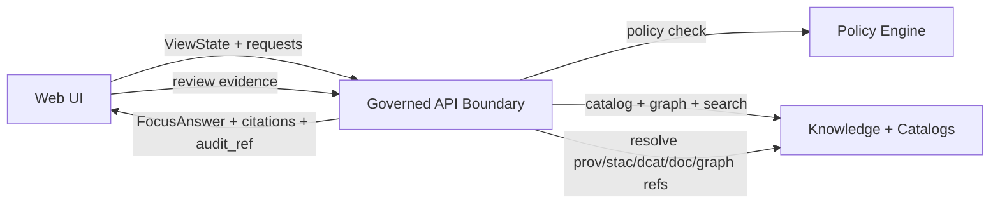

# KFM Web App

This directory (`web/`) contains the **Kansas Frontier Matrix (KFM)** web frontend: an evidence-first, policy-governed mapping and narrative interface.

The web UI is designed to:
- Explore map layers with provenance
- Synchronize map + time state with Story Nodes
- Provide Focus Mode Q&A that **must cite evidence or abstain**
- Offer a “review evidence” experience for both map layers and Focus Mode outputs

> [!IMPORTANT]
> This UI is inside KFM’s **trust membrane**:
> - It **must never** access databases or the graph directly.
> - All reads go through the governed API boundary (`src/server/`) so policy/redaction/schema guarantees are enforced consistently.

---

## What lives here

### Core capabilities
- **MapCanvas**: MapLibre map rendering, layer display, feature inspection
- **LayerPanel**: Toggle/filter layers; show dataset metadata, license, and attribution
- **Timeline**: Time range controls; optional playback/scrub
- **StoryViewer**: Render story steps; actions update map/time ViewState; show citations inline
- **FocusPanel**: Ask questions; display cited answers; deep-link to evidence
- **AuditDrawer**: View provenance chains and audit events

> [!NOTE]
> The KFM UI component responsibilities above are treated as a *design contract* because they map directly to evidence-first behavior and governance expectations.

---

## Non-negotiable contracts

### Pipeline ordering is absolute
KFM’s system order is inviolable:

**ETL → Catalogs (STAC/DCAT/PROV) → Graph → API → UI → Story Nodes → Focus Mode**

The UI must only consume artifacts that passed the upstream stages’ outputs and validations.

### Trust membrane and API boundary
- UI **does not** query Neo4j directly.
- UI **does not** query PostGIS directly.
- UI **does not** “read files from data/” as an implicit API.
- UI **does** call the governed API, which is responsible for:
  - access control
  - redaction and sensitivity handling
  - schema stability and versioning
  - audit logging

### Fail closed
If policy denies a request, the UI must:
- render a “Not authorized / Restricted / Redacted” state
- avoid leaking information via error messages, debug views, or cached payloads

### Evidence-first behavior
- **Story Nodes**: no unsourced narrative claims
- **Focus Mode**: must **cite or abstain**
- Evidence references must be reviewable by the user (via resolver endpoints and evidence panels)

---

## ViewState contract

The web UI maintains a canonical `ViewState` that synchronizes:
- map bbox
- active layers
- temporal context
- story context
- user role context for policy behavior

Recommended contract:

```ts
export type ViewState = {
  timeRange: [string, string];
  bbox: [number, number, number, number];
  activeLayers: string[];
  storyNodeId?: string;
  storyStepId?: string;
  userRole?: string;
};
```

> [!TIP]
> Treat `ViewState` as the *only* state object that crosses boundaries:
> - UI components can derive internal state, but outgoing requests should be driven by `ViewState`
> - `ViewState` should be serializable (URL state or export bundles) when possible

---

## Focus Mode contract expectations

At minimum, the UI should be able to call a Focus endpoint and render the response:

- **Request** includes:
  - `question`
  - `context` derived from `ViewState` (time range, bbox, active layers, story node id)
- **Response** includes:
  - `answer_markdown`
  - `citations[]`
  - `audit_ref`

> [!IMPORTANT]
> Rendering `answer_markdown` must be done safely:
> - Do not render unsanitized HTML.
> - Prefer a Markdown renderer configured to a safe subset.
> - Treat all server-provided strings as untrusted input.

---

## Evidence resolution UX

Evidence references may use resolver schemes like:
- `prov://...`
- `stac://...`
- `dcat://...`
- `doc://...`
- `graph://...`

UI requirements:
- Provide a **review evidence** view for:
  - map layer provenance (datasets, transformations, publication time)
  - Focus Mode citations (open cited sources/objects)
- Keep evidence resolution efficient:
  - target: resolve `citation.ref` to a human-readable evidence view in **≤ 2 API calls**

---

## Data flow



---

## Local development

> [!NOTE]
> Script names and ports are intentionally described generically here because they depend on the `web/package.json` and the repo’s `docker-compose.yml`.

### Prerequisites
- Node.js (LTS recommended)
- A package manager: npm, pnpm, or yarn
- Optional: Docker + Docker Compose for full-stack development

### Install
```bash
cd web
npm install
```

### Run the web dev server
Common patterns include:
```bash
npm run dev
# or
npm start
```

To discover available scripts:
```bash
npm run
```

### Run the full stack
From the repo root, many KFM setups use Docker Compose:
```bash
docker compose up
```

Then point the web app to the local API base URL via environment configuration.

---

## Configuration

### Environment variables
This UI should be configurable without code changes. Typical config values include:
- API base URL
- tile/style endpoints
- feature flags (reviewer mode UI, debug overlays)
- build metadata (commit SHA, build timestamp)

> [!TIP]
> If using Vite, environment variables typically use a `VITE_` prefix.
> If using other tooling, follow its conventions. Prefer `.env.example` + `.env.local` workflows.

### Roles and policy-aware UX
The UI may show different evidence detail depending on policy decisions and user role. The UI must not infer permissions client-side; it must rely on API responses.

---

## Testing and quality gates

Recommended layers of tests:
- **Unit tests**: pure functions, reducers/selectors
- **Component tests**: key flows (layer toggling, time range changes, evidence panel open)
- **End-to-end tests**: run against a deployed build and governed API

Recommended non-functional checks:
- Accessibility checks for map controls, dialogs, and focus management
- No-leak checks: verify restricted data stays hidden at all zoom levels and in exports
- Contract checks: UI behavior consistent with API response schemas

---

## Security and privacy notes

- Never commit secrets into `web/`.
- Avoid storing tokens in persistent browser storage unless explicitly required and reviewed.
- Treat any content (including Markdown) from the API as untrusted input.
- Do not add “backdoor” data access paths (direct DB calls, direct graph calls, hidden data bundles).

---

## Contribution checklist

Before opening a PR that changes the web app:

- [ ] Does the change preserve the trust membrane and API-only access rule?
- [ ] Does it preserve evidence-first UX (citations reviewable; no uncited narrative surfaces)?
- [ ] If it adds or changes any API calls, was the API contract updated in `src/server/` and validated?
- [ ] If it changes layer rendering or provenance views, does it still show license/attribution correctly?
- [ ] If it affects sensitive data handling, was a governance review triggered where required?
- [ ] Do tests pass (and were any new behaviors covered by tests)?

---

## Reference documents used for this module

These documents define (or strongly constrain) the web UI’s intended behavior and governance requirements:

- KFM Next-Gen Blueprint and Primary Guide v1.2 (Web UI Blueprint, ViewState contract, evidence UX requirements)
- KFM Master Guide v13 (repo structure, invariants, API boundary rule, pipeline ordering)
- KFM Comprehensive Data Source Integration Blueprint v1.0 (trust membrane, fail-closed policy, cite-or-abstain requirements)

> [!NOTE]
> If these documents are stored in-repo, prefer referencing them by stable path and version tag
> in future README edits to keep CI link-check clean.

---