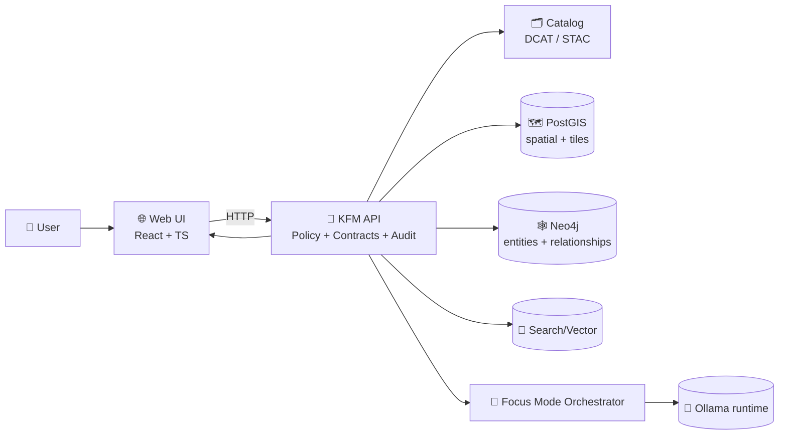

<div align="center">

<!-- 🚧 Under Construction / Animated Brand Mark -->


# 🌐 KFM Web UI (`/web`)
### 🗺️ Map · 🕰️ Timeline · 📚 Story Nodes · 🤖 Focus Mode

**The user-facing “living atlas” for Kansas — built to stay evidence-backed and policy-compliant.**  
<sub><em>“The map behind the map” — every layer, story step, and AI answer should trace back to sources.</em></sub>

<br/>

<!-- Status / Stack Badges -->


<br/>
<br/>

<a href="#-quickstart">🚀 Quickstart</a> •
<a href="#-core-experiences">✨ Core UX</a> •
<a href="#-ui-architecture--data-flow">🏗️ Architecture</a> •
<a href="#-project-structure">📦 Structure</a> •
<a href="#-focus-mode-ui-contract">🤖 Focus Mode</a> •
<a href="#-roadmap">🧭 Roadmap</a>

</div>

---

> [!WARNING]
> 🚧 **UNDER CONSTRUCTION**  
> This UI is in active development: component names, routes, and API surfaces may change quickly.  
> Treat this README as a **living spec** and keep it aligned with the KFM “Truth Path” rules (no bypasses).

---

## 🧭 Quick links

- ⬅️ **Repo root overview:** `../README.md`
- 🧩 **API gateway (policy-enforced):** `../api/README.md`
- 📚 **Docs hub:** `../docs/README.md`
- 📦 **Data vault (raw → processed → catalog/prov):** `../data/README.md`
- 🚰 **Pipelines runbook:** `../pipelines/README.md`
- 🧪 **Tests (CI trust gates):** `../tests/README.md`
- 🧰 **Tools:** `../tools/README.md`
- 🧰 **GitHub governance:** `../.github/README.md`

---

## 📌 What this folder is

`/web` contains the **frontend application** for Kansas Frontier Matrix (KFM):

- ⚛️ **React + TypeScript** client UI
- 🗺️ **2D map rendering** (MapLibre)
- 🌐 **Optional 3D** exploration (Cesium — roadmap)
- 🕰️ **Timeline** controls (scrub / play / compare)
- 📚 **Story Nodes** (step-based narratives that drive map/timeline state)
- 🤖 **Focus Mode UI** (AI assistant panel that calls the backend API — never the model directly)

---

## 🧱 Non‑negotiables (UI trust contract)

> [!IMPORTANT]
> **The Web UI is not allowed to “go around” governance.**  
> If data is needed, it goes through the API layer — that’s where validation, policy, redaction, and audit hooks live.

### ✅ Hard rules
- 🧱 **No direct DB connections** (no PostGIS/Neo4j from the browser).
- 🔐 **Policy-first behavior**: if access can’t be decided → deny / hide / degrade safely.
- 🧾 **Evidence-first rendering**: if a layer/story claim can’t point to cataloged evidence → it should not “look official.”
- 🤖 **No Source, No Answer**: Focus Mode must show citations or refuse.

---

## ✨ Core experiences

| Experience | What it feels like | “Trust signal” |
|---|---|---|
| 🗺️ Map Explorer | Toggle layers, inspect features, view legends | Layers link to dataset metadata + provenance |
| 🕰️ Timeline | Scrub time, animate changes, compare eras | Time filters align with dataset temporal coverage |
| 📚 Story Nodes | Guided narrative steps that move map & time | Every claim cites evidence |
| 🔎 Search | Find datasets + stories by keyword + area + time | Results originate from governed catalog APIs |
| 🤖 Focus Mode | Ask questions; get grounded answers | Citations + policy decisions are visible |

> [!TIP]
> When a feature is “not ready,” prefer **explicit UX** (🚧 tags, disabled controls, tooltips) over silent failure.

---

## 🏗️ UI architecture & data flow



### 🧠 Why this matters
- The UI stays **thin** and **safe**: it renders experiences, not governance.
- The API remains the **trust membrane**: validation + policy + provenance + redaction are enforced consistently.

---

## 🚀 Quickstart

> [!NOTE]
> KFM is designed for a **Compose-based** dev workflow where UI + API + data stores come up together.

### Option A: Run the full stack (recommended) 🐳
From repo root:

```bash
# Build + run everything (API, web, db, policy agent, etc.)
docker compose up -d --build
# (legacy)
docker-compose up -d --build
```

Then open:
- 🌐 **Web UI:** `http://localhost:3000`
- 🧪 **API docs (Swagger):** `http://localhost:8000/docs`

### Option B: Run only the Web UI (API already running elsewhere)
```bash
cd web
npm install
npm start   # CRA-style
# or:
npm run dev # Vite-style (if your package.json uses it)
```

> [!TIP]
> If you’re unsure which scripts exist, check `web/package.json` → `"scripts"`.

---

## ⚙️ Configuration

### Environment variables (typical)
> The UI should be configurable without code changes (swap API targets, disable experimental features).

| Variable | Purpose | Example |
|---|---|---|
| `REACT_APP_API_URL` | Base URL for REST/GraphQL calls (CRA) | `http://localhost:8000` |
| `VITE_API_URL` | Base URL (Vite) | `http://localhost:8000` |
| `WEB_PORT` | UI dev port (if supported) | `3000` |

> [!IMPORTANT]
> Focus Mode configuration (models, embeddings, policies) is **server-side**.  
> The browser should only speak to the API.

---

## 🌐 Ports (common defaults)

| Service | Default | Notes |
|---|---:|---|
| Web UI | `3000` | Dev server / mapped container port |
| API | `8000` | Swagger at `/docs` |
| PostGIS | `5432` | Port conflicts are common |
| Neo4j Browser | `7474` | Bolt differs (`7687`) |
| OPA (policy) | `8181` | If enabled in your stack |
| Ollama | `11434` | If running locally |

---

## 📦 Project structure

> This is a **recommended** layout. Keep it consistent and predictable — map UIs grow fast.

```text
web/
├─ 📄 README.md
├─ 📄 package.json
├─ 📄 tsconfig.json
├─ 📁 public/                       # static assets
└─ 📁 src/
   ├─ 🧭 app/                       # app shell (routes/layout/providers)
   ├─ 🧩 components/                # reusable UI parts
   │  ├─ 🗺️ MapViewer/              # MapLibre wrapper (2D)
   │  ├─ 🕰️ Timeline/               # scrub + play + compare controls
   │  ├─ 📚 StoryPanel/             # story nodes + stepper + citations
   │  ├─ 🔎 Search/                 # dataset/story search UI
   │  ├─ 🧾 EvidenceDrawer/          # provenance + catalog links
   │  └─ 🤖 FocusModePanel/          # chat UI (calls API)
   ├─ 🧠 state/                     # global store (Redux/Zustand/Context)
   ├─ 🔌 services/                  # API clients (REST/GraphQL), caching
   ├─ 🧱 features/                  # domain features (layers, stories, focus)
   ├─ 🧰 hooks/                     # reusable hooks (map, resize, fetch)
   ├─ 🎨 styles/                    # tokens/themes + CSS
   ├─ 🧾 types/                     # shared TS types
   └─ ✅ tests/                     # unit/component tests (optional)
```

---

## 🧩 Key UI modules

### 🗺️ MapViewer (MapLibre)
Responsibilities:
- map bootstrap (style, camera, controls)
- tile layer wiring (vector/raster)
- feature inspection + hover/click interaction
- “evidence affordances” (dataset links, layer metadata)

**Performance stance**
- Prefer tile endpoints for heavy layers.
- Keep GeoJSON overlays for small or curated subsets.
- Add loading states, progressive rendering, and sensible defaults.

---

### 🕰️ Timeline (scrub + play + compare)
Responsibilities:
- global “time cursor” (year / date / period)
- playback controls (play/pause, speed)
- compare mode (then vs now) when supported
- syncing with story steps

> [!TIP]
> Timeline is not “just UI.” It’s a **contract**: UI time selections must map to dataset temporal coverage.

---

### 📚 StoryPanel (Story Nodes)
Responsibilities:
- step-based narratives that drive map + time
- “Next/Back” stepper (and later: scrollytelling)
- citations UI: show what each step is grounded on
- shareable “story state” (deep links) — recommended

---

### 🔎 Search
Responsibilities:
- dataset discovery (keyword + bbox + time)
- story discovery (full-text)
- “add to map” patterns that keep symbology + metadata consistent

---

## 🤖 Focus Mode UI contract

> [!IMPORTANT]
> Focus Mode is **not** a free-form chatbot.  
> The UI submits a question to the API; the API retrieves evidence, enforces policy, and returns a response with citations.

### UI responsibilities
- send `question` + optional `scope` (bbox/time/story context)
- render:
  - ✅ `answer`
  - ✅ `citations[]` (must be present for factual answers)
  - ✅ `policy_decision` and/or `audit_id` (recommended)
- handle refusal states gracefully:
  - “Insufficient evidence”
  - “Restricted content”
  - “Out of scope”

### Suggested response shape (example)
```json
{
  "answer": "…",
  "citations": [
    {"title": "kfm.census.population.1900", "uri": "…", "kind": "dcat"},
    {"title": "STAC Item: …", "uri": "…", "kind": "stac"}
  ],
  "audit_id": "prov:run:…",
  "policy": {"allowed": true, "redactions": []}
}
```

---

## ♿ UX & design standards (map UIs are high-stakes)

### 1) Usability & feedback
- clear layout and consistent interaction patterns
- immediate feedback for actions (loading states, button states, errors)
- reduce “mystery meat” navigation — make controls obvious

### 2) Accessibility (WCAG-aligned)
- keyboard navigation for key workflows
- color contrast that works for legends and labels
- text alternatives for non-text content (icons, images)

### 3) Responsiveness
- map + panel layouts must adapt to mobile/tablet/desktop
- touch-friendly controls where needed (larger hit targets)

> [!NOTE]
> Treat accessibility as a first-class requirement — it improves overall UX and reduces rework.

---

## 🧪 Testing (recommended)

| Layer | Tooling (example) | What to test |
|---|---|---|
| Unit | Vitest/Jest | reducers, selectors, pure utils |
| Component | Testing Library | panels, dialogs, state wiring |
| E2E | Playwright/Cypress | map loads, tiles render, story flows, Focus Mode returns citations |
| Contract | API schema checks | UI breaks early if API contract changes |

---

## 🧭 Roadmap

> Keep “roadmap” items honest: if it’s not implemented, mark it clearly.

- [ ] 🚧 **Scrollytelling**: scroll-linked narratives where map + timeline animate in sync
- [ ] 🚧 **Guided Tours**: auto-play Story Nodes + (optional) narration
- [ ] 🚧 **Compare Mode**: then-vs-now views (time slider + layer compare)
- [ ] 🚧 **3D Mode**: Cesium-based exploration for selected layers/stories
- [ ] 🚧 **Offline-ish**: cached story bundles + thumbnails for demos (policy-permitting)

---

## 🧷 Contributing (Web UI)

### PR expectations ✅
- keep PRs scoped (one feature/bug per PR)
- update README/docs when behavior changes
- include screenshots/GIFs for UI changes
- add tests for critical logic paths
- do **not** introduce governance bypasses (no direct DB calls, no direct model calls)

### UI review checklist 👀
- [ ] keyboard navigation works for the new flow
- [ ] visible loading/error states
- [ ] consistent layer naming + legends
- [ ] citations are visible where claims appear
- [ ] no secrets in `.env` committed

---

<details>
<summary><strong>📚 Grounding & design references (project files)</strong> 🧾</summary>

- **Frontend scope**: React/TypeScript UI, MapLibre (2D), optional Cesium (3D), timeline slider + story narrative player + Focus Mode panel.:contentReference[oaicite:0]{index=0}

- **API boundary rule**: UI should not access databases directly; the API is the controlled entry point in the pipeline → catalog → database → API → UI architecture.:contentReference[oaicite:1]{index=1}

- **Compose-based dev workflow + common ports** (Web `3000`, API `8000`).:contentReference[oaicite:2]{index=2}

- **Focus Mode orchestration** (UI → API, prompt checks, retrieval, Ollama generation, citations/policy enforcement).:contentReference[oaicite:3]{index=3}

- **UI state & layout expectations** (Redux/global store, timeline controls, layer toggles).:contentReference[oaicite:4]{index=4}

- **Timeline + compare/analysis direction** (time-based interaction patterns).:contentReference[oaicite:5]{index=5}

- **UI calls governed endpoints for datasets/search/tiles** (API contract orientation).:contentReference[oaicite:6]{index=6}

- **Roadmap ideas**: scrollytelling where map/timeline animate with story scroll; story nodes already exist and “Next” changes the map.:contentReference[oaicite:7]{index=7}

- **Guided tour concept** (auto-play Story Nodes, potential narration).:contentReference[oaicite:8]{index=8}

- **Layered modular architecture mindset** (loose coupling, open standards, scalable components).:contentReference[oaicite:9]{index=9}

- **UI foundations**: usability, accessibility (WCAG), responsiveness, feedback loops.:contentReference[oaicite:10]{index=10}

- **Semantic HTML benefits** (structure/meaning improves accessibility and machine understanding).:contentReference[oaicite:11]{index=11}

- **State architecture rationale** (central store + one-way data flow scales for complex UI).:contentReference[oaicite:12]{index=12}

- **Navigation/consistency/accessibility as design priorities** (web design guidance).:contentReference[oaicite:13]{index=13}

</details>

---

<div align="center">

### 🧭 KFM UI promise
**Make it explorable. Make it understandable. Make it traceable.** ✅  
_No bypasses. No mystery data. No citation-less “facts.”_

</div>
