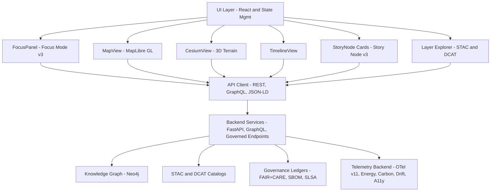

<div align="center">

# 🌐 **Kansas Frontier Matrix — Web Application & Focus Mode Platform (v11)**  
`web/README.md`  

Define the complete **architecture and behavioral contract** for the Kansas Frontier Matrix (KFM) v11 Web Platform, including: UI/UX design system, 2D/3D rendering pipelines, **Focus Mode v3** intelligence, **Story Node v3** integration, STAC/DCAT explorers, provenance overlays, A11y-first patterns, FAIR+CARE governance hooks, and full-stack telemetry instrumentation.

[Docs – MCP v6.3](../mcp/MCP-README.md) · [FAIR+CARE](../docs/standards/faircare/FAIRCARE-GUIDE.md) · [License: MIT](../LICENSE)

</div>

---

## 📘 1. Overview

The **KFM Web Application** is a spatial–temporal intelligence interface integrating:

- **MapLibre GL** for 2D vector/raster cartography  
- **CesiumJS** for high-fidelity 3D terrain and deep-time exploration  
- **Focus Mode v3** for entity-centric reasoning, narratives, and explainability  
- **Story Node v3** narrative units synchronized with map and timeline  
- **STAC/DCAT Explorer** for dataset discovery, lineage, and temporal slicing  
- **Neo4j-backed reasoning** via REST/GraphQL/JSON-LD APIs  
- **Timeline Engine** (e.g., D3/Recharts) with multi-range brushing  
- **A11y-first React/TypeScript** design compliant with WCAG 2.1 AA+  
- **Governance overlays** (CARE labels, provenance chips, SBOM/SLSA identity)  
- **OpenTelemetry v11** for performance, energy, carbon, and ethics metrics  

The Web Platform is the **primary public entrypoint** into the Kansas Frontier Matrix and must consistently reflect FAIR+CARE governance, sovereignty rules, and sustainability commitments.

---

## 🎯 2. Purpose of this Document

This specification:

- Establishes the **v11 Web Platform architecture** for `web/**`  
- Aligns frontend implementation with:
  - System architecture (`ARCHITECTURE.md`)  
  - GitHub infrastructure (`.github/ARCHITECTURE.md`)  
  - Data & validation contracts (`docs/contracts/**`, `schemas/**`)  
- Sets expectations for:
  - Focus Mode v3 behavior  
  - Story Node v3 presentation  
  - STAC/DCAT exploration  
  - Governance overlays and telemetry hooks  
- Serves as the **review reference** for:
  - Frontend engineers  
  - FAIR+CARE Council  
  - Governance and A11y reviewers  
  - Observability and sustainability analysts  

---

## 📍 3. Scope

### 3.1 In Scope

All code and assets under `web/**`, including:

- React components, pages, and layouts  
- Hooks, context providers, and state management  
- MapLibre/Cesium integration and UI layers  
- Focus Mode and Story Node presentation logic  
- STAC/DCAT explorer components  
- Governance overlays and badges  
- Telemetry emission from the web layer  
- Theming and adaptive UI elements  

### 3.2 Out of Scope

- Backend ETL/AI pipelines  
- Infrastructure (Kubernetes, Terraform, etc.)  
- Low-level storage concerns (DB schemas, disks, buckets)  

**Related Documents:**

- `ARCHITECTURE.md`  
- `.github/ARCHITECTURE.md`  
- `docs/architecture/system_overview.md`  
- `docs/standards/governance/ROOT-GOVERNANCE.md`  

---

## 📚 4. Key Concepts & Definitions

- **Focus Mode v3** – AI-assisted, entity-centric exploration interface, using graph context, Story Nodes, and datasets to produce governance-safe explanations.  
- **Story Node v3** – Structured narrative objects (text, time, space, relations) rendered as cards, overlays, and timeline entries.  
- **STAC Explorer** – UI to browse, filter, and preview STAC Collections/Items with map-based previews, filtering, and lineage traces.  
- **Governance Overlay** – Visual layer for CARE labels, provenance, SBOM/SLSA, consent, and risk indicators.  
- **Deep-Time Mode** – Combined 3D and timeline modes for paleogeography plus future projections (e.g., climate scenarios).  

These concepts must be implemented in a way that is consistent with backend governance and ontology alignment.

---

## 🏗 5. High-Level Web Architecture



The Web Platform is **read-only** with respect to core datasets (aside from user preferences and session state), and must never bypass backend governance or CARE enforcement.

---

## 🗂 6. Web Directory Layout (v11)

```text
web/
├── README.md                      # This web platform overview
├── ARCHITECTURE.md                # Detailed web architecture specification
│
├── public/                        # Static assets
│   ├── images/
│   ├── icons/
│   ├── manifest.json
│   ├── robots.txt
│   └── favicon.ico
│
├── src/                           # React/TypeScript SPA
│   ├── components/                # Map, panels, story cards, overlays
│   ├── pages/                     # Route-level containers (Landing, Explore, Focus, About)
│   ├── hooks/                     # useFocusMode, useTimeline, useMap, useStacExplorer, etc.
│   ├── context/                   # Theme, Focus, Time, A11y, Governance state
│   ├── services/                  # API clients: REST, GraphQL, STAC/DCAT, telemetry
│   ├── utils/                     # Formatting, parsing, schema helpers, JSON-LD builders
│   └── styles/                    # CSS/Tailwind, theme tokens, map styles
│
├── package.json                   # Dependencies & npm scripts
└── vite.config.ts                 # Build configuration
```

This layout must be maintained; changes require architecture review.

---

## 🎛 7. Major UI Modules & Responsibilities

### 7.1 MapView (MapLibre GL)

- Render basemaps, vector/raster overlays, STAC assets  
- Respond to timeline filters and Focus Mode context  
- Visualize Story Nodes’ spatial extents and masking  
- Indicate generalized geometries vs precise locations  

### 7.2 CesiumView (3D)

- 3D terrain and extruded layers for Story Nodes and datasets  
- Deep-time scenes and predictive futures (climate/hydrology) with clear labeling  
- Narrative camera tours coordinated with Focus Mode  

### 7.3 FocusPanel (Focus Mode v3)

- Display AI-generated but **governance-filtered** narratives  
- Surface provenance chips, CARE labels, and dataset links  
- Provide “Why am I seeing this?” explanations and overlays  
- Respect AI transform prohibitions (no speculative additions or unverified claims)  

### 7.4 StoryNode Cards (Story Node v3)

- Present narrative, time, and place in a consistent card design  
- Link to map and timeline context  
- Respect sovereignty, CARE masking, and site sensitivity rules  

### 7.5 TimelineView

- Multi-range selection for comparative context  
- Synchronize map, Focus Mode, and Story Node rendering  
- Annotate periods of interest and scenario intervals  

### 7.6 Layer Explorer (STAC/DCAT)

- Browse and filter STAC Collections/Items and DCAT Datasets  
- Show licensing, provenance, CARE labels, and usage notes  
- Provide preview layers in MapView and CesiumView  

---

## ⚖️ 8. Ethics, FAIR+CARE & Sovereignty

The Web Platform must:

- Display visible CARE labels on sensitive content  
- Show redaction/masking indicators when coordinates or details are generalized  
- Distinguish predictive/future content from historical records with explicit labeling  
- Clearly mark AI-generated narratives vs curated archival text  
- Avoid manipulative UX patterns around sensitive or uncertain information  

All ethics and sovereignty decisions on the web tier must be traceable to governance policies and backend enforcement.

---

## ♿ 9. Accessibility (WCAG 2.1 AA+)

Requirements include:

- Full keyboard control and logical focus order  
- Visible focus states for all interactive elements  
- Proper `aria-*` attributes on controls, dialogs, and landmarks  
- Good heading hierarchy and landmarks for screen readers  
- High-contrast themes and reduced-motion options  
- Non-color-dependent visual cues (icons, labels, patterns)  

Accessibility is continuously validated by automated tooling and manual review.

---

## 📈 10. Telemetry & Observability

The Web Platform emits telemetry for:

- Performance metrics (page load, route changes, map rendering)  
- Interaction metrics (high-level usage patterns, non-PII)  
- A11y metrics (keyboard nav usage, high-contrast mode, reduced-motion)  
- Error metrics (client-side errors, API failures, Focus Mode errors)  

Telemetry must:

- Avoid PII and sensitive content  
- Conform to telemetry schemas in `schemas/telemetry/`  
- Flow into `releases/<version>/focus-telemetry.json` via CI/CD  

---

## 🧪 11. Testing & QA

Web testing includes:

- Unit tests for React components and hooks  
- Integration tests for map/timeline/Focus/Story Node flows  
- E2E tests for critical user journeys (Explore → Focus → Story Node → STAC)  
- Snapshot tests for key visual panels  
- A11y tests (Axe, Lighthouse, or similar)  
- Telemetry schema validation tests  

No changes to core flows are merged without passing these tests in CI.

---

## 🕰 12. Version History

| Version | Date       | Summary                                                                                               |
|--------:|------------|-------------------------------------------------------------------------------------------------------|
| v11.0.1 | 2025-11-27 | Upgraded metadata to KFM-MDP v11.2.2, aligned header semantics, and clarified architecture linkages. |
| v11.0.0 | 2025-11-24 | v11 upgrade; integrated Focus Mode v3, Story Node v3, STAC/DCAT explorer, and telemetry v11.         |
| v10.4.0 | 2025-11-15 | v10.4 architecture; Focus v2.5, Story Node v3, telemetry v3, FAIR+CARE overlays.                     |
| v10.3.2 | 2025-11-14 | Deep rebuild; 3D integration and initial STAC/DCAT explorer flows.                                    |
| v10.3.1 | 2025-11-13 | Early v10.3 web architecture and A11y improvements.                                                  |

---

<div align="center">

[Root README](../README.md) · [System Architecture](../ARCHITECTURE.md) · [Governance Charter](../docs/standards/governance/ROOT-GOVERNANCE.md)

</div>
